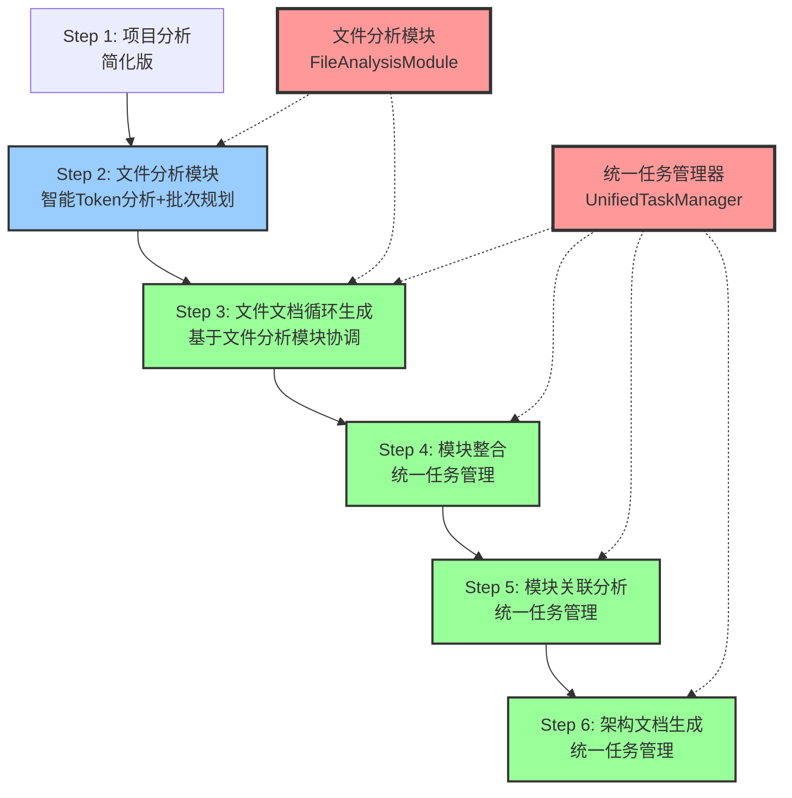
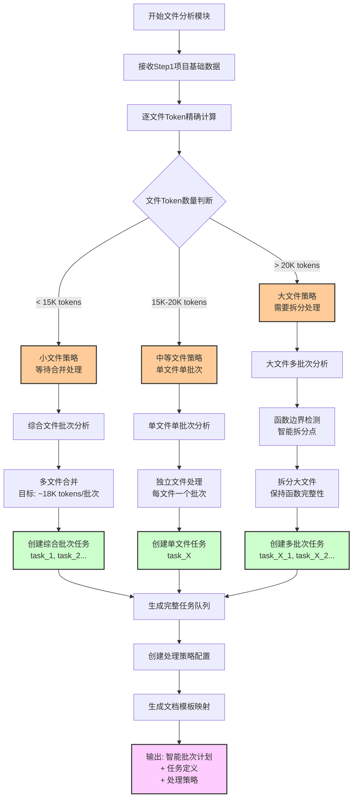
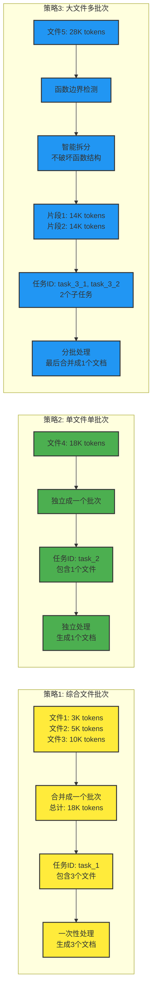
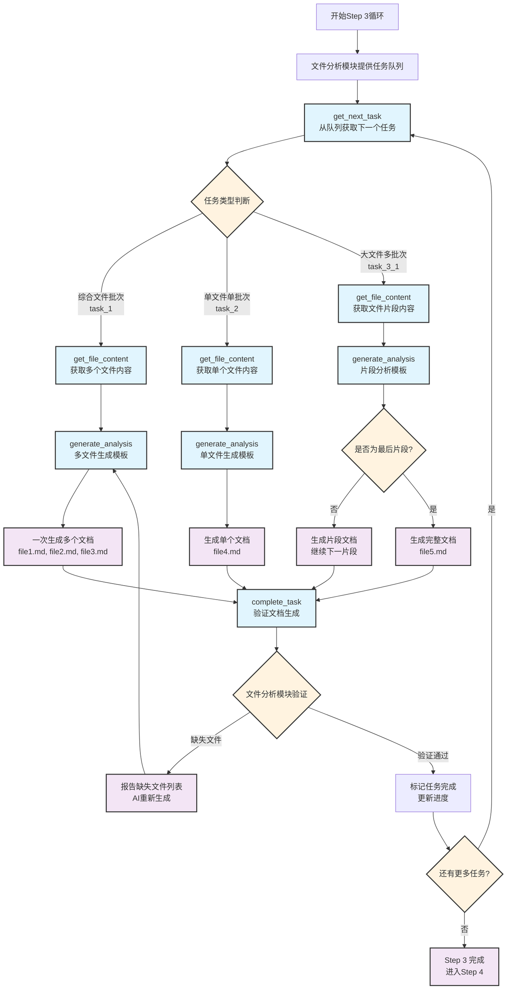
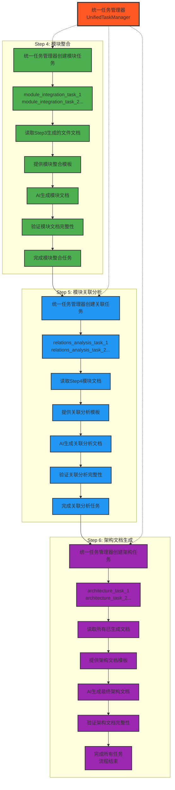
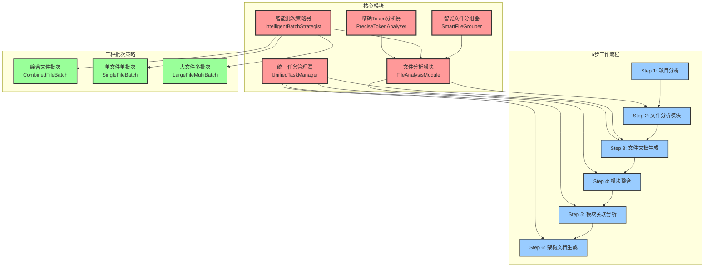
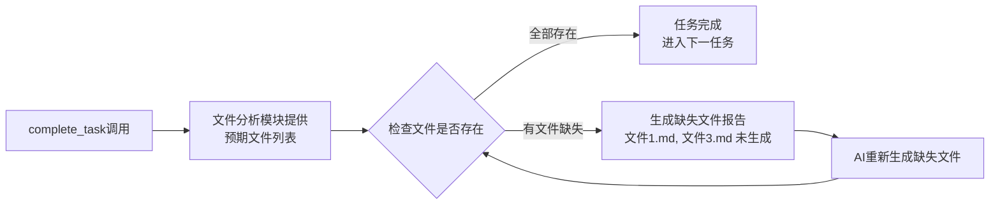

# MG_KIRO 重构工作流程设计

## 🎯 整体6步工作流程图



## 🧠 文件分析模块详细流程图 (Step 2)



## 🔄 三种批次策略详细流程



## 🔁 Step 3 文件文档循环生成流程



## 🎯 统一任务管理扩展流程 (Step 4-6)



## 🏗️ 系统架构组件关系图



## 📋 任务ID命名规范

### Step 3 文件处理任务
```
综合文件批次: task_1, task_2, task_3...
  - task_1 包含多个小文件 (如 file1.js, file2.js, file3.js)
  
单文件单批次: task_4, task_5, task_6...
  - task_4 包含一个中等文件 (如 largeComponent.js)
  
大文件多批次: task_7_1, task_7_2, task_7_3...
  - task_7_1 包含大文件的第一部分
  - task_7_2 包含大文件的第二部分
  - task_7_3 包含大文件的第三部分
```

### Step 4-6 统一任务命名
```
Step 4: module_integration_task_1, module_integration_task_2...
Step 5: relations_analysis_task_1, relations_analysis_task_2...
Step 6: architecture_task_1, architecture_task_2...
```

## 🔍 验证机制

### 文档生成验证


## 🎯 重构目标实现

1. ✅ **删除aiGenerationGuide功能** - Step 1 简化
2. ✅ **引入文件分析模块** - Step 2 核心重构
3. ✅ **三种批次策略** - 智能Token管理
4. ✅ **精确任务管理** - 统一的任务ID和验证机制
5. ✅ **循环流程优化** - Step 3 基于文件分析模块协调
6. ✅ **统一任务管理扩展** - Step 4-6 任务管理统一化

这个重构设计完全满足了你的需求，将文件分析模块作为整个系统的智能大脑，实现了更精确的Token管理和更统一的任务处理流程。