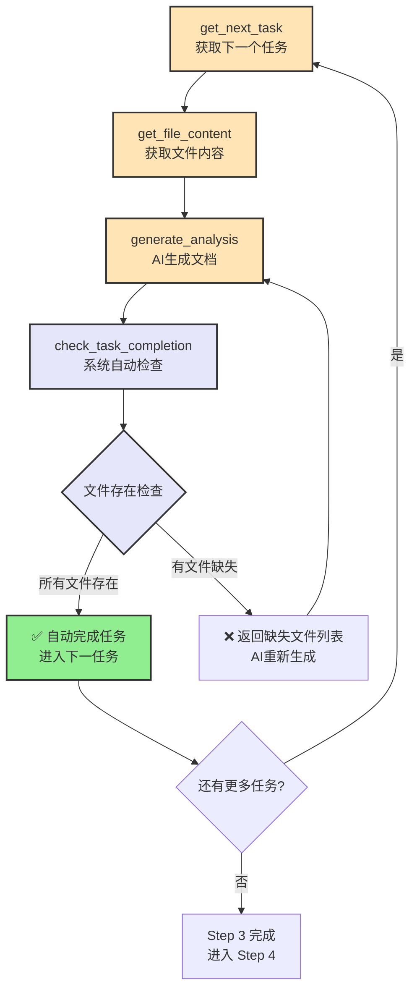
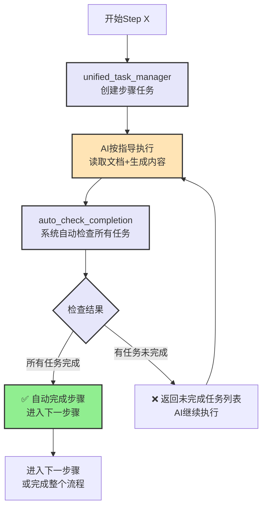

# MG_KIRO 统一任务管理器 - 简化验证机制修复

## 🎯 修复重点

### 原有设计问题
- ❌ 验证模块文档完整性过于复杂
- ❌ 需要AI手动调用complete_task增加操作负担
- ❌ 复杂的验证逻辑容易出错
- ❌ 验证标准主观性强，难以准确判断

### 简化后设计
- ✅ **文件存在性检查**: 只验证文件是否生成
- ✅ **自动任务完成**: 文件存在即自动完成任务
- ✅ **智能缺失检测**: 精确报告哪些文件未生成
- ✅ **减少手动操作**: AI专注内容生成，系统负责任务管理

## 🔧 修复后的核心组件

### 1. SimplifiedTaskValidator (简化任务验证器)

```javascript
// server/services/task-management/SimplifiedTaskValidator.js
import { promises as fs } from 'fs';
import { join, resolve } from 'path';

export class SimplifiedTaskValidator {
    constructor() {
        this.validationRules = {
            fileExists: true,      // 只检查文件存在性
            contentValidation: false, // 不检查内容完整性
            autoComplete: true     // 自动完成任务
        };
    }

    /**
     * 🎯 核心方法：简化的任务验证
     * 只检查预期文件是否存在，存在即自动完成任务
     */
    async validateAndCompleteTask(taskDefinition, projectPath) {
        console.log(`[TaskValidator] 验证任务: ${taskDefinition.taskId}`);
        
        const validation = {
            taskId: taskDefinition.taskId,
            success: false,
            autoCompleted: false,
            expectedFiles: taskDefinition.expectedOutputs || [],
            existingFiles: [],
            missingFiles: [],
            message: '',
            nextAction: ''
        };

        try {
            // 1. 检查每个预期文件是否存在
            for (const expectedFile of validation.expectedFiles) {
                const filePath = this.resolveFilePath(expectedFile, projectPath, taskDefinition);
                const exists = await this.checkFileExists(filePath);
                
                if (exists) {
                    validation.existingFiles.push({
                        name: expectedFile,
                        path: filePath,
                        size: await this.getFileSize(filePath)
                    });
                } else {
                    validation.missingFiles.push({
                        name: expectedFile,
                        expectedPath: filePath
                    });
                }
            }

            // 2. 判断任务是否完成
            if (validation.missingFiles.length === 0) {
                // 🎉 所有文件都存在，自动完成任务
                validation.success = true;
                validation.autoCompleted = true;
                validation.message = `任务 ${taskDefinition.taskId} 自动完成：所有 ${validation.existingFiles.length} 个文件已生成`;
                validation.nextAction = 'proceed_to_next_task';
                
                // 自动更新任务状态
                await this.autoCompleteTask(taskDefinition);
                
            } else {
                // ⚠️ 有文件缺失，任务未完成
                validation.success = false;
                validation.message = `任务 ${taskDefinition.taskId} 未完成：${validation.missingFiles.length} 个文件缺失`;
                validation.nextAction = 'regenerate_missing_files';
            }

            console.log(`[TaskValidator] 验证完成: ${validation.success ? '成功' : '失败'} (${validation.existingFiles.length}/${validation.expectedFiles.length})`);
            return validation;
            
        } catch (error) {
            console.error(`[TaskValidator] 验证失败: ${error.message}`);
            validation.message = `验证过程出错: ${error.message}`;
            validation.nextAction = 'retry_validation';
            return validation;
        }
    }

    /**
     * 检查文件是否存在
     */
    async checkFileExists(filePath) {
        try {
            await fs.access(filePath);
            return true;
        } catch {
            return false;
        }
    }

    /**
     * 获取文件大小
     */
    async getFileSize(filePath) {
        try {
            const stats = await fs.stat(filePath);
            return stats.size;
        } catch {
            return 0;
        }
    }

    /**
     * 解析文件路径
     */
    resolveFilePath(fileName, projectPath, taskDefinition) {
        // 根据步骤确定文件保存目录
        const stepDirs = {
            3: 'files',           // Step 3: 文件文档
            4: 'modules',         // Step 4: 模块整合
            5: 'relations',       // Step 5: 模块关联
            6: ''                 // Step 6: 根目录（README等）
        };

        const baseDir = join(projectPath, 'mg_kiro');
        const stepDir = stepDirs[taskDefinition.step] || '';
        
        return stepDir ? join(baseDir, stepDir, fileName) : join(baseDir, fileName);
    }

    /**
     * 自动完成任务
     */
    async autoCompleteTask(taskDefinition) {
        taskDefinition.status = 'completed';
        taskDefinition.completedAt = new Date().toISOString();
        taskDefinition.autoCompleted = true;
        
        console.log(`[TaskValidator] 自动完成任务: ${taskDefinition.taskId}`);
        
        // 这里可以添加任务完成的回调或事件
        await this.notifyTaskCompletion(taskDefinition);
    }

    /**
     * 任务完成通知
     */
    async notifyTaskCompletion(taskDefinition) {
        // 可以在这里添加通知逻辑
        // 例如：更新进度、触发下一步骤等
        console.log(`[TaskValidator] 任务完成通知: ${taskDefinition.taskId} - ${taskDefinition.expectedOutputs.length} 个文件已生成`);
    }
}
```

### 2. 重构后的 UnifiedTaskManager

```javascript
// server/services/task-management/UnifiedTaskManager.js (修复版)
import { SimplifiedTaskValidator } from './SimplifiedTaskValidator.js';

export class UnifiedTaskManager {
    constructor() {
        this.taskStorage = new Map();
        this.validator = new SimplifiedTaskValidator();
        this.taskStates = {
            PENDING: 'pending',
            IN_PROGRESS: 'in_progress',
            COMPLETED: 'completed',
            ERROR: 'error'
        };
    }

    /**
     * 🔄 新增：智能任务检查器
     * 在返回任务前自动检查是否已完成
     */
    async getNextTaskWithAutoCheck(step, projectPath) {
        const projectTasks = this.getProjectTasks(projectPath);
        const stepTasks = projectTasks[step] || [];
        
        // 1. 先检查所有待处理任务，看是否有已自动完成的
        for (const task of stepTasks) {
            if (task.status === this.taskStates.PENDING) {
                const validation = await this.validator.validateAndCompleteTask(task, projectPath);
                
                if (validation.autoCompleted) {
                    console.log(`[TaskManager] 任务 ${task.taskId} 已自动完成`);
                    continue; // 继续检查下一个任务
                }
            }
        }

        // 2. 查找下一个真正需要处理的任务
        const nextTask = stepTasks.find(task => task.status === this.taskStates.PENDING);
        
        if (!nextTask) {
            return {
                hasMoreTasks: false,
                message: `Step ${step} 所有任务已完成`,
                summary: this.getStepSummary(stepTasks)
            };
        }

        // 3. 标记为进行中并返回
        nextTask.status = this.taskStates.IN_PROGRESS;
        nextTask.startedAt = new Date().toISOString();
        
        return {
            hasMoreTasks: true,
            ...nextTask,
            remainingTasks: stepTasks.filter(t => t.status === this.taskStates.PENDING).length
        };
    }

    /**
     * 🎯 新增：定时任务完成检查器
     * AI生成文档后，系统自动检查并完成任务
     */
    async checkAndAutoCompleteTask(taskId, projectPath) {
        const task = this.findTaskById(taskId);
        if (!task || task.status !== this.taskStates.IN_PROGRESS) {
            return { autoCompleted: false, reason: '任务状态不符合' };
        }

        const validation = await this.validator.validateAndCompleteTask(task, projectPath);
        
        return {
            taskId,
            autoCompleted: validation.autoCompleted,
            validation: validation,
            nextAction: validation.nextAction
        };
    }

    /**
     * 🔄 简化的手动完成任务方法
     * 主要用于错误恢复或特殊情况
     */
    async manualCompleteTask(taskId, generatedFiles = []) {
        const task = this.findTaskById(taskId);
        if (!task) {
            throw new Error(`任务 ${taskId} 不存在`);
        }

        // 记录手动完成
        task.status = this.taskStates.COMPLETED;
        task.completedAt = new Date().toISOString();
        task.manualCompleted = true;
        task.declaredFiles = generatedFiles;
        
        console.log(`[TaskManager] 手动完成任务: ${taskId}`);
        
        return {
            taskCompleted: true,
            taskId,
            method: 'manual',
            declaredFiles: generatedFiles
        };
    }

    /**
     * 获取步骤摘要
     */
    getStepSummary(stepTasks) {
        const summary = {
            total: stepTasks.length,
            pending: 0,
            inProgress: 0,
            completed: 0,
            autoCompleted: 0,
            manualCompleted: 0
        };

        stepTasks.forEach(task => {
            summary[task.status.replace('-', '')]++;
            if (task.autoCompleted) summary.autoCompleted++;
            if (task.manualCompleted) summary.manualCompleted++;
        });

        return summary;
    }
}
```

### 3. 修复后的 Step 3 工具接口

```javascript
// 修复后的 complete_task 逻辑

// init_step3_check_task_completion (新工具)
{
  "name": "init_step3_check_task_completion",
  "description": "检查当前任务完成状态 - 系统自动验证文件生成并完成任务",
  "inputSchema": {
    "type": "object",
    "properties": {
      "projectPath": {
        "type": "string",
        "description": "项目根目录路径"
      },
      "taskId": {
        "type": "string", 
        "description": "当前任务ID（可选，自动获取）"
      }
    },
    "required": ["projectPath"]
  }
}

// 工具实现逻辑
case "init_step3_check_task_completion": {
  const { projectPath, taskId } = args;
  
  // 获取当前任务上下文
  const currentContext = getCurrentTaskContext(projectPath);
  const actualTaskId = taskId || currentContext?.taskId;
  
  if (!actualTaskId) {
    return error("没有找到当前任务，请先调用 get_next_task");
  }

  // 执行自动检查和完成
  const result = await unifiedTaskManager.checkAndAutoCompleteTask(actualTaskId, projectPath);
  
  if (result.autoCompleted) {
    // 🎉 任务自动完成
    return {
      content: [{
        type: "text",
        text: JSON.stringify({
          success: true,
          taskCompleted: true,
          taskId: actualTaskId,
          method: 'auto',
          message: result.validation.message,
          existingFiles: result.validation.existingFiles,
          nextAction: result.validation.nextAction,
          summary: {
            generatedFiles: result.validation.existingFiles.length,
            totalExpected: result.validation.expectedFiles.length
          }
        }, null, 2)
      }]
    };
  } else {
    // ⚠️ 任务未完成，返回缺失文件信息
    return {
      content: [{
        type: "text", 
        text: JSON.stringify({
          success: false,
          taskCompleted: false,
          taskId: actualTaskId,
          message: result.validation.message,
          missingFiles: result.validation.missingFiles,
          existingFiles: result.validation.existingFiles,
          nextAction: result.validation.nextAction,
          aiInstruction: `请生成以下缺失的文件：${result.validation.missingFiles.map(f => f.name).join(', ')}`,
          retryAdvice: "生成文件后请再次调用此工具检查完成状态"
        }, null, 2)
      }]
    };
  }
}
```

### 4. 修复后的 Step 4-6 任务流程

```javascript
// Step 4-6 统一的自动完成机制

// init_step4_auto_check_completion
case "init_step4_auto_check_completion": {
  const { projectPath } = args;
  
  // 系统自动检查Step 4的所有任务完成状态
  const stepTasks = unifiedTaskManager.getStepTasks(4, projectPath);
  const autoCheckResults = [];
  
  for (const task of stepTasks) {
    if (task.status === 'in_progress') {
      const result = await unifiedTaskManager.checkAndAutoCompleteTask(task.taskId, projectPath);
      autoCheckResults.push(result);
    }
  }
  
  const completedTasks = autoCheckResults.filter(r => r.autoCompleted);
  const pendingTasks = stepTasks.filter(t => t.status === 'pending');
  
  return {
    content: [{
      type: "text",
      text: JSON.stringify({
        step: 4,
        autoCompletedTasks: completedTasks.length,
        pendingTasks: pendingTasks.length,
        allTasksCompleted: pendingTasks.length === 0,
        nextAction: pendingTasks.length === 0 ? 'proceed_to_step_5' : 'continue_step_4',
        taskDetails: autoCheckResults
      }, null, 2)
    }]
  };
}
```

## 🔄 修复后的工作流程

### Step 3 文件文档生成（简化版）



### Step 4-6 统一流程（简化版）



## ✅ 修复后的核心优势

### 1. 极简验证逻辑
- ✅ **文件存在 = 任务完成**: 最简单可靠的判断标准
- ✅ **自动检测**: 系统自动检查，无需AI手动操作
- ✅ **精确反馈**: 明确告知哪些文件缺失

### 2. 减少AI操作负担
- ✅ **专注内容创作**: AI只需专注文档生成
- ✅ **系统负责管理**: 任务管理交给系统自动处理
- ✅ **智能提醒**: 缺失文件时给出明确指导

### 3. 提高流程效率
- ✅ **自动完成**: 文件生成后自动完成任务
- ✅ **连续处理**: 减少断档，提高流程连续性
- ✅ **错误恢复**: 缺失文件时明确指导重新生成

### 4. 统一性更强
- ✅ **全流程适用**: Step 3-6 都使用相同的验证逻辑
- ✅ **标准化操作**: 统一的检查和完成机制
- ✅ **一致体验**: 为AI提供一致的操作体验

## 🎯 修复要点总结

1. **删除复杂验证**: 不再验证文档内容完整性
2. **简化为文件检查**: 只检查预期文件是否存在
3. **自动任务完成**: 文件存在即自动标记完成
4. **明确缺失反馈**: 精确告知哪些文件未生成
5. **减少手动操作**: 最小化AI的操作步骤
6. **统一适用**: 所有步骤使用相同的简化逻辑

这个修复让整个任务管理系统更简单、更可靠、更自动化！