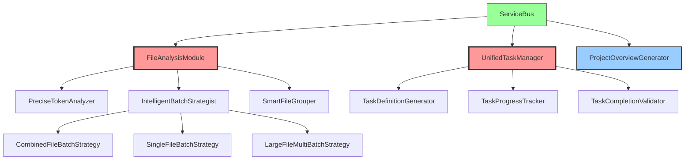

# MG_KIRO 重构技术实现指南

## 🏗️ 技术架构设计

### 1.1 整体架构

```
mg_kiro_mcp/
├── server/
│   ├── services/
│   │   ├── file-analysis/                 # 新增：文件分析模块
│   │   │   ├── FileAnalysisModule.js
│   │   │   ├── PreciseTokenAnalyzer.js
│   │   │   ├── IntelligentBatchStrategist.js
│   │   │   ├── SmartFileGrouper.js
│   │   │   └── strategies/
│   │   │       ├── CombinedFileBatchStrategy.js
│   │   │       ├── SingleFileBatchStrategy.js
│   │   │       └── LargeFileMultiBatchStrategy.js
│   │   ├── task-management/               # 新增：统一任务管理
│   │   │   ├── UnifiedTaskManager.js
│   │   │   ├── TaskDefinitionGenerator.js
│   │   │   ├── TaskProgressTracker.js
│   │   │   └── TaskCompletionValidator.js
│   │   ├── project-overview-generator.js  # 重构：简化版
│   │   └── ...existing services
│   └── routes/
│       └── init/
│           ├── claude-code-init.js        # 重构：集成新模块
│           └── ...
├── config/
│   ├── file-analysis.config.json         # 新增：文件分析配置
│   ├── batch-strategies.config.json      # 新增：批次策略配置
│   └── ...existing configs
└── prompts/
    └── modes/init/
        ├── file-analysis/                 # 新增：文件分析提示词
        └── ...existing prompts
```

### 1.2 服务依赖图



## 🔧 核心组件实现

### 2.1 FileAnalysisModule 核心实现

#### 2.1.1 主模块结构

```javascript
// server/services/file-analysis/FileAnalysisModule.js
import { PreciseTokenAnalyzer } from './PreciseTokenAnalyzer.js';
import { IntelligentBatchStrategist } from './IntelligentBatchStrategist.js';
import { SmartFileGrouper } from './SmartFileGrouper.js';
import { promises as fs } from 'fs';
import { join, resolve } from 'path';

export class FileAnalysisModule {
    constructor(config = {}) {
        this.config = {
            tokenLimits: {
                small: 15000,      // 小文件阈值
                medium: 20000,     // 中等文件阈值
                large: 20000       // 大文件阈值
            },
            targetBatchSize: 18000,    // 目标批次大小
            maxBatchSize: 25000,       // 最大批次大小
            ...config
        };
        
        this.tokenAnalyzer = new PreciseTokenAnalyzer(this.config);
        this.batchStrategist = new IntelligentBatchStrategist(this.config);
        this.fileGrouper = new SmartFileGrouper(this.config);
        
        // 项目状态缓存
        this.projectCache = new Map();
    }

    /**
     * 主要功能：分析项目并生成批次计划
     */
    async analyzeProject(projectPath, options = {}) {
        console.log(`[FileAnalysis] 开始分析项目: ${projectPath}`);
        
        const startTime = Date.now();
        const normalizedPath = resolve(projectPath);
        
        try {
            // 1. 获取所有源码文件
            const sourceFiles = await this.getSourceFiles(normalizedPath);
            
            // 2. 并行分析文件token
            const analysisResults = await this.analyzeFilesInParallel(sourceFiles);
            
            // 3. 智能文件分组
            const groupedFiles = await this.fileGrouper.groupFiles(analysisResults);
            
            // 4. 生成批次计划
            const batchPlan = await this.batchStrategist.createBatchPlan(groupedFiles);
            
            // 5. 缓存结果
            this.projectCache.set(normalizedPath, {
                analysisResults,
                groupedFiles,
                batchPlan,
                analyzedAt: new Date().toISOString(),
                analysisTime: Date.now() - startTime
            });
            
            console.log(`[FileAnalysis] 分析完成，耗时: ${Date.now() - startTime}ms`);
            
            return {
                success: true,
                projectPath: normalizedPath,
                totalFiles: sourceFiles.length,
                analysisResults,
                batchPlan,
                analysisTime: Date.now() - startTime,
                summary: this.generateAnalysisSummary(batchPlan)
            };
            
        } catch (error) {
            console.error(`[FileAnalysis] 分析失败: ${error.message}`);
            throw new Error(`项目分析失败: ${error.message}`);
        }
    }

    /**
     * 并行文件token分析
     */
    async analyzeFilesInParallel(sourceFiles) {
        const chunkSize = 10; // 每批次处理10个文件
        const results = [];
        
        for (let i = 0; i < sourceFiles.length; i += chunkSize) {
            const chunk = sourceFiles.slice(i, i + chunkSize);
            const chunkPromises = chunk.map(file => this.analyzeFile(file));
            const chunkResults = await Promise.all(chunkPromises);
            results.push(...chunkResults);
            
            // 进度报告
            console.log(`[FileAnalysis] 已分析 ${Math.min(i + chunkSize, sourceFiles.length)}/${sourceFiles.length} 个文件`);
        }
        
        return results.filter(result => result !== null);
    }

    /**
     * 分析单个文件
     */
    async analyzeFile(file) {
        try {
            const content = await fs.readFile(file.path, 'utf-8');
            const tokenCount = await this.tokenAnalyzer.calculateFileTokens(file.path, content);
            const codeStructure = await this.tokenAnalyzer.analyzeCodeStructure(content, file.language);
            
            return {
                filePath: file.path,
                relativePath: file.relativePath,
                fileName: file.name,
                fileSize: content.length,
                tokenCount,
                language: file.language,
                codeStructure,
                complexity: this.assessComplexity(tokenCount, codeStructure),
                priority: this.calculatePriority(file, tokenCount, codeStructure)
            };
        } catch (error) {
            console.warn(`[FileAnalysis] 跳过文件 ${file.path}: ${error.message}`);
            return null;
        }
    }

    /**
     * 获取项目的所有源码文件
     */
    async getSourceFiles(projectPath) {
        // 实现文件扫描逻辑，过滤源码文件
        // 类似现有的目录扫描功能，但专注于源码文件
    }

    /**
     * 生成分析摘要
     */
    generateAnalysisSummary(batchPlan) {
        const summary = {
            totalBatches: batchPlan.batches.length,
            batchTypes: {
                combined: 0,
                single: 0,
                multi: 0
            },
            totalTasks: 0,
            estimatedTime: 0
        };

        batchPlan.batches.forEach(batch => {
            summary.batchTypes[batch.strategy]++;
            summary.totalTasks += batch.tasks.length;
            summary.estimatedTime += batch.estimatedTime;
        });

        return summary;
    }
}
```

#### 2.1.2 PreciseTokenAnalyzer 实现

```javascript
// server/services/file-analysis/PreciseTokenAnalyzer.js
export class PreciseTokenAnalyzer {
    constructor(config = {}) {
        this.config = config;
        
        // 基于GPT-4的token估算规则（改进版）
        this.tokenRatios = {
            javascript: 0.25,
            typescript: 0.28,
            python: 0.22,
            java: 0.30,
            go: 0.24,
            rust: 0.26,
            csharp: 0.29,
            default: 0.25
        };
        
        // 函数/类检测正则表达式
        this.functionPatterns = {
            javascript: /(?:function\s+\w+|const\s+\w+\s*=\s*(?:async\s+)?\(|class\s+\w+)/g,
            python: /(?:def\s+\w+|class\s+\w+)/g,
            java: /(?:public|private|protected)?\s*(?:static\s+)?(?:void|[\w<>\[\]]+)\s+\w+\s*\(/g,
            go: /func\s+\w+\s*\(/g
        };
    }

    /**
     * 精确计算文件token数
     */
    async calculateFileTokens(filePath, content, language = null) {
        if (!content || typeof content !== 'string') return 0;
        
        // 1. 检测或使用提供的语言
        const detectedLanguage = language || this.detectLanguage(filePath);
        
        // 2. 预处理内容（去除注释、空行等）
        const cleanContent = this.preprocessContent(content, detectedLanguage);
        
        // 3. 基于语言特性的token计算
        const baseTokens = this.calculateBaseTokens(cleanContent, detectedLanguage);
        
        // 4. 代码结构调整
        const structureMultiplier = this.getStructureMultiplier(content, detectedLanguage);
        
        // 5. 最终token数
        const finalTokens = Math.ceil(baseTokens * structureMultiplier);
        
        console.log(`[TokenAnalyzer] ${filePath}: ${finalTokens} tokens (${detectedLanguage})`);
        return finalTokens;
    }

    /**
     * 分析代码结构
     */
    async analyzeCodeStructure(content, language) {
        const structure = {
            functions: [],
            classes: [],
            imports: [],
            exports: [],
            complexity: 'low'
        };

        try {
            // 函数检测
            structure.functions = this.detectFunctions(content, language);
            
            // 类检测
            structure.classes = this.detectClasses(content, language);
            
            // 导入导出检测
            structure.imports = this.detectImports(content, language);
            structure.exports = this.detectExports(content, language);
            
            // 复杂度评估
            structure.complexity = this.assessCodeComplexity(structure);
            
        } catch (error) {
            console.warn(`[TokenAnalyzer] 代码结构分析失败: ${error.message}`);
        }

        return structure;
    }

    /**
     * 找到函数边界（用于大文件拆分）
     */
    async findFunctionBoundaries(content, language) {
        const boundaries = [];
        const functions = this.detectFunctions(content, language);
        
        functions.forEach(func => {
            // 找到函数的开始和结束位置
            const start = content.indexOf(func.signature);
            if (start !== -1) {
                const end = this.findFunctionEnd(content, start, language);
                boundaries.push({
                    name: func.name,
                    start,
                    end,
                    canSplit: func.canSplit !== false // 默认可拆分
                });
            }
        });

        return boundaries.sort((a, b) => a.start - b.start);
    }

    /**
     * 预处理内容
     */
    preprocessContent(content, language) {
        let cleaned = content;
        
        // 移除注释
        cleaned = this.removeComments(cleaned, language);
        
        // 移除多余空行
        cleaned = cleaned.replace(/\n\s*\n\s*\n/g, '\n\n');
        
        // 移除行尾空格
        cleaned = cleaned.replace(/[ \t]+$/gm, '');
        
        return cleaned;
    }

    /**
     * 移除注释
     */
    removeComments(content, language) {
        const commentPatterns = {
            javascript: [
                /\/\*[\s\S]*?\*\//g,  // 块注释
                /\/\/.*$/gm           // 行注释
            ],
            python: [
                /"""[\s\S]*?"""/g,    // 三引号注释
                /#.*$/gm              // 行注释
            ],
            java: [
                /\/\*[\s\S]*?\*\//g,  // 块注释
                /\/\/.*$/gm           // 行注释
            ]
        };

        const patterns = commentPatterns[language] || commentPatterns.javascript;
        
        let cleaned = content;
        patterns.forEach(pattern => {
            cleaned = cleaned.replace(pattern, '');
        });
        
        return cleaned;
    }

    /**
     * 检测函数
     */
    detectFunctions(content, language) {
        const pattern = this.functionPatterns[language] || this.functionPatterns.javascript;
        const matches = [...content.matchAll(pattern)];
        
        return matches.map((match, index) => ({
            name: this.extractFunctionName(match[0], language),
            signature: match[0],
            index: match.index,
            canSplit: this.canSplitFunction(match[0], language)
        }));
    }

    /**
     * 提取函数名
     */
    extractFunctionName(signature, language) {
        const namePatterns = {
            javascript: /(?:function\s+(\w+)|const\s+(\w+)|class\s+(\w+))/,
            python: /(?:def\s+(\w+)|class\s+(\w+))/,
            java: /\b(\w+)\s*\(/,
            go: /func\s+(\w+)/
        };

        const pattern = namePatterns[language] || namePatterns.javascript;
        const match = signature.match(pattern);
        
        return match ? (match[1] || match[2] || match[3] || 'unknown') : 'unknown';
    }
}
```

#### 2.1.3 IntelligentBatchStrategist 实现

```javascript
// server/services/file-analysis/IntelligentBatchStrategist.js
import { CombinedFileBatchStrategy } from './strategies/CombinedFileBatchStrategy.js';
import { SingleFileBatchStrategy } from './strategies/SingleFileBatchStrategy.js';
import { LargeFileMultiBatchStrategy } from './strategies/LargeFileMultiBatchStrategy.js';

export class IntelligentBatchStrategist {
    constructor(config = {}) {
        this.config = config;
        
        this.strategies = {
            combined: new CombinedFileBatchStrategy(config),
            single: new SingleFileBatchStrategy(config),
            multi: new LargeFileMultiBatchStrategy(config)
        };
    }

    /**
     * 创建批次计划
     */
    async createBatchPlan(groupedFiles) {
        console.log('[BatchStrategist] 开始创建批次计划');
        
        const batchPlan = {
            batches: [],
            summary: {
                totalFiles: 0,
                totalTokens: 0,
                estimatedTime: 0
            }
        };

        // 1. 分类文件
        const categorizedFiles = this.categorizeFiles(groupedFiles);
        
        // 2. 应用不同策略
        const combinedBatches = await this.strategies.combined.createBatches(categorizedFiles.small);
        const singleBatches = await this.strategies.single.createBatches(categorizedFiles.medium);
        const multiBatches = await this.strategies.multi.createBatches(categorizedFiles.large);
        
        // 3. 合并所有批次
        batchPlan.batches = [
            ...combinedBatches,
            ...singleBatches,
            ...multiBatches
        ];

        // 4. 生成任务ID
        this.assignTaskIds(batchPlan.batches);
        
        // 5. 计算摘要
        batchPlan.summary = this.calculateBatchSummary(batchPlan.batches);
        
        console.log(`[BatchStrategist] 批次计划创建完成: ${batchPlan.batches.length} 个批次`);
        return batchPlan;
    }

    /**
     * 文件分类
     */
    categorizeFiles(files) {
        const categorized = {
            small: [],    // < 15K tokens
            medium: [],   // 15K-20K tokens
            large: []     // > 20K tokens
        };

        files.forEach(file => {
            if (file.tokenCount < this.config.tokenLimits.small) {
                categorized.small.push(file);
            } else if (file.tokenCount <= this.config.tokenLimits.medium) {
                categorized.medium.push(file);
            } else {
                categorized.large.push(file);
            }
        });

        console.log(`[BatchStrategist] 文件分类: 小文件${categorized.small.length}个, 中等文件${categorized.medium.length}个, 大文件${categorized.large.length}个`);
        return categorized;
    }

    /**
     * 分配任务ID
     */
    assignTaskIds(batches) {
        let taskCounter = 1;
        
        batches.forEach(batch => {
            if (batch.strategy === 'multi') {
                // 大文件多批次: task_X_1, task_X_2...
                batch.tasks.forEach((task, index) => {
                    task.taskId = `task_${taskCounter}_${index + 1}`;
                });
                taskCounter++;
            } else {
                // 综合/单文件批次: task_X
                batch.tasks.forEach(task => {
                    task.taskId = `task_${taskCounter}`;
                    taskCounter++;
                });
            }
        });
    }
}
```

#### 2.1.4 批次策略实现

```javascript
// server/services/file-analysis/strategies/CombinedFileBatchStrategy.js
export class CombinedFileBatchStrategy {
    constructor(config) {
        this.config = config;
        this.targetBatchSize = config.targetBatchSize || 18000;
    }

    async createBatches(smallFiles) {
        console.log(`[CombinedStrategy] 处理 ${smallFiles.length} 个小文件`);
        
        const batches = [];
        let currentBatch = {
            files: [],
            totalTokens: 0,
            strategy: 'combined'
        };

        // 按优先级排序
        const sortedFiles = smallFiles.sort((a, b) => b.priority - a.priority);

        for (const file of sortedFiles) {
            // 检查是否可以添加到当前批次
            if (currentBatch.totalTokens + file.tokenCount <= this.targetBatchSize) {
                currentBatch.files.push(file);
                currentBatch.totalTokens += file.tokenCount;
            } else {
                // 当前批次已满，创建新批次
                if (currentBatch.files.length > 0) {
                    batches.push(this.finalizeBatch(currentBatch));
                }
                
                currentBatch = {
                    files: [file],
                    totalTokens: file.tokenCount,
                    strategy: 'combined'
                };
            }
        }

        // 添加最后一个批次
        if (currentBatch.files.length > 0) {
            batches.push(this.finalizeBatch(currentBatch));
        }

        console.log(`[CombinedStrategy] 创建了 ${batches.length} 个综合批次`);
        return batches;
    }

    finalizeBatch(batch) {
        return {
            ...batch,
            tasks: [{
                files: batch.files,
                expectedOutputs: batch.files.map(f => `${f.fileName}.md`),
                processingInstructions: {
                    template: 'multi-file-analysis',
                    action: 'analyze_multiple_files',
                    outputFormat: 'separate_documents'
                }
            }],
            estimatedTime: this.estimateProcessingTime(batch.files)
        };
    }

    estimateProcessingTime(files) {
        // 基于文件数量和复杂度估算时间
        const baseTimePerFile = 2; // 分钟
        const complexityMultiplier = files.reduce((acc, file) => {
            return acc + (file.complexity === 'high' ? 1.5 : file.complexity === 'medium' ? 1.2 : 1);
        }, 0) / files.length;
        
        return Math.ceil(files.length * baseTimePerFile * complexityMultiplier);
    }
}
```

```javascript
// server/services/file-analysis/strategies/LargeFileMultiBatchStrategy.js
export class LargeFileMultiBatchStrategy {
    constructor(config) {
        this.config = config;
        this.maxChunkSize = config.maxBatchSize || 25000;
    }

    async createBatches(largeFiles) {
        console.log(`[MultiStrategy] 处理 ${largeFiles.length} 个大文件`);
        
        const batches = [];

        for (const file of largeFiles) {
            const fileBatches = await this.splitLargeFile(file);
            batches.push(...fileBatches);
        }

        console.log(`[MultiStrategy] 创建了 ${batches.length} 个多批次组`);
        return batches;
    }

    async splitLargeFile(file) {
        // 获取函数边界
        const content = await fs.readFile(file.filePath, 'utf-8');
        const functionBoundaries = await this.findSafeSplitPoints(content, file.language);
        
        // 根据函数边界拆分
        const chunks = this.createChunks(content, functionBoundaries, file);
        
        return [{
            strategy: 'multi',
            originalFile: file,
            tasks: chunks.map((chunk, index) => ({
                partIndex: index + 1,
                totalParts: chunks.length,
                content: chunk.content,
                tokenCount: chunk.tokenCount,
                functions: chunk.functions,
                isLastPart: index === chunks.length - 1,
                expectedOutputs: index === chunks.length - 1 
                    ? [`${file.fileName}.md`] 
                    : [`${file.fileName}_part_${index + 1}.tmp`],
                processingInstructions: {
                    template: index === chunks.length - 1 ? 'complete-file-analysis' : 'file-segment-analysis',
                    action: index === chunks.length - 1 ? 'analyze_complete_file' : 'analyze_file_segment',
                    aggregateOnLast: true
                }
            })),
            estimatedTime: this.estimateMultiFileTime(chunks)
        }];
    }

    async findSafeSplitPoints(content, language) {
        // 实现智能拆分点查找
        // 确保不破坏函数结构
    }
}
```

### 2.2 UnifiedTaskManager 实现（简化版）

```javascript
// server/services/task-management/UnifiedTaskManager.js
import { SimplifiedTaskValidator } from './SimplifiedTaskValidator.js';

export class UnifiedTaskManager {
    constructor() {
        this.taskStorage = new Map(); // 项目路径 -> 任务列表
        this.validator = new SimplifiedTaskValidator();
        this.taskStates = {
            PENDING: 'pending',
            IN_PROGRESS: 'in_progress',
            COMPLETED: 'completed',
            ERROR: 'error'
        };
    }

    /**
     * 为指定步骤创建任务
     */
    async createStepTasks(step, projectPath, inputData = {}) {
        console.log(`[TaskManager] 为Step ${step}创建任务: ${projectPath}`);
        
        const taskDefinitions = this.generateTaskDefinitions(step, projectPath, inputData);
        
        // 存储任务定义
        const projectTasks = this.getProjectTasks(projectPath);
        if (!projectTasks[step]) {
            projectTasks[step] = [];
        }
        
        projectTasks[step] = taskDefinitions;
        
        console.log(`[TaskManager] Step ${step} 创建了 ${taskDefinitions.length} 个任务`);
        return {
            step,
            totalTasks: taskDefinitions.length,
            tasks: taskDefinitions,
            nextAction: this.getNextActionForStep(step)
        };
    }

    /**
     * 🔄 智能任务获取：自动检查已完成任务
     */
    async getNextTaskWithAutoCheck(step, projectPath) {
        const projectTasks = this.getProjectTasks(projectPath);
        const stepTasks = projectTasks[step] || [];
        
        // 1. 检查所有待处理任务，自动完成已生成文件的任务
        for (const task of stepTasks) {
            if (task.status === this.taskStates.PENDING) {
                const validation = await this.validator.checkTaskCompletion(task, projectPath);
                if (validation.autoCompleted) {
                    console.log(`[TaskManager] 任务 ${task.taskId} 已自动完成`);
                }
            }
        }

        // 2. 查找下一个真正需要处理的任务
        const nextTask = stepTasks.find(task => task.status === this.taskStates.PENDING);
        
        if (!nextTask) {
            return {
                hasMoreTasks: false,
                message: `Step ${step} 所有任务已完成`,
                summary: this.getStepSummary(stepTasks)
            };
        }

        // 3. 标记为进行中
        nextTask.status = this.taskStates.IN_PROGRESS;
        nextTask.startedAt = new Date().toISOString();
        
        return {
            hasMoreTasks: true,
            ...nextTask,
            remainingTasks: stepTasks.filter(t => t.status === this.taskStates.PENDING).length
        };
    }

    /**
     * 🎯 自动任务完成检查器
     */
    async checkAndAutoCompleteTask(taskId, projectPath) {
        const task = this.findTaskById(taskId);
        if (!task || task.status !== this.taskStates.IN_PROGRESS) {
            return { autoCompleted: false, reason: '任务状态不符合' };
        }

        const validation = await this.validator.checkTaskCompletion(task, projectPath);
        
        return {
            taskId,
            autoCompleted: validation.autoCompleted,
            validation: validation,
            nextAction: validation.nextAction
        };
    }

    /**
     * 🔄 简化的手动完成任务（兼容性保留）
     */
    async completeTask(taskId, outputs = [], notes = '') {
        const task = this.findTaskById(taskId);
        if (!task) {
            throw new Error(`任务 ${taskId} 不存在`);
        }

        task.status = this.taskStates.COMPLETED;
        task.completedAt = new Date().toISOString();
        task.outputs = outputs;
        task.notes = notes;
        task.manualCompleted = true;
        
        console.log(`[TaskManager] 手动完成任务: ${taskId}`);
        
        return {
            taskCompleted: true,
            taskId,
            method: 'manual',
            outputs,
            processingTime: this.calculateProcessingTime(task)
        };
    }

    /**
     * ✅ 简化的验证方法：仅检查文件存在性
     */
    async validateTaskCompletion(taskId, expectedOutputs) {
        const task = this.findTaskById(taskId);
        if (!task) {
            throw new Error(`任务 ${taskId} 不存在`);
        }

        // 使用分层验证策略
        const validation = await this.validator.checkTaskCompletion(task, this.getProjectPathFromTask(task));
        
        return {
            valid: validation.success,
            autoCompleted: validation.autoCompleted,
            missingFiles: validation.missingFiles,
            existingFiles: validation.existingFiles,
            message: validation.message
        };
    }

    /**
     * 获取步骤摘要
     */
    getStepSummary(stepTasks) {
        const summary = {
            total: stepTasks.length,
            pending: 0,
            inProgress: 0,
            completed: 0,
            autoCompleted: 0,
            manualCompleted: 0
        };

        stepTasks.forEach(task => {
            const statusKey = task.status.replace(/-/g, '');
            summary[statusKey]++;
            if (task.autoCompleted) summary.autoCompleted++;
            if (task.manualCompleted) summary.manualCompleted++;
        });

        return summary;
    }
}
```

## 🛠️ 实现优先级和阶段

### 3.1 阶段 1：核心基础设施（Week 1）

#### 优先级 1: 基础架构
```bash
# 创建目录结构
mkdir -p server/services/file-analysis/{strategies}
mkdir -p server/services/task-management
mkdir -p config/file-analysis
mkdir -p tests/services/file-analysis
```

#### 优先级 2: 核心组件
1. **PreciseTokenAnalyzer** - token计算是核心
2. **基础批次策略** - 先实现单文件策略，再扩展
3. **UnifiedTaskManager** - 任务管理基础

#### 实现建议
```javascript
// 第一天：实现基础token计算
class SimpleTokenAnalyzer {
    calculateFileTokens(content, language) {
        // 实现基础token计算
        // 先确保准确性，再优化性能
    }
}

// 第二天：实现单文件批次策略
class SingleFileBatchStrategy {
    createBatches(files) {
        // 最简单的1:1映射
        return files.map(file => ({ file, strategy: 'single' }));
    }
}

// 第三天：集成到现有系统
// 修改 service-registry.js
// 添加到 index.js MCP工具定义
```

### 3.2 阶段 2：策略完善（Week 2）

#### 优先级 1: 批次策略完善
1. **CombinedFileBatchStrategy** - 小文件合并
2. **LargeFileMultiBatchStrategy** - 大文件拆分
3. **策略选择算法** - 自动选择最优策略

#### 优先级 2: 智能化功能
1. **函数边界检测** - 大文件安全拆分
2. **代码结构分析** - 复杂度评估
3. **优先级算法** - 基于重要性排序

### 3.3 阶段 3：集成测试（Week 3）

#### 优先级 1: Step 2 重构
- 删除 aiGenerationGuide
- 集成 FileAnalysisModule
- 更新 MCP 工具接口

#### 优先级 2: Step 3 重构
- 重构四个子工具
- 集成文件分析模块的指导
- 实现验证逻辑

## 🧪 测试策略

### 4.1 单元测试

#### 测试结构
```
tests/
├── services/
│   ├── file-analysis/
│   │   ├── PreciseTokenAnalyzer.test.js
│   │   ├── IntelligentBatchStrategist.test.js
│   │   └── strategies/
│   │       ├── CombinedFileBatchStrategy.test.js
│   │       ├── SingleFileBatchStrategy.test.js
│   │       └── LargeFileMultiBatchStrategy.test.js
│   └── task-management/
│       └── UnifiedTaskManager.test.js
├── integration/
│   ├── FileAnalysisModule.integration.test.js
│   └── EndToEndWorkflow.integration.test.js
└── fixtures/
    ├── sample-projects/
    │   ├── small-js-project/
    │   ├── medium-python-project/
    │   └── large-java-project/
    └── expected-outputs/
```

#### 关键测试用例

```javascript
// tests/services/file-analysis/PreciseTokenAnalyzer.test.js
describe('PreciseTokenAnalyzer', () => {
    let analyzer;
    
    beforeEach(() => {
        analyzer = new PreciseTokenAnalyzer();
    });

    describe('Token Calculation', () => {
        test('should calculate JavaScript tokens accurately', async () => {
            const jsContent = `
                function hello(name) {
                    console.log(\`Hello, \${name}!\`);
                    return \`Hello, \${name}!\`;
                }
            `;
            
            const tokens = await analyzer.calculateFileTokens('test.js', jsContent, 'javascript');
            
            // 验证token数在合理范围内（手动计算的90%-110%）
            expect(tokens).toBeGreaterThan(20);
            expect(tokens).toBeLessThan(40);
        });

        test('should handle large files efficiently', async () => {
            const largeContent = 'console.log("test");'.repeat(10000);
            
            const startTime = Date.now();
            const tokens = await analyzer.calculateFileTokens('large.js', largeContent, 'javascript');
            const duration = Date.now() - startTime;
            
            expect(tokens).toBeGreaterThan(0);
            expect(duration).toBeLessThan(1000); // 1秒内完成
        });
    });

    describe('Code Structure Analysis', () => {
        test('should detect functions correctly', async () => {
            const jsContent = `
                function regularFunction() {}
                const arrowFunction = () => {};
                class MyClass {
                    method() {}
                }
            `;
            
            const structure = await analyzer.analyzeCodeStructure(jsContent, 'javascript');
            
            expect(structure.functions).toHaveLength(3);
            expect(structure.classes).toHaveLength(1);
        });
    });
});
```

### 4.2 集成测试

```javascript
// tests/integration/FileAnalysisModule.integration.test.js
describe('FileAnalysisModule Integration', () => {
    let module;
    let testProjectPath;
    
    beforeEach(async () => {
        module = new FileAnalysisModule();
        testProjectPath = path.join(__dirname, '../fixtures/sample-projects/small-js-project');
    });

    test('should analyze complete project and generate batch plan', async () => {
        const result = await module.analyzeProject(testProjectPath);
        
        expect(result.success).toBe(true);
        expect(result.batchPlan).toBeDefined();
        expect(result.batchPlan.batches.length).toBeGreaterThan(0);
        
        // 验证批次策略分配
        const strategies = result.batchPlan.batches.map(b => b.strategy);
        expect(strategies).toContain('combined');
        
        // 验证任务ID格式
        const taskIds = result.batchPlan.batches.flatMap(b => b.tasks.map(t => t.taskId));
        taskIds.forEach(id => {
            expect(id).toMatch(/^task_\d+(_\d+)?$/);
        });
    });

    test('should handle different file sizes correctly', async () => {
        // 创建测试项目包含不同大小的文件
        const testProject = await createTestProject({
            'small.js': 'console.log("small");', // < 15K tokens
            'medium.js': 'console.log("medium");'.repeat(5000), // 15K-20K tokens  
            'large.js': 'console.log("large");'.repeat(15000) // > 20K tokens
        });
        
        const result = await module.analyzeProject(testProject);
        
        // 验证策略分配
        const strategies = result.batchPlan.batches.map(b => b.strategy);
        expect(strategies).toContain('combined'); // small.js
        expect(strategies).toContain('single');   // medium.js
        expect(strategies).toContain('multi');    // large.js
    });
});
```

### 4.3 性能测试

```javascript
// tests/performance/TokenCalculation.perf.test.js
describe('Token Calculation Performance', () => {
    test('should handle 1000 files within 10 seconds', async () => {
        const files = generateTestFiles(1000); // 生成1000个测试文件
        const analyzer = new PreciseTokenAnalyzer();
        
        const startTime = Date.now();
        
        const results = await Promise.all(
            files.map(file => analyzer.calculateFileTokens(file.path, file.content))
        );
        
        const duration = Date.now() - startTime;
        
        expect(results).toHaveLength(1000);
        expect(duration).toBeLessThan(10000); // 10秒内完成
        expect(results.every(r => r > 0)).toBe(true);
    });
});
```

## 📊 监控和调试

### 5.1 日志系统

```javascript
// server/services/file-analysis/Logger.js
export class FileAnalysisLogger {
    constructor(level = 'info') {
        this.level = level;
        this.levels = { debug: 0, info: 1, warn: 2, error: 3 };
    }

    debug(message, data = {}) {
        if (this.levels[this.level] <= 0) {
            console.log(`[FileAnalysis:DEBUG] ${message}`, data);
        }
    }

    info(message, data = {}) {
        if (this.levels[this.level] <= 1) {
            console.log(`[FileAnalysis:INFO] ${message}`, data);
        }
    }

    performance(operation, duration, details = {}) {
        console.log(`[FileAnalysis:PERF] ${operation}: ${duration}ms`, details);
    }

    tokenAnalysis(file, tokens, duration) {
        this.debug(`Token分析完成`, {
            file: file.relativePath,
            tokens,
            duration,
            tokensPerMs: Math.round(tokens / duration * 1000)
        });
    }

    batchCreation(strategy, batches, duration) {
        this.info(`批次创建完成`, {
            strategy,
            batchCount: batches.length,
            duration,
            averageFilesPerBatch: Math.round(
                batches.reduce((acc, b) => acc + b.files.length, 0) / batches.length
            )
        });
    }
}
```

### 5.2 性能监控

```javascript
// server/services/file-analysis/PerformanceMonitor.js
export class PerformanceMonitor {
    constructor() {
        this.metrics = new Map();
    }

    startTimer(operation) {
        this.metrics.set(operation, {
            startTime: Date.now(),
            memory: process.memoryUsage()
        });
    }

    endTimer(operation) {
        const metric = this.metrics.get(operation);
        if (!metric) return null;

        const endTime = Date.now();
        const endMemory = process.memoryUsage();
        
        const result = {
            operation,
            duration: endTime - metric.startTime,
            memoryDelta: {
                heapUsed: endMemory.heapUsed - metric.memory.heapUsed,
                rss: endMemory.rss - metric.memory.rss
            }
        };

        this.metrics.delete(operation);
        
        // 记录到日志
        console.log(`[Performance] ${operation}: ${result.duration}ms, ΔHeap: ${Math.round(result.memoryDelta.heapUsed / 1024 / 1024)}MB`);
        
        return result;
    }

    async measureAsync(operation, asyncFn) {
        this.startTimer(operation);
        try {
            const result = await asyncFn();
            this.endTimer(operation);
            return result;
        } catch (error) {
            this.endTimer(operation);
            throw error;
        }
    }
}
```

### 5.3 调试工具

```javascript
// server/services/file-analysis/DebugUtils.js
export class DebugUtils {
    static async generateAnalysisReport(projectPath, analysisResult) {
        const report = {
            projectInfo: {
                path: projectPath,
                analyzedAt: new Date().toISOString(),
                totalFiles: analysisResult.totalFiles,
                analysisTime: analysisResult.analysisTime
            },
            tokenDistribution: this.analyzeTokenDistribution(analysisResult.analysisResults),
            batchDistribution: this.analyzeBatchDistribution(analysisResult.batchPlan),
            recommendations: this.generateRecommendations(analysisResult)
        };

        // 保存报告到临时文件
        const reportPath = path.join(projectPath, 'mg_kiro', '.tmp', 'analysis-report.json');
        await fs.writeFile(reportPath, JSON.stringify(report, null, 2));
        
        console.log(`[Debug] 分析报告已保存: ${reportPath}`);
        return report;
    }

    static analyzeTokenDistribution(analysisResults) {
        const distribution = {
            small: 0,    // < 15K
            medium: 0,   // 15K-20K
            large: 0,    // > 20K
            histogram: {}
        };

        analysisResults.forEach(file => {
            if (file.tokenCount < 15000) distribution.small++;
            else if (file.tokenCount <= 20000) distribution.medium++;
            else distribution.large++;

            // Token数量直方图
            const bucket = Math.floor(file.tokenCount / 1000) * 1000;
            distribution.histogram[bucket] = (distribution.histogram[bucket] || 0) + 1;
        });

        return distribution;
    }

    static generateRecommendations(analysisResult) {
        const recommendations = [];
        const { batchPlan, analysisResults } = analysisResult;

        // 检查批次大小分布
        const avgBatchSize = batchPlan.batches.reduce((acc, b) => acc + b.totalTokens, 0) / batchPlan.batches.length;
        if (avgBatchSize < 15000) {
            recommendations.push({
                type: 'optimization',
                message: '平均批次大小偏小，建议调整合并策略以提高效率',
                impact: 'medium'
            });
        }

        // 检查大文件数量
        const largeFiles = analysisResults.filter(f => f.tokenCount > 20000);
        if (largeFiles.length > analysisResults.length * 0.2) {
            recommendations.push({
                type: 'structure',
                message: '大文件占比较高，建议考虑代码重构以降低复杂度',
                impact: 'high'
            });
        }

        return recommendations;
    }
}
```

## 🚀 部署和运维

### 6.1 配置管理

```json
// config/file-analysis/file-analysis.config.json
{
  "tokenLimits": {
    "small": 15000,
    "medium": 20000,
    "large": 20000
  },
  "batchConfig": {
    "targetBatchSize": 18000,
    "maxBatchSize": 25000,
    "minBatchSize": 5000
  },
  "performance": {
    "parallelAnalysisChunkSize": 10,
    "maxConcurrentBatches": 5,
    "tokenCalculationTimeout": 5000
  },
  "strategies": {
    "combined": {
      "enabled": true,
      "maxFilesPerBatch": 10,
      "priorityWeight": 0.3
    },
    "single": {
      "enabled": true,
      "complexityThreshold": 0.7
    },
    "multi": {
      "enabled": true,
      "maxChunksPerFile": 5,
      "functionBoundaryDetection": true
    }
  },
  "caching": {
    "enabled": true,
    "ttl": 3600000,
    "maxCacheSize": 100
  },
  "logging": {
    "level": "info",
    "enablePerformanceLogging": true,
    "enableDebugReports": false
  }
}
```

### 6.2 健康检查

```javascript
// server/services/file-analysis/HealthCheck.js
export class FileAnalysisHealthCheck {
    constructor(fileAnalysisModule) {
        this.module = fileAnalysisModule;
    }

    async checkHealth() {
        const health = {
            status: 'healthy',
            timestamp: new Date().toISOString(),
            checks: {}
        };

        try {
            // 检查token计算器
            health.checks.tokenAnalyzer = await this.checkTokenAnalyzer();
            
            // 检查批次策略器
            health.checks.batchStrategist = await this.checkBatchStrategist();
            
            // 检查内存使用
            health.checks.memory = this.checkMemoryUsage();
            
            // 检查缓存状态
            health.checks.cache = this.checkCacheHealth();
            
        } catch (error) {
            health.status = 'unhealthy';
            health.error = error.message;
        }

        return health;
    }

    async checkTokenAnalyzer() {
        const testContent = 'console.log("health check");';
        const startTime = Date.now();
        
        const tokens = await this.module.tokenAnalyzer.calculateFileTokens('test.js', testContent);
        const duration = Date.now() - startTime;
        
        return {
            status: tokens > 0 && duration < 100 ? 'healthy' : 'warning',
            tokens,
            duration,
            message: duration > 100 ? 'Token计算响应慢' : 'Token计算正常'
        };
    }

    checkMemoryUsage() {
        const usage = process.memoryUsage();
        const maxHeap = 500 * 1024 * 1024; // 500MB阈值
        
        return {
            status: usage.heapUsed < maxHeap ? 'healthy' : 'warning',
            heapUsed: Math.round(usage.heapUsed / 1024 / 1024),
            heapTotal: Math.round(usage.heapTotal / 1024 / 1024),
            rss: Math.round(usage.rss / 1024 / 1024),
            message: usage.heapUsed > maxHeap ? '内存使用过高' : '内存使用正常'
        };
    }
}
```

## 📚 开发工具和流程

### 7.1 开发环境配置

```json
// package.json 新增依赖
{
  "devDependencies": {
    "@jest/globals": "^29.0.0",
    "jest": "^29.0.0",
    "supertest": "^6.3.0",
    "benchmark": "^2.1.4",
    "clinic": "^10.0.0"
  },
  "scripts": {
    "test:file-analysis": "jest tests/services/file-analysis --coverage",
    "test:integration": "jest tests/integration --testTimeout=30000",
    "test:performance": "jest tests/performance --testTimeout=60000",
    "benchmark": "node tools/benchmark.js",
    "profile": "clinic doctor -- node index.js",
    "dev:file-analysis": "nodemon server/services/file-analysis/FileAnalysisModule.js"
  }
}
```

### 7.2 开发工具

```javascript
// tools/file-analysis-cli.js - 开发调试工具
#!/usr/bin/env node
import { FileAnalysisModule } from '../server/services/file-analysis/FileAnalysisModule.js';
import { Command } from 'commander';

const program = new Command();

program
  .name('file-analysis-cli')
  .description('文件分析模块调试工具')
  .version('1.0.0');

program
  .command('analyze <projectPath>')
  .description('分析项目并生成报告')
  .option('-d, --debug', '启用调试模式')
  .option('-r, --report', '生成详细报告')
  .action(async (projectPath, options) => {
    const module = new FileAnalysisModule();
    
    try {
      console.log(`正在分析项目: ${projectPath}`);
      const result = await module.analyzeProject(projectPath);
      
      console.log(`\n✅ 分析完成`);
      console.log(`📁 总文件数: ${result.totalFiles}`);
      console.log(`📦 批次数量: ${result.batchPlan.batches.length}`);
      console.log(`⏱️  分析耗时: ${result.analysisTime}ms`);
      
      if (options.report) {
        const report = await DebugUtils.generateAnalysisReport(projectPath, result);
        console.log(`📊 详细报告已生成`);
      }
      
    } catch (error) {
      console.error(`❌ 分析失败: ${error.message}`);
      if (options.debug) {
        console.error(error.stack);
      }
    }
  });

program
  .command('benchmark <projectPath>')
  .description('性能基准测试')
  .action(async (projectPath) => {
    // 实现性能基准测试
  });

program.parse();
```

### 7.3 Git工作流

```bash
# 分支策略
feature/file-analysis-module    # 文件分析模块主分支
feature/token-analyzer          # Token分析器
feature/batch-strategies        # 批次策略
feature/unified-task-manager    # 统一任务管理
feature/step-integration        # 步骤集成

# 提交消息规范
feat(file-analysis): 实现精确token计算
fix(batch-strategy): 修复大文件拆分边界检测
perf(token-analyzer): 优化并行处理性能
test(integration): 添加端到端集成测试
docs(api): 更新文件分析模块API文档

# 代码审查检查清单
- [ ] 单元测试覆盖率 > 85%
- [ ] 集成测试通过
- [ ] 性能测试满足要求
- [ ] 代码风格符合规范
- [ ] API文档更新
- [ ] 配置文件更新
- [ ] 向后兼容性检查
```

## 🎯 总结

这个技术实现指南提供了重构 mg_kiro MCP Server 的完整技术方案：

### 核心技术价值
1. **模块化架构**: 清晰的服务边界和依赖关系
2. **智能算法**: 精确的token计算和智能批次分配
3. **可测试性**: 完整的测试策略和工具链
4. **可监控性**: 全面的日志、监控和调试工具
5. **可扩展性**: 灵活的配置和策略系统

### 实施建议
1. **先基础后高级**: 优先实现核心功能，再完善智能特性
2. **测试驱动**: 每个组件都有完整的测试覆盖
3. **性能优先**: 从设计阶段就考虑性能优化
4. **渐进式重构**: 保持系统稳定性，分阶段替换
5. **充分验证**: 在多种项目类型上验证效果

通过这个实现方案，mg_kiro MCP Server 将成为一个更智能、更高效、更可靠的项目文档生成工具。

---

**文档版本**: v1.0  
**技术栈**: Node.js + ES6 + Jest + MCP Protocol  
**预计实现周期**: 4.5 周