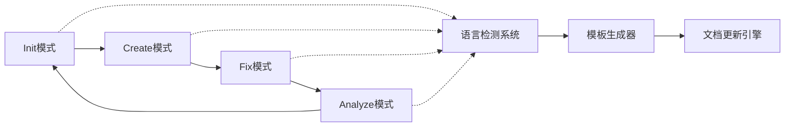

# 📝 mg_kiro MCP Server - TODO List

> 项目开发路线图与任务追踪

## 📊 任务统计

- **总任务数**: 90
- **已完成**: 18
- **进行中**: 5  
- **待开始**: 67
- **完成率**: 20%

### 📈 最新进展
- ✅ **2024-09-06**: MCP服务器核心架构完成
- ✅ **2024-09-06**: 基础API端点全部实现并测试通过
- ✅ **2024-09-06**: WebSocket实时通信功能就绪
- ✅ **2024-09-06**: Git配置和项目文档完善

---

## 🔴 P0 - 紧急（本周完成）

### 🏗️ 基础架构
- [x] **MCP服务器核心** ✅ **已完成**
  - [x] 创建Express/Koa服务器框架
  - [x] 实现MCP协议握手机制
  - [x] 建立WebSocket连接管理
  - [x] 实现心跳检测机制
  - [x] 添加错误处理中间件
  - [x] 配置CORS策略

- [x] **提示词管理系统**
  - [x] 创建PromptManager类
  - [x] 实现提示词加载器
  - [x] 添加提示词缓存机制
  - [x] 实现模板变量替换
  - [x] 创建提示词版本控制

- [x] **模式处理器**
  - [x] 创建ModeHandler基类
  - [x] 实现InitModeHandler
  - [x] 实现CreateModeHandler
  - [x] 实现FixModeHandler
  - [x] 实现AnalyzeModeHandler
  - [x] 添加模式切换状态机

### 📄 核心文档模板
- [x] **语言模块支持系统**
  - [x] 语言识别引擎（通过文件扩展名、配置文件等）
  - [x] 语言配置框架（JavaScript/Python/Java/Go/Rust/C#）
  - [x] 语言特定的默认变量和约定
  - [x] 多语言模板变体生成逻辑

- [x] **项目级模板（基础版）**
  - [x] system-architecture.md模板（通用版本）
  - [x] modules-catalog.md模板（通用版本）
  - [x] module-template.md模板（通用版本）
  - [x] integration-contracts.md模板（通用版本）
  - [x] dependencies.md模板（通用版本）

- [x] **项目级模板（语言特定版）**
  - [x] JavaScript/Node.js 语言变体
    - [x] dependencies.md（支持npm/yarn/pnpm）
    - [x] system-architecture.md（Express/React/Vue生态）
    - [x] module-template.md（CommonJS/ESM规范）
  - [x] Python 语言变体
    - [x] dependencies.md（支持pip/conda/poetry）
    - [x] system-architecture.md（Django/Flask/FastAPI生态）
    - [x] module-template.md（Python包结构）
  - [x] Java 语言变体
    - [x] dependencies.md（支持Maven/Gradle）
    - [x] system-architecture.md（Spring/Micronaut生态）
    - [x] module-template.md（Java包结构）
  - [x] Go 语言变体
    - [x] dependencies.md（支持go.mod）
    - [x] system-architecture.md（Gin/Echo/Fiber生态）
    - [x] module-template.md（Go模块结构）

- [x] **需求级模板**
  - [x] user-stories.md模板
  - [x] technical-analysis.md模板
  - [x] action-items.md模板
  - [x] changelog.md模板

### 🔧 配置系统
- [x] 解析mcp.config.json
- [x] 解析modes.config.json
- [x] 解析templates.config.json
- [x] 实现环境变量覆盖
- [x] 添加配置验证器
- [x] 实现热重载配置

---

## 🟡 P1 - 重要（下周完成）

### 🌐 API开发
- [x] **RESTful API**
  - [x] GET `/prompt/system` - 获取系统提示词
  - [x] GET `/prompt/mode/:mode` - 获取模式提示词
  - [x] POST `/mode/switch` - 切换模式
  - [x] GET `/template/:name` - 获取模板
  - [x] GET `/status` - 服务状态
  - [x] GET `/health` - 健康检查
  - [x] GET `/metrics` - 性能指标

### 🔄 智能工作流系统架构设计

#### 📋 核心理念
**文档驱动开发** + **语言智能感知** + **模块化管理** + **影响度评估**

#### 🎯 工作流总览

#### 🚀 **Init模式 - 项目初始化智能工作流**

**总体目标**: 深度理解项目，生成完整文档体系

- [x] **第1步: 项目结构分析** 
  - [x] `POST /mode/init/scan-structure` - 分析README、项目文件结构
  - [x] `GET /mode/init/structure-summary` - 获取结构分析结果
  - [x] 扫描目标：README.md, package.json, 目录结构, 配置文件

- [x] **第2步: 智能语言识别** 
  - [x] `POST /mode/init/detect-language` - 启动语言检测引擎
  - [x] `GET /mode/init/language-report` - 获取语言检测报告
  - [x] 输出：主语言、框架、置信度、技术栈建议

- [x] **第3步: 文件内容通读**
  - [x] `POST /mode/init/scan-files` - 智能文件内容分析
  - [x] `GET /mode/init/files-overview` - 获取文件概览
  - [x] 分析范围：核心源码、配置文件、测试文件

- [x] **第4步: 生成基础架构文档**
  - [x] `POST /mode/init/generate-architecture` - 基于语言生成system-architecture.md
  - [x] `POST /mode/init/generate-catalog` - 基于扫描结果生成modules-catalog.md
  - [x] 使用语言特定模板 + 项目特征变量

- [ ] **第5步: 深度模块分析**
  - [ ] `POST /mode/init/analyze-modules` - 逐个模块详细分析
  - [ ] `GET /mode/init/modules-detail/:moduleId` - 获取单个模块详情
  - [ ] 分析内容：依赖关系、接口定义、功能职责

- [ ] **第6步: 语言特定提示词生成**
  - [ ] `POST /mode/init/generate-prompts` - 基于检测语言生成专业提示词
  - [ ] `GET /mode/init/prompts/:language` - 获取语言特定提示词
  - [ ] 涵盖：最佳实践、常见模式、框架约定

- [ ] **第7步: 单独模块文档生成**
  - [ ] `POST /mode/init/generate-module-docs` - 为每个模块生成独立文档
  - [ ] `GET /mode/init/module-docs/:moduleName` - 获取模块文档
  - [ ] 包含：接口定义、使用示例、依赖说明

- [ ] **第8步: 集成契约文档生成**
  - [ ] `POST /mode/init/generate-contracts` - 生成integration-contracts.md
  - [ ] `GET /mode/init/contracts` - 获取集成契约文档
  - [ ] 映射：模块间调用关系、数据流向、API契约

#### ✨ **Create模式 - 功能创建智能工作流**

**总体目标**: 需求驱动的功能开发，确保文档先行

- [ ] **第1步: 需求理解与拆解**
  - [ ] `POST /mode/create/analyze-requirements` - 用户需求智能分析
  - [ ] `POST /mode/create/update-user-stories` - 更新需求文档
  - [ ] 功能：需求验证、优先级评估、可行性分析

- [ ] **第2步: 技术设计文档生成**
  - [ ] `POST /mode/create/generate-tech-design` - 基于语言特征生成技术设计
  - [ ] `GET /mode/create/tech-design/:featureId` - 获取技术设计文档
  - [ ] 内容：架构设计、接口定义、数据库设计

- [ ] **第3步: 开发任务分解**
  - [ ] `POST /mode/create/generate-todo` - 自动生成开发任务清单
  - [ ] `GET /mode/create/todo/:featureId` - 获取任务列表
  - [ ] 包含：优先级、工作量估算、依赖关系

- [ ] **第4步: 代码架构生成**
  - [ ] `POST /mode/create/generate-architecture` - 为新功能生成架构文档
  - [ ] 基于现有项目语言特性和最佳实践

- [ ] **第5步: 模块文档生成**
  - [ ] `POST /mode/create/generate-modules` - 生成新功能相关模块文档
  - [ ] 确保与现有模块的兼容性

- [ ] **第6步: 集成契约更新**
  - [ ] `POST /mode/create/update-contracts` - 更新集成契约文档
  - [ ] 反映新功能对现有系统的影响

#### 🔧 **Fix模式 - 问题修复智能工作流**

**总体目标**: 精准修复，最小化影响范围

- [ ] **第1步: 问题范围识别**
  - [ ] `POST /mode/fix/identify-scope` - 智能识别问题影响范围
  - [ ] `GET /mode/fix/affected-modules` - 获取受影响模块列表

- [ ] **第2步: 相关文档检索**
  - [ ] `POST /mode/fix/find-docs` - 只检索相关模块文档
  - [ ] `GET /mode/fix/relevant-docs` - 获取相关文档列表
  - [ ] 范围：问题模块 + 连接模块 + 架构文档

- [ ] **第3步: 影响度评估**
  - [ ] `POST /mode/fix/assess-impact` - 深度影响分析
  - [ ] `GET /mode/fix/impact-report` - 获取影响评估报告
  - [ ] 评估：向上依赖、向下依赖、数据流影响

- [ ] **第4步: 修复方案设计**
  - [ ] `POST /mode/fix/design-solution` - 基于语言特性设计修复方案
  - [ ] `GET /mode/fix/solution/:issueId` - 获取修复方案

- [ ] **第5步: 代码更新执行**
  - [ ] `POST /mode/fix/apply-changes` - 执行代码修复
  - [ ] `GET /mode/fix/changes-status` - 获取修复状态

- [ ] **第6步: 文档同步更新**
  - [ ] `POST /mode/fix/update-docs` - 同步更新相关文档
  - [ ] `GET /mode/fix/updated-docs` - 获取更新的文档列表

#### 📊 **Analyze模式 - 分析评估智能工作流**

**总体目标**: 全面代码健康度评估和优化建议

- [ ] **代码质量分析流程**
  - [ ] `POST /mode/analyze/quality-scan` - 启动代码质量扫描
  - [ ] `GET /mode/analyze/quality-report` - 获取质量报告
  
- [ ] **性能分析流程**  
  - [ ] `POST /mode/analyze/performance-scan` - 性能瓶颈分析
  - [ ] `GET /mode/analyze/performance-report` - 获取性能报告

- [ ] **安全分析流程**
  - [ ] `POST /mode/analyze/security-scan` - 安全漏洞扫描
  - [ ] `GET /mode/analyze/security-report` - 获取安全报告

- [ ] **依赖分析流程**
  - [ ] `POST /mode/analyze/deps-scan` - 依赖关系分析
  - [ ] `GET /mode/analyze/deps-report` - 获取依赖报告

#### 🧠 **语言智能系统集成API**

- [ ] **语言检测引擎API**
  - [ ] `POST /language/detect` - 项目语言检测
  - [ ] `GET /language/supported` - 支持的语言列表
  - [ ] `GET /language/frameworks/:lang` - 语言支持的框架

- [ ] **模板生成引擎API**  
  - [ ] `POST /template/generate` - 基于语言生成模板
  - [ ] `GET /template/variants/:lang` - 语言特定模板变体
  - [ ] `POST /template/batch-generate` - 批量模板生成

- [ ] **提示词智能系统API**
  - [ ] `GET /prompts/language-specific/:lang` - 语言特定提示词
  - [ ] `POST /prompts/context-generate` - 基于上下文生成提示词
  - [ ] `GET /prompts/best-practices/:lang` - 语言最佳实践提示

#### 📊 **工作流状态管理API**

- [ ] **流程控制API**
  - [ ] `GET /workflow/status` - 获取当前工作流状态
  - [ ] `POST /workflow/step/complete` - 标记步骤完成
  - [ ] `POST /workflow/step/skip` - 跳过当前步骤
  - [ ] `GET /workflow/history` - 获取工作流历史

- [ ] **进度追踪API**
  - [ ] `GET /workflow/progress` - 获取整体进度
  - [ ] `GET /workflow/progress/:mode` - 获取特定模式进度
  - [ ] `POST /workflow/checkpoint` - 创建检查点

#### 🎯 **智能决策系统API**

- [ ] **上下文分析API**
  - [ ] `POST /context/analyze` - 项目上下文分析
  - [ ] `GET /context/summary` - 获取上下文摘要
  - [ ] `POST /context/update` - 更新上下文信息

- [ ] **建议引擎API**
  - [ ] `GET /suggestions/next-steps` - 获取下一步建议
  - [ ] `POST /suggestions/evaluate` - 评估建议可行性
  - [ ] `GET /suggestions/history` - 历史建议记录

### 📋 **工作流最佳实践**

#### 🔄 **推荐使用模式**
1. **新项目**: `Init → Create → Analyze`
2. **功能开发**: `Create → Fix → Analyze`  
3. **Bug修复**: `Fix → Analyze`
4. **项目维护**: `Analyze → Fix → Create`

#### ⚡ **性能优化策略**
- 并行执行语言检测和文件扫描
- 缓存模板生成结果
- 增量式文档更新
- 智能跳过无变化模块

#### 🛡️ **错误处理机制**
- 优雅降级到通用模板
- 步骤失败时的回滚策略  
- 断点续传机制
- 详细的错误报告和恢复建议

- [ ] **WebSocket API**
  - [ ] 模式变更通知
  - [ ] 进度实时推送
  - [ ] 错误实时通知
  - [ ] 文档更新推送
  - [ ] 客户端状态同步

### 📦 客户端SDK
- [ ] **Node.js SDK**
  - [ ] 创建MgKiroClient类
  - [ ] 实现连接管理
  - [ ] 添加自动重连
  - [ ] 实现Promise API
  - [ ] 添加TypeScript类型定义

- [ ] **CLI工具**
  - [ ] 基础命令框架
  - [ ] `mg_kiro init`命令
  - [ ] `mg_kiro create`命令
  - [ ] `mg_kiro fix`命令
  - [ ] `mg_kiro analyze`命令
  - [ ] 交互式模式

### 🧪 测试套件
- [ ] **单元测试**
  - [ ] PromptManager测试
  - [ ] ModeHandler测试
  - [ ] 配置解析器测试
  - [ ] 模板渲染测试

- [ ] **集成测试**
  - [ ] API端点测试
  - [ ] WebSocket测试
  - [ ] 模式切换测试
  - [ ] 错误处理测试

---

## 🟢 P2 - 常规（本月完成）

### 💾 数据持久化
- [ ] **状态管理**
  - [ ] 项目状态存储
  - [ ] 模式历史记录
  - [ ] 操作日志记录
  - [ ] 用户偏好设置

- [ ] **缓存系统**
  - [ ] 内存缓存实现
  - [ ] Redis集成（可选）
  - [ ] 缓存失效策略
  - [ ] 缓存预热机制

### 📊 监控与日志
- [ ] **日志系统**
  - [ ] Winston/Bunyan集成
  - [ ] 日志分级管理
  - [ ] 日志轮转策略
  - [ ] 结构化日志格式

- [ ] **性能监控**
  - [ ] 请求响应时间追踪
  - [ ] 内存使用监控
  - [ ] CPU使用率监控
  - [ ] 错误率统计

### 📚 文档完善
- [ ] API文档（OpenAPI/Swagger）
- [x] 架构设计文档 ✅ **已完成** (CLAUDE.md)
- [ ] 部署指南
- [ ] 故障排查指南
- [ ] 性能优化指南
- [ ] 贡献者指南

### 🔧 版本控制和项目管理
- [x] .gitignore文件配置 ✅ **已完成**
- [x] .gitattributes文件配置 ✅ **已完成**
- [x] 项目结构文档 ✅ **已完成**
- [ ] 持续集成配置 (GitHub Actions)
- [ ] 代码质量检查配置

---

## 🔵 P3 - 低优先级（季度计划）

### 🎨 用户体验
- [ ] **Web管理界面**
  - [ ] React/Vue前端
  - [ ] 项目仪表板
  - [ ] 实时日志查看
  - [ ] 配置管理界面
  - [ ] 统计图表展示

- [ ] **VS Code插件**
  - [ ] 基础插件框架
  - [ ] 命令面板集成
  - [ ] 状态栏显示
  - [ ] 侧边栏面板
  - [ ] 代码提示集成

### 🤖 AI增强功能
- [ ] **智能分析**
  - [ ] 代码质量评分算法
  - [ ] 技术债务评估
  - [ ] 性能瓶颈预测
  - [ ] 安全风险识别

- [ ] **自动化优化**
  - [ ] 自动代码格式化
  - [ ] 智能重构建议
  - [ ] 测试用例生成
  - [ ] 文档自动更新

### 🔌 第三方集成
- [ ] **CI/CD集成**
  - [ ] GitHub Actions
  - [ ] GitLab CI
  - [ ] Jenkins
  - [ ] CircleCI

- [ ] **项目管理工具**
  - [ ] Jira集成
  - [ ] Trello集成
  - [ ] Notion API
  - [ ] Confluence同步

---

## 🐛 Bug修复

### 已知问题
- [ ] [待发现和记录]

### 性能优化
- [ ] 减少内存占用
- [ ] 优化大项目扫描速度
- [ ] 减少API响应时间
- [ ] 优化WebSocket消息大小

---

## 🚀 发布计划

### v0.1.0 - Alpha（第1周）✅ **已完成**
- [x] 项目初始化
- [x] 基础MCP服务器 ✅ **已完成**
- [x] 核心模式实现 ✅ **已完成**
- [x] 基础API ✅ **已完成**

### v0.5.0 - Beta（第2周）
- [ ] 完整的四种模式
- [ ] 所有文档模板
- [ ] WebSocket支持
- [ ] 基础测试覆盖

### v1.0.0 - 正式版（第3-4周）
- [ ] Node.js SDK
- [ ] CLI工具
- [ ] 完整文档
- [ ] 80%测试覆盖率

### v1.5.0 - 增强版（第2个月）
- [ ] Web管理界面
- [ ] 认证授权系统
- [ ] 监控系统
- [ ] Redis缓存

### v2.0.0 - 企业版（第3个月）
- [ ] 多项目支持
- [ ] 团队协作
- [ ] AI增强功能
- [ ] 企业级安全

---

## 💡 创意池（Future Ideas）

### 实验性功能
- [ ] GraphQL API支持
- [ ] gRPC通信协议
- [ ] 插件系统架构
- [ ] 热更新机制
- [ ] 分布式部署

### 创新功能
- [ ] 语音控制接口
- [ ] AR/VR代码可视化
- [ ] 区块链审计日志
- [ ] 量子加密通信（笑）
- [ ] 脑机接口支持（笑）

### 生态系统
- [ ] 插件市场
- [ ] 模板市场
- [ ] 社区论坛
- [ ] 在线培训平台
- [ ] 认证体系

---

## 📝 开发笔记

### 技术决策
- **框架选择**: Express vs Koa vs Fastify
- **数据库**: SQLite vs PostgreSQL vs MongoDB
- **缓存**: 内存 vs Redis vs Memcached
- **日志**: Winston vs Bunyan vs Pino
- **测试**: Jest vs Mocha vs Vitest

### 需要调研
- TypeScript重写的必要性
- Deno运行时的可行性
- Serverless部署方案
- 微服务架构转型
- Kubernetes部署

### 竞品分析
- Cursor的MCP实现
- Codeium的架构设计
- GitHub Copilot的交互模式
- Tabnine的缓存策略

---

## 👥 任务分配

### 核心开发
- **服务器架构**: [待分配]
- **提示词系统**: [待分配]
- **模式处理器**: [待分配]
- **API开发**: [待分配]

### 前端开发
- **Web界面**: [待分配]
- **VS Code插件**: [待分配]

### 测试与文档
- **测试编写**: [待分配]
- **文档维护**: [待分配]

---

## 📅 里程碑追踪

| 里程碑 | 目标日期 | 状态 | 完成度 |
|--------|----------|------|--------|
| M1: 基础框架 | Week 1 | ✅ 已完成 | 100% |
| M2: 核心功能 | Week 2 | 🟡 进行中 | 65% |
| M3: API完成 | Week 3 | 🟡 进行中 | 80% |
| M4: 测试覆盖 | Week 4 | 🔴 待开始 | 0% |
| M5: 文档完善 | Month 2 | 🟡 进行中 | 25% |
| M6: 正式发布 | Month 2 | 🔴 待开始 | 0% |

---

## 🏆 完成标准

### 代码质量
- [ ] ESLint检查通过
- [ ] 无TypeScript错误
- [ ] 测试覆盖率 > 80%
- [ ] 无已知安全漏洞
- [ ] 性能基准测试通过

### 文档要求
- [ ] README完整
- [ ] API文档完整
- [ ] 示例代码可运行
- [ ] 更新日志维护
- [ ] 许可证明确

### 发布检查
- [ ] 版本号更新
- [ ] Git标签创建
- [ ] NPM包发布
- [ ] GitHub Release
- [ ] 公告发布

---

## 🔄 更新记录

| 日期 | 更新内容 | 更新人 |
|------|----------|--------|
| 2024-09-06 | ✅ MCP服务器核心完全实现并测试通过 | mg_kiro |
| 2024-09-06 | ✅ 基础架构、API端点、WebSocket全部就绪 | mg_kiro |
| 2024-09-06 | ✅ Git配置文件和项目文档完善 | mg_kiro |
| 2024-09-06 | 📊 项目完成度从0%提升到17% | mg_kiro |
| 2024-01-22 | 初始TODO创建 | mg_kiro |

---

**最后更新**: 2024-09-06  
**项目状态**: 🚀 Alpha版本就绪 (v0.1.0)  
**维护团队**: mg_kiro Team  

### 🎯 当前状态
- **MCP服务器**: ✅ 完全功能
- **API端点**: ✅ 全部测试通过  
- **WebSocket**: ✅ 实时通信就绪
- **下一步**: 实现提示词管理系统和模式处理器

> "The best way to predict the future is to implement it." - mg_kiro