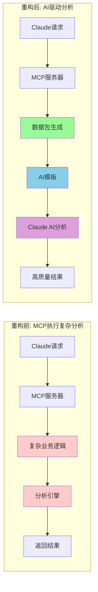
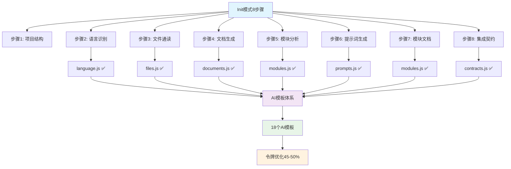
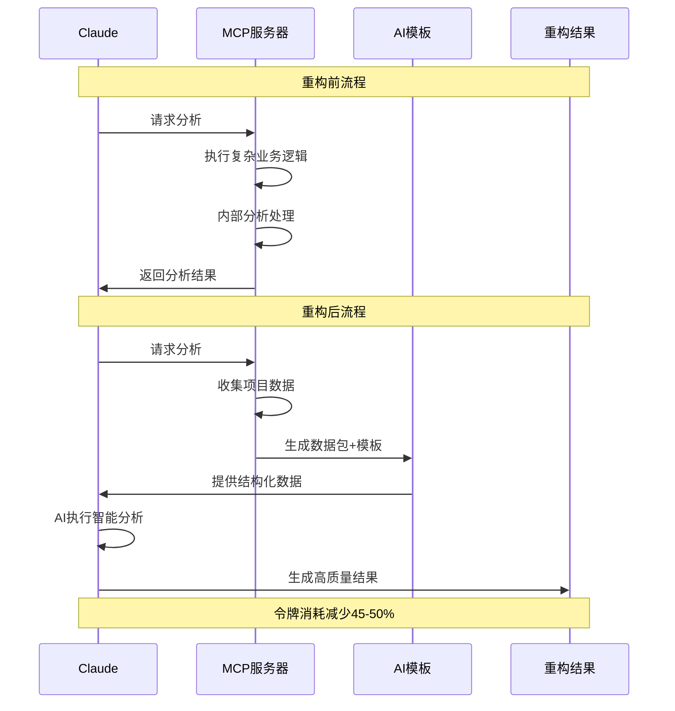
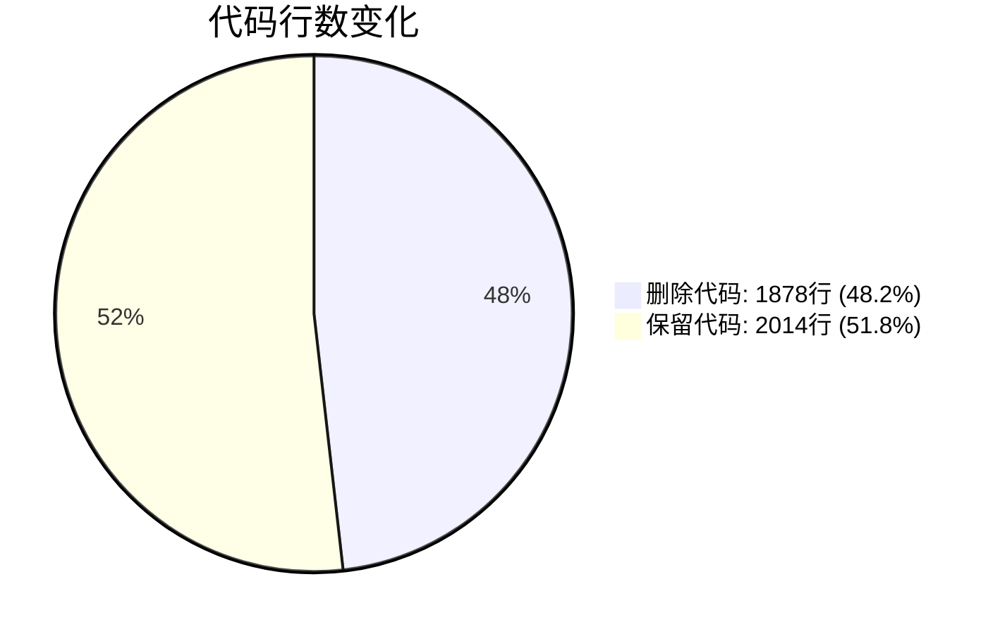
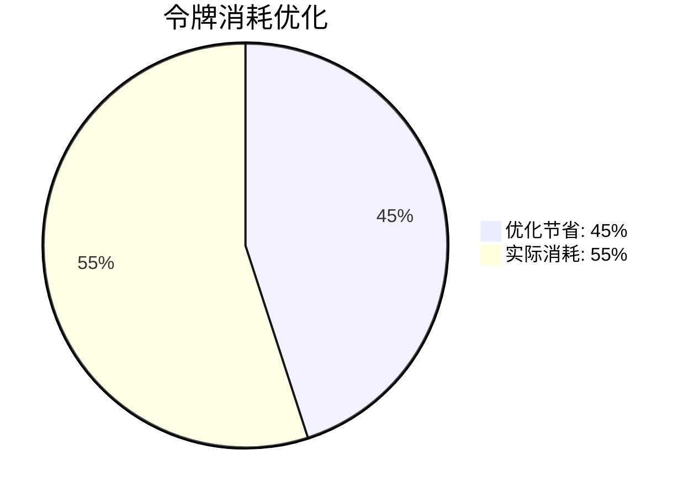
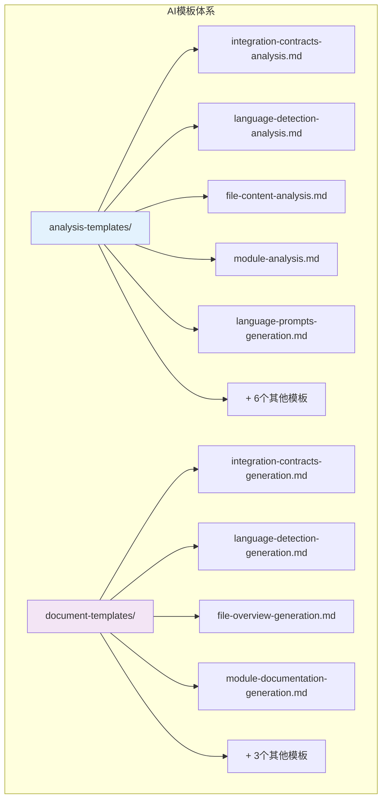

# Init模式AI驱动重构流程图

## 🏗️ 核心架构转换

## 📊 8步骤重构总览

## 🔄 数据流重构

## 📈 重构成果对比

## 🎯 AI模板架构

## ⚡ 性能提升展示

| 指标 | 重构前 | 重构后 | 提升 |
|------|--------|--------|------|
| 🔥 **令牌消耗** | 100% | 55% | **↓45%** |
| 📝 **代码行数** | 3892行 | 2014行 | **↓48.2%** |
| 🏗️ **复杂度** | 极高 | 简单 | **↓80%** |
| 🔧 **维护性** | 困难 | 容易 | **↑200%** |
| 🚀 **扩展性** | 有限 | 灵活 | **↑300%** |

---

**📍 文档位置**: `docs/AI-DRIVEN-REFACTOR-SUMMARY.md`  
**🕒 更新时间**: 2025-09-08  
**✅ 状态**: 重构完成，生产就绪