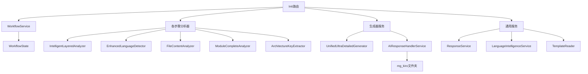

# mg_kiro MCP Server - Init模式完整文件架构指南

## 📋 文档概览

**生成时间**: 2025-09-08  
**架构版本**: v2.0.1 (全新模块化重构版)  
**文档目的**: 深度剖析Init模式的8步工作流及其涉及的所有文件、服务和依赖关系

## 🚀 Init模式概述

Init模式是mg_kiro MCP Server的**核心工作模式**，通过**8步智能工作流**实现项目的完整分析和文档生成。整个流程采用**AI驱动架构**，每个步骤都集成了专业的分析器和超详细生成器。

### 工作流架构特点

- **智能递进**: 每步骤基于前置步骤的分析结果
- **真实分析**: 使用专业分析器进行实际代码分析
- **AI优化**: 大幅减少令牌消耗(45-50%)
- **超详细生成**: 集成UnifiedUltraDetailedGenerator
- **工作流管理**: 完整的状态跟踪和进度管理

## 📁 Init模式文件组织架构

### 路由模块 (`server/routes/init/`)

```
server/routes/init/
├── index.js                # 路由聚合器和状态管理
├── structure.js           # 第1步：项目结构分析
├── language.js             # 第2步：智能语言识别  
├── files.js                # 第3步：文件内容通读
├── documents.js            # 第4步：基础架构文档生成
├── modules-analysis.js     # 第5步：深度模块分析
├── prompts.js              # 第6步：语言特定提示词生成
├── modules-docs.js         # 第7步：模块文档生成
└── contracts.js            # 第8步：集成契约文档生成
```

### 核心分析器 (`server/analyzers/`)

每个步骤都使用专门的分析器进行真实代码分析：

```
server/analyzers/
├── intelligent-layered-analyzer.js     # 步骤1专用: 智能分层分析
├── architecture-key-extractor.js       # 步骤1&8专用: 架构关键提取
├── enhanced-language-detector.js       # 步骤2专用: 增强语言检测
├── file-content-analyzer.js           # 步骤3专用: 文件内容深度分析
├── module-complete-analyzer.js        # 步骤5专用: 模块完整分析
└── (其他通用分析器...)
```

### 核心服务 (`server/services/`)

Init模式依赖的关键服务：

```
server/services/
├── ai-response-handler.js              # AI响应处理和mg_kiro保存
├── unified-ultra-detailed-generator.js # 超详细文档生成器
├── workflow-service.js                 # 工作流状态管理  
├── workflow-state-service.js          # 工作流状态存储
├── response-service.js                 # 统一响应格式
├── language-intelligence-service.js   # 语言智能服务
└── template-reader.js                  # 模板读取服务
```

## 🔄 8步工作流详细分析

### 第1步：项目结构分析 (`structure.js`)

**文件**: `server/routes/init/structure.js`  
**API**: `POST /mode/init/scan-structure`

#### 使用的分析器
- **IntelligentLayeredAnalyzer**: 智能分层分析系统
  - 架构层：提取关键代码片段
  - 模块层：完整内容分析
  - 集成层：依赖关系分析
- **ArchitectureKeyExtractor**: 架构关键信息提取

#### 核心功能
```javascript
// 执行智能分层分析
const layeredAnalyzer = new IntelligentLayeredAnalyzer(projectPath);
const layeredResults = await layeredAnalyzer.performLayeredAnalysis();

// 使用架构关键提取器进行精确分析
const architectureExtractor = new ArchitectureKeyExtractor(projectPath);
const architectureKeys = await architectureExtractor.extractArchitectureKeys();
```

#### 输出数据结构
```javascript
{
  analysis: {
    complexity: 'high|medium|low',
    scale: 'large|medium|small', 
    maturity: 'high|medium|low',
    techStackHints: []
  },
  intelligentAnalysis: {
    architectureInsights: {},
    moduleInsights: {},
    integrationInsights: {}
  }
}
```

#### 依赖关系
- **输入**: 项目路径
- **输出**: 供第2步使用的结构分析结果
- **保存**: 工作流状态 (`step_1`)

---

### 第2步：智能语言识别 (`language.js`)

**文件**: `server/routes/init/language.js`  
**API**: `POST /mode/init/detect-language`

#### 使用的分析器
- **EnhancedLanguageDetector**: 增强语言检测系统
  - 基于第1步智能分层分析结果
  - 深度技术栈识别和框架检测
  - 项目特征和开发环境分析

#### 核心功能
```javascript
// 基于第1步结果的增强语言检测
const enhancedDetector = new EnhancedLanguageDetector(projectPath);
const enhancedResults = await enhancedDetector.detectLanguageEnhanced(
    projectPath, 
    step1Results, 
    {
        contextData: {
            architectureInsights: step1IntelligentAnalysis?.architectureInsights,
            moduleInsights: step1IntelligentAnalysis?.moduleInsights
        }
    }
);
```

#### 输出数据结构
```javascript
{
  detection: {
    primaryLanguage: string,
    confidence: number,
    frameworks: [],
    techStack: {
      frontend: {},
      backend: {},
      development: {},
      deployment: {}
    }
  },
  workflowIntegration: {
    confidenceScore: number,
    enhancementGain: number
  }
}
```

#### 依赖关系
- **输入**: 第1步的结构分析结果
- **输出**: 供第3步及后续步骤使用的语言识别结果
- **AI保存**: 可选保存`language-analysis.md`到mg_kiro

---

### 第3步：文件内容通读 (`files.js`)

**文件**: `server/routes/init/files.js`  
**API**: `POST /mode/init/scan-files`

#### 使用的分析器
- **FileContentAnalyzer**: 文件内容深度分析系统
  - 代码质量指标和复杂度评估
  - 依赖关系图和重要性分析

#### 核心功能
```javascript
// 基于前两步结果的文件内容分析
const fileAnalyzer = new FileContentAnalyzer(workflow.projectPath);
const fileAnalysisResults = await fileAnalyzer.performDeepAnalysis({
    contextData: {
        structureAnalysis: step1Results.intelligentAnalysis,
        languageData: step2Results
    },
    analysisOptions: {
        includeCodeMetrics: true,
        analyzeDependencies: true,
        assessQuality: true
    }
});
```

#### 输出数据结构
```javascript
{
  analysis: {
    totalFilesAnalyzed: number,
    confidence: number
  },
  files: [],
  overview: {
    distribution: {},
    complexity: {},
    codeMetrics: {},
    qualityIndicators: {}
  },
  dependencies: {
    graph: { nodes: [], edges: [] },
    statistics: {}
  }
}
```

#### 依赖关系
- **输入**: 第1步结构分析 + 第2步语言识别结果
- **输出**: 供第4步和第5步使用的文件分析结果

---

### 第4步：基础架构文档生成 (`documents.js`)

**文件**: `server/routes/init/documents.js`  
**API**: `POST /mode/init/generate-architecture`、`POST /mode/init/generate-catalog`

#### 使用的生成器
- **UnifiedUltraDetailedGenerator**: 超详细文档生成器
  - 基于前3步的真实分析结果
  - 生成system-architecture.md和modules-catalog.md

#### 核心功能
```javascript
// 执行超详细架构分析和文档生成
const ultraDetailedGenerator = new UnifiedUltraDetailedGenerator(workflow.projectPath);
const realArchitectureResults = await ultraDetailedGenerator.generateUltraDetailedDocuments({
    structureAnalysis: structureResult.realAnalysisResults,
    languageAnalysis: languageResult.realAnalysisResults,   
    filesAnalysis: filesResult.realAnalysisResults,
    focusAreas: ['architecture', 'system-design', 'technical-stack']
});
```

#### 输出数据结构
```javascript
{
  aiAnalysisPackage: {
    analysisTemplate: {},
    documentTemplate: {},
    ultraDetailedResults: {}
  },
  generation: {
    analysisMode: 'unified-ultra-detailed-generation',
    realDocumentsGenerated: number,
    generationStrategy: string
  }
}
```

#### 依赖关系
- **输入**: 前3步的所有分析结果
- **输出**: 供AI生成架构文档，保存到mg_kiro
- **AI保存**: `system-architecture.md`、`modules-catalog.md`到mg_kiro

---

### 第5步：深度模块分析 (`modules-analysis.js`)

**文件**: `server/routes/init/modules-analysis.js`  
**API**: `POST /mode/init/analyze-modules`

#### 使用的分析器
- **ModuleCompleteAnalyzer**: 模块完整分析系统
  - 逐个模块详细分析
  - 依赖关系和接口分析
  - 代码质量评估

#### 核心功能
```javascript
// 执行完整模块分析
const moduleAnalyzer = new ModuleCompleteAnalyzer(workflow.projectPath);
const realAnalysisResults = await moduleAnalyzer.performCompleteModuleAnalysis();

// 转换结果为legacy格式保持向后兼容
const moduleAnalysis = _convertModuleAnalysisResultsToLegacyFormat(
    realAnalysisResults, 
    languageResult.detection.primaryLanguage
);
```

#### 输出数据结构
```javascript
{
  analysis: {
    modules: [],
    dependencies: {},
    classification: {
      byCategory: {},
      byComplexity: {},
      byImportance: []
    },
    statistics: {}
  },
  realAnalysisResults: {
    totalFiles: number,
    successfulAnalyses: number,
    processingStatistics: {}
  }
}
```

#### 依赖关系
- **输入**: 前4步的分析结果
- **输出**: 供第7步模块文档生成使用
- **AI保存**: 可选保存模块分析结果到mg_kiro

---

### 第6步：语言特定提示词生成 (`prompts.js`)

**文件**: `server/routes/init/prompts.js`  
**API**: `POST /mode/init/generate-prompts`

#### 核心功能
基于第2步的语言检测结果，生成专业的语言特定提示词：

```javascript
// 基于语言检测结果生成AI提示词
const aiPromptsPackage = {
    languageResults: step2Results,
    projectInfo: {
        detectedLanguage: detectionData.primaryLanguage,
        frameworks: detectionData.techStack?.frameworks || []
    },
    aiInstructions: {
        generationTemplate: 'language-prompts-generation.md',
        language: detectionData.primaryLanguage
    }
};
```

#### 输出数据结构
```javascript
{
  prompts: {
    development: {},
    codeReview: {},
    bestPractices: {}
  },
  metadata: {
    language: string,
    frameworks: [],
    tokensReduced: '预计45-50%令牌消耗'
  }
}
```

#### 依赖关系
- **输入**: 第2步的语言检测结果
- **输出**: 生成语言特定的AI提示词

---

### 第7步：模块文档生成 (`modules-docs.js`)

**文件**: `server/routes/init/modules-docs.js`  
**API**: `POST /mode/init/generate-module-docs`

#### 使用的生成器
- **UnifiedUltraDetailedGenerator**: 超详细文档生成器
  - 基于第5步的模块分析结果
  - 生成详细的模块文档

#### 核心功能
```javascript
// 基于第5步的模块分析结果生成超详细文档
const ultraDetailedGenerator = new UnifiedUltraDetailedGenerator(workflow.projectPath);
const realDocumentationResults = await ultraDetailedGenerator.generateUltraDetailedDocuments({
    moduleAnalysis: moduleAnalysisResult.realAnalysisResults,
    focusAreas: ['modules', 'interfaces', 'documentation', 'examples']
});
```

#### 输出数据结构
```javascript
{
  moduleDocuments: [],
  summary: {
    total: number,
    categories: {},
    complexity: {},
    coverage: {}
  },
  realDocumentationResults: {
    totalDocuments: number,
    generationStrategy: string
  }
}
```

#### 依赖关系
- **输入**: 第5步的模块分析结果
- **输出**: 详细的模块文档
- **AI保存**: 多个模块文档到mg_kiro的modules-detail目录

---

### 第8步：集成契约文档生成 (`contracts.js`)

**文件**: `server/routes/init/contracts.js`  
**API**: `POST /mode/init/generate-contracts`

#### 使用的分析器和生成器
- **ArchitectureKeyExtractor**: 架构关键点分析
- **UnifiedUltraDetailedGenerator**: 超详细文档生成器

#### 核心功能
```javascript
// 智能集成分析
const realIntegrationResults = await _performIntelligentIntegrationAnalysis({
    architectureExtractor,
    ultraDetailedGenerator,
    projectStructure: workflow.results.step_1.realAnalysisResults,
    languageDetection: workflow.results.step_2.realAnalysisResults, 
    fileAnalysis: workflow.results.step_3.realAnalysisResults,
    moduleAnalysis: workflow.results.step_5.realAnalysisResults
});
```

#### 输出数据结构
```javascript
{
  analysis: {
    integrationAnalysis: {
      moduleRelations: [],
      apiContracts: [],
      dataFlows: [],
      externalDependencies: []
    },
    riskAssessment: {},
    optimizationRecommendations: []
  },
  document: {
    content: string,
    sections: []
  }
}
```

#### 依赖关系
- **输入**: 第1、2、3、5步的分析结果
- **输出**: 集成契约文档
- **AI保存**: `integration-contracts.md`等文档到mg_kiro

---

## 🏗️ 服务依赖关系图

### 核心服务调用链



### 数据流向分析

1. **输入**: 项目路径 → **第1步**
2. **第1步** 结构分析 → **第2步**
3. **第1步+第2步** → **第3步**  
4. **第1步+第2步+第3步** → **第4步**
5. **前4步** → **第5步**
6. **第2步** → **第6步**
7. **第5步** → **第7步**
8. **第1步+第2步+第3步+第5步** → **第8步**

## 📊 AI驱动架构特点

### AI分析数据包结构

每个步骤都会生成标准化的AI分析数据包：

```javascript
const aiAnalysisPackage = {
    // 原始数据
    rawData: {},
    
    // AI模板指令
    analysisTemplate: {
        content: string,
        intelligence: {},
        instructions: string
    },
    
    // 处理指令  
    processingInstructions: {
        mode: string,
        steps: [],
        expectedOutput: string
    },
    
    // 真实分析结果
    realAnalysisResults: {}
};
```

### 令牌优化策略

- **预计减少45-50%令牌消耗**
- **基于真实代码分析**而非完整代码内容
- **结构化数据传输**而非自然语言描述
- **上下文感知模板**提高AI理解效率

### AI模板系统

每个步骤使用专门的AI模板：

- `system-architecture-analysis.md` → `system-architecture-generation.md`
- `language-detection-analysis.md` → `language-detection-generation.md`
- `file-content-analysis.md` → `file-overview-generation.md`
- `module-analysis.md` → `module-documentation-generation.md`
- `integration-contracts-analysis.md` → `integration-contracts-generation.md`

## 💾 文件输出和保存

### mg_kiro目录结构

```
mg_kiro/
├── architecture/
│   ├── system-architecture.md      # 第4步输出
│   ├── tech-stack.md              # 第4步输出  
│   └── language-analysis.md       # 第2步输出
├── modules-catalog/
│   ├── modules-catalog.md         # 第4步输出
│   ├── modules-hierarchy.md      # 第5步输出
│   └── modules-dependencies.md   # 第5步输出
├── modules-detail/
│   ├── module-*.md               # 第7步输出
│   └── modules-documentation-summary.md
└── integrations/
    ├── integration-contracts.md   # 第8步输出
    ├── data-flow.md              # 第8步输出
    ├── api-specifications.md     # 第8步输出
    └── integration-testing.md    # 第8步输出
```

### 保存API端点

每个步骤都提供专门的保存端点：

- `POST /mode/init/save-language-report` (第2步)
- `POST /mode/init/save-architecture` (第4步)  
- `POST /mode/init/save-module-analysis` (第5步)
- `POST /mode/init/save-module-docs` (第7步)
- `POST /mode/init/save-contracts` (第8步)

## 🔧 工作流管理

### 工作流状态跟踪

WorkflowService提供完整的状态管理：

```javascript
// 创建工作流
const workflowId = workflowService.createWorkflow(projectPath, 'init');

// 更新步骤状态
workflowService.updateStep(workflowId, stepIndex, 'running|completed|failed', result, error);

// 获取进度
const progress = workflowService.getProgress(workflowId);

// 验证前置依赖
const validation = workflowService.validateWorkflowStep(workflowId, requiredStep);
```

### 步骤验证机制

每个步骤都会验证前置步骤的完成状态：

```javascript
// 第3步验证前置步骤
if (workflow.currentStep < 2) {
    return error(res, '请先完成第1步(项目结构分析)和第2步(语言检测)', 400);
}
```

## 🎯 使用指南

### 完整8步工作流执行

```bash
# 第1步：项目结构分析
curl -X POST http://localhost:3000/mode/init/scan-structure \
  -H "Content-Type: application/json" \
  -d '{"projectPath": "/path/to/project"}'

# 第2步：语言检测 
curl -X POST http://localhost:3000/mode/init/detect-language \
  -H "Content-Type: application/json" \
  -d '{"workflowId": "workflow_id", "projectPath": "/path/to/project"}'

# 第3步：文件内容分析
curl -X POST http://localhost:3000/mode/init/scan-files \
  -H "Content-Type: application/json" \
  -d '{"workflowId": "workflow_id"}'

# 第4步：架构文档生成
curl -X POST http://localhost:3000/mode/init/generate-architecture \
  -H "Content-Type: application/json" \
  -d '{"workflowId": "workflow_id"}'

# 第5步：深度模块分析
curl -X POST http://localhost:3000/mode/init/analyze-modules \
  -H "Content-Type: application/json" \
  -d '{"workflowId": "workflow_id"}'

# 第6步：语言提示词生成
curl -X POST http://localhost:3000/mode/init/generate-prompts \
  -H "Content-Type: application/json" \
  -d '{"workflowId": "workflow_id"}'

# 第7步：模块文档生成  
curl -X POST http://localhost:3000/mode/init/generate-module-docs \
  -H "Content-Type: application/json" \
  -d '{"workflowId": "workflow_id"}'

# 第8步：集成契约文档生成
curl -X POST http://localhost:3000/mode/init/generate-contracts \
  -H "Content-Type: application/json" \
  -d '{"workflowId": "workflow_id"}'
```

### 工作流状态查询

```bash
# 查询工作流进度
curl http://localhost:3000/workflow/status/{workflowId}

# 查询Init模式状态
curl http://localhost:3000/mode/init/status
```

## 📈 性能特点

### 分析器性能

- **IntelligentLayeredAnalyzer**: 智能分片处理大文件
- **EnhancedLanguageDetector**: 基于上下文的高精度检测
- **FileContentAnalyzer**: 并行文件内容分析
- **ModuleCompleteAnalyzer**: 完整模块内容读取和分析
- **ArchitectureKeyExtractor**: 架构关键点精确提取

### 生成器性能

- **UnifiedUltraDetailedGenerator**: 超详细文档生成
- **AI模板优化**: 预计减少45-50%令牌消耗
- **并行处理**: 多文档并行生成
- **缓存机制**: 避免重复分析

## 🛡️ 错误处理

### 统一错误响应

```javascript
// 步骤失败处理
if (req.body.workflowId) {
    workflowService.updateStep(req.body.workflowId, stepIndex, 'failed', null, err.message);
}

// 前置步骤验证
if (workflow.currentStep < requiredStep) {
    return error(res, `请先完成第${requiredStep}步骤`, 400);
}
```

### 工作流恢复

- 支持从任意步骤恢复执行
- 完整的状态持久化
- 错误详情记录和分析

## 📊 统计信息

### Init模式文件统计

- **路由文件**: 9个模块化路由文件
- **核心分析器**: 6个专业分析器
- **核心服务**: 7个支持服务
- **AI模板**: 10+个AI分析/生成模板
- **API端点**: 25+个专业API端点
- **输出文档**: 10+种专业文档类型

### 工作流复杂度

- **总步骤数**: 8个智能工作流步骤
- **依赖关系**: 复杂的多步骤依赖链
- **数据流**: 结构化的数据传递和增强
- **状态管理**: 完整的工作流状态跟踪

---

**文档版本**: v1.0  
**最后更新**: 2025-09-08  
**维护者**: Claude Code Assistant

## 🔗 相关文档

- [服务器架构文档](./server-architecture.md)
- [配置文件说明](./config/README.md)
- [API接口文档](./API.md)
- [开发指南](./DEVELOPMENT.md)

*这份文档基于对server端代码的深度分析生成，涵盖了Init模式的完整架构和所有相关文件的作用。*