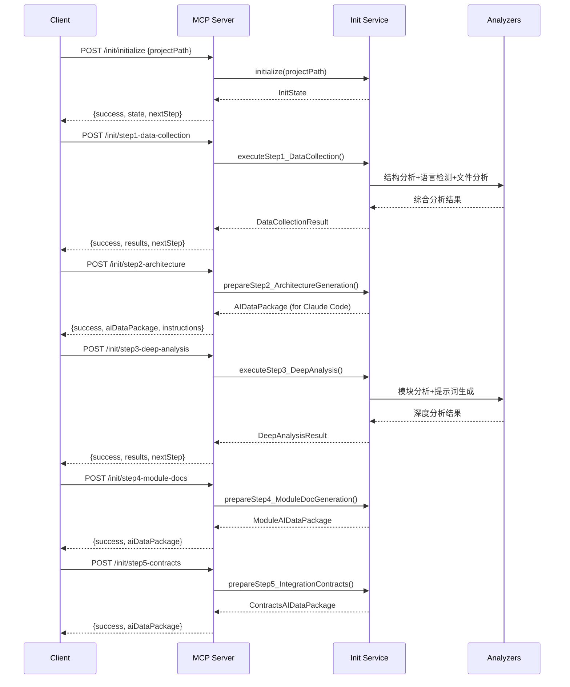

# mg_kiro MCP 集成契约文档

## 契约概览

**项目名称**: mg_kiro_mcp  
**生成时间**: 2025-09-09  
**主要语言**: JavaScript  
**架构类型**: 微服务 + MCP协议  

## 模块接口契约

### 1. 核心服务接口

#### MCP服务器接口
```typescript
interface MCPServerInterface {
  // 工具调用契约
  callTool(request: CallToolRequest): Promise<CallToolResult>
  
  // 工具列表契约  
  listTools(): Promise<ListToolsResult>
  
  // 初始化契约
  initialize(params: InitializeParams): Promise<InitializeResult>
}
```

#### Express API接口契约
```typescript
interface ExpressAPIInterface {
  // 健康检查契约
  "GET /health": () => Promise<HealthStatus>
  
  // Init流程契约
  "POST /init/initialize": (body: {projectPath: string}) => Promise<InitState>
  "POST /init/step1-data-collection": () => Promise<DataCollectionResult>  
  "POST /init/step2-architecture": () => Promise<AIDataPackage>
  "POST /init/step3-deep-analysis": () => Promise<DeepAnalysisResult>
  "POST /init/step4-module-docs": () => Promise<ModuleDocsResult>
  "POST /init/step5-contracts": () => Promise<ContractsResult>
  
  // 服务状态契约
  "GET /services/status": () => Promise<ServiceStatus>
  "GET /services/info": () => Promise<ServiceInfo>
}
```

### 2. 数据契约规范

#### Init流程数据契约
```typescript
// 步骤1数据契约
interface DataCollectionResult {
  structureAnalysis: {
    layeredResults: ArchitectureAnalysis
    architectureKeys: KeyExtraction
  }
  languageDetection: {
    detection: LanguageResult
    techStack: TechStackInfo
  }  
  fileAnalysis: {
    totalFiles: number
    quality: QualityMetrics
    complexity: ComplexityScore
    dependencies: DependencyGraph
  }
}

// 步骤2数据契约
interface ArchitectureAIPackage {
  projectInfo: {
    path: string
    name: string
    timestamp: string
  }
  structureAnalysis: StructureData
  languageData: LanguageData
  fileAnalysis: FileData
  generationInstructions: {
    documentType: 'system-architecture'
    outputFormat: 'markdown'
    sections: string[]
    template: string
  }
}
```

### 3. 服务依赖契约

#### 服务注册契约
```typescript
interface ServiceRegistryContract {
  // 必须实现的服务
  services: {
    templateReader: TemplateReaderService
    configService: ConfigService  
    initState: InitStateService
    claudeCodeInit: ClaudeCodeInitService
    promptManager: PromptManagerService
    projectScanner: ProjectScannerService
    enhancedLanguageDetector: EnhancedLanguageDetectorService
    fileContentAnalyzer: FileContentAnalyzerService
    languageIntelligence: LanguageIntelligenceService
    unifiedTemplateService: UnifiedTemplateService
  }
  
  // 依赖关系契约
  dependencies: {
    promptManager: ['templateReader']
    unifiedTemplateService: ['templateReader', 'languageIntelligence']
  }
}
```

## API调用流程契约

### Claude Code Init 5步流程契约



## 错误处理契约

### 标准错误响应格式
```typescript
interface ErrorResponse {
  success: false
  error: string
  details?: any
  timestamp: string
}

interface SuccessResponse<T> {
  success: true
  message: string
  data: T
  timestamp: string
}
```

### 错误类型契约
1. **初始化错误** (400): 项目路径未设置或无效
2. **步骤依赖错误** (400): 前置步骤未完成
3. **分析器错误** (500): 分析过程中的内部错误
4. **服务不可用** (503): 依赖服务未启动

## WebSocket通信契约

### 消息格式契约
```typescript
interface WebSocketMessage {
  type: 'init' | 'progress' | 'complete' | 'error'
  step?: number
  data?: any
  timestamp: string
}

// 进度更新消息
interface ProgressMessage extends WebSocketMessage {
  type: 'progress'
  step: number
  progress: {
    current: number
    total: number
    percentage: number
    status: string
  }
}
```

## 性能契约

### 响应时间契约
- **健康检查**: < 100ms
- **步骤1数据收集**: < 5s
- **步骤2-5数据准备**: < 2s
- **服务初始化**: < 10s

### 资源使用契约
- **内存使用**: < 500MB (正常运行)
- **CPU使用**: < 50% (分析期间)
- **并发连接**: 支持10个并发客户端

## 版本兼容性契约

### API版本契约
- **当前版本**: v2.0.1
- **向后兼容**: 支持v2.0.x所有版本
- **废弃警告**: 6个月提前通知
- **迁移支持**: 提供迁移指南和工具

### MCP协议契约
- **协议版本**: MCP 1.0
- **扩展支持**: 自定义工具注册
- **向前兼容**: 自动适配新版本特性

## 安全契约

### 访问控制契约
- **本地访问**: 默认仅localhost
- **认证**: 可选API密钥认证
- **授权**: 基于角色的访问控制
- **审计**: 完整的操作日志记录

### 数据保护契约
- **敏感数据**: 不记录密码和密钥
- **传输加密**: 支持HTTPS/WSS
- **存储安全**: 临时文件自动清理

## 监控和诊断契约

### 健康检查契约
```typescript
interface HealthCheckContract {
  endpoint: "GET /health"
  response: {
    status: 'healthy' | 'unhealthy' | 'degraded'
    version: string
    uptime: number
    services: ServiceStatus[]
  }
  sla: "99.9% availability"
}
```

### 诊断信息契约
```typescript  
interface DiagnosticContract {
  endpoint: "GET /diagnostic"
  response: {
    architecture: ArchitectureInfo
    environment: EnvironmentInfo
    services: ServiceInfo
    endpoints: EndpointInfo
  }
}
```

---

*此集成契约文档由 Claude Code Init 流程自动生成*  
*基于系统架构分析和模块依赖关系*  
*生成时间: 2025-09-09*  
*契约版本: 2.0.1*