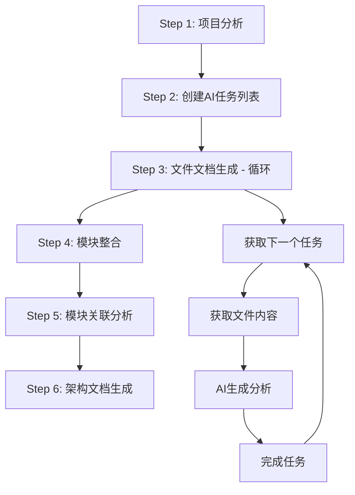
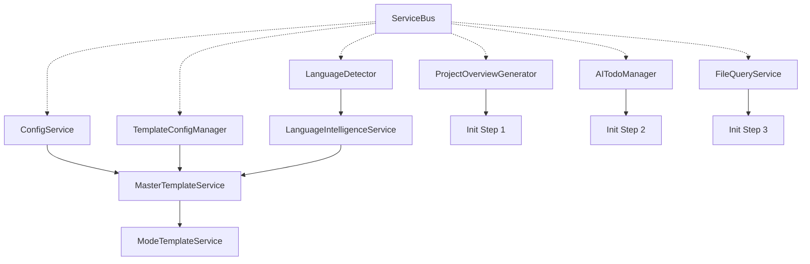

# mg_kiro MCP Server - Init Mode 完整分析文档

## 📋 概述

mg_kiro MCP Server 是一个专为 Claude Code 设计的 MCP (Model Context Protocol) 服务器，提供项目初始化和文档生成功能。Init Mode 是其核心工作模式，通过 6 步完整流程为项目生成详细的文档体系。

**版本**: v4.0.0-complete-6-steps  
**协议**: MCP 2024-11-05  
**主要功能**: 项目概览生成、渐进式文档生成、语言智能识别  

## 🎯 Init Mode 工作流程详解

### 6 步完整流程概览

Init Mode 采用智能化的 6 步流程，从项目分析到最终架构文档生成：



### Step 1: 项目分析 (Project Analysis)

**工具**: `init_step1_project_analysis`  
**职责**: 深度分析项目结构，生成基础数据包

#### 核心功能
- **语言检测**: 自动识别项目主要编程语言
- **依赖分析**: 提取 package.json、requirements.txt 等配置文件信息
- **目录结构**: 生成完整的项目目录树（支持 maxDepth 控制）
- **关键文件**: 智能提取重要配置文件和入口文件内容
- **架构特征**: 分析项目复杂度、架构类型、框架特征

#### 输入参数
```json
{
  "projectPath": "string (必需) - 项目根目录绝对路径",
  "maxDepth": "number (可选, 默认3) - 目录扫描深度",
  "includeFiles": "array (可选) - 额外包含的文件模式",
  "maxKeyFileSize": "number (可选, 默认50KB) - 关键文件最大字节数"
}
```

#### 输出结果
- **projectMetadata**: 项目元数据（名称、总文件数、大小等）
- **languageProfile**: 语言配置文件（主要语言、框架、依赖）
- **dependencyAnalysis**: 依赖关系分析
- **directoryStructure**: 目录结构树
- **keyFileContents**: 关键文件内容
- **projectCharacteristics**: 项目特征（架构类型、复杂度）
- **aiGenerationGuide**: AI 生成指导（批次大小建议、文档策略）

### Step 2: 创建AI任务列表 (Create Todos)

**工具**: `init_step2_create_todos`  
**职责**: 基于项目分析结果创建详细的处理任务列表

#### 核心功能
- **任务分解**: 将项目文件分解为可处理的任务单元
- **批次规划**: 智能批次大小计算，优化 token 使用
- **优先级排序**: 按文件重要性和依赖关系排序
- **处理策略**: 生成文件处理策略和时间估算

#### 输入参数
```json
{
  "projectPath": "string (必需) - 项目根目录路径",
  "batchSize": "number (可选) - 批次大小，默认使用Step1建议值",
  "includeAnalysisTasks": "boolean (可选, 默认true) - 是否包含分析任务",
  "includeSummaryTasks": "boolean (可选, 默认true) - 是否包含总结任务"
}
```

#### 输出结果
- **todoCreationResults**: 任务创建结果统计
- **processingStrategy**: 处理策略（批次数、平均大小、处理模式）
- **estimatedTime**: 预估处理时间
- **nextStep**: 下一步指导信息

### Step 3: 文件文档生成 (File Processing Loop)

**核心工具链**: 
- `init_step3_get_next_task` → `init_step3_get_file_content` → `init_step3_generate_analysis` → `init_step3_complete_task`

#### 3.1 获取下一个任务 (`init_step3_get_next_task`)

**职责**: 启动文件处理流程，获取第一个/下一个待处理任务

```json
{
  "projectPath": "string (必需) - 项目根目录路径"
}
```

**返回**: 下一个任务信息（任务ID、文件路径、处理指导）

#### 3.2 获取文件内容 (`init_step3_get_file_content`)

**职责**: 读取当前任务的文件内容，进行智能分片处理

```json
{
  "projectPath": "string (必需) - 项目根目录路径",
  "relativePath": "string (必需) - 文件相对路径（从next_task获取）",
  "maxContentLength": "number (可选, 默认50000) - 文件内容最大长度"
}
```

**核心功能**:
- **智能分片**: 超大文件自动分片，每片控制在 1500 token 以内
- **Token 计算**: 精确的 token 估算（支持中英文混合）
- **内容预处理**: 去除冗余空白，保持代码结构

#### 3.3 生成分析文档 (`init_step3_generate_analysis`)

**职责**: 基于文件内容生成分析文档，解决 AI 不知道生成什么的问题

```json
{
  "projectPath": "string (必需) - 项目根目录路径",
  "taskId": "string (可选) - 任务ID（自动获取）",
  "analysisContent": "string (可选) - AI生成的分析内容",
  "analysisStyle": "string (可选) - 分析风格 comprehensive|concise|technical",
  "includeCodeExamples": "boolean (可选, 默认true) - 是否包含代码示例"
}
```

**智能特性**:
- **上下文管理**: 自动维护任务上下文，避免调用断档
- **模板驱动**: 使用预定义模板引导 AI 生成
- **质量控制**: 内置质量检查和格式标准

#### 3.4 完成任务 (`init_step3_complete_task`)

**职责**: 保存生成的文档，更新进度，获取下一个任务

```json
{
  "projectPath": "string (必需) - 项目根目录路径",
  "taskId": "string (必需) - 任务ID",
  "step": "string (可选) - 步骤类型 file-processing|module-integration|overview-generation",
  "notes": "string (可选) - 完成备注"
}
```

**核心功能**:
- **文档保存**: 将分析文档保存到 `mg_kiro/files/` 目录
- **进度更新**: 更新任务完成状态和全局进度
- **循环控制**: 判断是否有更多文件需要处理

### Step 4: 模块整合 (Module Integration)

**工具**: `init_step4_module_integration`  
**职责**: 将文件级文档整合为模块级架构

#### 核心功能
- **模块识别**: 基于目录结构和文件关系识别模块
- **功能聚合**: 将相关文件的功能聚合为模块功能
- **接口提取**: 提取模块对外接口和内部实现
- **依赖梳理**: 分析模块间的依赖关系

#### 输出文档
- **模块整合指导**: 提供模块整合的详细指导
- **模块总览**: 生成每个模块的功能总览
- **架构建议**: 提供架构优化建议

### Step 5: 模块关联分析 (Module Relations)

**工具**: `init_step5_module_relations`  
**职责**: 详细分析模块间的关联关系

#### 分析维度
- **函数调用关系**: 跨模块函数调用频次和路径
- **数据依赖关系**: 数据在模块间的流转路径
- **模块间依赖**: 模块层面的依赖关系图
- **接口和服务调用**: API 和服务层的调用关系

#### 输出结果
- **依赖关系图**: 可视化的模块依赖关系
- **调用频次分析**: 高频调用的函数和接口
- **数据流向图**: 系统数据流向分析
- **架构洞察**: 架构设计的深度洞察

### Step 6: 架构文档生成 (Architecture Docs)

**工具**: `init_step6_architecture_docs`  
**职责**: 生成最终的架构文档和项目总览

#### 生成文档
- **README.md**: 项目主要说明文档
- **architecture.md**: 详细的架构设计文档
- **development.md**: 开发指南和最佳实践
- **docs-index.md**: 完整的文档索引

#### 文档内容
- **项目概述**: 项目目标、特性、技术栈
- **架构设计**: 系统架构、模块设计、数据流
- **开发指南**: 环境搭建、开发流程、代码规范
- **API 文档**: 接口说明、使用示例、集成指南

## 🔧 核心服务架构

### 服务总线架构 (ServiceBus)

mg_kiro 采用服务总线架构，实现服务的注册、依赖注入和生命周期管理：

```javascript
// 服务注册示例
serviceBus
  .register('languageDetector', LanguageDetector, {}, [])
  .register('projectOverviewGenerator', ProjectOverviewGenerator, {}, [])
  .register('masterTemplateService', MasterTemplateService, {}, [
    'templateConfigManager', 'languageIntelligence'
  ]);
```

### 核心服务详解

#### 1. ProjectOverviewGenerator (项目概览生成器)

**位置**: `server/services/project-overview-generator.js`  
**职责**: Step 1 的核心实现

**关键方法**:
- `generateOverview()`: 生成完整项目概览
- `collectProjectMetadata()`: 收集项目元数据
- `analyzeLanguageProfile()`: 分析语言配置
- `analyzeDependencies()`: 分析依赖关系
- `analyzeDirectoryStructure()`: 分析目录结构

**智能特性**:
- **并行分析**: 5 个分析任务并行执行
- **智能截取**: 大文件智能截取关键内容
- **语言识别**: 基于文件扩展名和配置的智能语言检测

#### 2. AITodoManager (AI 任务管理器)

**位置**: `server/services/ai-todo-manager.js`  
**职责**: Step 2 的核心实现，管理 AI 处理任务队列

**核心功能**:
- **任务创建**: 基于项目分析创建处理任务
- **进度跟踪**: 跟踪 AI 处理进度和状态
- **批次管理**: 智能批次大小计算和管理
- **质量保证**: 提供处理指导和质量标准

**任务状态管理**:
```javascript
this.taskStatus = {
  PENDING: 'pending',
  IN_PROGRESS: 'in_progress', 
  COMPLETED: 'completed',
  SKIPPED: 'skipped',
  ERROR: 'error'
};
```

#### 3. FileQueryService (文件查询服务)

**位置**: `server/services/file-query-service.js`  
**职责**: Step 3 的核心实现，处理文件内容查询和分片

**核心组件**:

##### TokenCalculator (Token 计算器)
- **精确估算**: 支持中英文混合的 token 估算
- **代码优化**: 针对不同编程语言的 token 密度优化
- **安全限制**: 预留缓冲区，避免超出 token 限制

##### SmartChunker (智能分片器)
- **超小分片**: 每片控制在 1500 token 以内
- **保守策略**: 基于字符数而非 token 估算的安全分片
- **结构保持**: 保持代码结构的完整性

**分片策略**:
```javascript
// 每个分片最多1200个token，约4800字符
const maxCharsPerChunk = Math.min(4800, maxTokens * 4);
```

#### 4. MasterTemplateService (主模板服务)

**位置**: `server/services/unified/master-template-service.js`  
**职责**: 统一的模板管理和渲染

**模板系统**:
- **模板分类**: 按步骤和功能分类管理
- **变量替换**: 支持变量替换和条件渲染
- **智能适配**: 根据语言和项目特征智能选择模板

#### 5. LanguageDetector (语言检测器)

**位置**: `server/language/detector.js`  
**职责**: 智能语言检测和特征分析

**检测机制**:
- **文件扩展名**: 基于文件扩展名的基础检测
- **配置文件**: package.json、requirements.txt 等配置文件分析
- **目录结构**: 特定目录结构的框架检测
- **框架特征**: 框架特有文件和结构的检测

### 服务依赖关系



## 🛠️ MCP 工具接口

### 工具完整列表

| 工具名称 | 功能描述 | 步骤 | 前置条件 |
|---------|---------|------|----------|
| `workflow_guide` | 工作流引导入口 | - | 无 |
| `init_step1_project_analysis` | 项目分析 | 1 | 无 |
| `init_step2_create_todos` | 创建AI任务列表 | 2 | Step 1 完成 |
| `init_step3_get_next_task` | 获取下一个任务 | 3 | Step 2 完成 |
| `init_step3_get_file_content` | 获取文件内容 | 3 | 调用 get_next_task |
| `init_step3_generate_analysis` | AI生成分析 | 3 | 调用 get_file_content |
| `init_step3_complete_task` | 完成任务 | 3 | 调用 generate_analysis |
| `init_step4_module_integration` | 模块整合 | 4 | Step 3 完成 |
| `init_step5_module_relations` | 模块关联分析 | 5 | Step 4 完成 |
| `init_step6_architecture_docs` | 架构文档生成 | 6 | Step 5 完成 |
| `get_init_status` | 获取状态信息 | - | 无 |
| `reset_init` | 重置流程 | - | 无 |

### 工具调用流程约束

#### 严格调用顺序 (Step 3)
```
init_step3_get_next_task 
  ↓
init_step3_get_file_content 
  ↓
init_step3_generate_analysis 
  ↓
init_step3_complete_task
  ↓
(循环直到所有文件处理完成)
```

#### 参数自动补全机制
- **上下文管理**: 自动维护当前任务上下文
- **参数传递**: 工具间参数自动传递，减少手动输入
- **错误恢复**: 调用断档时的智能恢复机制

### 状态管理

#### 项目状态结构
```javascript
{
  currentStep: 0,
  projectPath: "绝对路径",
  stepsCompleted: ["step1", "step2"],
  stepResults: {
    step1: { /* Step1结果 */ },
    step2: { /* Step2结果 */ }
  },
  startedAt: "ISO时间戳",
  completedAt: "ISO时间戳",
  error: null,
  documentCount: 0,
  generatedDocs: []
}
```

#### 任务上下文管理
```javascript
{
  taskId: "file_1_1",
  fileName: "index.js",
  relativePath: "src/index.js",
  fileContent: "文件内容",
  currentPhase: "content_loaded",
  updatedAt: "ISO时间戳"
}
```

## 📁 配置系统

### 配置文件结构

#### mcp.config.json - MCP 服务器配置
```json
{
  "server": {
    "name": "mg_kiro_mcp",
    "version": "1.0.0",
    "port": 3000
  },
  "mcp": {
    "protocol_version": "2024-11-05",
    "capabilities": {
      "logging": {}, "prompts": {}, "resources": {}, "tools": {}
    }
  },
  "features": {
    "hot_reload": true,
    "health_check": true,
    "metrics": true
  }
}
```

#### workflows.config.json - 工作流配置
包含完整的 6 步工作流定义：
- **步骤定义**: 每个步骤的详细配置
- **依赖关系**: 工具间的依赖关系图
- **状态转换**: 状态转换规则
- **智能推荐**: 基于项目大小和语言的推荐策略
- **错误恢复**: 错误检测和恢复机制

#### templates.config.json - 模板配置
定义了 Init 模式的所有模板：
- **文件分析模板**: Step 3 使用
- **模块整合模板**: Step 4 使用  
- **关联分析模板**: Step 5 使用
- **架构生成模板**: Step 6 使用

### 模板系统

#### 模板分类
```
prompts/modes/init/
├── file-documentation/     # Step 3 文件文档模板
├── module-integration/     # Step 4 模块整合模板
├── relations-analysis/     # Step 5 关联分析模板
├── architecture-generation/ # Step 6 架构生成模板
├── project-analysis/       # Step 1 项目分析模板
└── task-creation/          # Step 2 任务创建模板
```

#### 变量替换系统
模板支持变量替换，格式：`{{variable_name}}`

常用变量：
- `{{fileName}}`, `{{filePath}}` - 文件信息
- `{{moduleName}}`, `{{moduleType}}` - 模块信息
- `{{projectName}}`, `{{projectType}}` - 项目信息
- `{{analysisCompleted}}` - 分析完成状态

## 🎯 智能特性

### 1. 自动化参数补全
- **上下文感知**: 自动检测当前任务上下文
- **参数传递**: 工具间参数自动传递
- **断档恢复**: 调用中断时的智能恢复

### 2. Token 管理优化
- **精确估算**: 中英文混合内容的精确 token 计算
- **安全分片**: 超大文件的安全分片处理
- **缓冲机制**: 预留 20% 缓冲区避免超限

### 3. 语言智能适配
- **多语言支持**: JavaScript, Python, Java, Go, Rust, C#
- **框架检测**: 自动检测 React, Vue, Django, Spring 等框架
- **特化分析**: 基于语言特性的针对性分析

### 4. 错误处理和恢复
- **前置条件检查**: 每个工具调用前检查前置条件
- **断点续传**: 支持工作流的断点续传
- **智能建议**: 错误发生时提供修复建议

## 📈 性能优化

### 1. 并行处理
- **Step 1**: 5 个分析任务并行执行
- **文件处理**: 批量文件的并行分析
- **模板渲染**: 多模板并行渲染

### 2. 缓存机制
- **状态缓存**: 工作流状态持久化到文件
- **模板缓存**: 模板编译结果缓存
- **分析结果缓存**: 重复分析结果缓存

### 3. 内存管理
- **分片处理**: 大文件分片处理避免内存溢出
- **及时释放**: 处理完成后及时释放资源
- **垃圾回收**: 主动垃圾回收机制

## 🚀 使用示例

### 基本使用流程

```javascript
// 1. 获取工作流指引
const guide = await callTool('workflow_guide', { workflow: 'init' });

// 2. 开始项目分析
const step1 = await callTool('init_step1_project_analysis', {
  projectPath: '/absolute/path/to/project'
});

// 3. 创建任务列表
const step2 = await callTool('init_step2_create_todos', {
  projectPath: '/absolute/path/to/project'
});

// 4. 开始文件处理循环
let hasMoreTasks = true;
while (hasMoreTasks) {
  // 获取下一个任务
  const task = await callTool('init_step3_get_next_task', {
    projectPath: '/absolute/path/to/project'
  });
  
  if (!task.hasMoreTasks) {
    hasMoreTasks = false;
    break;
  }
  
  // 获取文件内容
  const content = await callTool('init_step3_get_file_content', {
    projectPath: '/absolute/path/to/project',
    relativePath: task.relativePath
  });
  
  // AI 生成分析（需要 AI 参与）
  const analysis = await callTool('init_step3_generate_analysis', {
    projectPath: '/absolute/path/to/project',
    analysisContent: "AI生成的分析内容"
  });
  
  // 完成任务
  await callTool('init_step3_complete_task', {
    projectPath: '/absolute/path/to/project',
    taskId: task.taskId
  });
}

// 5. 模块整合
const step4 = await callTool('init_step4_module_integration', {
  projectPath: '/absolute/path/to/project'
});

// 6. 关联分析
const step5 = await callTool('init_step5_module_relations', {
  projectPath: '/absolute/path/to/project'
});

// 7. 架构文档生成
const step6 = await callTool('init_step6_architecture_docs', {
  projectPath: '/absolute/path/to/project'
});
```

### 状态监控

```javascript
// 查看当前状态
const status = await callTool('get_init_status', {
  projectPath: '/absolute/path/to/project'
});

console.log(`进度: ${status.progress.percentage}%`);
console.log(`当前步骤: ${status.currentStep}`);
console.log(`生成文档数: ${status.documentCount}`);

// 重置流程
await callTool('reset_init', {
  projectPath: '/absolute/path/to/project'
});
```

## 📂 输出文档结构

完整的 6 步流程会在项目根目录生成 `mg_kiro/` 文档目录：

```
mg_kiro/
├── .tmp/                          # 临时文件目录
│   ├── init-state.json           # 工作流状态
│   ├── current-task-context.json # 当前任务上下文
│   └── step*-result.json         # 各步骤结果
├── files/                         # Step 3: 文件级文档
│   ├── src-index.js.md
│   ├── src-utils-helper.js.md
│   └── ...
├── modules/                       # Step 4: 模块级文档
│   ├── core-module-overview.md
│   ├── api-module-overview.md
│   └── ...
├── relations/                     # Step 5: 关联分析文档
│   ├── function-calls-analysis.md
│   ├── module-dependencies.md
│   ├── data-flows-analysis.md
│   └── relations-overview.md
├── README.md                      # Step 6: 项目主文档
├── architecture.md               # Step 6: 架构设计文档
├── development.md                 # Step 6: 开发指南
└── docs-index.md                  # Step 6: 文档索引
```

## 🔧 扩展和定制

### 添加新的分析步骤

1. **定义新工具**: 在 `index.js` 中添加 MCP 工具定义
2. **实现服务**: 在 `server/services/` 中创建对应服务
3. **注册服务**: 在 `service-registry.js` 中注册服务
4. **配置工作流**: 在 `workflows.config.json` 中添加步骤配置
5. **创建模板**: 在 `prompts/modes/init/` 中添加模板

### 支持新的编程语言

1. **扩展检测器**: 在 `detector.js` 中添加语言检测规则
2. **添加模板**: 在 `prompts/languages/` 中创建语言特定模板
3. **配置特征**: 在配置文件中添加语言特征定义

### 自定义分析模板

1. **创建模板文件**: 在对应目录创建 `.md` 模板文件
2. **定义变量**: 在模板中使用 `{{variable}}` 格式定义变量
3. **注册模板**: 在 `templates.config.json` 中注册模板
4. **配置使用**: 在工作流配置中指定模板使用

## 🎉 总结

mg_kiro MCP Server 的 Init Mode 是一个完整的项目文档生成解决方案，通过 6 步智能化流程，从项目分析到最终文档生成，提供了：

### 核心优势
1. **完整性**: 6 步流程覆盖从分析到文档的全过程
2. **智能化**: AI 协作 + 自动化参数补全 + 上下文管理
3. **可扩展**: 模块化架构支持功能扩展和定制
4. **高效性**: 并行处理 + 智能分片 + 缓存机制
5. **易用性**: 一键启动 + 进度监控 + 错误恢复

### 技术亮点
- **服务总线架构**: 松耦合的服务架构
- **智能 Token 管理**: 精确的 token 计算和安全分片
- **模板系统**: 灵活的模板管理和渲染
- **多语言支持**: 广泛的编程语言和框架支持
- **状态管理**: 完整的工作流状态管理

Init Mode 为开发者提供了一个强大的项目文档化工具，通过与 Claude Code 的深度集成，实现了高效、智能的项目文档生成体验。

---

**文档版本**: v1.0  
**生成时间**: 2025-01-11  
**分析基准**: mg_kiro v4.0.0-complete-6-steps