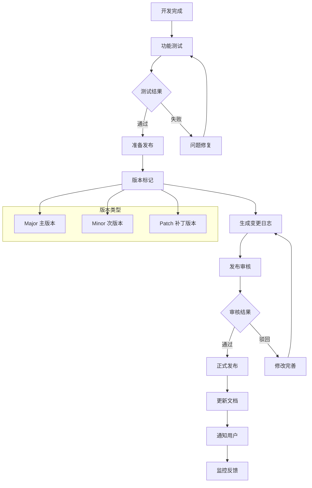
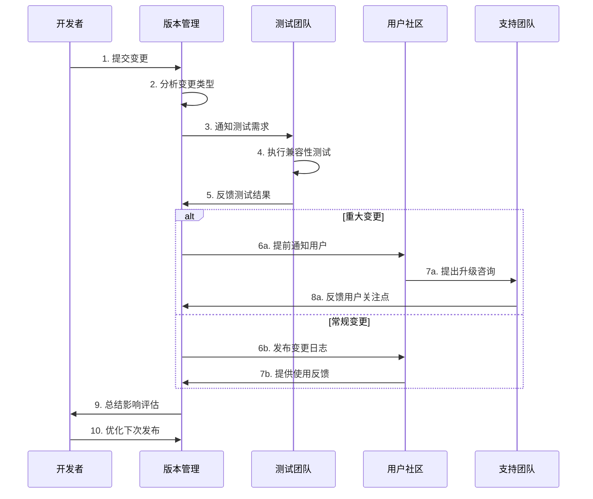
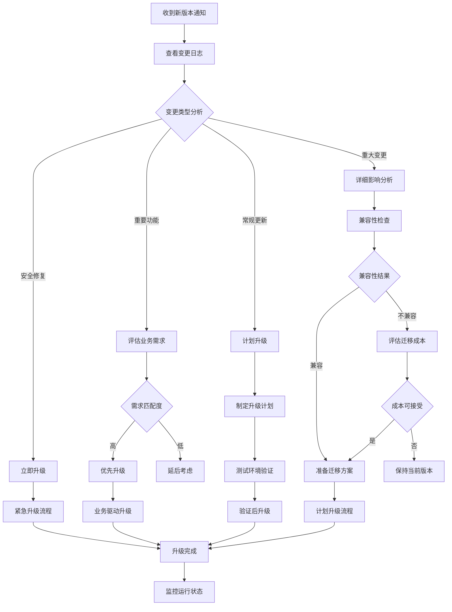
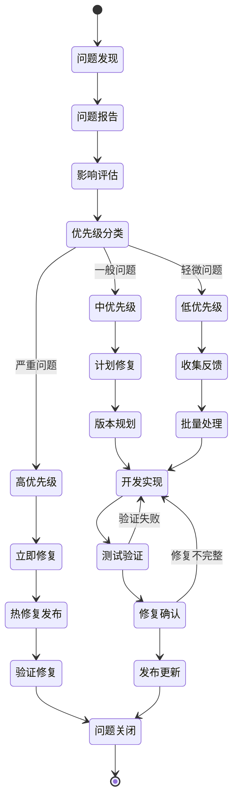

# 项目变更记录 - {{project_name}}

## 📋 版本概览
**当前版本**: {{current_version}}  
**发布日期**: {{current_date}}  
**发布类型**: {{release_type}} (Major/Minor/Patch)

## 🚀 [{{version}}] - {{date}}

### ✨ 新增功能 (Added)
- **{{feature1_title}}**: {{feature1_desc}}
  - 影响模块: {{feature1_modules}}
  - 用户价值: {{feature1_value}}

- **{{feature2_title}}**: {{feature2_desc}}
  - 影响模块: {{feature2_modules}}
  - 用户价值: {{feature2_value}}

### 🔄 功能变更 (Changed)
- **{{change1_title}}**: {{change1_desc}}
  - 变更原因: {{change1_reason}}
  - 迁移指南: {{change1_migration}}

- **{{change2_title}}**: {{change2_desc}}
  - 变更原因: {{change2_reason}}
  - 迁移指南: {{change2_migration}}

### 🐛 问题修复 (Fixed)
- **{{fix1_title}}** (#{{issue1_id}}): {{fix1_desc}}
  - 影响版本: {{fix1_versions}}
  - 修复方式: {{fix1_method}}

- **{{fix2_title}}** (#{{issue2_id}}): {{fix2_desc}}
  - 影响版本: {{fix2_versions}}
  - 修复方式: {{fix2_method}}

### ⚠️ 弃用警告 (Deprecated)
- **{{deprecated1}}**: {{deprecated1_desc}}
  - 替代方案: {{deprecated1_alternative}}
  - 移除时间: {{deprecated1_sunset}}

### ❌ 移除功能 (Removed)
- **{{removed1}}**: {{removed1_desc}}
  - 移除原因: {{removed1_reason}}
  - 影响评估: {{removed1_impact}}

### 🔒 安全更新 (Security)
- **{{security1}}**: {{security1_desc}}
  - 风险等级: {{security1_level}}
  - 建议措施: {{security1_action}}

## 📊 版本统计
| 类型 | 数量 | 说明 |
|------|------|------|
| 新增功能 | {{added_count}} | {{added_summary}} |
| 功能变更 | {{changed_count}} | {{changed_summary}} |
| 问题修复 | {{fixed_count}} | {{fixed_summary}} |
| 安全修复 | {{security_count}} | {{security_summary}} |

## 🎯 本版本亮点
### 主要改进
1. **{{highlight1}}**: {{highlight1_detail}}
2. **{{highlight2}}**: {{highlight2_detail}}
3. **{{highlight3}}**: {{highlight3_detail}}

### 性能提升
- **{{perf1}}**: 提升 {{perf1_improvement}}
- **{{perf2}}**: 优化 {{perf2_improvement}}

### 用户体验
- **{{ux1}}**: {{ux1_desc}}
- **{{ux2}}**: {{ux2_desc}}

## ⬆️ 升级指南

### 兼容性
- **向后兼容**: {{backward_compatible}}
- **API变更**: {{api_changes}}
- **数据迁移**: {{data_migration}}

### 升级步骤
1. **备份数据**: {{backup_instructions}}
2. **更新依赖**: {{dependency_update}}
3. **配置调整**: {{config_changes}}
4. **验证功能**: {{verification_steps}}

### 注意事项
⚠️ **重要提醒**: {{important_notes}}  
🔧 **配置变更**: {{config_notes}}  
📝 **文档更新**: {{docs_updates}}

## 🐛 已知问题
| 问题描述 | 影响范围 | 临时方案 | 计划修复 |
|---------|---------|---------|---------|
| {{known_issue1}} | {{issue1_impact}} | {{issue1_workaround}} | {{issue1_fix_plan}} |
| {{known_issue2}} | {{issue2_impact}} | {{issue2_workaround}} | {{issue2_fix_plan}} |

## 🙏 致谢
感谢以下贡献者：
- **{{contributor1}}**: {{contribution1}}
- **{{contributor2}}**: {{contribution2}}
- **{{contributor3}}**: {{contribution3}}

## 📚 相关资源
- [迁移指南]({{migration_guide_url}})
- [API文档]({{api_docs_url}})
- [发布说明]({{release_notes_url}})
- [问题反馈]({{feedback_url}})

---

## 🗂 历史版本

### [{{prev_version}}] - {{prev_date}}
**类型**: {{prev_type}}  
**主要更新**: {{prev_summary}}

- ✨ {{prev_added_summary}}
- 🐛 {{prev_fixed_summary}}

### [{{prev_version2}}] - {{prev_date2}}  
**类型**: {{prev_type2}}  
**主要更新**: {{prev_summary2}}

- 🔄 {{prev_changed_summary2}}
- 🔒 {{prev_security_summary2}}

---

## 📋 变更流程图

### 版本发布流程

### 变更影响分析流程

### 升级决策支持流程

### 问题追踪解决流程

---

**版本格式**: 遵循 [Semantic Versioning](https://semver.org/)  
**更新频率**: {{release_frequency}}  
**支持策略**: {{support_policy}}