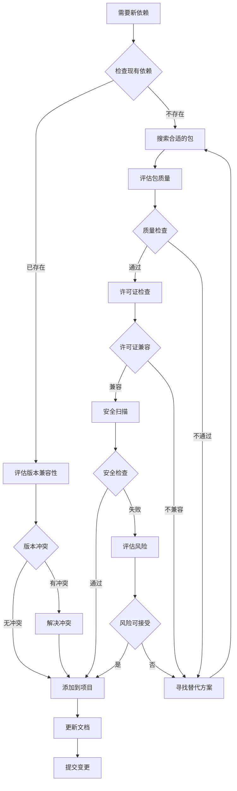
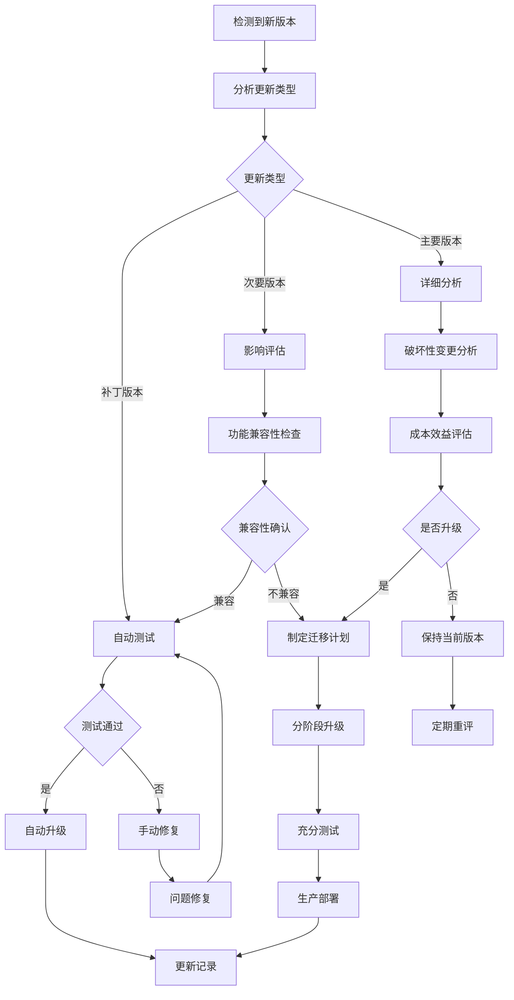
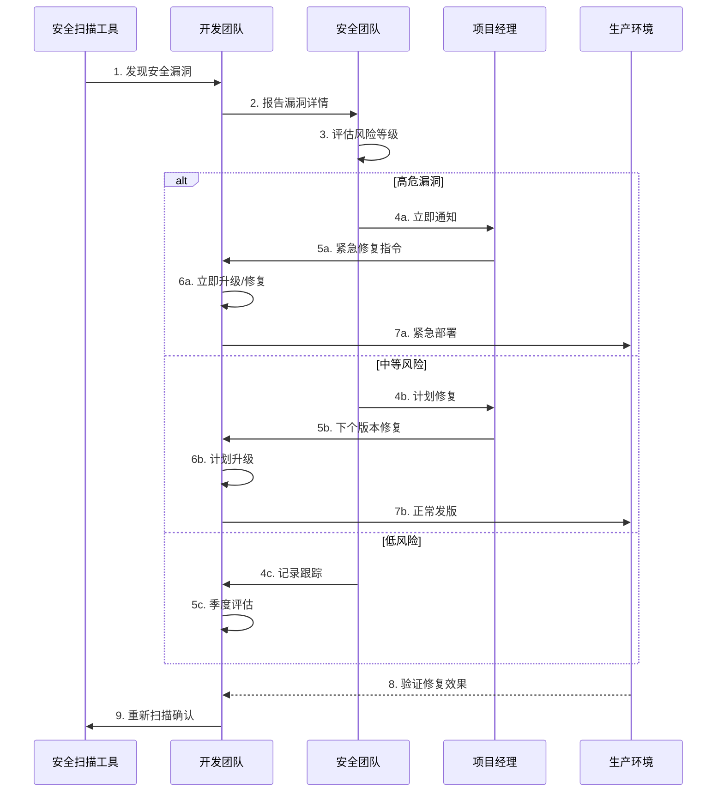

# 依赖管理 - {{project_name}}

## 核心依赖
| 包名 | 版本 | 用途 | 状态 |
|------|------|------|---------|
| {{framework1}} | {{version1}} | {{purpose1}} | {{status1}} |
| {{framework2}} | {{version2}} | {{purpose2}} | {{status2}} |

## 安全策略
- **定期审计**: 每{{audit_frequency}}进行安全检查
- **漏洞响应**: {{vulnerability_response_time}}内响应高危漏洞
- **版本锁定**: 使用精确版本避免意外升级

## 升级计划
| 依赖 | 当前版本 | 目标版本 | 计划时间 |
|------|---------|---------|----------|
| {{dep1}} | {{current1}} | {{target1}} | {{date1}} |
| {{dep2}} | {{current2}} | {{target2}} | {{date2}} |

## 许可证合规
| 许可证类型 | 数量 | 兼容性 |
|-----------|------|---------|
| MIT | {{mit_count}} | ✅ |
| Apache-2.0 | {{apache_count}} | ✅ |
| GPL | {{gpl_count}} | ⚠️ |

## 📋 依赖管理流程图

### 依赖引入流程

### 依赖升级决策流程

### 安全漏洞处理流程
