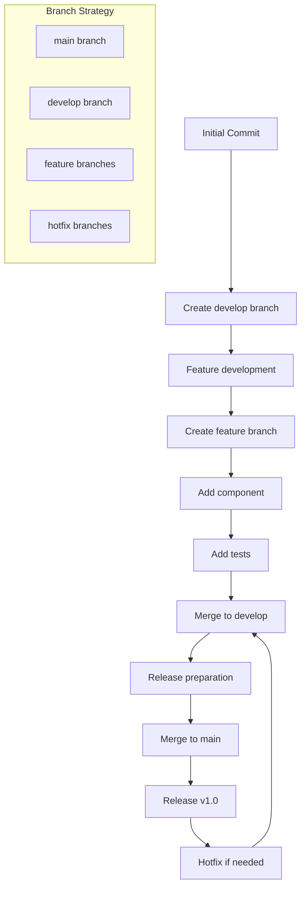
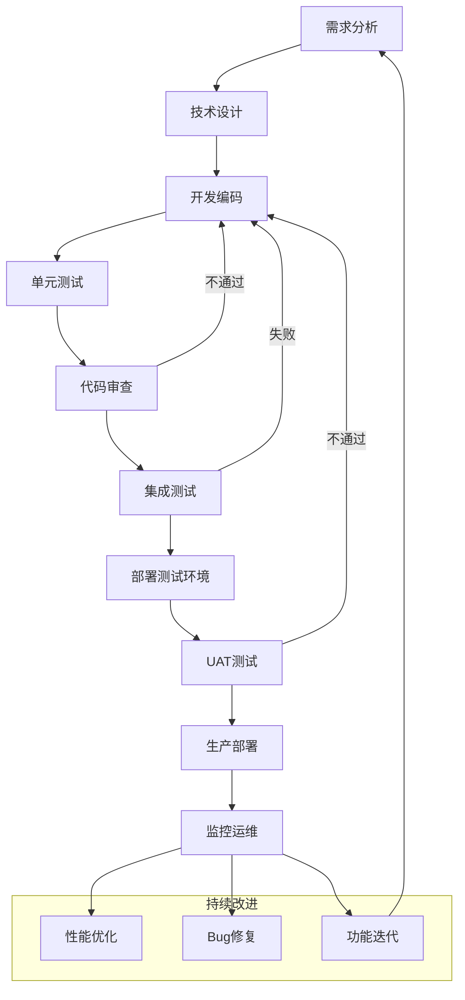
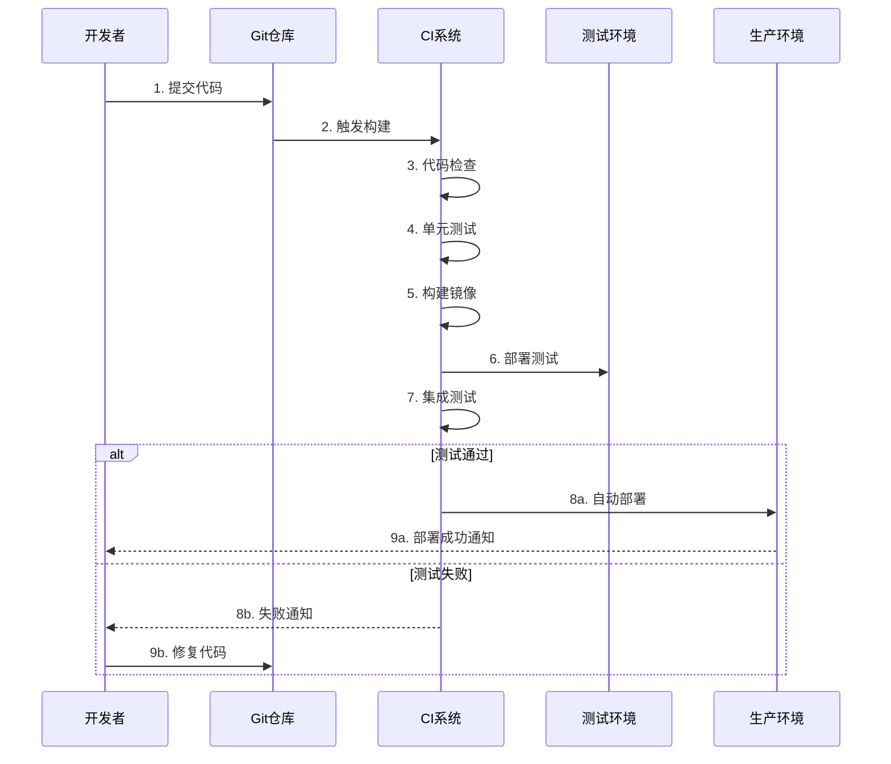
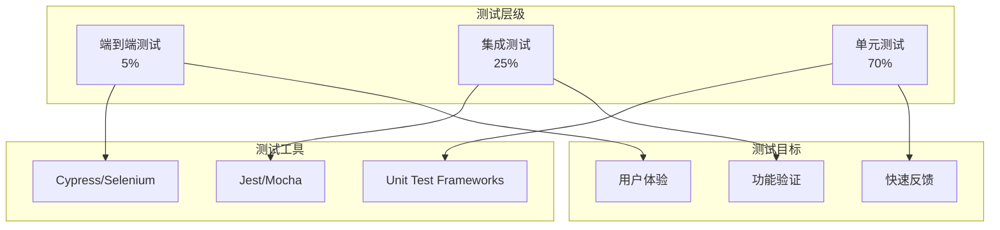
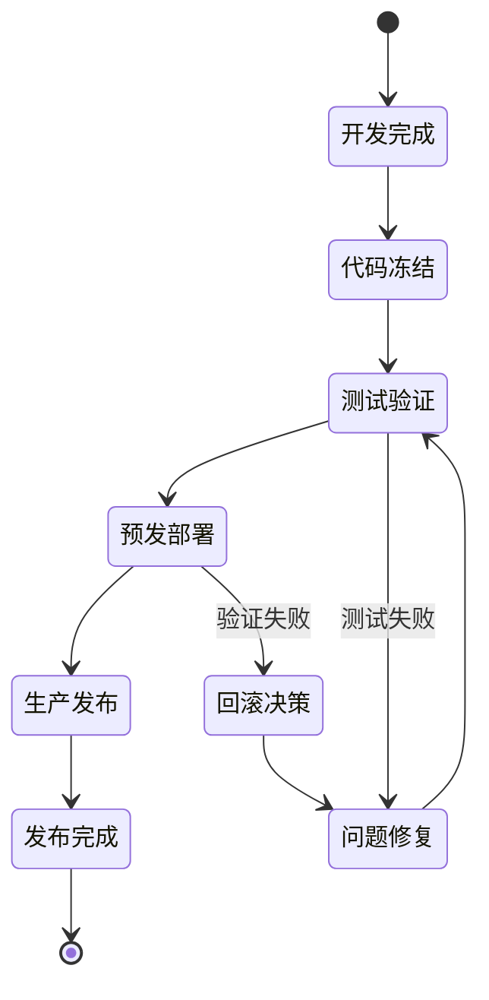

# 开发工作流 - {{project_name}}

## 📋 开发流程概览

### Git工作流


### 开发生命周期


## 🔄 CI/CD流水线

### 自动化流程


## 🏗️ 分支管理策略

### 分支类型
| 分支类型 | 命名规范 | 生命周期 | 合并目标 |
|---------|---------|---------|---------|
| main | main | 永久 | - |
| develop | develop | 永久 | main |
| feature | feature/{{feature_name}} | 临时 | develop |
| hotfix | hotfix/{{issue_name}} | 临时 | main+develop |
| release | release/{{version}} | 临时 | main+develop |

### 分支保护规则
- **main分支**: 需要PR + 审核 + 测试通过
- **develop分支**: 需要PR + 测试通过
- **feature分支**: 需要本地测试通过

## 📝 代码规范

### 提交信息规范
```
<type>(<scope>): <subject>

<body>

<footer>
```

**类型说明**:
- `feat`: 新功能
- `fix`: 修复问题  
- `docs`: 文档更新
- `style`: 代码格式
- `refactor`: 代码重构
- `test`: 测试相关
- `chore`: 构建相关

### 代码审查检查清单
- [ ] 功能实现正确
- [ ] 代码风格一致
- [ ] 注释完整清晰
- [ ] 测试覆盖充分
- [ ] 性能影响可控
- [ ] 安全问题排查

## 🧪 测试策略

### 测试金字塔


### 测试环境
| 环境 | 用途 | 数据 | 部署频率 |
|------|------|------|----------|
| 开发环境 | 日常开发 | 模拟数据 | 实时 |
| 测试环境 | 功能测试 | 测试数据 | 每日 |
| 预发环境 | 上线验证 | 生产副本 | 发版前 |
| 生产环境 | 正式服务 | 生产数据 | 发版时 |

## 🚀 发布管理

### 版本发布流程


### 发布检查清单
**发布前**:
- [ ] 功能测试通过
- [ ] 性能测试通过  
- [ ] 安全扫描通过
- [ ] 文档更新完成
- [ ] 回滚方案准备

**发布中**:
- [ ] 灰度发布执行
- [ ] 监控指标正常
- [ ] 错误率在阈值内
- [ ] 用户反馈正常

**发布后**:
- [ ] 功能验证完成
- [ ] 性能指标达标
- [ ] 日志监控正常
- [ ] 版本标签创建

## 🔧 开发工具配置

### 本地开发环境
```yaml
development:
  runtime: "Node.js 18+"
  database: "PostgreSQL 14+"
  cache: "Redis 6+"
  tools:
    - eslint: "latest"
    - prettier: "^2.8.0"
```

### IDE配置推荐
**VS Code插件**:
- ESLint: 代码质量检查
- Prettier: 代码格式化
- GitLens: Git历史增强

**配置文件**:
```json
{
  "editor.formatOnSave": true,
  "editor.codeActionsOnSave": {
    "source.fixAll.eslint": true
  },
  "typescript.preferences.includePackageJsonAutoImports": "on"
}
```

## 📊 质量度量

### 代码质量指标
| 指标 | 目标值 | 当前值 | 趋势 |
|------|--------|--------|------|
| 测试覆盖率 | >80% | 85% | ↗️ |
| 代码重复率 | <5% | 3% | ↘️ |
| 技术债务 | <40h | 32h | ↘️ |
| 缺陷密度 | <2/KLOC | 1.5/KLOC | ↘️ |

### 流程效率指标
| 指标 | 目标值 | 当前值 |
|------|--------|--------|
| 构建时间 | <5min | 3.5min |
| 部署频率 | 每日 | 每日 |
| 修复时间 | <4h | 2.5h |
| 变更失败率 | <5% | 2% |