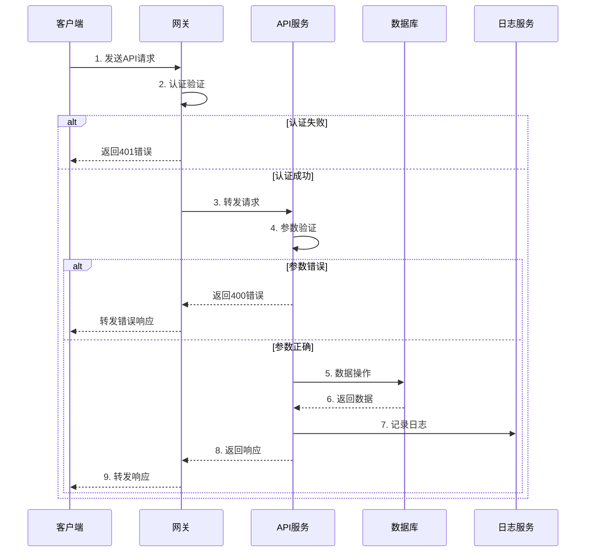
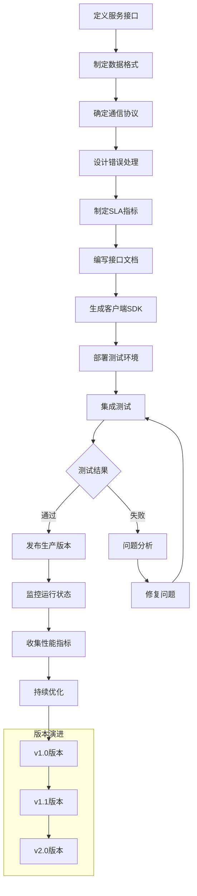
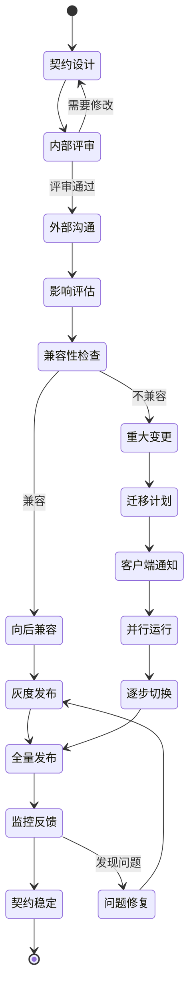
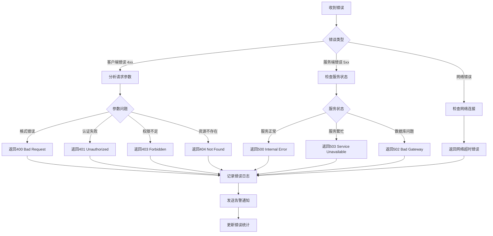

# 集成契约 - {{project_name}}

## API规范
- **基础URL**: `{{base_url}}/api/v{{api_version}}`
- **认证方式**: {{auth_method}}
- **内容类型**: `application/json`

## 状态码
| 代码 | 含义 |
|------|------|
| 200 | 请求成功 |
| 201 | 资源创建成功 |
| 400 | 请求参数错误 |
| 401 | 未认证 |
| 403 | 无权限 |
| 404 | 资源不存在 |
| 500 | 服务器错误 |

## 核心接口
### {{api_endpoint_1}}
- **路径**: `{{api_path_1}}`
- **方法**: `{{api_method_1}}`
- **认证**: {{api_auth_1}}

**请求**:
```json
{
  "{{request_field1}}": "{{value1}}",
  "{{request_field2}}": "{{value2}}"
}
```

**响应**:
```json
{
  "code": 200,
  "data": {
    "{{response_field1}}": "{{value1}}",
    "{{response_field2}}": "{{value2}}"
  }
}
```

## SLA指标
| 接口类别 | 响应时间 | 可用性 | QPS |
|---------|---------|--------|-----|
| 查询接口 | < 100ms | 99.9% | 10000 |
| 写入接口 | < 200ms | 99.9% | 5000 |

## 版本管理
- **格式**: `v{major}.{minor}`
- **兼容性**: 保持向后兼容
- **升级**: 提前通知客户端

## 🔄 集成契约流程图

### API请求处理流程


### 服务集成协议流程


### 契约变更管理流程


### 错误处理决策树
