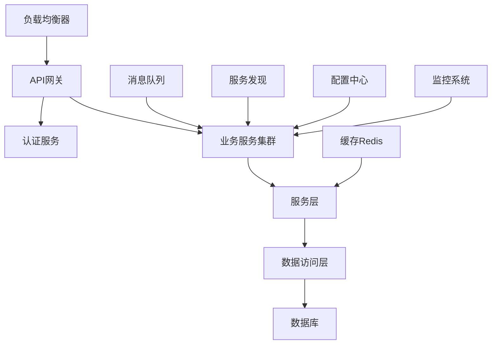

# Go 系统架构文档 - {{project_name}}

> 文档版本: {{version}}  
> 更新日期: {{timestamp}}  
> 维护者: {{author}}  
> Go版本: {{go_version}}

## 概述

### 项目简介
{{project_description}}

### Go生态特性
- **运行环境**: Go {{go_version}}
- **编译目标**: {{target_os}}/{{target_arch}}
- **Web框架**: {{web_framework}} (Gin/Echo/Fiber/Chi)
- **并发模型**: Goroutines + Channels
- **部署方式**: {{deployment_type}} (单一二进制/容器化)

### 核心价值
- **简洁高效**: 语法简洁，编译快速，运行高效
- **并发优势**: 原生goroutine支持，轻松处理高并发
- **云原生**: 天然适合微服务和容器化部署
- **跨平台**: 一次编写，多平台编译
- **内存安全**: 垃圾回收机制，避免内存泄漏

## 架构设计

### 架构原则
1. **简洁优于复杂**: 遵循Go的简洁哲学，避免过度设计
2. **组合优于继承**: 使用接口和组合而非继承
3. **显式优于隐式**: 显式错误处理，明确的依赖关系
4. **并发安全**: 合理使用goroutines和channels
5. **标准库优先**: 优先使用标准库，减少外部依赖

### 整体架构


## Web框架选型对比

### 主流框架特性对比
| 框架 | 性能 | 生态 | 学习曲线 | 适用场景 | 推荐度 |
|------|------|------|---------|----------|--------|
| **Gin** | ⭐⭐⭐⭐⭐ | ⭐⭐⭐⭐⭐ | ⭐⭐⭐⭐ | API服务 | ⭐⭐⭐⭐⭐ |
| **Echo** | ⭐⭐⭐⭐ | ⭐⭐⭐⭐ | ⭐⭐⭐ | Web应用 | ⭐⭐⭐⭐ |
| **Fiber** | ⭐⭐⭐⭐⭐ | ⭐⭐⭐ | ⭐⭐⭐⭐ | 高性能API | ⭐⭐⭐⭐ |
| **Chi** | ⭐⭐⭐⭐ | ⭐⭐⭐ | ⭐⭐⭐⭐⭐ | 轻量级路由 | ⭐⭐⭐ |
| **标准库** | ⭐⭐⭐ | ⭐⭐⭐⭐⭐ | ⭐⭐ | 学习/简单项目 | ⭐⭐ |

### 技术栈配置
| 层级 | 技术选型 | 版本 | 说明 |
|------|---------|------|------|
| **Web框架** | {{web_framework}} | {{framework_version}} | {{framework_desc}} |
| **路由** | {{router}} | {{router_version}} | {{router_desc}} |
| **数据库** | {{database}} | {{db_version}} | {{db_desc}} |
| **ORM** | {{orm_framework}} | {{orm_version}} | {{orm_desc}} |
| **缓存** | Redis | {{redis_version}} | {{cache_desc}} |
| **消息队列** | {{mq_solution}} | {{mq_version}} | {{mq_desc}} |

## Gin框架架构 (推荐)

### 项目结构
```
{{project_name}}/
├── cmd/                          # 应用入口
│   └── server/
│       └── main.go              # 主程序
├── internal/                     # 内部包
│   ├── config/                  # 配置管理
│   │   ├── config.go
│   │   └── database.go
│   ├── handler/                 # HTTP处理器
│   │   ├── {{resource}}.go
│   │   ├── auth.go
│   │   └── health.go
│   ├── service/                 # 业务逻辑层
│   │   ├── {{resource}}.go
│   │   └── auth.go
│   ├── repository/              # 数据访问层
│   │   ├── {{resource}}.go
│   │   └── interfaces.go
│   ├── model/                   # 数据模型
│   │   ├── {{resource}}.go
│   │   └── user.go
│   ├── middleware/              # 中间件
│   │   ├── auth.go
│   │   ├── cors.go
│   │   ├── logger.go
│   │   └── recovery.go
│   ├── dto/                     # 数据传输对象
│   │   ├── request/
│   │   └── response/
│   └── utils/                   # 工具函数
│       ├── validator.go
│       ├── jwt.go
│       └── response.go
├── pkg/                         # 公共包
│   ├── database/               # 数据库连接
│   │   └── postgres.go
│   ├── logger/                 # 日志工具
│   │   └── logger.go
│   └── redis/                  # Redis客户端
│       └── client.go
├── api/                        # API文档
│   └── swagger/
├── configs/                    # 配置文件
│   ├── config.yaml
│   ├── config.dev.yaml
│   └── config.prod.yaml
├── scripts/                    # 脚本文件
│   ├── migrate.sh
│   └── build.sh
├── deployments/                # 部署配置
│   ├── docker/
│   └── k8s/
├── go.mod                      # Go模块文件
├── go.sum                      # 依赖校验
├── Dockerfile                  # Docker构建
├── Makefile                    # 构建脚本
└── README.md                   # 项目说明
```

### 核心组件设计

#### 1. 应用入口 (main.go)
```go
// cmd/server/main.go
package main

import (
    "context"
    "fmt"
    "log"
    "net/http"
    "os"
    "os/signal"
    "syscall"
    "time"

    "github.com/gin-gonic/gin"
    "{{module_path}}/internal/config"
    "{{module_path}}/internal/handler"
    "{{module_path}}/internal/middleware"
    "{{module_path}}/internal/repository"
    "{{module_path}}/internal/service"
    "{{module_path}}/pkg/database"
    "{{module_path}}/pkg/logger"
    "{{module_path}}/pkg/redis"
)

func main() {
    // 加载配置
    cfg, err := config.Load()
    if err != nil {
        log.Fatalf("Failed to load config: %v", err)
    }

    // 初始化日志
    logger := logger.New(cfg.Log)

    // 初始化数据库
    db, err := database.NewPostgres(cfg.Database)
    if err != nil {
        logger.Fatal("Failed to connect database", "error", err)
    }
    defer db.Close()

    // 初始化Redis
    rdb := redis.NewClient(cfg.Redis)
    defer rdb.Close()

    // 初始化依赖
    {{resource}}Repo := repository.New{{Resource}}Repository(db)
    {{resource}}Svc := service.New{{Resource}}Service({{resource}}Repo, logger)
    {{resource}}Handler := handler.New{{Resource}}Handler({{resource}}Svc, logger)

    // 设置路由
    router := setupRouter(cfg, {{resource}}Handler, logger)

    // 启动服务器
    srv := &http.Server{
        Addr:    fmt.Sprintf(":%d", cfg.Server.Port),
        Handler: router,
        ReadTimeout:  cfg.Server.ReadTimeout,
        WriteTimeout: cfg.Server.WriteTimeout,
    }

    // 优雅关闭
    go func() {
        logger.Info("Server starting", "port", cfg.Server.Port)
        if err := srv.ListenAndServe(); err != nil && err != http.ErrServerClosed {
            logger.Fatal("Server failed to start", "error", err)
        }
    }()

    // 等待中断信号
    quit := make(chan os.Signal, 1)
    signal.Notify(quit, syscall.SIGINT, syscall.SIGTERM)
    <-quit

    logger.Info("Server shutting down...")

    ctx, cancel := context.WithTimeout(context.Background(), 30*time.Second)
    defer cancel()

    if err := srv.Shutdown(ctx); err != nil {
        logger.Fatal("Server forced to shutdown", "error", err)
    }

    logger.Info("Server exited")
}

func setupRouter(cfg *config.Config, {{resource}}Handler *handler.{{Resource}}Handler, logger logger.Logger) *gin.Engine {
    // 设置Gin模式
    if cfg.Server.Mode == "release" {
        gin.SetMode(gin.ReleaseMode)
    }

    r := gin.New()

    // 全局中间件
    r.Use(
        middleware.Logger(logger),
        middleware.Recovery(logger),
        middleware.CORS(),
        middleware.RequestID(),
    )

    // 健康检查
    r.GET("/health", handler.Health)
    r.GET("/ready", handler.Ready)

    // API路由组
    v1 := r.Group("/api/v1")
    {
        // 认证路由
        auth := v1.Group("/auth")
        {
            auth.POST("/login", {{resource}}Handler.Login)
            auth.POST("/register", {{resource}}Handler.Register)
        }

        // 需要认证的路由
        protected := v1.Group("/")
        protected.Use(middleware.AuthRequired())
        {
            {{resources}} := protected.Group("/{{resources}}")
            {
                {{resources}}.GET("", {{resource}}Handler.List)
                {{resources}}.POST("", {{resource}}Handler.Create)
                {{resources}}.GET("/:id", {{resource}}Handler.GetByID)
                {{resources}}.PUT("/:id", {{resource}}Handler.Update)
                {{resources}}.DELETE("/:id", {{resource}}Handler.Delete)
            }
        }
    }

    return r
}
```

#### 2. 分层架构实现

##### Handler层 (控制器)
```go
// internal/handler/{{resource}}.go
package handler

import (
    "net/http"
    "strconv"

    "github.com/gin-gonic/gin"
    "{{module_path}}/internal/dto/request"
    "{{module_path}}/internal/dto/response"
    "{{module_path}}/internal/service"
    "{{module_path}}/pkg/logger"
    "{{module_path}}/internal/utils"
)

type {{Resource}}Handler struct {
    service service.{{Resource}}Service
    logger  logger.Logger
}

func New{{Resource}}Handler(service service.{{Resource}}Service, logger logger.Logger) *{{Resource}}Handler {
    return &{{Resource}}Handler{
        service: service,
        logger:  logger,
    }
}

// List 获取{{resource_name}}列表
// @Summary 获取{{resource_name}}列表
// @Description 分页获取{{resource_name}}列表
// @Tags {{resources}}
// @Accept json
// @Produce json
// @Param page query int false "页码" default(1)
// @Param size query int false "每页大小" default(10)
// @Success 200 {object} response.PageResponse[response.{{Resource}}]
// @Failure 400 {object} response.ErrorResponse
// @Router /api/v1/{{resources}} [get]
func (h *{{Resource}}Handler) List(c *gin.Context) {
    req := &request.{{Resource}}ListRequest{}
    if err := c.ShouldBindQuery(req); err != nil {
        h.logger.Error("Failed to bind query params", "error", err)
        utils.ErrorResponse(c, http.StatusBadRequest, "Invalid query parameters")
        return
    }

    {{resources}}, total, err := h.service.List(c.Request.Context(), req)
    if err != nil {
        h.logger.Error("Failed to list {{resources}}", "error", err)
        utils.ErrorResponse(c, http.StatusInternalServerError, "Failed to list {{resources}}")
        return
    }

    utils.PageResponse(c, {{resources}}, total, req.Page, req.Size)
}

// Create 创建{{resource_name}}
// @Summary 创建{{resource_name}}
// @Description 创建新的{{resource_name}}
// @Tags {{resources}}
// @Accept json
// @Produce json
// @Param request body request.Create{{Resource}} true "创建{{resource_name}}请求"
// @Success 201 {object} response.{{Resource}}
// @Failure 400 {object} response.ErrorResponse
// @Failure 422 {object} response.ValidationErrorResponse
// @Router /api/v1/{{resources}} [post]
func (h *{{Resource}}Handler) Create(c *gin.Context) {
    req := &request.Create{{Resource}}{}
    if err := c.ShouldBindJSON(req); err != nil {
        h.logger.Error("Failed to bind JSON", "error", err)
        utils.ValidationErrorResponse(c, err)
        return
    }

    // 获取当前用户ID
    userID, _ := c.Get("userID")

    {{resource}}, err := h.service.Create(c.Request.Context(), req, userID.(uint))
    if err != nil {
        h.logger.Error("Failed to create {{resource}}", "error", err)
        utils.ErrorResponse(c, http.StatusInternalServerError, "Failed to create {{resource}}")
        return
    }

    utils.SuccessResponse(c, http.StatusCreated, {{resource}})
}

// GetByID 根据ID获取{{resource_name}}
// @Summary 根据ID获取{{resource_name}}
// @Description 获取指定ID的{{resource_name}}详情
// @Tags {{resources}}
// @Accept json
// @Produce json
// @Param id path int true "{{resource_name}}ID"
// @Success 200 {object} response.{{Resource}}
// @Failure 400 {object} response.ErrorResponse
// @Failure 404 {object} response.ErrorResponse
// @Router /api/v1/{{resources}}/{id} [get]
func (h *{{Resource}}Handler) GetByID(c *gin.Context) {
    idStr := c.Param("id")
    id, err := strconv.ParseUint(idStr, 10, 32)
    if err != nil {
        utils.ErrorResponse(c, http.StatusBadRequest, "Invalid ID format")
        return
    }

    {{resource}}, err := h.service.GetByID(c.Request.Context(), uint(id))
    if err != nil {
        if err == service.ErrNotFound {
            utils.ErrorResponse(c, http.StatusNotFound, "{{Resource}} not found")
            return
        }
        h.logger.Error("Failed to get {{resource}}", "error", err, "id", id)
        utils.ErrorResponse(c, http.StatusInternalServerError, "Failed to get {{resource}}")
        return
    }

    utils.SuccessResponse(c, http.StatusOK, {{resource}})
}

// Update 更新{{resource_name}}
func (h *{{Resource}}Handler) Update(c *gin.Context) {
    idStr := c.Param("id")
    id, err := strconv.ParseUint(idStr, 10, 32)
    if err != nil {
        utils.ErrorResponse(c, http.StatusBadRequest, "Invalid ID format")
        return
    }

    req := &request.Update{{Resource}}{}
    if err := c.ShouldBindJSON(req); err != nil {
        h.logger.Error("Failed to bind JSON", "error", err)
        utils.ValidationErrorResponse(c, err)
        return
    }

    userID, _ := c.Get("userID")
    {{resource}}, err := h.service.Update(c.Request.Context(), uint(id), req, userID.(uint))
    if err != nil {
        if err == service.ErrNotFound {
            utils.ErrorResponse(c, http.StatusNotFound, "{{Resource}} not found")
            return
        }
        if err == service.ErrForbidden {
            utils.ErrorResponse(c, http.StatusForbidden, "Access denied")
            return
        }
        h.logger.Error("Failed to update {{resource}}", "error", err, "id", id)
        utils.ErrorResponse(c, http.StatusInternalServerError, "Failed to update {{resource}}")
        return
    }

    utils.SuccessResponse(c, http.StatusOK, {{resource}})
}

// Delete 删除{{resource_name}}
func (h *{{Resource}}Handler) Delete(c *gin.Context) {
    idStr := c.Param("id")
    id, err := strconv.ParseUint(idStr, 10, 32)
    if err != nil {
        utils.ErrorResponse(c, http.StatusBadRequest, "Invalid ID format")
        return
    }

    userID, _ := c.Get("userID")
    err = h.service.Delete(c.Request.Context(), uint(id), userID.(uint))
    if err != nil {
        if err == service.ErrNotFound {
            utils.ErrorResponse(c, http.StatusNotFound, "{{Resource}} not found")
            return
        }
        if err == service.ErrForbidden {
            utils.ErrorResponse(c, http.StatusForbidden, "Access denied")
            return
        }
        h.logger.Error("Failed to delete {{resource}}", "error", err, "id", id)
        utils.ErrorResponse(c, http.StatusInternalServerError, "Failed to delete {{resource}}")
        return
    }

    utils.SuccessResponse(c, http.StatusNoContent, nil)
}
```

##### Service层 (业务逻辑)
```go
// internal/service/{{resource}}.go
package service

import (
    "context"
    "errors"
    "time"

    "{{module_path}}/internal/dto/request"
    "{{module_path}}/internal/dto/response"
    "{{module_path}}/internal/model"
    "{{module_path}}/internal/repository"
    "{{module_path}}/pkg/logger"
)

var (
    ErrNotFound  = errors.New("record not found")
    ErrForbidden = errors.New("access forbidden")
    ErrDuplicate = errors.New("record already exists")
)

type {{Resource}}Service interface {
    List(ctx context.Context, req *request.{{Resource}}ListRequest) ([]*response.{{Resource}}, int64, error)
    Create(ctx context.Context, req *request.Create{{Resource}}, userID uint) (*response.{{Resource}}, error)
    GetByID(ctx context.Context, id uint) (*response.{{Resource}}, error)
    Update(ctx context.Context, id uint, req *request.Update{{Resource}}, userID uint) (*response.{{Resource}}, error)
    Delete(ctx context.Context, id uint, userID uint) error
}

type {{resource}}Service struct {
    repo   repository.{{Resource}}Repository
    logger logger.Logger
}

func New{{Resource}}Service(repo repository.{{Resource}}Repository, logger logger.Logger) {{Resource}}Service {
    return &{{resource}}Service{
        repo:   repo,
        logger: logger,
    }
}

func (s *{{resource}}Service) List(ctx context.Context, req *request.{{Resource}}ListRequest) ([]*response.{{Resource}}, int64, error) {
    // 设置默认值
    if req.Page <= 0 {
        req.Page = 1
    }
    if req.Size <= 0 || req.Size > 100 {
        req.Size = 10
    }

    // 计算偏移量
    offset := (req.Page - 1) * req.Size

    // 构建查询条件
    filter := &repository.{{Resource}}Filter{
        Search: req.Search,
        Status: req.Status,
        Offset: offset,
        Limit:  req.Size,
    }

    {{resources}}, total, err := s.repo.List(ctx, filter)
    if err != nil {
        s.logger.Error("Failed to list {{resources}} from repository", "error", err)
        return nil, 0, err
    }

    // 转换为响应DTO
    result := make([]*response.{{Resource}}, len({{resources}}))
    for i, {{resource}} := range {{resources}} {
        result[i] = s.toResponseDTO({{resource}})
    }

    return result, total, nil
}

func (s *{{resource}}Service) Create(ctx context.Context, req *request.Create{{Resource}}, userID uint) (*response.{{Resource}}, error) {
    // 业务验证
    if err := s.validateCreate(ctx, req); err != nil {
        return nil, err
    }

    // 创建模型
    {{resource}} := &model.{{Resource}}{
        Title:       req.Title,
        Description: req.Description,
        Status:      model.{{Status}}Active,
        UserID:      userID,
        CreatedAt:   time.Now(),
        UpdatedAt:   time.Now(),
    }

    // 保存到数据库
    if err := s.repo.Create(ctx, {{resource}}); err != nil {
        s.logger.Error("Failed to create {{resource}} in repository", "error", err)
        return nil, err
    }

    s.logger.Info("{{Resource}} created successfully", "id", {{resource}}.ID, "userID", userID)
    
    return s.toResponseDTO({{resource}}), nil
}

func (s *{{resource}}Service) GetByID(ctx context.Context, id uint) (*response.{{Resource}}, error) {
    {{resource}}, err := s.repo.GetByID(ctx, id)
    if err != nil {
        if errors.Is(err, repository.ErrNotFound) {
            return nil, ErrNotFound
        }
        s.logger.Error("Failed to get {{resource}} from repository", "error", err, "id", id)
        return nil, err
    }

    return s.toResponseDTO({{resource}}), nil
}

func (s *{{resource}}Service) Update(ctx context.Context, id uint, req *request.Update{{Resource}}, userID uint) (*response.{{Resource}}, error) {
    // 获取现有记录
    existing, err := s.repo.GetByID(ctx, id)
    if err != nil {
        if errors.Is(err, repository.ErrNotFound) {
            return nil, ErrNotFound
        }
        return nil, err
    }

    // 权限检查
    if existing.UserID != userID {
        return nil, ErrForbidden
    }

    // 业务验证
    if err := s.validateUpdate(ctx, req, existing); err != nil {
        return nil, err
    }

    // 更新字段
    if req.Title != "" {
        existing.Title = req.Title
    }
    if req.Description != "" {
        existing.Description = req.Description
    }
    existing.UpdatedAt = time.Now()

    // 保存更新
    if err := s.repo.Update(ctx, existing); err != nil {
        s.logger.Error("Failed to update {{resource}} in repository", "error", err, "id", id)
        return nil, err
    }

    s.logger.Info("{{Resource}} updated successfully", "id", id, "userID", userID)
    
    return s.toResponseDTO(existing), nil
}

func (s *{{resource}}Service) Delete(ctx context.Context, id uint, userID uint) error {
    // 获取记录进行权限检查
    {{resource}}, err := s.repo.GetByID(ctx, id)
    if err != nil {
        if errors.Is(err, repository.ErrNotFound) {
            return ErrNotFound
        }
        return err
    }

    // 权限检查
    if {{resource}}.UserID != userID {
        return ErrForbidden
    }

    // 执行删除
    if err := s.repo.Delete(ctx, id); err != nil {
        s.logger.Error("Failed to delete {{resource}} in repository", "error", err, "id", id)
        return err
    }

    s.logger.Info("{{Resource}} deleted successfully", "id", id, "userID", userID)
    return nil
}

// 私有辅助方法
func (s *{{resource}}Service) validateCreate(ctx context.Context, req *request.Create{{Resource}}) error {
    // 实现创建验证逻辑
    if req.Title == "" {
        return errors.New("title is required")
    }
    
    // 检查重复
    exists, err := s.repo.ExistsByTitle(ctx, req.Title)
    if err != nil {
        return err
    }
    if exists {
        return ErrDuplicate
    }
    
    return nil
}

func (s *{{resource}}Service) validateUpdate(ctx context.Context, req *request.Update{{Resource}}, existing *model.{{Resource}}) error {
    // 实现更新验证逻辑
    return nil
}

func (s *{{resource}}Service) toResponseDTO({{resource}} *model.{{Resource}}) *response.{{Resource}} {
    return &response.{{Resource}}{
        ID:          {{resource}}.ID,
        Title:       {{resource}}.Title,
        Description: {{resource}}.Description,
        Status:      string({{resource}}.Status),
        UserID:      {{resource}}.UserID,
        CreatedAt:   {{resource}}.CreatedAt,
        UpdatedAt:   {{resource}}.UpdatedAt,
    }
}
```

##### Repository层 (数据访问)
```go
// internal/repository/{{resource}}.go
package repository

import (
    "context"
    "errors"
    "fmt"

    "gorm.io/gorm"
    "{{module_path}}/internal/model"
)

var (
    ErrNotFound = errors.New("record not found")
)

type {{Resource}}Filter struct {
    Search string
    Status string
    UserID uint
    Offset int
    Limit  int
}

type {{Resource}}Repository interface {
    List(ctx context.Context, filter *{{Resource}}Filter) ([]*model.{{Resource}}, int64, error)
    Create(ctx context.Context, {{resource}} *model.{{Resource}}) error
    GetByID(ctx context.Context, id uint) (*model.{{Resource}}, error)
    Update(ctx context.Context, {{resource}} *model.{{Resource}}) error
    Delete(ctx context.Context, id uint) error
    ExistsByTitle(ctx context.Context, title string) (bool, error)
    CountByUserID(ctx context.Context, userID uint) (int64, error)
}

type {{resource}}Repository struct {
    db *gorm.DB
}

func New{{Resource}}Repository(db *gorm.DB) {{Resource}}Repository {
    return &{{resource}}Repository{
        db: db,
    }
}

func (r *{{resource}}Repository) List(ctx context.Context, filter *{{Resource}}Filter) ([]*model.{{Resource}}, int64, error) {
    var {{resources}} []*model.{{Resource}}
    var total int64

    query := r.db.WithContext(ctx).Model(&model.{{Resource}}{})

    // 应用过滤条件
    if filter.Search != "" {
        searchPattern := fmt.Sprintf("%%%s%%", filter.Search)
        query = query.Where("title ILIKE ? OR description ILIKE ?", searchPattern, searchPattern)
    }

    if filter.Status != "" {
        query = query.Where("status = ?", filter.Status)
    }

    if filter.UserID > 0 {
        query = query.Where("user_id = ?", filter.UserID)
    }

    // 获取总数
    if err := query.Count(&total).Error; err != nil {
        return nil, 0, fmt.Errorf("failed to count {{resources}}: %w", err)
    }

    // 分页查询
    if err := query.
        Offset(filter.Offset).
        Limit(filter.Limit).
        Order("created_at DESC").
        Find(&{{resources}}).Error; err != nil {
        return nil, 0, fmt.Errorf("failed to list {{resources}}: %w", err)
    }

    return {{resources}}, total, nil
}

func (r *{{resource}}Repository) Create(ctx context.Context, {{resource}} *model.{{Resource}}) error {
    if err := r.db.WithContext(ctx).Create({{resource}}).Error; err != nil {
        return fmt.Errorf("failed to create {{resource}}: %w", err)
    }
    return nil
}

func (r *{{resource}}Repository) GetByID(ctx context.Context, id uint) (*model.{{Resource}}, error) {
    var {{resource}} model.{{Resource}}
    
    if err := r.db.WithContext(ctx).
        Where("id = ?", id).
        First(&{{resource}}).Error; err != nil {
        if errors.Is(err, gorm.ErrRecordNotFound) {
            return nil, ErrNotFound
        }
        return nil, fmt.Errorf("failed to get {{resource}} by id: %w", err)
    }

    return &{{resource}}, nil
}

func (r *{{resource}}Repository) Update(ctx context.Context, {{resource}} *model.{{Resource}}) error {
    if err := r.db.WithContext(ctx).Save({{resource}}).Error; err != nil {
        return fmt.Errorf("failed to update {{resource}}: %w", err)
    }
    return nil
}

func (r *{{resource}}Repository) Delete(ctx context.Context, id uint) error {
    result := r.db.WithContext(ctx).Delete(&model.{{Resource}}{}, id)
    if result.Error != nil {
        return fmt.Errorf("failed to delete {{resource}}: %w", result.Error)
    }
    
    if result.RowsAffected == 0 {
        return ErrNotFound
    }
    
    return nil
}

func (r *{{resource}}Repository) ExistsByTitle(ctx context.Context, title string) (bool, error) {
    var count int64
    
    if err := r.db.WithContext(ctx).
        Model(&model.{{Resource}}{}).
        Where("title = ?", title).
        Count(&count).Error; err != nil {
        return false, fmt.Errorf("failed to check {{resource}} existence: %w", err)
    }

    return count > 0, nil
}

func (r *{{resource}}Repository) CountByUserID(ctx context.Context, userID uint) (int64, error) {
    var count int64
    
    if err := r.db.WithContext(ctx).
        Model(&model.{{Resource}}{}).
        Where("user_id = ?", userID).
        Count(&count).Error; err != nil {
        return 0, fmt.Errorf("failed to count {{resources}} by user: %w", err)
    }

    return count, nil
}
```

## 并发编程架构

### Goroutines和Channels
```go
// 并发处理示例
package service

import (
    "context"
    "sync"
    "time"
)

// 并发处理多个任务
func (s *{{resource}}Service) ProcessBatch(ctx context.Context, items []ProcessItem) error {
    const maxWorkers = 10
    const bufferSize = 100

    // 创建通道
    jobs := make(chan ProcessItem, bufferSize)
    results := make(chan ProcessResult, bufferSize)
    errors := make(chan error, bufferSize)

    // 启动工作协程
    var wg sync.WaitGroup
    for i := 0; i < maxWorkers; i++ {
        wg.Add(1)
        go func() {
            defer wg.Done()
            s.worker(ctx, jobs, results, errors)
        }()
    }

    // 发送任务
    go func() {
        defer close(jobs)
        for _, item := range items {
            select {
            case jobs <- item:
            case <-ctx.Done():
                return
            }
        }
    }()

    // 收集结果
    go func() {
        wg.Wait()
        close(results)
        close(errors)
    }()

    // 处理结果和错误
    var resultCount, errorCount int
    for {
        select {
        case result, ok := <-results:
            if !ok {
                results = nil
            } else {
                resultCount++
                s.handleResult(result)
            }
        case err, ok := <-errors:
            if !ok {
                errors = nil
            } else {
                errorCount++
                s.logger.Error("Worker error", "error", err)
            }
        case <-ctx.Done():
            return ctx.Err()
        }

        if results == nil && errors == nil {
            break
        }
    }

    s.logger.Info("Batch processing completed", 
        "total", len(items),
        "success", resultCount, 
        "errors", errorCount)
    
    return nil
}

func (s *{{resource}}Service) worker(ctx context.Context, jobs <-chan ProcessItem, results chan<- ProcessResult, errors chan<- error) {
    for {
        select {
        case job, ok := <-jobs:
            if !ok {
                return
            }
            
            result, err := s.processItem(ctx, job)
            if err != nil {
                select {
                case errors <- err:
                case <-ctx.Done():
                    return
                }
            } else {
                select {
                case results <- result:
                case <-ctx.Done():
                    return
                }
            }
            
        case <-ctx.Done():
            return
        }
    }
}

// 限流和超时控制
type RateLimiter struct {
    limiter chan struct{}
    timeout time.Duration
}

func NewRateLimiter(maxConcurrent int, timeout time.Duration) *RateLimiter {
    return &RateLimiter{
        limiter: make(chan struct{}, maxConcurrent),
        timeout: timeout,
    }
}

func (rl *RateLimiter) Execute(ctx context.Context, fn func() error) error {
    // 获取令牌
    select {
    case rl.limiter <- struct{}{}:
        defer func() { <-rl.limiter }()
    case <-time.After(rl.timeout):
        return errors.New("rate limit timeout")
    case <-ctx.Done():
        return ctx.Err()
    }

    return fn()
}
```

## 中间件架构

### 核心中间件
```go
// internal/middleware/auth.go
package middleware

import (
    "net/http"
    "strings"

    "github.com/gin-gonic/gin"
    "{{module_path}}/internal/utils"
    "{{module_path}}/pkg/jwt"
)

func AuthRequired() gin.HandlerFunc {
    return func(c *gin.Context) {
        authHeader := c.GetHeader("Authorization")
        if authHeader == "" {
            utils.ErrorResponse(c, http.StatusUnauthorized, "Authorization header required")
            c.Abort()
            return
        }

        // 解析Bearer token
        bearerToken := strings.Split(authHeader, " ")
        if len(bearerToken) != 2 || bearerToken[0] != "Bearer" {
            utils.ErrorResponse(c, http.StatusUnauthorized, "Invalid authorization header format")
            c.Abort()
            return
        }

        // 验证JWT
        claims, err := jwt.ValidateToken(bearerToken[1])
        if err != nil {
            utils.ErrorResponse(c, http.StatusUnauthorized, "Invalid token")
            c.Abort()
            return
        }

        // 设置用户信息到上下文
        c.Set("userID", claims.UserID)
        c.Set("username", claims.Username)
        c.Set("roles", claims.Roles)

        c.Next()
    }
}

// RBAC权限中间件
func RequireRole(roles ...string) gin.HandlerFunc {
    return func(c *gin.Context) {
        userRoles, exists := c.Get("roles")
        if !exists {
            utils.ErrorResponse(c, http.StatusForbidden, "No roles found")
            c.Abort()
            return
        }

        userRolesList := userRoles.([]string)
        
        // 检查是否有任一所需角色
        hasRole := false
        for _, requiredRole := range roles {
            for _, userRole := range userRolesList {
                if userRole == requiredRole {
                    hasRole = true
                    break
                }
            }
            if hasRole {
                break
            }
        }

        if !hasRole {
            utils.ErrorResponse(c, http.StatusForbidden, "Insufficient permissions")
            c.Abort()
            return
        }

        c.Next()
    }
}

// 请求日志中间件
func Logger(logger logger.Logger) gin.HandlerFunc {
    return gin.LoggerWithFormatter(func(param gin.LogFormatterParams) string {
        logger.Info("HTTP Request",
            "method", param.Method,
            "path", param.Path,
            "status", param.StatusCode,
            "latency", param.Latency,
            "client_ip", param.ClientIP,
            "user_agent", param.Request.UserAgent(),
        )
        return ""
    })
}

// 限流中间件
func RateLimit(maxRequests int, window time.Duration) gin.HandlerFunc {
    limiter := make(map[string]*TokenBucket)
    mutex := &sync.RWMutex{}

    return func(c *gin.Context) {
        clientIP := c.ClientIP()
        
        mutex.Lock()
        bucket, exists := limiter[clientIP]
        if !exists {
            bucket = NewTokenBucket(maxRequests, window)
            limiter[clientIP] = bucket
        }
        mutex.Unlock()

        if !bucket.Allow() {
            utils.ErrorResponse(c, http.StatusTooManyRequests, "Rate limit exceeded")
            c.Abort()
            return
        }

        c.Next()
    }
}
```

## 配置管理

### 配置结构
```go
// internal/config/config.go
package config

import (
    "fmt"
    "time"

    "github.com/spf13/viper"
)

type Config struct {
    Server   ServerConfig   `mapstructure:"server"`
    Database DatabaseConfig `mapstructure:"database"`
    Redis    RedisConfig    `mapstructure:"redis"`
    JWT      JWTConfig      `mapstructure:"jwt"`
    Log      LogConfig      `mapstructure:"log"`
    External ExternalConfig `mapstructure:"external"`
}

type ServerConfig struct {
    Port         int           `mapstructure:"port"`
    Mode         string        `mapstructure:"mode"`
    ReadTimeout  time.Duration `mapstructure:"read_timeout"`
    WriteTimeout time.Duration `mapstructure:"write_timeout"`
    IdleTimeout  time.Duration `mapstructure:"idle_timeout"`
}

type DatabaseConfig struct {
    Host         string        `mapstructure:"host"`
    Port         int           `mapstructure:"port"`
    User         string        `mapstructure:"user"`
    Password     string        `mapstructure:"password"`
    DBName       string        `mapstructure:"dbname"`
    SSLMode      string        `mapstructure:"sslmode"`
    MaxOpenConns int           `mapstructure:"max_open_conns"`
    MaxIdleConns int           `mapstructure:"max_idle_conns"`
    MaxLifetime  time.Duration `mapstructure:"max_lifetime"`
}

type RedisConfig struct {
    Host         string        `mapstructure:"host"`
    Port         int           `mapstructure:"port"`
    Password     string        `mapstructure:"password"`
    DB           int           `mapstructure:"db"`
    MaxRetries   int           `mapstructure:"max_retries"`
    DialTimeout  time.Duration `mapstructure:"dial_timeout"`
    ReadTimeout  time.Duration `mapstructure:"read_timeout"`
    WriteTimeout time.Duration `mapstructure:"write_timeout"`
}

type JWTConfig struct {
    Secret     string        `mapstructure:"secret"`
    ExpireTime time.Duration `mapstructure:"expire_time"`
    Issuer     string        `mapstructure:"issuer"`
}

type LogConfig struct {
    Level      string `mapstructure:"level"`
    Format     string `mapstructure:"format"`
    Output     string `mapstructure:"output"`
    MaxSize    int    `mapstructure:"max_size"`
    MaxAge     int    `mapstructure:"max_age"`
    MaxBackups int    `mapstructure:"max_backups"`
    Compress   bool   `mapstructure:"compress"`
}

type ExternalConfig struct {
    APIGateway APIGatewayConfig `mapstructure:"api_gateway"`
    S3         S3Config         `mapstructure:"s3"`
}

// Load 加载配置
func Load() (*Config, error) {
    viper.SetConfigName("config")
    viper.SetConfigType("yaml")
    viper.AddConfigPath("./configs")
    viper.AddConfigPath(".")

    // 设置环境变量前缀
    viper.SetEnvPrefix("APP")
    viper.AutomaticEnv()

    // 设置默认值
    setDefaults()

    if err := viper.ReadInConfig(); err != nil {
        return nil, fmt.Errorf("failed to read config file: %w", err)
    }

    var config Config
    if err := viper.Unmarshal(&config); err != nil {
        return nil, fmt.Errorf("failed to unmarshal config: %w", err)
    }

    // 验证配置
    if err := validateConfig(&config); err != nil {
        return nil, fmt.Errorf("invalid config: %w", err)
    }

    return &config, nil
}

func setDefaults() {
    // Server defaults
    viper.SetDefault("server.port", 8080)
    viper.SetDefault("server.mode", "debug")
    viper.SetDefault("server.read_timeout", "10s")
    viper.SetDefault("server.write_timeout", "10s")
    viper.SetDefault("server.idle_timeout", "60s")

    // Database defaults
    viper.SetDefault("database.host", "localhost")
    viper.SetDefault("database.port", 5432)
    viper.SetDefault("database.sslmode", "disable")
    viper.SetDefault("database.max_open_conns", 25)
    viper.SetDefault("database.max_idle_conns", 5)
    viper.SetDefault("database.max_lifetime", "5m")

    // Redis defaults
    viper.SetDefault("redis.host", "localhost")
    viper.SetDefault("redis.port", 6379)
    viper.SetDefault("redis.db", 0)
    viper.SetDefault("redis.max_retries", 3)
    viper.SetDefault("redis.dial_timeout", "5s")
    viper.SetDefault("redis.read_timeout", "3s")
    viper.SetDefault("redis.write_timeout", "3s")

    // JWT defaults
    viper.SetDefault("jwt.expire_time", "24h")
    viper.SetDefault("jwt.issuer", "{{project_name}}")

    // Log defaults
    viper.SetDefault("log.level", "info")
    viper.SetDefault("log.format", "json")
    viper.SetDefault("log.output", "stdout")
}

func validateConfig(config *Config) error {
    if config.Database.Host == "" {
        return errors.New("database host is required")
    }
    if config.JWT.Secret == "" {
        return errors.New("jwt secret is required")
    }
    return nil
}
```

## 测试架构

### 单元测试示例
```go
// internal/service/{{resource}}_test.go
package service

import (
    "context"
    "testing"
    "time"

    "github.com/stretchr/testify/assert"
    "github.com/stretchr/testify/mock"
    "{{module_path}}/internal/dto/request"
    "{{module_path}}/internal/model"
    "{{module_path}}/mocks"
)

func Test{{Resource}}Service_Create(t *testing.T) {
    tests := []struct {
        name      string
        req       *request.Create{{Resource}}
        userID    uint
        setupMock func(*mocks.{{Resource}}Repository)
        wantErr   bool
    }{
        {
            name: "成功创建{{resource_name}}",
            req: &request.Create{{Resource}}{
                Title:       "Test Title",
                Description: "Test Description",
            },
            userID: 1,
            setupMock: func(mockRepo *mocks.{{Resource}}Repository) {
                mockRepo.On("ExistsByTitle", mock.Anything, "Test Title").Return(false, nil)
                mockRepo.On("Create", mock.Anything, mock.AnythingOfType("*model.{{Resource}}")).Return(nil)
            },
            wantErr: false,
        },
        {
            name: "重复标题应该失败",
            req: &request.Create{{Resource}}{
                Title:       "Duplicate Title",
                Description: "Test Description",
            },
            userID: 1,
            setupMock: func(mockRepo *mocks.{{Resource}}Repository) {
                mockRepo.On("ExistsByTitle", mock.Anything, "Duplicate Title").Return(true, nil)
            },
            wantErr: true,
        },
    }

    for _, tt := range tests {
        t.Run(tt.name, func(t *testing.T) {
            // 设置模拟对象
            mockRepo := new(mocks.{{Resource}}Repository)
            mockLogger := new(mocks.Logger)
            
            tt.setupMock(mockRepo)
            
            service := New{{Resource}}Service(mockRepo, mockLogger)
            
            // 执行测试
            result, err := service.Create(context.Background(), tt.req, tt.userID)
            
            // 验证结果
            if tt.wantErr {
                assert.Error(t, err)
                assert.Nil(t, result)
            } else {
                assert.NoError(t, err)
                assert.NotNil(t, result)
                assert.Equal(t, tt.req.Title, result.Title)
                assert.Equal(t, tt.req.Description, result.Description)
            }
            
            // 验证模拟对象调用
            mockRepo.AssertExpectations(t)
        })
    }
}

// 基准测试
func Benchmark{{Resource}}Service_Create(b *testing.B) {
    mockRepo := new(mocks.{{Resource}}Repository)
    mockLogger := new(mocks.Logger)
    
    mockRepo.On("ExistsByTitle", mock.Anything, mock.Anything).Return(false, nil)
    mockRepo.On("Create", mock.Anything, mock.Anything).Return(nil)
    
    service := New{{Resource}}Service(mockRepo, mockLogger)
    
    req := &request.Create{{Resource}}{
        Title:       "Benchmark Title",
        Description: "Benchmark Description",
    }
    
    b.ResetTimer()
    
    for i := 0; i < b.N; i++ {
        _, err := service.Create(context.Background(), req, 1)
        if err != nil {
            b.Fatal(err)
        }
    }
}

// 表格驱动测试
func Test{{Resource}}Service_List_TableDriven(t *testing.T) {
    testCases := []struct {
        name     string
        req      *request.{{Resource}}ListRequest
        mockResp []*model.{{Resource}}
        mockErr  error
        wantLen  int
        wantErr  bool
    }{
        {
            name: "正常列表查询",
            req: &request.{{Resource}}ListRequest{
                Page: 1,
                Size: 10,
            },
            mockResp: []*model.{{Resource}}{
                {ID: 1, Title: "Title 1"},
                {ID: 2, Title: "Title 2"},
            },
            mockErr: nil,
            wantLen: 2,
            wantErr: false,
        },
        // 更多测试用例...
    }
    
    for _, tc := range testCases {
        t.Run(tc.name, func(t *testing.T) {
            // 测试实现
        })
    }
}
```

## 部署架构

### Docker配置
```dockerfile
# 多阶段构建
FROM golang:1.21-alpine AS builder

WORKDIR /app

# 安装必要的包
RUN apk add --no-cache git ca-certificates tzdata

# 复制go.mod和go.sum
COPY go.mod go.sum ./
RUN go mod download

# 复制源代码
COPY . .

# 构建二进制文件
RUN CGO_ENABLED=0 GOOS=linux GOARCH=amd64 go build \
    -ldflags='-w -s -extldflags "-static"' \
    -a -installsuffix cgo \
    -o main ./cmd/server

# 最终镜像
FROM scratch

# 从构建阶段复制文件
COPY --from=builder /etc/ssl/certs/ca-certificates.crt /etc/ssl/certs/
COPY --from=builder /usr/share/zoneinfo /usr/share/zoneinfo
COPY --from=builder /app/main /main
COPY --from=builder /app/configs /configs

# 设置时区
ENV TZ=Asia/Shanghai

# 暴露端口
EXPOSE 8080

# 健康检查
HEALTHCHECK --interval=30s --timeout=3s --start-period=5s --retries=3 \
  CMD ["/main", "--health-check"]

# 启动命令
ENTRYPOINT ["/main"]
```

## 相关文档

- [Go依赖管理](./dependencies.md)
- [Go模块模板](./module-template.md)
- [Gin框架文档](https://gin-gonic.com/docs/)
- [GORM文档](https://gorm.io/docs/)
- [Go并发编程](https://golang.org/doc/effective_go.html#concurrency)

---

*本文档由 mg_kiro MCP 系统根据Go项目特征自动生成*