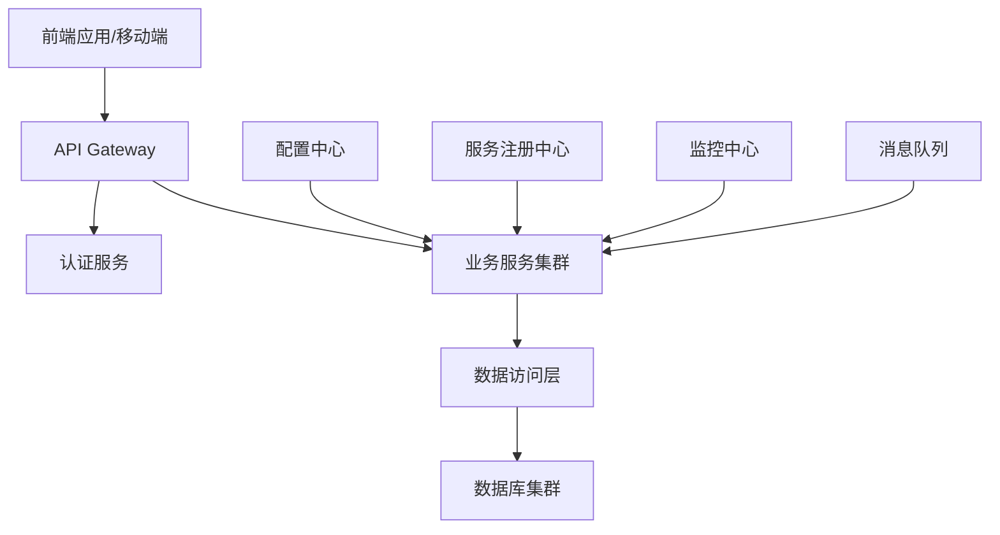

# Java 系统架构文档 - {{project_name}}

> 文档版本: {{version}}  
> 更新日期: {{timestamp}}  
> 维护者: {{author}}  
> Java版本: {{java_version}}

## 概述

### 项目简介
{{project_description}}

### Java生态特性
- **运行环境**: JDK {{java_version}} (Oracle/OpenJDK)
- **构建工具**: {{build_tool}} (Maven/Gradle)
- **应用框架**: {{app_framework}} (Spring Boot/Micronaut/Quarkus)
- **应用服务器**: {{app_server}} (Tomcat/Jetty/Undertow)
- **JVM设置**: {{jvm_options}}

### 核心价值
- **企业级**: 成熟稳定的企业级开发平台
- **跨平台**: "一次编写，处处运行"的平台无关性
- **生态丰富**: 庞大的开源生态和企业级解决方案
- **性能稳定**: JVM优化和垃圾收集机制保证高性能

## 架构设计

### 架构原则
1. **分层架构**: 清晰的控制器-服务-数据访问层分离
2. **依赖注入**: 使用IoC容器管理对象生命周期
3. **AOP编程**: 横切关注点的统一处理
4. **配置外部化**: 环境相关配置的外部化管理
5. **微服务友好**: 支持微服务架构和分布式部署

### 整体架构


## 技术栈选型

### Spring Boot生态 (推荐)
| 层级 | 技术选型 | 版本 | 说明 |
|------|---------|------|------|
| **Web框架** | Spring Boot Web | {{spring_boot_version}} | {{web_desc}} |
| **数据访问** | Spring Data JPA | {{spring_data_version}} | {{data_desc}} |
| **安全框架** | Spring Security | {{spring_security_version}} | {{security_desc}} |
| **缓存** | Spring Cache + Redis | {{redis_version}} | {{cache_desc}} |
| **消息队列** | Spring Cloud Stream | {{stream_version}} | {{mq_desc}} |
| **微服务** | Spring Cloud | {{spring_cloud_version}} | {{cloud_desc}} |

### 微服务技术栈对比
| 框架 | 启动时间 | 内存占用 | 特点 | 适用场景 |
|------|---------|---------|------|---------|
| **Spring Boot** | 中等 | 中等 | 生态最丰富 | 企业级应用 |
| **Micronaut** | 快 | 小 | 编译时DI | 云原生应用 |
| **Quarkus** | 极快 | 极小 | GraalVM支持 | 容器化/Serverless |

### 数据库和持久化
```xml
<!-- JPA/Hibernate栈 -->
<dependency>
    <groupId>org.springframework.boot</groupId>
    <artifactId>spring-boot-starter-data-jpa</artifactId>
</dependency>

<!-- 数据库驱动 -->
<dependency>
    <groupId>org.postgresql</groupId>
    <artifactId>postgresql</artifactId>
    <scope>runtime</scope>
</dependency>

<!-- 连接池 -->
<dependency>
    <groupId>com.zaxxer</groupId>
    <artifactId>HikariCP</artifactId>
</dependency>

<!-- 数据库迁移 -->
<dependency>
    <groupId>org.flywaydb</groupId>
    <artifactId>flyway-core</artifactId>
</dependency>
```

## Spring Boot架构设计

### 项目结构
```
src/main/java/
├── {{package_name}}/
│   ├── {{ProjectName}}Application.java    # 启动类
│   ├── config/                           # 配置类
│   │   ├── DatabaseConfig.java
│   │   ├── SecurityConfig.java
│   │   ├── RedisConfig.java
│   │   └── SwaggerConfig.java
│   ├── controller/                       # 控制器层
│   │   ├── {{Resource}}Controller.java
│   │   ├── AuthController.java
│   │   └── advice/
│   │       └── GlobalExceptionHandler.java
│   ├── service/                         # 服务层
│   │   ├── {{Resource}}Service.java
│   │   ├── impl/
│   │   │   └── {{Resource}}ServiceImpl.java
│   │   └── UserService.java
│   ├── repository/                      # 数据访问层
│   │   ├── {{Resource}}Repository.java
│   │   └── UserRepository.java
│   ├── entity/                          # 实体类
│   │   ├── {{Resource}}.java
│   │   ├── User.java
│   │   └── BaseEntity.java
│   ├── dto/                            # 数据传输对象
│   │   ├── {{Resource}}DTO.java
│   │   ├── request/
│   │   │   └── Create{{Resource}}Request.java
│   │   └── response/
│   │       └── {{Resource}}Response.java
│   ├── enums/                          # 枚举类
│   │   └── {{StatusEnum}}.java
│   ├── exception/                      # 自定义异常
│   │   ├── {{BusinessException}}.java
│   │   └── {{ResourceNotFoundException}}.java
│   ├── security/                       # 安全相关
│   │   ├── JwtAuthenticationFilter.java
│   │   ├── JwtTokenProvider.java
│   │   └── UserPrincipal.java
│   └── util/                          # 工具类
│       ├── DateUtil.java
│       ├── JsonUtil.java
│       └── ValidationUtil.java
src/main/resources/
├── application.yml                     # 主配置文件
├── application-dev.yml                 # 开发环境配置
├── application-prod.yml                # 生产环境配置
├── db/migration/                       # Flyway迁移脚本
│   ├── V1__Create_initial_tables.sql
│   └── V2__Add_user_roles.sql
├── static/                            # 静态资源
└── templates/                         # 模板文件
```

### 分层架构设计

#### 1. 控制器层 (Controller Layer)
```java
@RestController
@RequestMapping("/api/v1/{{resources}}")
@Validated
@Slf4j
public class {{Resource}}Controller {
    
    private final {{Resource}}Service {{resource}}Service;
    
    public {{Resource}}Controller({{Resource}}Service {{resource}}Service) {
        this.{{resource}}Service = {{resource}}Service;
    }
    
    @GetMapping
    public ResponseEntity<PageResponse<{{Resource}}DTO>> getAll(
            @Valid @RequestParam(defaultValue = "0") int page,
            @Valid @RequestParam(defaultValue = "20") int size,
            @RequestParam(required = false) String search) {
        
        PageRequest pageRequest = PageRequest.of(page, size);
        Page<{{Resource}}DTO> result = {{resource}}Service.findAll(pageRequest, search);
        
        return ResponseEntity.ok(PageResponse.of(result));
    }
    
    @GetMapping("/{id}")
    public ResponseEntity<{{Resource}}DTO> getById(@PathVariable Long id) {
        {{Resource}}DTO {{resource}} = {{resource}}Service.findById(id);
        return ResponseEntity.ok({{resource}});
    }
    
    @PostMapping
    @PreAuthorize("hasRole('ADMIN')")
    public ResponseEntity<{{Resource}}DTO> create(
            @Valid @RequestBody Create{{Resource}}Request request) {
        {{Resource}}DTO created = {{resource}}Service.create(request);
        
        URI location = ServletUriComponentsBuilder
                .fromCurrentRequest()
                .path("/{id}")
                .buildAndExpand(created.getId())
                .toUri();
                
        return ResponseEntity.created(location).body(created);
    }
    
    @PutMapping("/{id}")
    @PreAuthorize("hasRole('ADMIN') or @{{resource}}Service.isOwner(#id, authentication.name)")
    public ResponseEntity<{{Resource}}DTO> update(
            @PathVariable Long id,
            @Valid @RequestBody Update{{Resource}}Request request) {
        {{Resource}}DTO updated = {{resource}}Service.update(id, request);
        return ResponseEntity.ok(updated);
    }
    
    @DeleteMapping("/{id}")
    @PreAuthorize("hasRole('ADMIN')")
    public ResponseEntity<Void> delete(@PathVariable Long id) {
        {{resource}}Service.delete(id);
        return ResponseEntity.noContent().build();
    }
}
```

#### 2. 服务层 (Service Layer)
```java
@Service
@Transactional(readOnly = true)
@Slf4j
public class {{Resource}}ServiceImpl implements {{Resource}}Service {
    
    private final {{Resource}}Repository {{resource}}Repository;
    private final {{Resource}}Mapper {{resource}}Mapper;
    private final ApplicationEventPublisher eventPublisher;
    
    public {{Resource}}ServiceImpl(
            {{Resource}}Repository {{resource}}Repository,
            {{Resource}}Mapper {{resource}}Mapper,
            ApplicationEventPublisher eventPublisher) {
        this.{{resource}}Repository = {{resource}}Repository;
        this.{{resource}}Mapper = {{resource}}Mapper;
        this.eventPublisher = eventPublisher;
    }
    
    @Override
    public Page<{{Resource}}DTO> findAll(Pageable pageable, String search) {
        log.debug("Finding {{resources}} with search: {}", search);
        
        Page<{{Resource}}> {{resources}} = StringUtils.hasText(search)
                ? {{resource}}Repository.findByTitleContainingIgnoreCase(search, pageable)
                : {{resource}}Repository.findAll(pageable);
        
        return {{resources}}.map({{resource}}Mapper::toDto);
    }
    
    @Override
    public {{Resource}}DTO findById(Long id) {
        {{Resource}} {{resource}} = {{resource}}Repository.findById(id)
                .orElseThrow(() -> new {{ResourceNotFoundException}}("{{Resource}} not found with id: " + id));
        
        return {{resource}}Mapper.toDto({{resource}});
    }
    
    @Override
    @Transactional
    public {{Resource}}DTO create(Create{{Resource}}Request request) {
        log.info("Creating new {{resource}} with title: {}", request.getTitle());
        
        {{Resource}} {{resource}} = {{resource}}Mapper.toEntity(request);
        {{resource}}.setCreatedAt(Instant.now());
        
        {{Resource}} saved = {{resource}}Repository.save({{resource}});
        
        // 发布领域事件
        eventPublisher.publishEvent(new {{Resource}}CreatedEvent(saved.getId()));
        
        return {{resource}}Mapper.toDto(saved);
    }
    
    @Override
    @Transactional
    @Cacheable(value = "{{resources}}", key = "#id")
    public {{Resource}}DTO update(Long id, Update{{Resource}}Request request) {
        {{Resource}} existing = {{resource}}Repository.findById(id)
                .orElseThrow(() -> new {{ResourceNotFoundException}}("{{Resource}} not found with id: " + id));
        
        {{resource}}Mapper.updateEntityFromDto(request, existing);
        existing.setUpdatedAt(Instant.now());
        
        {{Resource}} updated = {{resource}}Repository.save(existing);
        
        return {{resource}}Mapper.toDto(updated);
    }
    
    @Override
    @Transactional
    @CacheEvict(value = "{{resources}}", key = "#id")
    public void delete(Long id) {
        if (!{{resource}}Repository.existsById(id)) {
            throw new {{ResourceNotFoundException}}("{{Resource}} not found with id: " + id);
        }
        
        {{resource}}Repository.deleteById(id);
        log.info("Deleted {{resource}} with id: {}", id);
    }
}
```

#### 3. 数据访问层 (Repository Layer)
```java
@Repository
public interface {{Resource}}Repository extends JpaRepository<{{Resource}}, Long>, 
        JpaSpecificationExecutor<{{Resource}}> {
    
    // 基于方法名的查询
    Page<{{Resource}}> findByTitleContainingIgnoreCase(String title, Pageable pageable);
    
    List<{{Resource}}> findByStatusAndCreatedAtBefore({{Status}} status, Instant before);
    
    boolean existsByTitleIgnoreCase(String title);
    
    // JPQL查询
    @Query("SELECT r FROM {{Resource}} r WHERE r.user.id = :userId AND r.status = :status")
    List<{{Resource}}> findByUserIdAndStatus(@Param("userId") Long userId, @Param("status") {{Status}} status);
    
    // 原生SQL查询
    @Query(value = "SELECT * FROM {{table_name}} WHERE created_at >= :since", nativeQuery = true)
    List<{{Resource}}> findRecentRecords(@Param("since") Instant since);
    
    // 修改查询
    @Modifying
    @Query("UPDATE {{Resource}} r SET r.status = :newStatus WHERE r.status = :oldStatus")
    int updateStatusBatch(@Param("oldStatus") {{Status}} oldStatus, @Param("newStatus") {{Status}} newStatus);
    
    // 统计查询
    @Query("SELECT COUNT(r) FROM {{Resource}} r WHERE r.createdAt BETWEEN :start AND :end")
    long countByDateRange(@Param("start") Instant start, @Param("end") Instant end);
    
    // 复杂查询 - Specification
    default Page<{{Resource}}> findByDynamicCriteria({{Resource}}SearchCriteria criteria, Pageable pageable) {
        return findAll({{Resource}}Specifications.withCriteria(criteria), pageable);
    }
}

// JPA Specification示例
public class {{Resource}}Specifications {
    
    public static Specification<{{Resource}}> withCriteria({{Resource}}SearchCriteria criteria) {
        return (root, query, criteriaBuilder) -> {
            List<Predicate> predicates = new ArrayList<>();
            
            if (StringUtils.hasText(criteria.getTitle())) {
                predicates.add(criteriaBuilder.like(
                    criteriaBuilder.lower(root.get("title")),
                    "%" + criteria.getTitle().toLowerCase() + "%"
                ));
            }
            
            if (criteria.getStatus() != null) {
                predicates.add(criteriaBuilder.equal(root.get("status"), criteria.getStatus()));
            }
            
            if (criteria.getDateFrom() != null) {
                predicates.add(criteriaBuilder.greaterThanOrEqualTo(root.get("createdAt"), criteria.getDateFrom()));
            }
            
            return criteriaBuilder.and(predicates.toArray(new Predicate[0]));
        };
    }
}
```

#### 4. 实体设计 (Entity Layer)
```java
@Entity
@Table(name = "{{table_name}}", 
       indexes = {
           @Index(name = "idx_{{table_name}}_title", columnList = "title"),
           @Index(name = "idx_{{table_name}}_status_created", columnList = "status,created_at")
       })
@EntityListeners(AuditingEntityListener.class)
@Getter @Setter @NoArgsConstructor @AllArgsConstructor
@Builder
public class {{Resource}} extends BaseAuditEntity {
    
    @Id
    @GeneratedValue(strategy = GenerationType.IDENTITY)
    private Long id;
    
    @Column(nullable = false, length = 200)
    @NotBlank(message = "Title is required")
    @Size(max = 200, message = "Title must not exceed 200 characters")
    private String title;
    
    @Column(columnDefinition = "TEXT")
    @Size(max = 5000, message = "Content must not exceed 5000 characters")
    private String content;
    
    @Enumerated(EnumType.STRING)
    @Column(nullable = false)
    @Builder.Default
    private {{Status}} status = {{Status}}.DRAFT;
    
    @ManyToOne(fetch = FetchType.LAZY)
    @JoinColumn(name = "user_id", nullable = false)
    @JsonIgnoreProperties({"hibernateLazyInitializer", "handler"})
    private User user;
    
    @OneToMany(mappedBy = "{{resource}}", cascade = CascadeType.ALL, orphanRemoval = true)
    @JsonManagedReference
    @Builder.Default
    private Set<{{ResourceItem}}> items = new HashSet<>();
    
    @ManyToMany
    @JoinTable(
        name = "{{table_name}}_tags",
        joinColumns = @JoinColumn(name = "{{resource}}_id"),
        inverseJoinColumns = @JoinColumn(name = "tag_id")
    )
    @Builder.Default
    private Set<Tag> tags = new HashSet<>();
    
    // JSON字段支持
    @Type(type = "jsonb")
    @Column(columnDefinition = "jsonb")
    private Map<String, Object> metadata = new HashMap<>();
    
    // 业务方法
    public void addItem({{ResourceItem}} item) {
        items.add(item);
        item.set{{Resource}}(this);
    }
    
    public void removeItem({{ResourceItem}} item) {
        items.remove(item);
        item.set{{Resource}}(null);
    }
    
    public boolean isOwnedBy(String username) {
        return user != null && Objects.equals(user.getUsername(), username);
    }
    
    @PrePersist
    public void prePersist() {
        if (status == null) {
            status = {{Status}}.DRAFT;
        }
    }
    
    @PreUpdate
    public void preUpdate() {
        // 更新前的业务逻辑
    }
}

// 基础审计实体
@MappedSuperclass
@EntityListeners(AuditingEntityListener.class)
@Getter @Setter
public abstract class BaseAuditEntity {
    
    @CreatedDate
    @Column(nullable = false, updatable = false)
    private Instant createdAt;
    
    @LastModifiedDate
    @Column(nullable = false)
    private Instant updatedAt;
    
    @CreatedBy
    @Column(updatable = false)
    private String createdBy;
    
    @LastModifiedBy
    private String lastModifiedBy;
    
    @Version
    private Long version;
}
```

## 安全架构

### Spring Security配置
```java
@Configuration
@EnableWebSecurity
@EnableGlobalMethodSecurity(prePostEnabled = true)
public class SecurityConfig {
    
    private final JwtAuthenticationEntryPoint jwtAuthenticationEntryPoint;
    private final JwtAccessDeniedHandler jwtAccessDeniedHandler;
    private final JwtTokenProvider tokenProvider;
    
    @Bean
    public PasswordEncoder passwordEncoder() {
        return new BCryptPasswordEncoder(12);
    }
    
    @Bean
    public AuthenticationManager authenticationManager(
            AuthenticationConfiguration config) throws Exception {
        return config.getAuthenticationManager();
    }
    
    @Bean
    public SecurityFilterChain filterChain(HttpSecurity http) throws Exception {
        return http
            .cors(cors -> cors.configurationSource(corsConfigurationSource()))
            .csrf(csrf -> csrf.disable())
            .sessionManagement(session -> 
                session.sessionCreationPolicy(SessionCreationPolicy.STATELESS))
            .exceptionHandling(exceptions -> exceptions
                .authenticationEntryPoint(jwtAuthenticationEntryPoint)
                .accessDeniedHandler(jwtAccessDeniedHandler))
            .authorizeHttpRequests(authz -> authz
                .requestMatchers("/api/auth/**").permitAll()
                .requestMatchers("/api/public/**").permitAll()
                .requestMatchers(HttpMethod.GET, "/api/v1/{{resources}}/**").permitAll()
                .requestMatchers("/actuator/health").permitAll()
                .requestMatchers("/swagger-ui/**", "/v3/api-docs/**").permitAll()
                .anyRequest().authenticated())
            .oauth2ResourceServer(oauth2 -> oauth2
                .jwt(jwt -> jwt.jwtAuthenticationConverter(jwtAuthenticationConverter())))
            .addFilterBefore(new JwtAuthenticationFilter(tokenProvider), 
                            UsernamePasswordAuthenticationFilter.class)
            .build();
    }
    
    @Bean
    public CorsConfigurationSource corsConfigurationSource() {
        CorsConfiguration configuration = new CorsConfiguration();
        configuration.setAllowedOriginPatterns(Arrays.asList("{{allowed_origins}}"));
        configuration.setAllowedMethods(Arrays.asList("GET", "POST", "PUT", "DELETE", "OPTIONS"));
        configuration.setAllowedHeaders(Arrays.asList("*"));
        configuration.setAllowCredentials(true);
        
        UrlBasedCorsConfigurationSource source = new UrlBasedCorsConfigurationSource();
        source.registerCorsConfiguration("/**", configuration);
        return source;
    }
}
```

### JWT Token处理
```java
@Component
@Slf4j
public class JwtTokenProvider {
    
    private final String jwtSecret;
    private final int jwtExpirationInMs;
    private final UserDetailsService userDetailsService;
    
    public JwtTokenProvider(
            @Value("${app.jwtSecret}") String jwtSecret,
            @Value("${app.jwtExpirationInMs}") int jwtExpirationInMs,
            UserDetailsService userDetailsService) {
        this.jwtSecret = jwtSecret;
        this.jwtExpirationInMs = jwtExpirationInMs;
        this.userDetailsService = userDetailsService;
    }
    
    public String generateToken(Authentication authentication) {
        UserPrincipal userPrincipal = (UserPrincipal) authentication.getPrincipal();
        Date expiryDate = new Date(System.currentTimeMillis() + jwtExpirationInMs);
        
        return Jwts.builder()
                .setSubject(Long.toString(userPrincipal.getId()))
                .setIssuedAt(new Date())
                .setExpiration(expiryDate)
                .claim("username", userPrincipal.getUsername())
                .claim("roles", userPrincipal.getAuthorities().stream()
                    .map(GrantedAuthority::getAuthority)
                    .collect(Collectors.toList()))
                .signWith(SignatureAlgorithm.HS512, jwtSecret)
                .compact();
    }
    
    public Long getUserIdFromJWT(String token) {
        Claims claims = Jwts.parser()
                .setSigningKey(jwtSecret)
                .parseClaimsJws(token)
                .getBody();
        
        return Long.parseLong(claims.getSubject());
    }
    
    public boolean validateToken(String authToken) {
        try {
            Jwts.parser().setSigningKey(jwtSecret).parseClaimsJws(authToken);
            return true;
        } catch (MalformedJwtException ex) {
            log.error("Invalid JWT token");
        } catch (ExpiredJwtException ex) {
            log.error("Expired JWT token");
        } catch (UnsupportedJwtException ex) {
            log.error("Unsupported JWT token");
        } catch (IllegalArgumentException ex) {
            log.error("JWT claims string is empty");
        }
        return false;
    }
}
```

## 配置管理

### 应用配置
```yaml
# application.yml
spring:
  application:
    name: {{application_name}}
  
  profiles:
    active: ${SPRING_PROFILES_ACTIVE:dev}
  
  datasource:
    url: ${DATABASE_URL:jdbc:postgresql://localhost:5432/{{db_name}}}
    username: ${DATABASE_USERNAME:{{db_username}}}
    password: ${DATABASE_PASSWORD:{{db_password}}}
    hikari:
      connection-timeout: 30000
      idle-timeout: 600000
      max-lifetime: 1800000
      maximum-pool-size: ${DATABASE_POOL_SIZE:20}
  
  jpa:
    hibernate:
      ddl-auto: ${DDL_AUTO:validate}
    properties:
      hibernate:
        dialect: org.hibernate.dialect.PostgreSQLDialect
        format_sql: true
        default_batch_fetch_size: 20
    show-sql: false
  
  redis:
    host: ${REDIS_HOST:localhost}
    port: ${REDIS_PORT:6379}
    password: ${REDIS_PASSWORD:}
    timeout: 2000ms
    lettuce:
      pool:
        max-active: 8
        max-idle: 8
        min-idle: 0
  
  cache:
    type: redis
    redis:
      time-to-live: 600000
      key-prefix: {{app_name}}:
      
  security:
    oauth2:
      resourceserver:
        jwt:
          jwk-set-uri: ${OAUTH2_JWK_SET_URI:}

# 应用自定义配置
app:
  jwtSecret: ${JWT_SECRET:mySecretKey}
  jwtExpirationInMs: ${JWT_EXPIRATION:86400000} # 24小时

# 监控配置  
management:
  endpoints:
    web:
      exposure:
        include: health,info,metrics,prometheus
  endpoint:
    health:
      show-details: when_authorized
  metrics:
    export:
      prometheus:
        enabled: true

# 日志配置
logging:
  level:
    {{package_name}}: ${LOG_LEVEL:INFO}
    org.springframework.security: DEBUG
    org.hibernate.SQL: DEBUG
    org.hibernate.type.descriptor.sql.BasicBinder: TRACE
  pattern:
    console: "%d{yyyy-MM-dd HH:mm:ss} - %msg%n"
    file: "%d{yyyy-MM-dd HH:mm:ss} [%thread] %-5level %logger{36} - %msg%n"
  file:
    name: logs/{{app_name}}.log

# Swagger文档配置
springdoc:
  api-docs:
    enabled: true
    path: /v3/api-docs
  swagger-ui:
    enabled: true
    path: /swagger-ui.html
```

## 性能优化

### 数据库优化
```java
// 连接池配置
@Configuration
public class DatabaseConfig {
    
    @Bean
    @ConfigurationProperties("spring.datasource.hikari")
    public HikariConfig hikariConfig() {
        HikariConfig config = new HikariConfig();
        config.setMaximumPoolSize(20);
        config.setMinimumIdle(5);
        config.setConnectionTimeout(30000);
        config.setIdleTimeout(600000);
        config.setMaxLifetime(1800000);
        config.setLeakDetectionThreshold(60000);
        return config;
    }
    
    // JPA优化配置
    @Bean
    public LocalContainerEntityManagerFactoryBean entityManagerFactory() {
        LocalContainerEntityManagerFactoryBean em = new LocalContainerEntityManagerFactoryBean();
        
        Properties properties = new Properties();
        properties.setProperty("hibernate.jdbc.batch_size", "20");
        properties.setProperty("hibernate.order_inserts", "true");
        properties.setProperty("hibernate.order_updates", "true");
        properties.setProperty("hibernate.jdbc.batch_versioned_data", "true");
        properties.setProperty("hibernate.query.plan_cache_max_size", "2048");
        properties.setProperty("hibernate.query.plan_parameter_metadata_max_size", "128");
        
        em.setJpaProperties(properties);
        return em;
    }
}
```

### 缓存配置
```java
@Configuration
@EnableCaching
public class CacheConfig {
    
    @Bean
    public CacheManager cacheManager(RedisConnectionFactory connectionFactory) {
        RedisCacheConfiguration config = RedisCacheConfiguration.defaultCacheConfig()
                .entryTtl(Duration.ofMinutes(10))
                .serializeKeysWith(RedisSerializationContext.SerializationPair
                    .fromSerializer(new StringRedisSerializer()))
                .serializeValuesWith(RedisSerializationContext.SerializationPair
                    .fromSerializer(new GenericJackson2JsonRedisSerializer()));
        
        return RedisCacheManager.builder(connectionFactory)
                .cacheDefaults(config)
                .build();
    }
    
    // 自定义缓存策略
    @Cacheable(value = "{{resources}}", key = "#id", unless = "#result == null")
    public {{Resource}}DTO findById(Long id) {
        // 实现逻辑
    }
    
    @CacheEvict(value = "{{resources}}", key = "#id")
    public void delete(Long id) {
        // 实现逻辑
    }
    
    @Caching(evict = {
        @CacheEvict(value = "{{resources}}", key = "#id"),
        @CacheEvict(value = "{{resources}}_list", allEntries = true)
    })
    public {{Resource}}DTO update(Long id, Update{{Resource}}Request request) {
        // 实现逻辑
    }
}
```

## 监控和观测性

### 监控配置
```java
@Configuration
public class MonitoringConfig {
    
    @Bean
    public MeterRegistryCustomizer<MeterRegistry> metricsCommonTags() {
        return registry -> registry.config().commonTags("application", "{{application_name}}");
    }
    
    @Bean
    @ConditionalOnProperty("management.metrics.export.prometheus.enabled")
    public PrometheusMeterRegistry prometheusMeterRegistry() {
        return new PrometheusMeterRegistry(PrometheusConfig.DEFAULT);
    }
    
    // 自定义健康检查
    @Component
    public class {{CustomHealthIndicator}} implements HealthIndicator {
        
        @Override
        public Health health() {
            try {
                // 执行健康检查逻辑
                performHealthCheck();
                return Health.up()
                        .withDetail("database", "Available")
                        .withDetail("diskSpace", "10GB")
                        .build();
            } catch (Exception ex) {
                return Health.down()
                        .withDetail("error", ex.getMessage())
                        .build();
            }
        }
        
        private void performHealthCheck() {
            // 健康检查实现
        }
    }
}
```

### 分布式追踪
```xml
<!-- Spring Cloud Sleuth -->
<dependency>
    <groupId>org.springframework.cloud</groupId>
    <artifactId>spring-cloud-starter-sleuth</artifactId>
</dependency>

<!-- Zipkin集成 -->
<dependency>
    <groupId>org.springframework.cloud</groupId>
    <artifactId>spring-cloud-sleuth-zipkin</artifactId>
</dependency>
```

## 测试架构

### 测试分层
```java
// 单元测试
@ExtendWith(MockitoExtension.class)
class {{Resource}}ServiceTest {
    
    @Mock
    private {{Resource}}Repository {{resource}}Repository;
    
    @Mock
    private {{Resource}}Mapper {{resource}}Mapper;
    
    @InjectMocks
    private {{Resource}}ServiceImpl {{resource}}Service;
    
    @Test
    void shouldFindById() {
        // Given
        Long id = 1L;
        {{Resource}} {{resource}} = new {{Resource}}();
        {{resource}}.setId(id);
        {{Resource}}DTO expectedDto = new {{Resource}}DTO();
        expectedDto.setId(id);
        
        when({{resource}}Repository.findById(id)).thenReturn(Optional.of({{resource}}));
        when({{resource}}Mapper.toDto({{resource}})).thenReturn(expectedDto);
        
        // When
        {{Resource}}DTO result = {{resource}}Service.findById(id);
        
        // Then
        assertThat(result).isNotNull();
        assertThat(result.getId()).isEqualTo(id);
    }
}

// 集成测试
@SpringBootTest
@AutoConfigureTestDatabase(replace = AutoConfigureTestDatabase.Replace.NONE)
@Testcontainers
class {{Resource}}IntegrationTest {
    
    @Container
    static PostgreSQLContainer<?> postgres = new PostgreSQLContainer<>("postgres:13")
            .withDatabaseName("test")
            .withUsername("test")
            .withPassword("test");
    
    @DynamicPropertySource
    static void configureProperties(DynamicPropertyRegistry registry) {
        registry.add("spring.datasource.url", postgres::getJdbcUrl);
        registry.add("spring.datasource.username", postgres::getUsername);
        registry.add("spring.datasource.password", postgres::getPassword);
    }
    
    @Autowired
    private {{Resource}}Repository {{resource}}Repository;
    
    @Test
    @Sql("/test-data.sql")
    void shouldFindByTitle() {
        List<{{Resource}}> {{resources}} = {{resource}}Repository.findByTitleContainingIgnoreCase("test", Pageable.unpaged()).getContent();
        assertThat({{resources}}).isNotEmpty();
    }
}

// Web层测试
@WebMvcTest({{Resource}}Controller.class)
@Import(SecurityConfig.class)
class {{Resource}}ControllerTest {
    
    @Autowired
    private MockMvc mockMvc;
    
    @MockBean
    private {{Resource}}Service {{resource}}Service;
    
    @Test
    @WithMockUser(roles = "USER")
    void shouldGetById() throws Exception {
        {{Resource}}DTO {{resource}} = new {{Resource}}DTO();
        {{resource}}.setId(1L);
        {{resource}}.setTitle("Test");
        
        when({{resource}}Service.findById(1L)).thenReturn({{resource}});
        
        mockMvc.perform(get("/api/v1/{{resources}}/1"))
                .andExpect(status().isOk())
                .andExpect(jsonPath("$.id").value(1))
                .andExpect(jsonPath("$.title").value("Test"));
    }
}
```

## 部署架构

### Docker配置
```dockerfile
# 多阶段构建
FROM openjdk:{{java_version}}-jdk-slim AS builder

WORKDIR /app
COPY pom.xml .
COPY src src

RUN ./mvnw clean package -DskipTests

FROM openjdk:{{java_version}}-jre-slim

WORKDIR /app

# 创建非root用户
RUN addgroup --system spring && adduser --system spring --ingroup spring
USER spring:spring

# 复制构建产物
COPY --from=builder /app/target/{{artifact_name}}.jar app.jar

# JVM优化参数
ENV JAVA_OPTS="-Xms512m -Xmx1024m -XX:+UseG1GC -XX:MaxGCPauseMillis=200"

# 健康检查
HEALTHCHECK --interval=30s --timeout=3s --start-period=5s --retries=3 \
  CMD curl -f http://localhost:8080/actuator/health || exit 1

EXPOSE 8080

ENTRYPOINT ["sh", "-c", "java $JAVA_OPTS -jar app.jar"]
```

### Kubernetes部署
```yaml
# deployment.yaml
apiVersion: apps/v1
kind: Deployment
metadata:
  name: {{app_name}}
spec:
  replicas: 3
  selector:
    matchLabels:
      app: {{app_name}}
  template:
    metadata:
      labels:
        app: {{app_name}}
    spec:
      containers:
      - name: {{app_name}}
        image: {{image_name}}:{{image_tag}}
        ports:
        - containerPort: 8080
        env:
        - name: SPRING_PROFILES_ACTIVE
          value: "prod"
        - name: DATABASE_URL
          valueFrom:
            secretKeyRef:
              name: db-secret
              key: url
        resources:
          requests:
            memory: "512Mi"
            cpu: "500m"
          limits:
            memory: "1Gi"
            cpu: "1000m"
        livenessProbe:
          httpGet:
            path: /actuator/health
            port: 8080
          initialDelaySeconds: 30
          periodSeconds: 10
        readinessProbe:
          httpGet:
            path: /actuator/health
            port: 8080
          initialDelaySeconds: 5
          periodSeconds: 5
```

## 相关文档

- [Java依赖管理](./dependencies.md)
- [Java模块模板](./module-template.md)
- [Spring Boot官方文档](https://spring.io/projects/spring-boot)
- [Spring Security参考](https://spring.io/projects/spring-security)
- [Hibernate用户指南](https://hibernate.org/orm/documentation/)

---

*本文档由 mg_kiro MCP 系统根据Java项目特征自动生成*