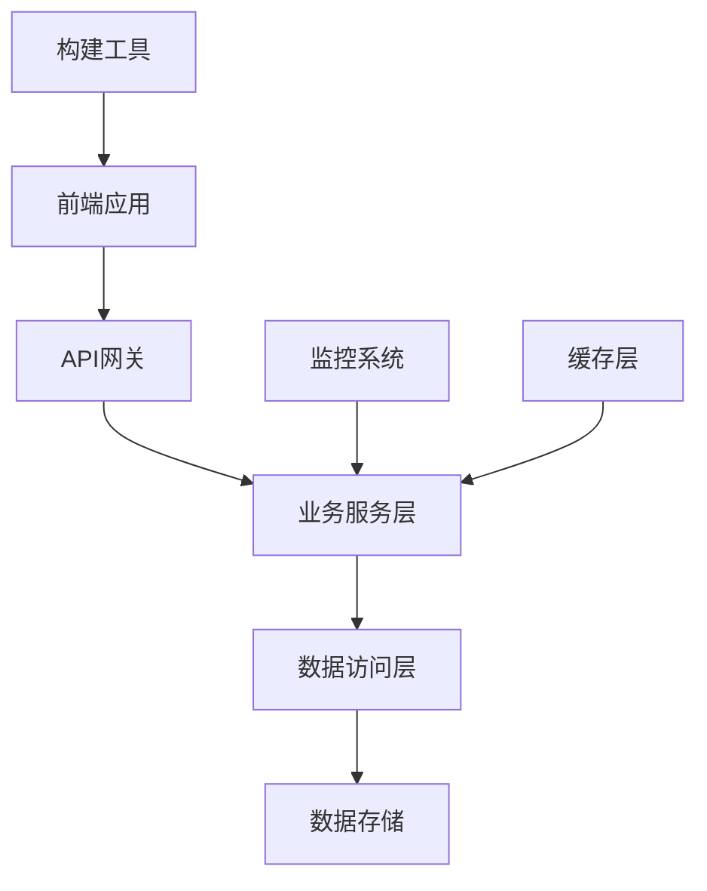

# JavaScript/Node.js 系统架构文档 - {{project_name}}

> 文档版本: {{version}}  
> 更新日期: {{timestamp}}  
> 维护者: {{author}}  
> 技术栈: {{tech_stack}}

## 概述

### 项目简介
{{project_description}}

### JavaScript生态特性
- **运行环境**: Node.js {{node_version}}
- **模块系统**: {{module_system}} (CommonJS/ESM)
- **包管理器**: {{package_manager}} (npm/yarn/pnpm)
- **语言增强**: {{language_enhancement}} (TypeScript/Flow)

### 核心价值
- **快速开发**: 丰富的npm生态和工具链
- **全栈能力**: 前后端统一技术栈
- **性能优化**: V8引擎和异步I/O
- **社区活跃**: 持续演进的技术标准

## 架构设计

### 架构原则
1. **单一职责**: 每个模块专注单一功能
2. **异步优先**: 充分利用Node.js异步特性
3. **类型安全**: 使用TypeScript增强代码可靠性
4. **模块化**: ES模块和CommonJS混合使用
5. **性能导向**: Bundle优化和代码分割

### 整体架构


## 技术栈选型

### 前端技术栈
| 层级 | 技术选型 | 版本 | 说明 |
|------|---------|------|------|
| **框架** | {{frontend_framework}} | {{framework_version}} | {{framework_desc}} |
| **状态管理** | {{state_management}} | {{state_version}} | {{state_desc}} |
| **路由** | {{router_lib}} | {{router_version}} | {{router_desc}} |
| **UI组件** | {{ui_library}} | {{ui_version}} | {{ui_desc}} |
| **样式** | {{styling_solution}} | {{style_version}} | {{style_desc}} |
| **构建工具** | {{build_tool}} | {{build_version}} | {{build_desc}} |

#### React生态架构 (如果适用)
```typescript
// 应用入口结构
src/
├── components/          # 可复用组件
│   ├── ui/             # 基础UI组件
│   └── business/       # 业务组件
├── pages/              # 页面组件
├── hooks/              # 自定义hooks
├── store/              # 状态管理
│   ├── slices/         # Redux slices
│   └── middleware/     # 中间件
├── services/           # API服务
├── utils/              # 工具函数
├── types/              # TypeScript类型
└── App.tsx             # 根组件
```

### 后端技术栈
| 层级 | 技术选型 | 版本 | 说明 |
|------|---------|------|------|
| **框架** | {{backend_framework}} | {{backend_version}} | {{backend_desc}} |
| **数据库** | {{database}} | {{db_version}} | {{db_desc}} |
| **ORM/ODM** | {{orm_framework}} | {{orm_version}} | {{orm_desc}} |
| **认证** | {{auth_framework}} | {{auth_version}} | {{auth_desc}} |
| **缓存** | {{cache_solution}} | {{cache_version}} | {{cache_desc}} |
| **消息队列** | {{mq_solution}} | {{mq_version}} | {{mq_desc}} |

#### Express.js架构 (如果适用)
```javascript
// 服务端结构
src/
├── controllers/        # 控制器层
├── services/          # 业务逻辑层
├── models/            # 数据模型
├── middleware/        # 中间件
├── routes/            # 路由定义
├── config/            # 配置文件
├── utils/             # 工具函数
├── types/             # TypeScript类型
└── app.ts             # 应用入口
```

## 核心模块设计

### 前端模块架构

#### 1. 组件层次结构
```typescript
// 组件分层
interface ComponentArchitecture {
  pages: {           // 页面级组件
    responsibility: "路由和布局";
    dependencies: ["business components", "layouts"];
  };
  business: {        // 业务组件
    responsibility: "业务逻辑封装";
    dependencies: ["ui components", "hooks", "services"];
  };
  ui: {             // UI组件
    responsibility: "纯展示逻辑";
    dependencies: ["styled-components", "theme"];
  };
}
```

#### 2. 状态管理架构
```typescript
// Redux Toolkit 示例
interface StoreStructure {
  auth: AuthState;
  user: UserState;
  ui: UIState;
  api: RTKQueryState;
}

// Zustand 示例
interface AppStore {
  // 状态
  user: User | null;
  theme: Theme;
  
  // 动作
  setUser: (user: User) => void;
  toggleTheme: () => void;
}
```

### 后端模块架构

#### 1. MVC模式 (Express)
```typescript
// Controller层
export class {{ControllerName}}Controller {
  constructor(private {{serviceName}}Service: {{ServiceName}}Service) {}
  
  async create(req: Request, res: Response): Promise<void> {
    const result = await this.{{serviceName}}Service.create(req.body);
    res.json(result);
  }
}

// Service层
export class {{ServiceName}}Service {
  constructor(private {{repositoryName}}Repository: {{RepositoryName}}Repository) {}
  
  async create(data: Create{{EntityName}}DTO): Promise<{{EntityName}}> {
    // 业务逻辑
    return this.{{repositoryName}}Repository.create(data);
  }
}
```

#### 2. 数据访问层
```typescript
// Repository模式
export interface {{EntityName}}Repository {
  findById(id: string): Promise<{{EntityName}} | null>;
  create(data: Create{{EntityName}}DTO): Promise<{{EntityName}}>;
  update(id: string, data: Update{{EntityName}}DTO): Promise<{{EntityName}}>;
  delete(id: string): Promise<void>;
}

// Prisma ORM 实现
export class Prisma{{EntityName}}Repository implements {{EntityName}}Repository {
  constructor(private prisma: PrismaClient) {}
  
  async findById(id: string): Promise<{{EntityName}} | null> {
    return this.prisma.{{tableName}}.findUnique({ where: { id } });
  }
}
```

## 数据流架构

### 前端数据流
```typescript
// 单向数据流
User Input → Action → Reducer → Store → Component → UI

// React + Redux示例
dispatch(fetchUserData()) 
  → createAsyncThunk 
  → API调用 
  → 更新Store 
  → 组件重渲染
```

### API设计规范
```typescript
// RESTful API结构
interface APIEndpoints {
  users: {
    'GET /api/v1/users': GetUsersResponse;
    'POST /api/v1/users': CreateUserResponse;
    'GET /api/v1/users/:id': GetUserResponse;
    'PUT /api/v1/users/:id': UpdateUserResponse;
    'DELETE /api/v1/users/:id': DeleteUserResponse;
  };
}

// 统一响应格式
interface APIResponse<T> {
  success: boolean;
  data?: T;
  error?: {
    code: string;
    message: string;
  };
  meta?: {
    pagination?: PaginationInfo;
    timestamp: string;
  };
}
```

## 安全架构

### 前端安全
```typescript
// XSS防护
const sanitizeHtml = require('sanitize-html');

// CSRF防护
const csrfToken = document.querySelector('meta[name="csrf-token"]').content;

// 内容安全策略
const cspDirectives = {
  defaultSrc: ["'self'"],
  scriptSrc: ["'self'", "'unsafe-inline'"],
  styleSrc: ["'self'", "'unsafe-inline'"],
  imgSrc: ["'self'", "data:", "https:"]
};
```

### 后端安全
```typescript
// JWT认证
interface JWTPayload {
  sub: string;          // 用户ID
  iat: number;          // 签发时间
  exp: number;          // 过期时间
  scope: string[];      // 权限范围
}

// 权限中间件
const requireAuth = (requiredScope: string) => {
  return (req: Request, res: Response, next: NextFunction) => {
    const token = extractToken(req);
    const payload = verifyToken(token);
    
    if (payload.scope.includes(requiredScope)) {
      next();
    } else {
      res.status(403).json({ error: 'Insufficient permissions' });
    }
  };
};
```

## 性能架构

### 前端性能优化
```typescript
// 代码分割
const LazyComponent = lazy(() => import('./components/HeavyComponent'));

// 组件缓存
const MemoizedComponent = memo(({ data }) => {
  return <ExpensiveComponent data={data} />;
});

// 虚拟化长列表
import { FixedSizeList as List } from 'react-window';

// Service Worker缓存
const CACHE_NAME = '{{app_name}}-v{{version}}';
const urlsToCache = [
  '/',
  '/static/js/bundle.js',
  '/static/css/main.css'
];
```

### 后端性能优化
```typescript
// Redis缓存
const cacheMiddleware = (ttl: number = 300) => {
  return async (req: Request, res: Response, next: NextFunction) => {
    const key = `cache:${req.originalUrl}`;
    const cached = await redis.get(key);
    
    if (cached) {
      return res.json(JSON.parse(cached));
    }
    
    // 拦截响应
    const originalSend = res.send;
    res.send = function(data) {
      redis.setex(key, ttl, data);
      originalSend.call(this, data);
    };
    
    next();
  };
};

// 数据库查询优化
const optimizedQuery = {
  include: { posts: true },        // 预加载关联数据
  where: { status: 'published' },  // 索引字段查询
  take: 20,                        // 分页限制
  skip: (page - 1) * 20           // 偏移量
};
```

## 部署架构

### 构建流程
```yaml
# 前端构建
frontend_build:
  steps:
    - install: {{install_command}}
    - type_check: npm run type-check
    - lint: npm run lint
    - test: npm run test
    - build: npm run build
    - optimize: npm run analyze
  
# 后端构建
backend_build:
  steps:
    - install: {{install_command}}
    - compile: npm run build
    - test: npm run test
    - migrate: npm run migrate
```

### 容器化部署
```dockerfile
# 多阶段构建
FROM node:{{node_version}}-alpine AS builder
WORKDIR /app
COPY package*.json ./
RUN npm ci --only=production

FROM node:{{node_version}}-alpine AS runner
WORKDIR /app
COPY --from=builder /app/node_modules ./node_modules
COPY . .
EXPOSE {{port}}
CMD ["npm", "start"]
```

### Serverless架构 (如果适用)
```typescript
// AWS Lambda函数
export const handler: APIGatewayProxyHandler = async (event) => {
  const { httpMethod, path, body } = event;
  
  try {
    const result = await processRequest(httpMethod, path, body);
    return {
      statusCode: 200,
      headers: {
        'Content-Type': 'application/json',
        'Access-Control-Allow-Origin': '*'
      },
      body: JSON.stringify(result)
    };
  } catch (error) {
    return {
      statusCode: 500,
      body: JSON.stringify({ error: error.message })
    };
  }
};
```

## 监控和调试

### 前端监控
```typescript
// 错误边界
class ErrorBoundary extends Component<Props, State> {
  componentDidCatch(error: Error, errorInfo: ErrorInfo) {
    console.error('Error caught by boundary:', error, errorInfo);
    // 发送错误到监控服务
    sendErrorToService(error, errorInfo);
  }
}

// 性能监控
const observer = new PerformanceObserver((list) => {
  const entries = list.getEntries();
  entries.forEach((entry) => {
    if (entry.entryType === 'navigation') {
      console.log('页面加载时间:', entry.loadEventEnd - entry.loadEventStart);
    }
  });
});
```

### 后端监控
```typescript
// 请求日志中间件
const requestLogger = (req: Request, res: Response, next: NextFunction) => {
  const start = Date.now();
  
  res.on('finish', () => {
    const duration = Date.now() - start;
    logger.info({
      method: req.method,
      url: req.url,
      status: res.statusCode,
      duration,
      userAgent: req.get('User-Agent'),
      ip: req.ip
    });
  });
  
  next();
};

// 健康检查端点
app.get('/health', (req, res) => {
  res.json({
    status: 'healthy',
    timestamp: new Date().toISOString(),
    version: process.env.APP_VERSION,
    environment: process.env.NODE_ENV,
    uptime: process.uptime(),
    memory: process.memoryUsage()
  });
});
```

## 开发工具链

### 开发环境配置
```json
{
  "scripts": {
    "dev": "concurrently \"npm run dev:server\" \"npm run dev:client\"",
    "dev:server": "nodemon --exec ts-node src/server.ts",
    "dev:client": "vite dev",
    "build": "npm run build:client && npm run build:server",
    "test": "jest",
    "test:watch": "jest --watch",
    "test:e2e": "cypress run",
    "lint": "eslint src/**/*.{ts,tsx}",
    "format": "prettier --write src/**/*.{ts,tsx,json,md}"
  }
}
```

### TypeScript配置
```json
{
  "compilerOptions": {
    "target": "ES2022",
    "module": "ESNext",
    "moduleResolution": "node",
    "strict": true,
    "esModuleInterop": true,
    "skipLibCheck": true,
    "forceConsistentCasingInFileNames": true,
    "declaration": true,
    "outDir": "dist",
    "baseUrl": ".",
    "paths": {
      "@/*": ["src/*"],
      "@/components/*": ["src/components/*"],
      "@/services/*": ["src/services/*"]
    }
  }
}
```

## 测试策略

### 测试金字塔
```typescript
// 单元测试 (Jest)
describe('UserService', () => {
  let userService: UserService;
  
  beforeEach(() => {
    userService = new UserService(mockRepository);
  });
  
  test('should create user successfully', async () => {
    const userData = { name: 'John', email: 'john@example.com' };
    const result = await userService.createUser(userData);
    expect(result.id).toBeDefined();
  });
});

// 集成测试 (Supertest)
describe('API Integration Tests', () => {
  test('POST /api/users should create user', async () => {
    const response = await request(app)
      .post('/api/users')
      .send({ name: 'John', email: 'john@example.com' })
      .expect(201);
    
    expect(response.body.data.id).toBeDefined();
  });
});

// E2E测试 (Cypress)
describe('User Registration Flow', () => {
  it('should allow user to register', () => {
    cy.visit('/register');
    cy.get('[data-testid="email-input"]').type('user@example.com');
    cy.get('[data-testid="password-input"]').type('password123');
    cy.get('[data-testid="submit-button"]').click();
    cy.url().should('include', '/dashboard');
  });
});
```

## 最佳实践

### 代码组织
1. **文件命名**: kebab-case for files, PascalCase for components
2. **目录结构**: 按功能分组，而非类型
3. **导入顺序**: external → internal → relative
4. **异步处理**: 优先使用async/await而非Promise

### 性能最佳实践
1. **Bundle优化**: 使用tree-shaking和code-splitting
2. **图片优化**: 使用WebP格式和lazy loading
3. **缓存策略**: 合理设置HTTP缓存头
4. **数据库查询**: 避免N+1问题，使用连接池

## 相关文档

- [JavaScript依赖管理](./dependencies.md)
- [JavaScript模块模板](./module-template.md)
- [Node.js最佳实践](https://nodejs.org/en/docs/guides/nodejs-docker-webapp/)
- [React架构指南](https://reactjs.org/docs/getting-started.html)
- [Express.js指南](https://expressjs.com/en/guide/routing.html)

---

*本文档由 mg_kiro MCP 系统根据JavaScript/Node.js项目特征自动生成*