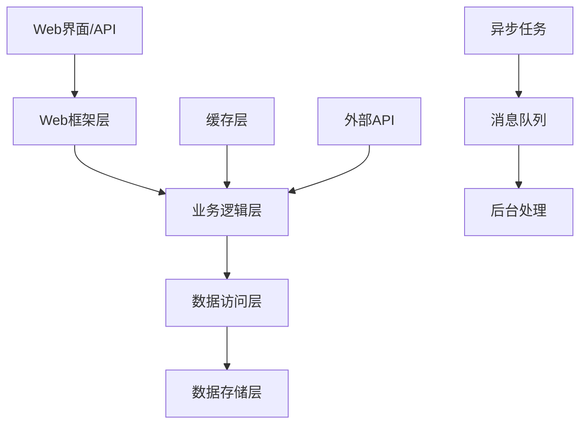

# Python 系统架构文档 - {{project_name}}

> 文档版本: {{version}}  
> 更新日期: {{timestamp}}  
> 维护者: {{author}}  
> Python版本: {{python_version}}

## 概述

### 项目简介
{{project_description}}

### Python生态特性
- **运行环境**: Python {{python_version}}
- **框架选型**: {{web_framework}} (Django/Flask/FastAPI)
- **异步支持**: {{async_support}} (asyncio/async/await)
- **包管理器**: {{package_manager}} (pip/poetry/conda)
- **WSGI/ASGI**: {{server_interface}} (Gunicorn/Uvicorn)

### 核心价值
- **快速开发**: "Batteries included" 和丰富的第三方生态
- **代码可读**: 清晰简洁的语法和强大的标准库
- **多范式**: 支持面向对象、函数式和过程式编程
- **跨平台**: 一次编写，处处运行

## 架构设计

### 架构原则
1. **Pythonic**: 遵循Python之禅和PEP规范
2. **异步优先**: 充分利用asyncio和异步编程
3. **类型安全**: 使用type hints增强代码可靠性
4. **模块化**: 清晰的包结构和导入关系
5. **测试驱动**: 高测试覆盖率和行为驱动开发

### 整体架构


## 技术栈选型

### Web框架对比
| 框架 | 类型 | 特点 | 适用场景 | 生态成熟度 |
|------|------|------|---------|-----------|
| **Django** | 全栈框架 | 功能完整，ORM强大 | 大型应用，内容管理 | ⭐⭐⭐⭐⭐ |
| **Flask** | 微框架 | 轻量灵活，扩展性好 | 中小型API，原型开发 | ⭐⭐⭐⭐ |
| **FastAPI** | 异步框架 | 高性能，自动文档 | API服务，现代应用 | ⭐⭐⭐⭐ |

### 核心技术栈
| 层级 | 技术选型 | 版本 | 说明 |
|------|---------|------|------|
| **Web框架** | {{web_framework}} | {{framework_version}} | {{framework_desc}} |
| **ASGI/WSGI服务器** | {{app_server}} | {{server_version}} | {{server_desc}} |
| **数据库** | {{database}} | {{db_version}} | {{db_desc}} |
| **ORM** | {{orm_framework}} | {{orm_version}} | {{orm_desc}} |
| **缓存** | {{cache_solution}} | {{cache_version}} | {{cache_desc}} |
| **任务队列** | {{task_queue}} | {{queue_version}} | {{queue_desc}} |

## 框架特定架构

### Django架构 (如果适用)
```python
# Django项目结构
{{project_name}}/
├── manage.py               # Django命令行工具
├── {{project_name}}/       # 项目配置
│   ├── __init__.py
│   ├── settings/           # 分环境配置
│   │   ├── __init__.py
│   │   ├── base.py         # 基础配置
│   │   ├── development.py  # 开发配置
│   │   ├── production.py   # 生产配置
│   │   └── testing.py      # 测试配置
│   ├── urls.py            # 根URL配置
│   └── wsgi.py            # WSGI入口
├── apps/                   # Django应用
│   ├── authentication/     # 认证应用
│   ├── users/             # 用户管理
│   ├── {{business_app}}/  # 业务应用
│   └── common/            # 公共模块
├── static/                # 静态文件
├── media/                 # 媒体文件
├── templates/             # 模板文件
└── requirements/          # 依赖文件
```

#### Django应用结构
```python
# apps/{{app_name}}/
├── __init__.py
├── admin.py               # 管理后台
├── apps.py               # 应用配置
├── models.py             # 数据模型
├── views.py              # 视图逻辑
├── urls.py               # URL路由
├── forms.py              # 表单定义
├── serializers.py        # API序列化器
├── managers.py           # 自定义管理器
├── signals.py            # 信号处理
├── tasks.py              # 异步任务
├── tests/                # 测试文件
└── migrations/           # 数据库迁移
```

#### Django设计模式
```python
# Model层 - 数据模型
from django.db import models
from django.contrib.auth.models import AbstractUser

class {{ModelName}}(models.Model):
    """{{model_description}}"""
    
    title = models.CharField(max_length=200, verbose_name="标题")
    content = models.TextField(verbose_name="内容")
    created_at = models.DateTimeField(auto_now_add=True)
    updated_at = models.DateTimeField(auto_now=True)
    
    class Meta:
        db_table = '{{table_name}}'
        verbose_name = '{{verbose_name}}'
        verbose_name_plural = '{{verbose_name_plural}}'
        ordering = ['-created_at']
    
    def __str__(self):
        return self.title

# View层 - 基于类的视图
from django.views.generic import ListView, DetailView
from rest_framework.viewsets import ModelViewSet

class {{ModelName}}ViewSet(ModelViewSet):
    """{{model_name}} API视图集"""
    
    queryset = {{ModelName}}.objects.all()
    serializer_class = {{ModelName}}Serializer
    permission_classes = [{{PermissionClass}}]
    
    def get_queryset(self):
        """自定义查询集"""
        return super().get_queryset().select_related('user')
```

### FastAPI架构 (如果适用)
```python
# FastAPI项目结构
{{project_name}}/
├── app/
│   ├── __init__.py
│   ├── main.py             # 应用入口
│   ├── core/               # 核心配置
│   │   ├── __init__.py
│   │   ├── config.py       # 配置管理
│   │   └── security.py     # 安全模块
│   ├── api/                # API路由
│   │   ├── __init__.py
│   │   ├── deps.py         # 依赖注入
│   │   └── v1/             # API版本
│   │       ├── __init__.py
│   │       ├── {{resource}}.py
│   │       └── auth.py
│   ├── crud/               # CRUD操作
│   ├── models/             # 数据模型
│   ├── schemas/            # Pydantic模式
│   └── services/           # 业务服务
├── alembic/                # 数据库迁移
├── tests/                  # 测试文件
└── docker-compose.yml      # 容器编排
```

#### FastAPI异步模式
```python
# main.py - 应用入口
from fastapi import FastAPI, Depends
from fastapi.middleware.cors import CORSMiddleware
import uvicorn

app = FastAPI(
    title="{{api_title}}",
    description="{{api_description}}",
    version="{{api_version}}"
)

# CORS中间件
app.add_middleware(
    CORSMiddleware,
    allow_origins=["*"],
    allow_credentials=True,
    allow_methods=["*"],
    allow_headers=["*"],
)

# 依赖注入
async def get_db():
    async with AsyncSession() as session:
        yield session

# API路由
@app.post("/{{resource}}/", response_model={{ResponseSchema}})
async def create_{{resource}}(
    {{resource}}: {{CreateSchema}},
    db: AsyncSession = Depends(get_db)
):
    """创建{{resource_name}}"""
    return await {{crud_service}}.create(db, {{resource}})

# 异步背景任务
from fastapi import BackgroundTasks

@app.post("/send-notification/")
async def send_notification(
    email: str, 
    background_tasks: BackgroundTasks
):
    background_tasks.add_task(send_email_async, email)
    return {"message": "Notification sent"}
```

### Flask架构 (如果适用)
```python
# Flask项目结构
{{project_name}}/
├── app/
│   ├── __init__.py         # 应用工厂
│   ├── models.py           # 数据模型
│   ├── views/              # 视图蓝图
│   │   ├── __init__.py
│   │   ├── auth.py         # 认证视图
│   │   └── {{resource}}.py # 资源视图
│   ├── static/             # 静态文件
│   ├── templates/          # 模板文件
│   └── utils.py            # 工具函数
├── migrations/             # 数据库迁移
├── tests/                  # 测试文件
├── config.py              # 配置文件
└── run.py                 # 启动脚本
```

#### Flask应用工厂模式
```python
# app/__init__.py
from flask import Flask
from flask_sqlalchemy import SQLAlchemy
from flask_migrate import Migrate

db = SQLAlchemy()
migrate = Migrate()

def create_app(config_name='development'):
    """应用工厂函数"""
    app = Flask(__name__)
    app.config.from_object(config[config_name])
    
    # 初始化扩展
    db.init_app(app)
    migrate.init_app(app, db)
    
    # 注册蓝图
    from .views.auth import auth_bp
    from .views.{{resource}} import {{resource}}_bp
    
    app.register_blueprint(auth_bp, url_prefix='/auth')
    app.register_blueprint({{resource}}_bp, url_prefix='/{{resource}}')
    
    return app

# 蓝图模式
from flask import Blueprint, request, jsonify

{{resource}}_bp = Blueprint('{{resource}}', __name__)

@{{resource}}_bp.route('/', methods=['GET'])
def get_{{resource}}s():
    """获取{{resource_name}}列表"""
    {{resource}}s = {{ModelName}}.query.all()
    return jsonify([{{resource}}.to_dict() for {{resource}} in {{resource}}s])
```

## 数据层架构

### ORM模式选择
| ORM | 特点 | 适用场景 | 性能 |
|-----|------|---------|------|
| **Django ORM** | 功能完整，自动迁移 | Django项目 | ⭐⭐⭐ |
| **SQLAlchemy** | 灵活强大，支持原生SQL | Flask/FastAPI | ⭐⭐⭐⭐ |
| **Tortoise ORM** | 异步原生，类Django语法 | 异步应用 | ⭐⭐⭐⭐ |
| **Peewee** | 轻量级，简单易用 | 小型项目 | ⭐⭐⭐⭐ |

### SQLAlchemy异步模式
```python
# models/base.py
from sqlalchemy.ext.asyncio import create_async_engine, AsyncSession
from sqlalchemy.orm import declarative_base, sessionmaker

Base = declarative_base()

# 异步引擎
engine = create_async_engine(
    "{{database_url}}",
    echo={{db_echo}},
    pool_pre_ping=True
)

# 异步会话
AsyncSessionLocal = sessionmaker(
    engine, class_=AsyncSession, expire_on_commit=False
)

# 模型定义
class {{ModelName}}(Base):
    __tablename__ = "{{table_name}}"
    
    id: Mapped[int] = mapped_column(primary_key=True)
    title: Mapped[str] = mapped_column(String(200))
    content: Mapped[str] = mapped_column(Text)
    created_at: Mapped[datetime] = mapped_column(default=datetime.utcnow)
    
    # 关系定义
    user_id: Mapped[int] = mapped_column(ForeignKey("users.id"))
    user: Mapped["User"] = relationship(back_populates="{{resource}}s")

# CRUD操作
class {{ModelName}}CRUD:
    @staticmethod
    async def get(db: AsyncSession, id: int) -> {{ModelName}} | None:
        result = await db.execute(
            select({{ModelName}}).where({{ModelName}}.id == id)
        )
        return result.scalar_one_or_none()
    
    @staticmethod
    async def create(db: AsyncSession, obj_in: {{CreateSchema}}) -> {{ModelName}}:
        db_obj = {{ModelName}}(**obj_in.dict())
        db.add(db_obj)
        await db.commit()
        await db.refresh(db_obj)
        return db_obj
```

## 异步编程架构

### asyncio模式
```python
# 异步服务层
import asyncio
import aiohttp
from typing import List, Optional

class {{ServiceName}}:
    def __init__(self):
        self.session: Optional[aiohttp.ClientSession] = None
    
    async def __aenter__(self):
        self.session = aiohttp.ClientSession()
        return self
    
    async def __aexit__(self, exc_type, exc_val, exc_tb):
        if self.session:
            await self.session.close()
    
    async def process_batch(self, items: List[str]) -> List[dict]:
        """并发处理批量任务"""
        tasks = [self.process_item(item) for item in items]
        return await asyncio.gather(*tasks, return_exceptions=True)
    
    async def process_item(self, item: str) -> dict:
        """处理单个项目"""
        async with self.session.get(f"{{api_url}}/{item}") as response:
            return await response.json()

# 使用示例
async def main():
    async with {{ServiceName}}() as service:
        results = await service.process_batch(['item1', 'item2', 'item3'])
        return results
```

### 任务队列架构
```python
# Celery任务定义
from celery import Celery

celery_app = Celery(
    "{{project_name}}",
    broker="{{broker_url}}",
    backend="{{result_backend}}"
)

@celery_app.task(bind=True, autoretry_for=(Exception,), retry_kwargs={'max_retries': 3})
def {{task_name}}(self, data: dict) -> dict:
    """异步任务处理"""
    try:
        result = process_data(data)
        return {"status": "success", "result": result}
    except Exception as exc:
        self.retry(countdown=60, exc=exc)

# RQ任务队列 (轻量级选择)
from rq import Queue
from redis import Redis

redis_conn = Redis()
queue = Queue(connection=redis_conn)

# 添加任务
job = queue.enqueue({{task_name}}, data)

# 获取结果
result = job.result
```

## 安全架构

### 认证和授权
```python
# JWT认证
from jose import JWTError, jwt
from passlib.context import CryptContext
from datetime import datetime, timedelta

pwd_context = CryptContext(schemes=["bcrypt"], deprecated="auto")

class SecurityService:
    def __init__(self, secret_key: str, algorithm: str = "HS256"):
        self.secret_key = secret_key
        self.algorithm = algorithm
    
    def create_access_token(self, data: dict, expires_delta: timedelta = None):
        """创建访问令牌"""
        to_encode = data.copy()
        if expires_delta:
            expire = datetime.utcnow() + expires_delta
        else:
            expire = datetime.utcnow() + timedelta(minutes=15)
        
        to_encode.update({"exp": expire})
        return jwt.encode(to_encode, self.secret_key, algorithm=self.algorithm)
    
    def verify_token(self, token: str):
        """验证令牌"""
        try:
            payload = jwt.decode(token, self.secret_key, algorithms=[self.algorithm])
            username: str = payload.get("sub")
            if username is None:
                raise JWTError("Invalid token")
            return username
        except JWTError:
            raise JWTError("Could not validate credentials")
    
    def hash_password(self, password: str):
        """密码哈希"""
        return pwd_context.hash(password)
    
    def verify_password(self, plain_password: str, hashed_password: str):
        """验证密码"""
        return pwd_context.verify(plain_password, hashed_password)

# 权限装饰器
from functools import wraps

def require_permission(permission: str):
    def decorator(func):
        @wraps(func)
        async def wrapper(*args, **kwargs):
            # 获取当前用户
            user = get_current_user()
            if not user.has_permission(permission):
                raise PermissionDenied("Insufficient permissions")
            return await func(*args, **kwargs)
        return wrapper
    return decorator
```

### 数据验证和清理
```python
# Pydantic模型验证
from pydantic import BaseModel, validator, Field
from typing import Optional
from datetime import datetime

class {{ResourceSchema}}(BaseModel):
    title: str = Field(..., min_length=1, max_length=200)
    content: str = Field(..., min_length=10)
    tags: List[str] = Field(default_factory=list)
    published: bool = Field(default=False)
    
    @validator('title')
    def title_must_not_be_empty(cls, v):
        if not v.strip():
            raise ValueError('Title cannot be empty')
        return v.strip()
    
    @validator('tags')
    def validate_tags(cls, v):
        # 清理和验证标签
        cleaned_tags = [tag.strip().lower() for tag in v if tag.strip()]
        return list(set(cleaned_tags))  # 去重
    
    class Config:
        # 配置
        orm_mode = True
        json_encoders = {
            datetime: lambda v: v.isoformat()
        }
```

## 性能优化架构

### 缓存策略
```python
# Redis缓存装饰器
import redis
import json
from functools import wraps
from typing import Optional

redis_client = redis.Redis(host='{{redis_host}}', port={{redis_port}})

def cache_result(ttl: int = 300, key_prefix: str = ""):
    """结果缓存装饰器"""
    def decorator(func):
        @wraps(func)
        async def wrapper(*args, **kwargs):
            # 构建缓存键
            cache_key = f"{key_prefix}:{func.__name__}:{hash(str(args)+str(kwargs))}"
            
            # 尝试从缓存获取
            cached = redis_client.get(cache_key)
            if cached:
                return json.loads(cached)
            
            # 执行函数
            result = await func(*args, **kwargs)
            
            # 存储到缓存
            redis_client.setex(cache_key, ttl, json.dumps(result, default=str))
            return result
        return wrapper
    return decorator

# 数据库查询优化
from sqlalchemy.orm import selectinload, joinedload

class {{ModelName}}Service:
    @staticmethod
    async def get_with_relations(db: AsyncSession, id: int):
        """预加载关联数据"""
        result = await db.execute(
            select({{ModelName}})
            .options(
                selectinload({{ModelName}}.{{relation1}}),
                joinedload({{ModelName}}.{{relation2}})
            )
            .where({{ModelName}}.id == id)
        )
        return result.scalar_one_or_none()
```

### 数据库连接池
```python
# SQLAlchemy连接池配置
engine = create_async_engine(
    "{{database_url}}",
    pool_size={{pool_size}},           # 连接池大小
    max_overflow={{max_overflow}},     # 最大溢出连接数
    pool_timeout={{pool_timeout}},     # 连接超时时间
    pool_recycle={{pool_recycle}},     # 连接回收时间
    pool_pre_ping=True,                # 连接预检
    echo={{db_echo}}                   # SQL日志
)
```

## 监控和日志架构

### 结构化日志
```python
# logging配置
import logging
import json
from datetime import datetime

class JSONFormatter(logging.Formatter):
    def format(self, record):
        log_entry = {
            'timestamp': datetime.utcnow().isoformat(),
            'level': record.levelname,
            'logger': record.name,
            'message': record.getMessage(),
            'module': record.module,
            'function': record.funcName,
            'line': record.lineno
        }
        
        if hasattr(record, 'user_id'):
            log_entry['user_id'] = record.user_id
        
        if hasattr(record, 'request_id'):
            log_entry['request_id'] = record.request_id
            
        return json.dumps(log_entry)

# 配置日志
logging.basicConfig(
    level=logging.{{log_level}},
    format='%(message)s',
    handlers=[
        logging.StreamHandler(),
        logging.FileHandler('logs/app.log')
    ]
)

# 获取logger
logger = logging.getLogger(__name__)
logger.addHandler(logging.StreamHandler())
logger.handlers[0].setFormatter(JSONFormatter())
```

### 性能监控
```python
# 性能监控装饰器
import time
from functools import wraps

def monitor_performance(func_name: str = None):
    def decorator(func):
        @wraps(func)
        async def wrapper(*args, **kwargs):
            start_time = time.time()
            try:
                result = await func(*args, **kwargs)
                duration = time.time() - start_time
                
                logger.info({
                    'event': 'function_call',
                    'function': func_name or func.__name__,
                    'duration': duration,
                    'status': 'success'
                })
                return result
            except Exception as e:
                duration = time.time() - start_time
                logger.error({
                    'event': 'function_call',
                    'function': func_name or func.__name__,
                    'duration': duration,
                    'status': 'error',
                    'error': str(e)
                })
                raise
        return wrapper
    return decorator
```

## 测试架构

### 测试分层
```python
# conftest.py - pytest配置
import pytest
import asyncio
from httpx import AsyncClient
from sqlalchemy.ext.asyncio import create_async_engine, AsyncSession

@pytest.fixture(scope="session")
def event_loop():
    """创建事件循环"""
    loop = asyncio.get_event_loop_policy().new_event_loop()
    yield loop
    loop.close()

@pytest.fixture
async def db_session():
    """数据库会话"""
    engine = create_async_engine("sqlite+aiosqlite:///:memory:")
    async with engine.begin() as conn:
        await conn.run_sync(Base.metadata.create_all)
    
    async with AsyncSession(engine) as session:
        yield session

@pytest.fixture
async def client():
    """HTTP客户端"""
    async with AsyncClient(app=app, base_url="http://test") as ac:
        yield ac

# 单元测试
class Test{{ServiceName}}:
    async def test_create_{{resource}}(self, db_session):
        """测试创建{{resource_name}}"""
        service = {{ServiceName}}(db_session)
        data = {{CreateSchema}}(
            title="Test Title",
            content="Test Content"
        )
        
        result = await service.create(data)
        
        assert result.id is not None
        assert result.title == "Test Title"

# 集成测试
class TestAPI:
    async def test_create_{{resource}}_api(self, client):
        """测试{{resource_name}}创建API"""
        payload = {
            "title": "Test Title",
            "content": "Test Content"
        }
        
        response = await client.post("/{{resource}}/", json=payload)
        
        assert response.status_code == 201
        data = response.json()
        assert data["title"] == "Test Title"
```

## 部署架构

### Docker化部署
```dockerfile
# Dockerfile
FROM python:{{python_version}}-slim

WORKDIR /app

# 安装系统依赖
RUN apt-get update && apt-get install -y \
    gcc \
    && rm -rf /var/lib/apt/lists/*

# 安装Python依赖
COPY requirements.txt .
RUN pip install --no-cache-dir -r requirements.txt

# 复制应用代码
COPY . .

# 创建非root用户
RUN adduser --disabled-password --gecos '' appuser && \
    chown -R appuser:appuser /app
USER appuser

# 健康检查
HEALTHCHECK --interval=30s --timeout=10s --start-period=5s --retries=3 \
  CMD curl -f http://localhost:{{port}}/health || exit 1

# 启动命令
CMD ["{{start_command}}"]
```

### 环境配置
```python
# config.py
import os
from pydantic import BaseSettings

class Settings(BaseSettings):
    # 应用配置
    app_name: str = "{{project_name}}"
    debug: bool = False
    version: str = "{{version}}"
    
    # 数据库配置
    database_url: str
    db_pool_size: int = 10
    
    # Redis配置
    redis_url: str = "redis://localhost:6379"
    
    # 安全配置
    secret_key: str
    jwt_algorithm: str = "HS256"
    access_token_expire_minutes: int = 30
    
    # 外部服务
    {{external_service_url}}: str = "{{default_url}}"
    
    class Config:
        env_file = ".env"

settings = Settings()
```

## 最佳实践

### 代码组织
1. **包结构**: 按功能分组，避免循环导入
2. **命名规范**: snake_case for functions/variables, PascalCase for classes
3. **类型提示**: 使用type hints提升代码可读性
4. **文档字符串**: 遵循Google/NumPy风格的docstring

### 性能最佳实践
1. **异步优先**: 对I/O密集型操作使用async/await
2. **数据库优化**: 使用eager loading减少N+1查询
3. **缓存策略**: 合理使用Redis缓存热点数据
4. **内存管理**: 避免循环引用，及时释放大对象

### 安全最佳实践
1. **输入验证**: 使用Pydantic验证所有输入
2. **SQL注入防护**: 使用ORM参数化查询
3. **XSS防护**: 对用户输入进行HTML转义
4. **CSRF防护**: 使用CSRF Token保护表单

## 相关文档

- [Python依赖管理](./dependencies.md)
- [Python模块模板](./module-template.md)
- [Django官方文档](https://docs.djangoproject.com/)
- [FastAPI官方文档](https://fastapi.tiangolo.com/)
- [Flask官方文档](https://flask.palletsprojects.com/)

---

*本文档由 mg_kiro MCP 系统根据Python项目特征自动生成*