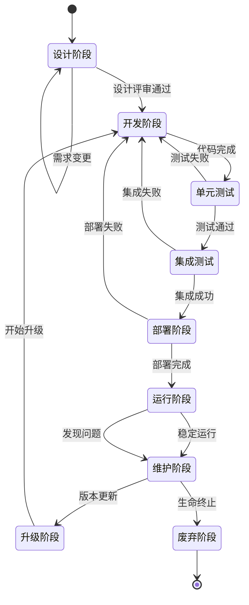
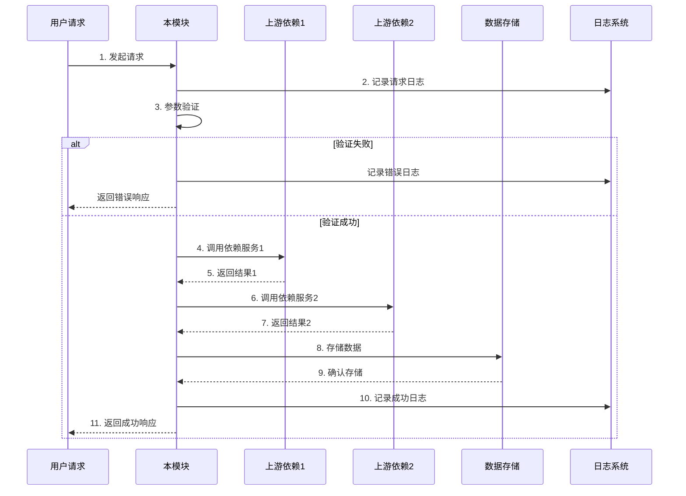
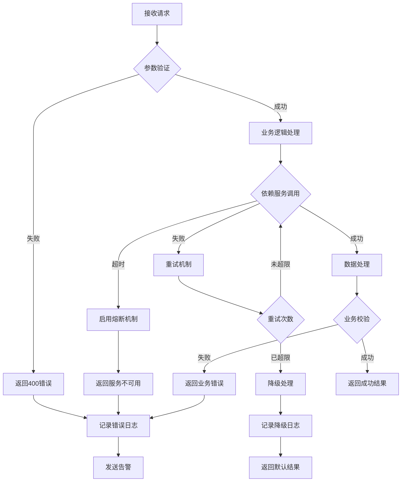
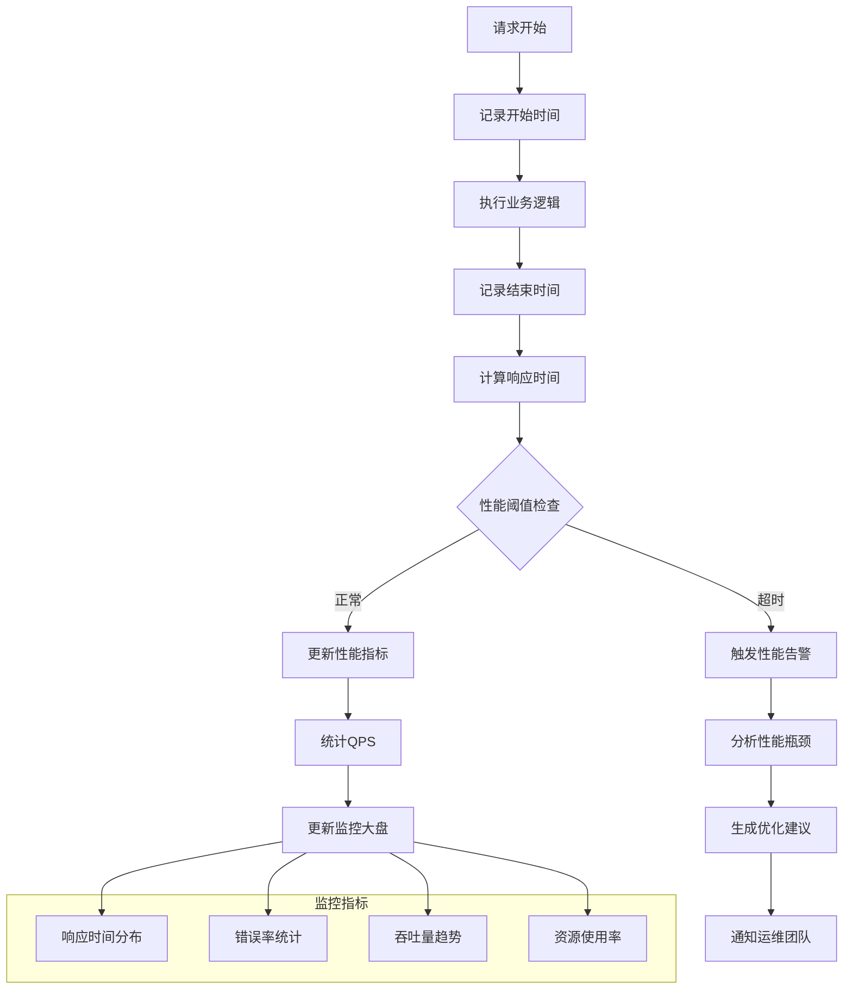

# {{module_name}} 模块

## 基本信息
- **模块ID**: `{{module_id}}`
- **版本**: {{module_version}}
- **负责人**: {{module_owner}}
- **状态**: {{module_status}}

## 功能描述
{{module_description}}

## 主要功能
| 功能名称 | 描述 | 状态 | 优先级 |
|---------|------|------|--------|
| {{feature1_name}} | {{feature1_desc}} | {{feature1_status}} | {{feature1_priority}} |
| {{feature2_name}} | {{feature2_desc}} | {{feature2_status}} | {{feature2_priority}} |

## 接口定义
### {{api_endpoint_1}}
- **路径**: `{{api_path_1}}`
- **方法**: `{{api_method_1}}`
- **权限**: {{api_permission_1}}

**请求**:
```json
{
  "{{request_field1}}": "{{value1}}",
  "{{request_field2}}": "{{value2}}"
}
```

**响应**:
```json
{
  "code": 200,
  "data": {
    "{{response_field1}}": "{{value1}}",
    "{{response_field2}}": "{{value2}}"
  }
}
```

## 依赖关系
| 上游依赖 | 类型 | 说明 |
|---------|------|------|
| {{upstream1}} | {{dep_type1}} | {{dep_desc1}} |
| {{upstream2}} | {{dep_type2}} | {{dep_desc2}} |

## 错误处理
| 错误码 | 错误描述 | 处理建议 |
|--------|---------|---------|
| {{error_code1}} | {{error_desc1}} | {{error_solution1}} |
| {{error_code2}} | {{error_desc2}} | {{error_solution2}} |

## 性能指标
| 指标 | 目标值 | 当前值 |
|------|--------|--------|
| 响应时间 | < {{target_latency}} | {{current_latency}} |
| 可用性 | > {{target_availability}} | {{current_availability}} |
| 吞吐量 | > {{target_throughput}} | {{current_throughput}} |

## 🔄 模块流程图

### 模块生命周期


### 模块交互流程


### 错误处理流程


### 性能监控流程
