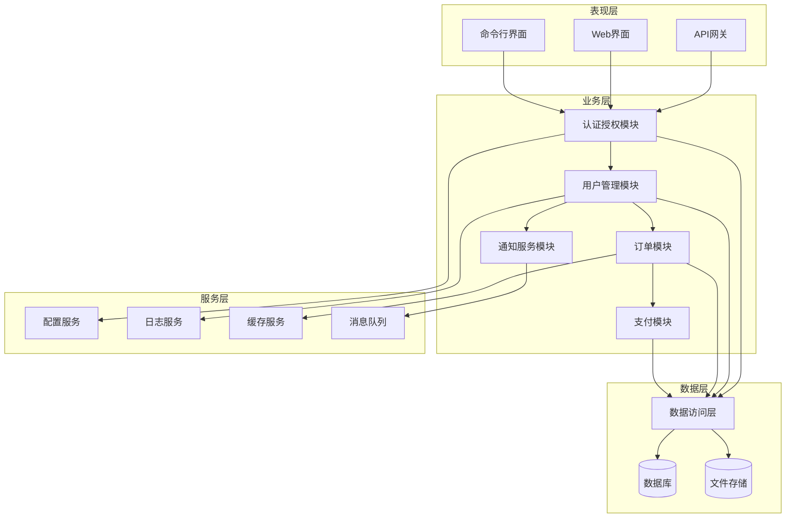
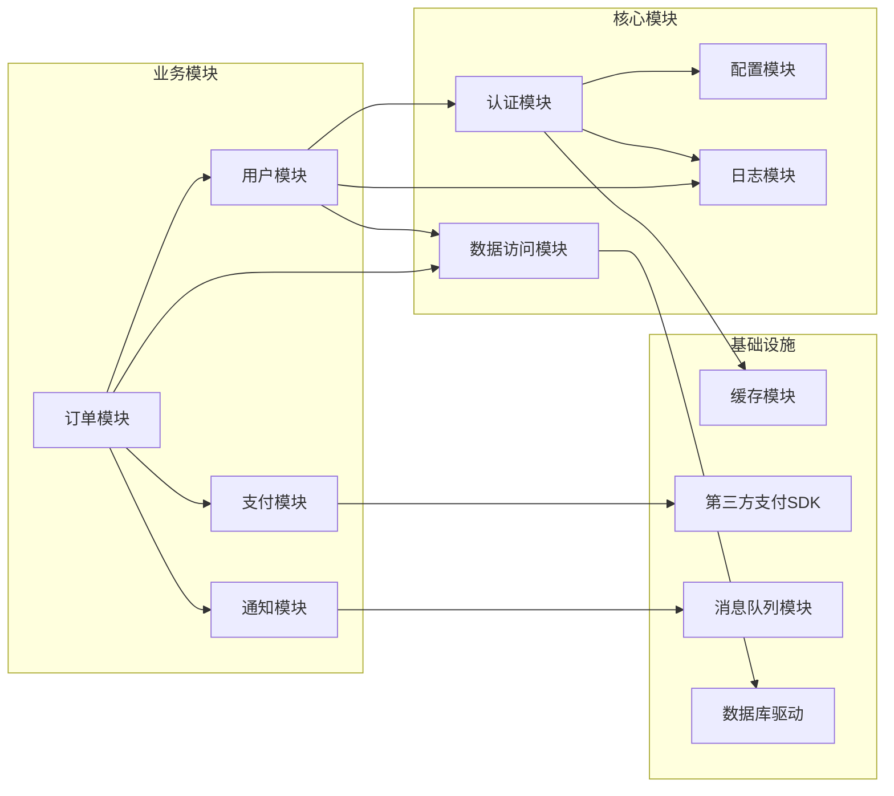
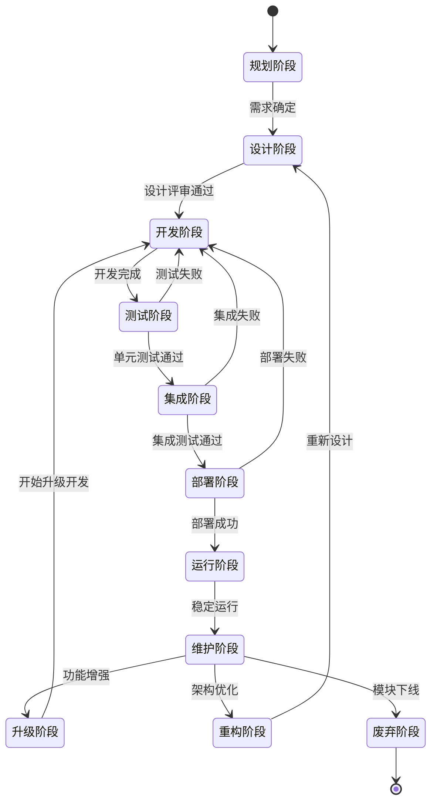
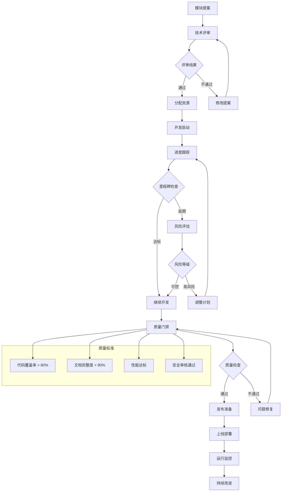

# 模块目录 - {{project_name}}

## 模块统计
- **总模块数**: {{total_modules}}
- **核心模块**: {{core_modules_count}}
- **业务模块**: {{business_modules_count}}

## 核心模块

### 认证授权模块
**模块ID**: `auth` | **版本**: {{auth_version}} | **状态**: {{auth_status}}

#### 主要功能
- 用户登录/登出
- Token管理  
- 权限验证
- 角色管理

#### 对外接口
| 接口名称 | 方法 | 路径 | 说明 |
|---------|------|------|------|
| 用户登录 | POST | /api/auth/login | 用户身份验证 |
| 用户登出 | POST | /api/auth/logout | 结束用户会话 |
| 权限验证 | GET | /api/auth/verify | 验证用户权限 |

### 数据访问模块  
**模块ID**: `dal` | **版本**: {{dal_version}} | **状态**: {{dal_status}}

#### 主要功能
- 数据库连接管理
- ORM/ODM封装
- 事务管理
- 数据缓存

## 业务模块

### 用户管理模块
**模块ID**: `user` | **版本**: {{user_version}} | **状态**: {{user_status}}

#### 功能清单
- [x] 用户注册
- [x] 用户信息管理
- [x] 用户列表查询
- [ ] 用户画像分析

### 通知服务模块
**模块ID**: `notification` | **版本**: {{notification_version}} | **状态**: {{notification_status}}

#### 支持渠道
- 邮件通知
- 短信通知
- 推送通知
- 站内消息

## 模块健康度
| 模块 | 代码覆盖率 | 文档完整度 | 健康评分 |
|------|------------|------------|----------|
| {{module1}} | {{coverage1}}% | {{doc1}}% | {{health1}}/100 |
| {{module2}} | {{coverage2}}% | {{doc2}}% | {{health2}}/100 |

## 开发计划
### 进行中
- [ ] {{ongoing_module1}} - {{ongoing_desc1}}
- [ ] {{ongoing_module2}} - {{ongoing_desc2}}

### 计划中  
- [ ] {{planned_module1}} - {{planned_desc1}}
- [ ] {{planned_module2}} - {{planned_desc2}}

## 📊 模块架构图

### 整体模块架构

### 模块依赖关系

### 模块生命周期管理

### 模块治理流程
