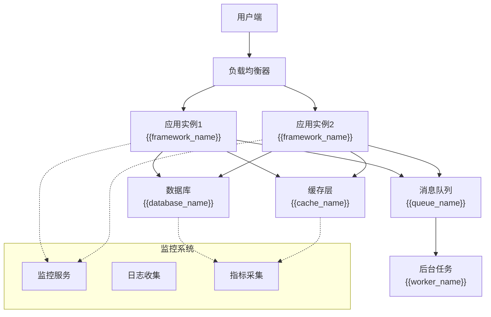
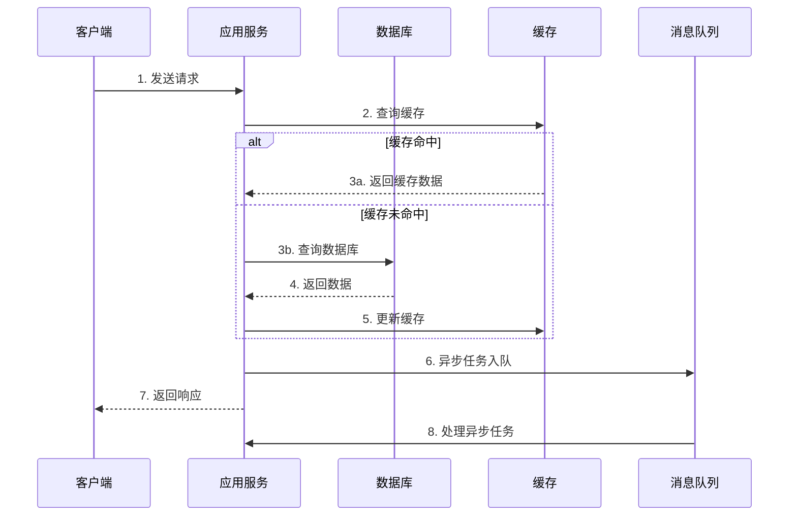

# 系统架构 - {{project_name}}

## 项目简介
{{project_description}}

### 核心价值
- **主要目标**: {{main_objectives}}
- **目标用户**: {{target_users}}
- **关键特性**: {{key_features}}

## 技术栈
| 层级 | 技术选型 | 说明 |
|------|---------|------|
| 前端 | {{frontend_stack}} | {{frontend_desc}} |
| 后端 | {{backend_stack}} | {{backend_desc}} |
| 数据库 | {{database_stack}} | {{database_desc}} |
| 缓存 | {{cache_stack}} | {{cache_desc}} |
| 部署 | {{deploy_stack}} | {{deploy_desc}} |

## 核心模块
| 模块名称 | 职责 | 依赖关系 | 接口数量 |
|---------|------|---------|---------|
| {{module1_name}} | {{module1_responsibility}} | {{module1_deps}} | {{module1_apis}} |
| {{module2_name}} | {{module2_responsibility}} | {{module2_deps}} | {{module2_apis}} |
| {{module3_name}} | {{module3_responsibility}} | {{module3_deps}} | {{module3_apis}} |

## 系统架构图

### 整体架构

### 数据流向图

## 安全架构
### 安全层级
1. **网络安全**: HTTPS/TLS 加密传输
2. **应用安全**: 身份认证 {{auth_method}}, 授权 {{authz_method}}
3. **数据安全**: 敏感数据加密存储

## 性能目标
| 指标 | 目标值 | 当前值 | 状态 |
|------|--------|--------|------|
| 响应时间 | < {{target_response_time}} | {{current_response_time}} | {{status}} |
| 并发用户 | {{target_concurrent}} | {{current_concurrent}} | {{status}} |
| 可用性 | {{target_availability}} | {{current_availability}} | {{status}} |

## 监控告警
### 告警规则
| 级别 | 触发条件 | 通知方式 |
|------|---------|---------|
| P0-紧急 | {{p0_condition}} | {{p0_notification}} |
| P1-严重 | {{p1_condition}} | {{p1_notification}} |
| P2-警告 | {{p2_condition}} | {{p2_notification}} |