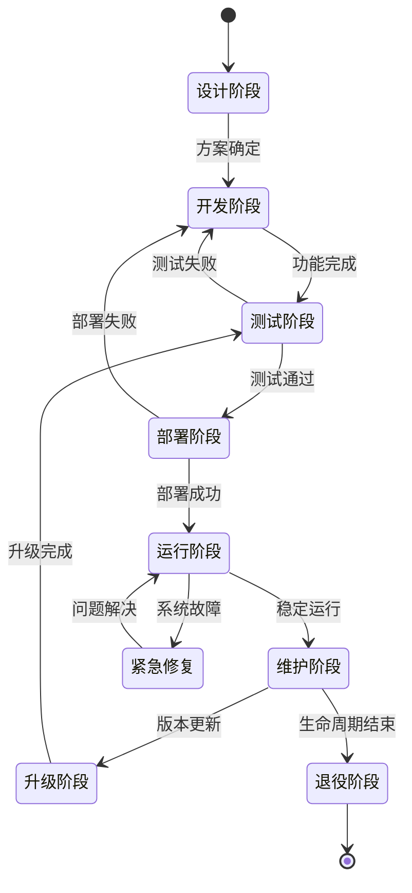
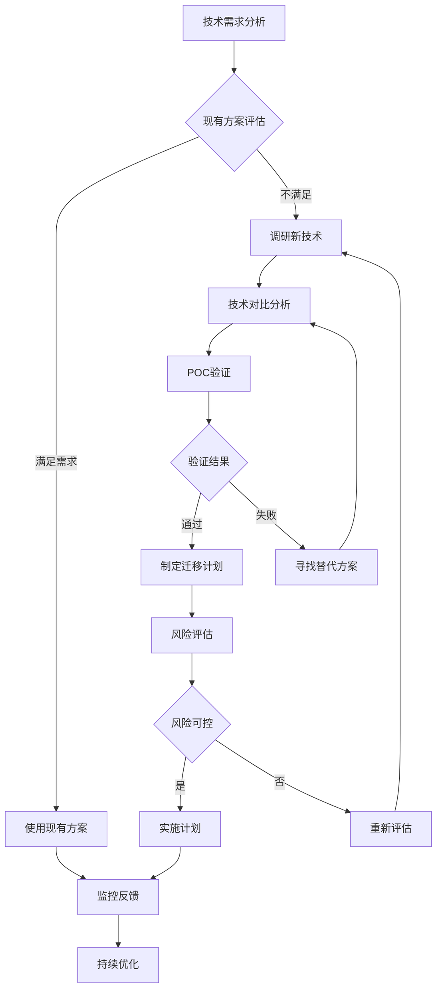
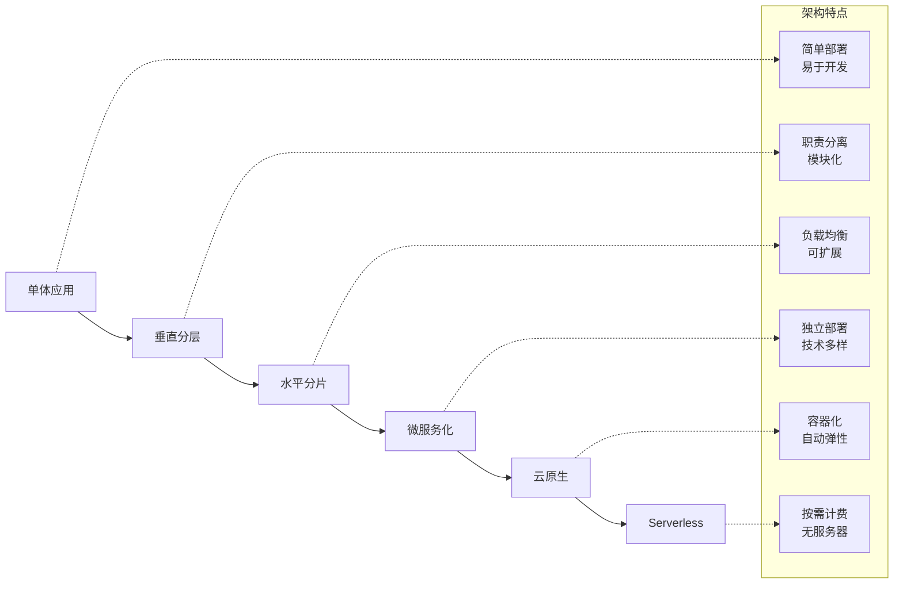

# 技术方案分析 - {{project_name}}

## 核心技术决策

### 🔧 {{decision_title1}}
**决策**: {{decision1}}  
**选择理由**: {{reasoning1}}  
**业务影响**: {{impact1}}  
**技术风险**: {{risk1}}  
**缓解方案**: {{mitigation1}}

### 🔧 {{decision_title2}}
**决策**: {{decision2}}  
**选择理由**: {{reasoning2}}  
**业务影响**: {{impact2}}  
**技术风险**: {{risk2}}  
**缓解方案**: {{mitigation2}}

## 方案对比分析

### {{comparison_topic}}
| 方案 | 技术优势 | 技术劣势 | 实施成本 | 推荐度 |
|------|---------|---------|---------|--------|
| {{option1}} | {{pros1}} | {{cons1}} | {{cost1}} | {{score1}}/5 |
| {{option2}} | {{pros2}} | {{cons2}} | {{cost2}} | {{score2}}/5 |
| {{option3}} | {{pros3}} | {{cons3}} | {{cost3}} | {{score3}}/5 |

**最终选择**: {{final_choice}}  
**选择依据**: {{choice_rationale}}

## 技术栈评估

### 核心技术栈
| 技术分类 | 选型 | 版本 | 优势 | 风险点 |
|---------|------|------|------|-------|
| {{tech_category1}} | {{tech_choice1}} | {{tech_version1}} | {{tech_pros1}} | {{tech_risks1}} |
| {{tech_category2}} | {{tech_choice2}} | {{tech_version2}} | {{tech_pros2}} | {{tech_risks2}} |

### 依赖分析
**关键依赖**: {{critical_dependencies}}  
**版本策略**: {{version_strategy}}  
**升级计划**: {{upgrade_plan}}

## 性能与扩展性

### 性能目标
| 指标 | 目标值 | 当前预估 | 达成策略 |
|------|--------|---------|---------|
| {{perf_metric1}} | {{target1}} | {{estimate1}} | {{strategy1}} |
| {{perf_metric2}} | {{target2}} | {{estimate2}} | {{strategy2}} |

### 扩展性设计
**水平扩展**: {{horizontal_scaling}}  
**垂直扩展**: {{vertical_scaling}}  
**瓶颈预测**: {{bottleneck_prediction}}

## 安全性分析

### 安全威胁模型
| 威胁类型 | 风险等级 | 影响范围 | 防护措施 |
|---------|---------|---------|---------|
| {{threat1}} | {{risk_level1}} | {{impact1}} | {{protection1}} |
| {{threat2}} | {{risk_level2}} | {{impact2}} | {{protection2}} |

### 合规要求
**数据保护**: {{data_protection}}  
**访问控制**: {{access_control}}  
**审计日志**: {{audit_logging}}

## 技术债务管理

### 当前技术债务
| 债务项目 | 严重程度 | 影响范围 | 预估工时 | 处理优先级 |
|---------|---------|---------|---------|-----------|
| {{debt1}} | {{severity1}} | {{scope1}} | {{effort1}}h | {{priority1}} |
| {{debt2}} | {{severity2}} | {{scope2}} | {{effort2}}h | {{priority2}} |

### 债务清偿计划
**第一阶段**: {{phase1_debt}}  
**第二阶段**: {{phase2_debt}}  
**持续改进**: {{continuous_improvement}}

## 风险评估与应对

### 🔴 高风险项
1. **{{high_risk1}}** - 应对: {{high_mitigation1}}
2. **{{high_risk2}}** - 应对: {{high_mitigation2}}

### 🟡 中风险项
1. **{{medium_risk1}}** - 应对: {{medium_mitigation1}}
2. **{{medium_risk2}}** - 应对: {{medium_mitigation2}}

### 🟢 低风险项
1. **{{low_risk1}}** - 监控: {{low_monitoring1}}
2. **{{low_risk2}}** - 监控: {{low_monitoring2}}

## 实施建议

### 开发阶段规划
**阶段1**: {{dev_phase1}} ({{phase1_duration}})  
**阶段2**: {{dev_phase2}} ({{phase2_duration}})  
**阶段3**: {{dev_phase3}} ({{phase3_duration}})

### 关键里程碑
- [ ] {{milestone1}} - {{milestone1_date}}
- [ ] {{milestone2}} - {{milestone2_date}}
- [ ] {{milestone3}} - {{milestone3_date}}

### 技术验证计划
**概念验证**: {{poc_plan}}  
**原型开发**: {{prototype_plan}}  
**压力测试**: {{stress_test_plan}}

## 🔄 技术架构状态图

### 系统状态迁移

### 技术选型决策流程

### 部署架构演进
