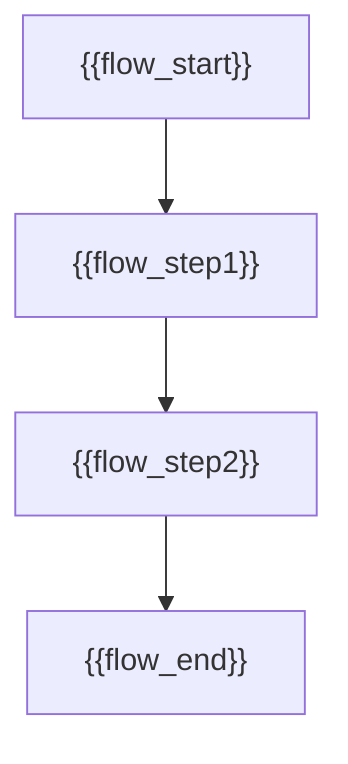

# 用户需求文档 - {{project_name}}

## 目标用户
| 用户类型 | 特征描述 | 核心需求 | 主要痛点 |
|---------|---------|---------|---------|
| {{user_type1}} | {{user_trait1}} | {{user_need1}} | {{user_pain1}} |
| {{user_type2}} | {{user_trait2}} | {{user_need2}} | {{user_pain2}} |

## 核心用户故事

### 🎯 Epic: {{epic_name}}
#### 故事 1: {{story_title1}}
**作为** {{user_role1}}，**我希望** {{user_want1}}，**以便** {{user_benefit1}}

**验收标准:**
- [ ] {{acceptance1_1}}
- [ ] {{acceptance1_2}} 
- [ ] {{acceptance1_3}}

**优先级**: {{priority1}} | **工作量**: {{effort1}}点 | **状态**: {{status1}}

#### 故事 2: {{story_title2}}
**作为** {{user_role2}}，**我希望** {{user_want2}}，**以便** {{user_benefit2}}

**验收标准:**
- [ ] {{acceptance2_1}}
- [ ] {{acceptance2_2}}

**优先级**: {{priority2}} | **工作量**: {{effort2}}点 | **状态**: {{status2}}

### 🎯 Epic: {{epic_name2}}
#### 故事 3: {{story_title3}}
**作为** {{user_role3}}，**我希望** {{user_want3}}，**以便** {{user_benefit3}}

**验收标准:**
- [ ] {{acceptance3_1}}
- [ ] {{acceptance3_2}}

**优先级**: {{priority3}} | **工作量**: {{effort3}}点 | **状态**: {{status3}}

## 需求优先级 (MoSCoW)
### Must Have (必须有)
- {{must_have1}}
- {{must_have2}}

### Should Have (应该有)  
- {{should_have1}}
- {{should_have2}}

### Could Have (可以有)
- {{could_have1}}
- {{could_have2}}

### Won't Have (暂不考虑)
- {{wont_have1}}
- {{wont_have2}}

## 业务流程

## 非功能性需求
| 类型 | 需求描述 | 指标 |
|------|---------|------|
| 性能 | {{performance_req}} | {{performance_metric}} |
| 安全 | {{security_req}} | {{security_metric}} |
| 可用性 | {{usability_req}} | {{usability_metric}} |

## 验收准则
- [ ] 所有Must Have功能完成
- [ ] 用户验收测试通过
- [ ] 性能指标满足要求
- [ ] 安全审核通过