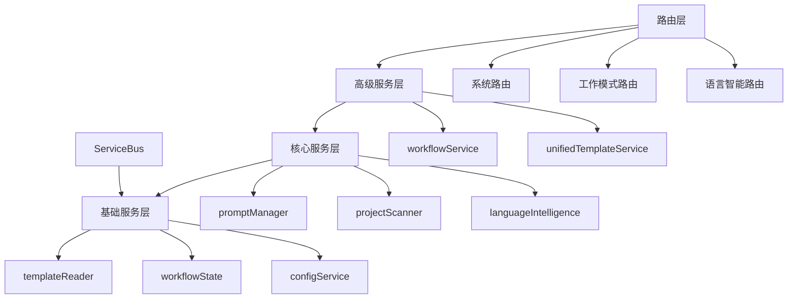

# mg_kiro MCP Server 架构文档

## 📋 文档概览

**生成时间**: 2025-09-08  
**架构版本**: v2.0.1  
**文档目的**: 深入理解server端的完整架构、模块关系和依赖管理

## 🏗️ 总体架构

mg_kiro MCP Server 采用**现代模块化架构**，基于依赖注入和服务总线模式，实现了高度解耦和可扩展的系统设计。

### 核心设计原则

- **模块化路由系统**: 按工作模式和功能领域分层组织
- **服务依赖注入**: 通过ServiceBus实现统一服务管理
- **统一响应格式**: 标准化所有API响应
- **工作流状态管理**: 支持复杂多步骤工作流
- **智能语言检测**: 集成语言识别和模板生成

## 📁 目录结构

```
server/
├── analyzers/           # 项目分析器模块
├── language/            # 语言处理和检测模块  
├── routes/              # 模块化路由系统
│   ├── system/          # 系统级路由 (health, mcp, prompts)
│   ├── init/            # Init工作模式路由 (8步工作流)
│   ├── create/          # Create工作模式路由 
│   ├── fix/             # Fix工作模式路由
│   ├── analyze/         # Analyze工作模式路由
│   └── language/        # 语言智能系统路由
├── services/            # 核心服务层
├── prompt-manager.js    # 提示词管理器
└── (已清理废弃文件)
```

## 🔧 核心服务架构

### ServiceBus - 服务总线

**位置**: `server/services/service-bus.js`  
**职责**: 统一服务管理中心，解决循环依赖，提供依赖注入

**核心功能**:
- 服务注册和生命周期管理
- 依赖关系解析和验证
- 懒加载和循环依赖检测
- 服务状态监控和统计

```javascript
// 服务注册示例
serviceBus
    .register('promptManager', PromptManager, config, ['templateReader'])
    .register('workflowService', WorkflowService, {}, ['workflowState'])
```

### ServiceRegistry - 服务注册配置

**位置**: `server/services/service-registry.js`  
**职责**: 定义所有服务的注册信息和依赖关系

**服务分层**:
- **基础服务层**: templateReader, workflowState, configService
- **核心服务层**: promptManager, projectScanner, languageIntelligence
- **高级服务层**: workflowService, unifiedTemplateService

## 📊 主要服务模块

### 1. 提示词管理 (PromptManager)

**位置**: `server/prompt-manager.js`  
**依赖**: templateReader  
**功能**: 模板加载、变量处理、缓存管理

```javascript
// 核心API
await promptManager.loadPrompt('modes', 'init', variables)
await promptManager.listPrompts('analysis')
```

### 2. 项目扫描器 (ProjectScanner)

**位置**: `server/analyzers/project-scanner.js`  
**功能**: 深度项目结构分析、配置文件检测、技术栈识别

**扫描功能**:
- 目录结构递归扫描 (可配置深度)
- README内容分析和提取
- 配置文件识别 (package.json, requirements.txt等)
- 开发工具配置检测 (.gitignore, Dockerfile等)
- 项目复杂度和成熟度评估

### 3. 语言检测引擎 (LanguageDetector)

**位置**: `server/language/detector.js`  
**功能**: 通过文件扩展名、配置文件、框架特征自动识别项目语言

**支持语言**:
- JavaScript/Node.js (React, Vue, Angular, Express, Next.js)
- Python (Django, Flask, FastAPI, 数据科学框架)
- Java (Spring, Maven, Gradle)
- Go, Rust, C#/.NET

**检测算法**:
- 权重计算: 文件扩展名(10分) + 配置文件(50分) + 目录结构(20分)
- 框架识别: 基于指示文件存在性评分
- 置信度计算: 权重占比 × 100%

### 4. 语言智能服务 (LanguageIntelligenceService)

**位置**: `server/services/language-intelligence-service.js`  
**功能**: 统一管理语言检测、模板生成、智能提示词

**核心能力**:
- 项目语言检测增强 (缓存、建议、能力分析)
- 支持语言和框架信息查询
- 基于语言的模板生成
- 上下文智能提示词生成
- 最佳实践建议

### 5. 工作流服务 (WorkflowService)

**位置**: `server/services/workflow-service.js`  
**依赖**: workflowState  
**功能**: 管理mg_kiro的8步工作流程

**工作流管理**:
- 工作流创建和状态跟踪
- 步骤验证和进度查询
- 下一步建议生成
- 过期工作流清理

### 6. 模板服务系统

**TemplateReader**: 基础模板文件读取  
**UnifiedTemplateService**: 智能模板选择和生成  
**TemplateEngineService**: 高级模板引擎功能

**模板分类**:
- 工作模式模板 (`prompts/modes/`)
- 分析模板 (`prompts/analysis/`)
- 生成模板 (`prompts/generation/`)
- 语言变体 (`prompts/language-variants/`)

## 🛣️ 路由系统架构

### 路由组织结构

```
routes/
├── index.js           # 主路由聚合器
├── system/            # 系统级API
│   ├── health.js      # 健康检查和状态监控
│   ├── mcp.js         # MCP协议端点
│   └── prompts.js     # 提示词和模板管理
├── init/              # Init工作模式 (8步工作流)
│   ├── structure.js   # 步骤1: 项目结构分析
│   ├── language.js    # 步骤2: 智能语言识别
│   ├── files.js       # 步骤3: 文件内容通读
│   ├── documents.js   # 步骤4: 基础架构文档生成
│   ├── modules-analysis.js # 步骤5: 深度模块分析
│   ├── prompts.js     # 步骤6: 语言提示词集成
│   ├── modules-docs.js # 步骤7: 模块文档生成
│   └── contracts.js   # 步骤8: 契约文档生成
├── create/            # Create工作模式
├── fix/               # Fix工作模式
├── analyze/           # Analyze工作模式
└── language/          # 语言智能系统
    ├── detection.js   # 语言检测API
    ├── templates.js   # 模板生成API
    └── prompts.js     # 智能提示词API
```

### 统一路由入口

**位置**: `server/routes/index.js`  
**功能**: 聚合所有路由模块，提供统一的路由入口

**路由分层**:
1. **系统路由**: 健康检查、MCP协议、提示词管理
2. **工作模式路由**: Init/Create/Fix/Analyze四大工作模式
3. **语言智能路由**: 语言检测、模板生成、智能提示词
4. **工作流管理**: 状态查询、错误处理、404处理

## 📈 分析器模块

### 项目分析器生态

```
analyzers/
├── project-scanner.js                    # 核心项目扫描器
├── enhanced-language-detector.js         # 增强语言检测
├── file-content-analyzer.js             # 文件内容分析
├── integration-analyzer.js              # 集成关系分析
├── intelligent-layered-analyzer.js      # 智能分层分析
├── module-complete-analyzer.js          # 完整模块分析
├── progressive-analysis-engine.js       # 渐进式分析引擎
├── ultra-detailed-code-analyzer.js      # 超详细代码分析
├── architecture-key-extractor.js        # 架构关键信息提取
└── real-project-scanner.js              # 真实项目扫描器
```

**分析能力**:
- **多维度扫描**: 结构、内容、配置、依赖、技术栈
- **智能推断**: 项目类型、开发阶段、复杂度评估
- **渐进式分析**: 从简单到深度的多层分析
- **上下文理解**: 基于项目特征的智能建议

## 🧠 语言处理模块

```
language/
├── detector.js                    # 语言识别引擎
├── template-generator.js         # 语言模板生成器
├── prompt-intelligence.js        # 智能提示词系统
└── language-prompt-generator.js  # 语言提示词生成器
```

**语言处理流水线**:
1. **检测阶段**: 文件扫描 → 权重计算 → 框架识别 → 置信度评估
2. **分析阶段**: 技术栈提示 → 项目类型推断 → 建议生成
3. **生成阶段**: 模板选择 → 变量替换 → 智能提示词

## 🔄 服务依赖关系

### 依赖图



### 依赖注入模式

```javascript
// 服务注册时的依赖声明
.register('promptManager', PromptManager, config, ['templateReader'])
.register('workflowService', WorkflowService, {}, ['workflowState'])
.register('unifiedTemplateService', UnifiedTemplateService, {}, [
    'templateReader', 
    'languageIntelligence'
])
```

## 🎯 API端点总览

### 系统级API

- `GET /health` - 系统健康检查
- `GET /status` - 详细状态信息
- `POST /mcp/handshake` - MCP协议握手
- `GET /prompt/mode/:mode` - 获取模式提示词
- `GET /template/:name` - 获取文档模板

### Init工作模式API (8步工作流)

- `POST /mode/init/scan-structure` - 步骤1: 扫描项目结构
- `POST /mode/init/detect-language` - 步骤2: 智能语言识别
- `POST /mode/init/scan-files` - 步骤3: 文件内容通读
- `POST /mode/init/generate-documents` - 步骤4: 生成基础架构文档
- `POST /mode/init/analyze-modules` - 步骤5: 深度模块分析
- `POST /mode/init/generate-prompts` - 步骤6: 生成语言提示词
- `POST /mode/init/generate-modules-docs` - 步骤7: 生成模块文档
- `POST /mode/init/generate-contracts` - 步骤8: 生成契约文档

### 语言智能系统API

- `POST /language/detect` - 项目语言检测
- `GET /language/supported` - 支持的语言列表
- `POST /template/generate` - 基于语言生成模板
- `GET /template/variants/:lang` - 语言特定模板变体
- `GET /prompts/language-specific/:lang` - 语言特定提示词

## ⚙️ 配置和环境

### 环境变量

```bash
MCP_PORT=3000              # 服务端口
MCP_HOST=localhost         # 主机地址
MCP_LOG_LEVEL=info         # 日志级别
MCP_API_KEY=your-key       # API密钥(可选)
```

### 配置文件

- `config/mcp.config.json` - 服务器配置
- `config/modes.config.json` - 工作模式配置  
- `config/templates.config.json` - 模板系统配置

## 🚀 性能特性

### 缓存策略

- **提示词缓存**: LRU缓存，TTL 1小时
- **语言检测缓存**: 基于项目路径和选项的智能缓存
- **模板生成缓存**: 30分钟TTL，最大100个条目
- **扫描结果缓存**: 基于项目修改时间的增量缓存

### 并发处理

- **并行扫描**: 目录结构、配置文件、README同时分析
- **批量模板生成**: 支持最多20个并发请求
- **异步工作流**: 非阻塞的多步骤工作流处理

## 🛡️ 错误处理和响应格式

### 统一响应格式

**成功响应**:
```json
{
    "success": true,
    "message": "操作成功",
    "data": {...},
    "timestamp": "2025-09-08T10:00:00.000Z"
}
```

**错误响应**:
```json
{
    "success": false,
    "error": "错误信息",
    "details": {...},
    "timestamp": "2025-09-08T10:00:00.000Z"
}
```

**工作流响应**:
```json
{
    "success": true,
    "message": "工作流步骤完成",
    "workflow": "init",
    "data": {...},
    "timestamp": "2025-09-08T10:00:00.000Z"
}
```

## 🔍 已清理的废弃文件

在架构分析过程中，已识别并删除以下废弃文件和目录:

### 删除的文件
- `server/.DS_Store` - macOS系统文件
- `server/routes/.DS_Store` - macOS系统文件
- `server/services/enhanced-ai-content-generator.js` - 未被引用的重复AI生成器
- `server/utils/` (空目录) - 空的工具目录

### 保留的活跃文件
- `server/services/ai-content-generator.js` - 被ai-response-handler使用
- `server/services/ai-response-handler.js` - 被多个init路由使用
- `server/services/template-engine-service.js` - 被语言路由使用
- `server/services/unified-template-service.js` - 在服务注册中使用

## 🎯 架构优势

### 1. 高度模块化
- 清晰的职责分离
- 独立的功能模块  
- 易于测试和维护

### 2. 可扩展性
- 插件化的路由系统
- 依赖注入的服务架构
- 标准化的接口规范

### 3. 容错性
- 统一的错误处理
- 服务降级机制
- 缓存失效恢复

### 4. 智能化
- 自动语言识别
- 上下文感知模板生成
- 智能工作流建议

## 📋 维护指南

### 添加新服务
1. 在`server/services/`创建服务类
2. 在`service-registry.js`注册服务和依赖
3. 通过ServiceBus获取服务实例

### 扩展路由
1. 在对应的模式目录下创建路由文件
2. 在`routes/index.js`中导入和注册
3. 使用统一的响应格式

### 集成新工作模式
1. 创建`routes/[mode]/`目录和路由
2. 更新`config/modes.config.json`
3. 添加相应的提示词模板

## 📊 架构统计

- **总文件数**: 46个活跃文件
- **核心服务**: 16个服务类
- **路由模块**: 22个路由文件  
- **分析器**: 10个分析器模块
- **支持语言**: 6种主流编程语言
- **工作模式**: 4种工作模式 (Init/Create/Fix/Analyze)
- **API端点**: 50+个REST API端点

---

**文档版本**: v1.0  
**最后更新**: 2025-09-08  
**维护者**: Claude Code Assistant