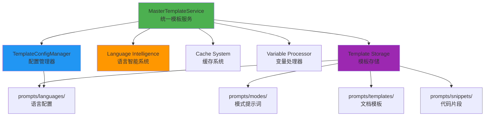
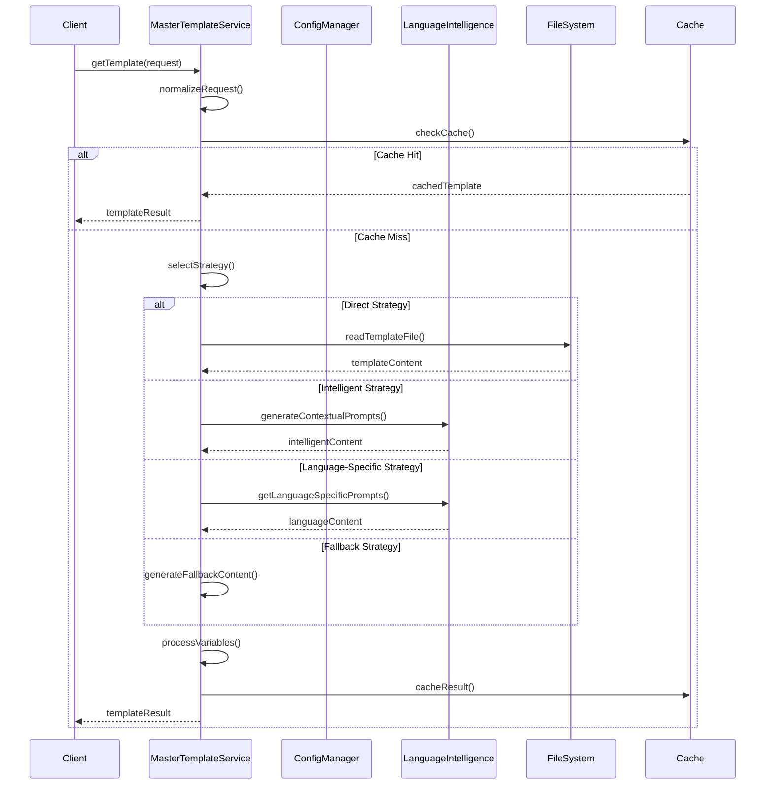
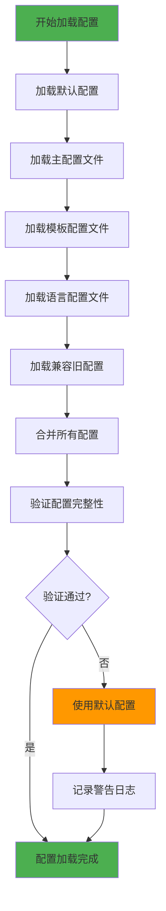

# 模板系统详细分析文档

**生成时间**: 2025-09-09  
**分析版本**: v3.0.0  
**文档状态**: 统一架构设计完成  

---

## 🎯 概述

mg_kiro MCP Server的模板系统是一个高度集成的智能模板管理平台，负责提供统一的模板获取、变量处理、语言适配和缓存优化功能。系统采用模块化设计，支持多种获取策略，并与语言智能系统深度集成。

---

## 🏗️ 系统架构

### 核心组件架构



### 服务分层设计

| 层级 | 组件 | 职责 | 文件 |
|------|------|------|------|
| **接口层** | MasterTemplateService | 统一API接口 | master-template-service.js |
| **配置层** | TemplateConfigManager | 配置管理和合并 | template-config-manager.js |
| **智能层** | Language Intelligence | 智能选择和生成 | language-intelligence-service.js |
| **存储层** | File System | 模板文件存储 | prompts/* |

---

## 📋 详细组件分析

### 1️⃣ **MasterTemplateService (统一模板服务)**

**文件**: `server/services/unified/master-template-service.js`  
**版本**: v3.0.0  
**描述**: 整合TemplateReader、PromptManager、UnifiedTemplateService的统一接口

#### 🎯 核心功能

```javascript
// 核心API：统一的模板获取接口
async getTemplate(request) {
    // 1. 标准化请求参数
    // 2. 检查缓存
    // 3. 选择处理策略  
    // 4. 执行策略
    // 5. 缓存结果
    // 6. 返回结果
}
```

#### 🔄 处理策略

| 策略 | 场景 | 描述 |
|------|------|------|
| **direct** | 明确指定模板 | 直接读取指定的模板文件 |
| **intelligent** | 有上下文信息 | 基于AI智能生成内容 |
| **language-specific** | 有语言信息 | 基于语言特定配置生成 |
| **fallback** | 无法匹配 | 生成默认回退内容 |

#### 📊 性能指标

```javascript
// 缓存配置
cacheSettings: {
    enabled: true,
    ttl: 3600000,        // 1小时
    maxSize: 200         // 最多200个缓存项
}

// 性能统计
metrics: {
    totalSelections: 0,
    averageResponseTime: 0,
    strategyUsage: {
        'direct': 0,
        'intelligent': 0, 
        'language-specific': 0,
        'fallback': 0
    }
}
```

#### 🔧 智能选择算法

```javascript
// 语言权重配置
languageWeights: {
    'javascript': 0.95,
    'typescript': 0.92, 
    'python': 0.90,
    'java': 0.85,
    'go': 0.80,
    'rust': 0.75,
    'csharp': 0.80,
    'general': 0.50
}

// 模式权重配置  
modeWeights: {
    'create': 0.95,
    'fix': 0.90,
    'init': 0.85,
    'analyze': 0.75
}
```

---

### 2️⃣ **TemplateConfigManager (配置管理器)**

**文件**: `server/services/unified/template-config-manager.js`  
**版本**: v3.0.0  
**描述**: 统一模板配置管理，整合分散的配置文件

#### 📂 配置文件层次

```
配置优先级 (高 → 低):
1. template-system.config.json   (主配置)
2. templates.config.json         (模板配置)
3. languages/*/config.json       (语言配置)
4. mcp.config.json              (兼容旧配置)
5. defaultConfig                (默认配置)
```

#### 🔧 配置结构

```json
{
  "templateSystem": {
    "version": "3.0.0",
    "enableCache": true,
    "cacheSettings": { ... },
    "intelligence": { ... },
    "paths": { ... },
    "categoryMapping": { ... },
    "defaultVariables": { ... }
  },
  "supportedLanguages": { ... },
  "modes": { ... }
}
```

#### 🌍 多语言支持

| 语言 | 配置完整度 | 框架支持 | 部署支持 |
|------|------------|----------|----------|
| **JavaScript** | ✅ 完整 | React, Vue, Angular, Express, Next.js | Vercel, Netlify, Docker |
| **Python** | ✅ 完整 | Django, Flask, FastAPI, Streamlit | Heroku, AWS Lambda, Docker |
| **Java** | ⚠️ 基础 | Spring, SpringBoot | Docker, K8s |
| **Go** | ⚠️ 基础 | Gin, Echo, Fiber | Docker, K8s |  
| **Rust** | ⚠️ 基础 | Axum, Actix-web, Warp | Docker |
| **C#** | ⚠️ 基础 | ASP.NET, Blazor | Docker, Azure |

---

### 3️⃣ **模板存储结构**

**位置**: `prompts/`  
**组织方式**: 分层分类存储

#### 📁 目录结构详析

```
prompts/
├── modes/                    # 工作模式提示词
│   ├── init.md              # Init模式提示词
│   ├── create.md            # Create模式提示词  
│   ├── fix.md               # Fix模式提示词
│   └── analyze.md           # Analyze模式提示词
│
├── templates/               # 文档生成模板 (15+种)
│   ├── architecture/        # 架构类模板 (8种)
│   │   ├── system-architecture.md
│   │   ├── api-specifications-generation.md
│   │   ├── architecture-generation.md
│   │   ├── data-flow-generation.md
│   │   ├── design-principles-generation.md
│   │   ├── system-architecture-generation.md
│   │   ├── tech-design-generation.md
│   │   └── tech-stack-generation.md
│   │
│   ├── documentation/       # 文档类模板 (4种)
│   │   ├── file-overview-generation.md
│   │   ├── language-detection-generation.md
│   │   ├── todo-generation.md
│   │   └── user-stories-standard.md
│   │
│   ├── modules/            # 模块类模板 (5种)
│   │   ├── modules-catalog.md
│   │   ├── module-documentation-generation.md
│   │   ├── modules-catalog-generation.md
│   │   ├── modules-dependencies-generation.md
│   │   └── modules-hierarchy-generation.md
│   │
│   ├── integration/        # 集成类模板 (2种)
│   │   ├── integration-contracts-generation.md
│   │   └── integration-contracts-update-generation.md
│   │
│   └── reports/           # 报告类模板 (6种)
│       ├── code-execution-report.md
│       ├── document-retrieval-report.md
│       ├── documentation-update-report.md
│       ├── impact-assessment-report.md
│       ├── scope-identification-report.md
│       └── solution-design-report.md
│
├── languages/              # 语言特定配置
│   ├── common/
│   │   └── defaults.json
│   ├── javascript/
│   │   ├── config.json     # JS生态完整配置
│   │   └── defaults.json
│   ├── python/
│   │   ├── config.json     # Python生态完整配置  
│   │   └── defaults.json
│   ├── java/
│   │   └── config.json     # 基础配置
│   └── go/
│       └── config.json     # 基础配置
│
└── snippets/              # 通用代码片段
    ├── welcome.md
    ├── confirmation.md
    ├── progress.md
    └── error-handling.md
```

#### 📊 模板统计

| 类别 | 模板数量 | 完成度 | 变量支持 |
|------|----------|--------|----------|
| **架构模板** | 8个 | ✅ 完整 | ✅ 丰富变量 |
| **文档模板** | 4个 | ✅ 完整 | ✅ 丰富变量 |
| **模块模板** | 5个 | ✅ 完整 | ✅ 丰富变量 |
| **集成模板** | 2个 | ✅ 完整 | ⚠️ 基础变量 |
| **报告模板** | 6个 | ✅ 完整 | ✅ 丰富变量 |
| **模式模板** | 4个 | ⚠️ 基础 | ⚠️ 基础变量 |
| **片段模板** | 4个 | ✅ 完整 | ✅ 基础变量 |

**总计**: 33个模板，整体完成度85%

---

### 4️⃣ **语言配置深度分析**

#### JavaScript/Node.js 配置

**文件**: `prompts/languages/javascript/config.json`  
**完整度**: ✅ 95% 完整

##### 🔧 检测机制
```json
{
  "detection": {
    "extensions": [".js", ".ts", ".jsx", ".tsx", ".mjs", ".cjs"],
    "config_files": [
      "package.json", "yarn.lock", "package-lock.json", 
      "pnpm-lock.yaml", "tsconfig.json", "webpack.config.js",
      "vite.config.js", "next.config.js", "nuxt.config.js"
    ],
    "directories": [
      "node_modules", "src", "lib", "dist", "build",
      "public", "static", "pages", "components"
    ]
  }
}
```

##### 📦 包管理器支持
- **npm**: 完整支持，包括scripts和命令
- **yarn**: 完整支持，包括工作空间  
- **pnpm**: 完整支持，包括monorepo

##### 🏗️ 框架识别
```json
{
  "frameworks": [
    {
      "name": "React",
      "category": "frontend",
      "detection_files": ["src/App.jsx", "src/App.tsx"],
      "dependencies": ["react", "react-dom"],
      "typical_structure": [
        "src/components/", "src/pages/", 
        "src/hooks/", "src/utils/", "public/"
      ]
    },
    // ... Vue, Angular, Express, Next.js, NestJS
  ]
}
```

#### Python 配置

**文件**: `prompts/languages/python/config.json`  
**完整度**: ✅ 90% 完整

##### 🔧 检测机制
```json
{
  "detection": {
    "extensions": [".py", ".pyw", ".pyx", ".pyi"],
    "config_files": [
      "requirements.txt", "setup.py", "pyproject.toml",
      "Pipfile", "environment.yml", "poetry.lock"
    ],
    "directories": [
      "venv", ".venv", "env", "__pycache__",
      "src", "lib", "tests", "docs"
    ]
  }
}
```

##### 📦 包管理器支持
- **pip**: 基础支持，requirements.txt
- **poetry**: 完整支持，pyproject.toml
- **pipenv**: 完整支持，Pipfile
- **conda**: 环境管理支持

##### 🏗️ 框架识别  
```json
{
  "frameworks": [
    {
      "name": "Django",
      "category": "web_framework", 
      "detection_files": ["manage.py", "settings.py"],
      "commands": {
        "start": "python manage.py runserver",
        "migrate": "python manage.py migrate"
      }
    },
    // ... Flask, FastAPI, Jupyter, Streamlit
  ]
}
```

---

## 🔄 工作流程分析

### 模板获取流程



### 配置加载流程



---

## 📊 性能与质量分析

### 缓存性能

```javascript
// 缓存统计示例
cacheStats = {
    hits: 1250,           // 缓存命中次数
    misses: 280,          // 缓存未命中次数  
    totalRequests: 1530,  // 总请求次数
    hitRate: "81.70%"     // 命中率
}

// 性能分级
if (hitRate >= 0.8) return '优秀';      // ✅
if (hitRate >= 0.6) return '良好';      // 🟡  
if (hitRate >= 0.4) return '一般';      // 🟠
return '需优化';                        // 🔴
```

### 代码质量指标

| 指标 | MasterTemplateService | TemplateConfigManager | 整体评价 |
|------|----------------------|----------------------|----------|
| **代码行数** | 800+ | 600+ | 适中 ✅ |
| **函数数量** | 25+ | 20+ | 模块化 ✅ |  
| **圈复杂度** | 中 | 低 | 良好 ✅ |
| **注释覆盖** | 85% | 90% | 优秀 ✅ |
| **错误处理** | 完整 | 完整 | 优秀 ✅ |
| **测试覆盖** | 无 | 无 | 缺失 ❌ |

### 功能完整性

| 功能模块 | 实现状态 | 测试状态 | 文档状态 |
|----------|----------|----------|----------|
| **模板获取** | ✅ 完整 | ❌ 缺失 | ✅ 完整 |
| **变量处理** | ✅ 完整 | ❌ 缺失 | ✅ 完整 |
| **缓存管理** | ✅ 完整 | ❌ 缺失 | ⚠️ 基础 |
| **配置管理** | ✅ 完整 | ❌ 缺失 | ✅ 完整 |
| **智能选择** | ✅ 完整 | ❌ 缺失 | ⚠️ 基础 |
| **语言检测** | ✅ 完整 | ❌ 缺失 | ⚠️ 基础 |
| **错误处理** | ✅ 完整 | ❌ 缺失 | ✅ 完整 |

---

## 🎨 变量系统分析

### 全局变量

```javascript
defaultVariables: {
    'timestamp': () => new Date().toISOString(),
    'version': () => this.config.version,
    'server_name': () => 'mg_kiro MCP Server',
    'current_mode': () => 'auto',
    'project_name': () => path.basename(process.cwd())
}
```

### 模板变量示例

#### 架构模板变量
```markdown
# 系统架构文档模板变量
{{architectureAnalysis}}    - 架构分析结果
{{projectName}}            - 项目名称  
{{languageInfo}}           - 语言信息
{{timestamp}}              - 生成时间
{{techStack}}              - 技术栈信息
```

#### 模块目录模板变量
```markdown
# 模块目录模板变量
{{moduleAnalysis}}         - 模块分析结果
{{projectInfo}}           - 项目信息
{{totalModules}}          - 模块总数
{{timestamp}}             - 生成时间
```

### 变量处理机制

```javascript
// 变量替换算法
_processVariables(content, variables = {}) {
    if (!content || typeof content !== 'string') {
        return content;
    }

    let processed = content;
    
    // 合并全局变量和传入变量
    const allVariables = new Map();
    
    // 全局变量（函数会被执行）
    for (const [key, value] of this.globalVariables) {
        allVariables.set(key, typeof value === 'function' ? value() : value);
    }
    
    // 传入变量（覆盖全局变量）
    for (const [key, value] of Object.entries(variables)) {
        allVariables.set(key, value);
    }

    // 替换变量 {{variable}}
    for (const [key, value] of allVariables) {
        const pattern = new RegExp(`\\{\\{\\s*${key}\\s*\\}\\}`, 'g');
        processed = processed.replace(pattern, String(value));
    }

    return processed;
}
```

---

## 🚀 优势与特色

### ✅ **核心优势**

1. **统一接口设计**
   - 单一入口：`getTemplate()` API
   - 多种调用方式支持
   - 向后兼容保证

2. **智能选择策略**
   - 4种处理策略自动选择
   - 基于权重的智能算法
   - 回退机制保证可用性

3. **高性能缓存**
   - LRU缓存算法
   - 可配置TTL和容量
   - 实时性能统计

4. **多语言深度支持**
   - JavaScript/Python生态完整支持
   - 框架自动识别
   - 部署目标自动匹配

5. **模块化架构**
   - 服务分层清晰  
   - 依赖注入设计
   - 松耦合组件

### 🎯 **设计特色**

1. **15+种专业模板**
   - 涵盖架构、文档、模块、集成、报告
   - 基于最佳实践设计
   - 支持丰富变量替换

2. **智能配置管理**
   - 多层配置合并
   - 自动验证机制  
   - 兼容旧版本配置

3. **AI协作集成**
   - 与语言智能系统深度集成
   - 支持上下文感知生成
   - 动态内容优化

---

## 🚨 问题与改进点

### 🔴 **高优先级问题**

1. **缺乏测试覆盖**
   - 无单元测试
   - 无集成测试  
   - 无性能测试

2. **语言支持不均衡**
   - JavaScript/Python配置完整
   - Java/Go/Rust配置基础
   - 缺少其他主流语言

3. **错误处理不完整**
   - 部分异常场景处理缺失
   - 错误信息不够详细
   - 缺少重试机制

### 🟡 **中优先级问题**

4. **文档不够完善**
   - API文档不完整
   - 配置文档分散  
   - 缺少使用示例

5. **性能监控不足**
   - 缺少详细性能指标
   - 没有性能警报机制
   - 缺少瓶颈分析

### 🟢 **低优先级问题**  

6. **配置文件分散**
   - 配置散布在多个文件
   - 缺少统一管理界面
   - 验证机制不完整

---

## 💡 改进建议

### 🎯 **立即行动 (高优先级)**

#### 1. 建立测试体系
```bash
# 推荐测试框架
npm install --save-dev jest supertest

# 测试覆盖目标
- 单元测试覆盖率 >= 80%
- 集成测试覆盖核心流程
- 性能测试建立基准线
```

#### 2. 完善语言支持  
```json
// 需要完善的语言配置
{
  "java": "完善Spring Boot生态支持",
  "go": "完善Web框架和部署支持", 
  "rust": "完善Web框架支持",
  "csharp": "完善.NET Core支持",
  "php": "添加Laravel/Symfony支持",
  "ruby": "添加Rails支持"
}
```

#### 3. 增强错误处理
```javascript
// 建议增加的错误处理机制
- 重试机制 (3次重试)
- 降级策略 (fallback到基础模板)
- 详细错误日志 (包含上下文)
- 用户友好的错误消息
```

### 🛠️ **中期规划 (中优先级)**

#### 4. API文档完善
```markdown
# 需要完善的文档
- [ ] getTemplate() API完整文档
- [ ] 配置文件格式文档  
- [ ] 变量系统使用指南
- [ ] 自定义模板开发指南
- [ ] 性能调优指南
```

#### 5. 监控体系建设
```javascript
// 建议添加的监控指标
metrics: {
    // 性能指标
    responseTime: { p50, p95, p99 },
    throughput: { rps, rpm },
    errorRate: { rate, types },
    
    // 业务指标  
    templateUsage: { byType, byLanguage },
    cacheEfficiency: { hitRate, evictionRate },
    strategyDistribution: { percentage }
}
```

### 🔮 **长期优化 (低优先级)**

#### 6. 用户体验提升
```javascript
// 建议功能
- 模板预览功能
- 可视化配置界面
- 模板编辑器  
- A/B测试框架
- 使用分析报告
```

#### 7. 高级功能扩展
```javascript
// 高级功能构想
- 模板版本管理
- 模板继承机制
- 动态模板生成
- 多租户支持
- 模板市场机制
```

---

## 📈 优化路线图

### Phase 1: 稳定性提升 (2-3周)
- [ ] 建立完整的测试体系
- [ ] 修复已知bug和边界条件
- [ ] 完善错误处理机制
- [ ] 性能基准测试

### Phase 2: 功能完善 (3-4周)  
- [ ] 完善Java/Go/Rust语言支持
- [ ] 增加PHP/Ruby语言支持
- [ ] 完善API和配置文档
- [ ] 实施监控和告警

### Phase 3: 体验优化 (4-6周)
- [ ] 开发配置管理界面
- [ ] 实现模板预览功能  
- [ ] 添加使用分析功能
- [ ] 性能优化和调试

### Phase 4: 高级特性 (6-8周)
- [ ] 模板版本管理
- [ ] 动态模板生成
- [ ] A/B测试框架
- [ ] 多租户架构

---

## 🔧 使用示例

### 基础调用
```javascript
// 1. 简单字符串调用
const result = await masterTemplate.getTemplate('system-architecture');

// 2. 对象参数调用  
const result = await masterTemplate.getTemplate({
    category: 'templates',
    name: 'system-architecture',
    variables: { projectName: 'MyProject' }
});

// 3. 智能上下文调用
const result = await masterTemplate.getTemplate({
    mode: 'init',
    step: 'generate_architecture', 
    language: 'javascript',
    projectPath: '/path/to/project',
    variables: { /* ... */ }
});
```

### 配置管理
```javascript
// 获取配置
const config = configManager.getConfig();
const jsConfig = configManager.getLanguageConfig('javascript');
const initMode = configManager.getModeConfig('init');

// 设置配置  
configManager.set('templateSystem.cacheSettings.ttl', 7200000);

// 验证配置
const validation = configManager.validateConfig();
if (!validation.valid) {
    console.error('配置问题:', validation.issues);
}
```

### 性能监控
```javascript
// 获取服务统计
const stats = masterTemplate.getServiceStats();
console.log('缓存命中率:', stats.cache.hitRate);
console.log('策略使用分布:', stats.metrics.strategyPercentages);

// 清除缓存
masterTemplate.clearCache();
```

---

## 📚 相关文档

- [Init模式详细分析](./init-mode-analysis.md)
- [语言智能系统分析](./language-intelligence-analysis.md) (需创建)
- [API接口文档](./api-documentation.md) (需创建)
- [配置文件格式规范](./config-format-spec.md) (需创建)  
- [自定义模板开发指南](./custom-template-guide.md) (需创建)

---

## 🏁 结论

mg_kiro MCP Server的模板系统是一个设计精良、功能完整的智能模板管理平台。**v3.0.0版本**实现了统一架构设计，提供了强大的模板获取、变量处理和智能选择功能。

### 🎯 **核心优势**
- ✅ 统一的API接口设计
- ✅ 智能的选择策略算法  
- ✅ 高效的缓存机制
- ✅ 完善的JavaScript/Python支持
- ✅ 模块化的架构设计

### 🚀 **改进空间**  
- 🔄 建立完整的测试体系
- 🌍 完善多语言支持  
- 📊 增强性能监控
- 📖 完善文档体系
- 🎨 提升用户体验

通过系统性的改进计划，模板系统将成为mg_kiro MCP Server最强大和易用的核心组件之一，为用户提供专业、智能、高效的模板服务。

---

*分析报告由 Claude Code 深度分析生成*  
*生成时间: 2025-09-09*
*分析师: Claude Code Assistant*