# 🏗️ mg_kiro MCP服务器 - 超详细总体架构（精确到文件级别）

## 📊 完整文件依赖关系图

```mermaid
graph TB
    %% =================================
    %% 入口层 - 主入口点
    %% =================================
    subgraph "📁 ROOT"
        INDEX[index.js<br/>🎯 主入口点<br/>MCP + Express + WebSocket]
        PACKAGE[package.json<br/>📦 项目配置]
        JEST[jest.config.js<br/>🧪 测试配置]
    end
    
    %% =================================
    %% 外部依赖层
    %% =================================
    subgraph "🌐 External Dependencies"
        MCP_SDK["@modelcontextprotocol/sdk<br/>Server, StdioServerTransport"]
        EXPRESS["express<br/>Web框架"]
        WS["ws<br/>WebSocket"]
        CORS["cors<br/>跨域处理"]
        FS["fs<br/>文件系统"]
        PATH["path<br/>路径处理"]
        CRYPTO["crypto<br/>加密工具"]
    end
    
    %% =================================
    %% 路由层 - 请求分发
    %% =================================
    subgraph "🗂️ server/routes/"
        ROUTES_INDEX[routes/index.js<br/>🎭 主路由入口<br/>路由聚合和错误处理]
        
        %% 系统路由子模块
        subgraph "🔧 routes/system/"
            HEALTH[system/health.js<br/>💓 健康检查路由<br/>服务状态监控]
            MCP_ROUTE[system/mcp.js<br/>🔌 MCP协议路由<br/>协议管理端点]
            PROMPTS[system/prompts.js<br/>📝 提示词管理路由<br/>模板CRUD操作]
            SYSTEM_INDEX[system/index.js<br/>🔗 系统路由聚合器]
        end
        
        %% Init路由子模块  
        subgraph "🚀 routes/init/"
            CLAUDE_INIT[init/claude-code-init.js<br/>🎯 Claude Code专用Init<br/>6步工作流路由]
            TURBO_INIT[init/turbo-init.js<br/>⚡ 高性能Turbo Init<br/>批量处理路由] 
            AI_BATCH_INIT[init/ai-batch-init.js<br/>🤖 AI批处理Init<br/>智能分析路由]
        end
        
        %% Create路由子模块
        subgraph "⚒️ routes/create/"
            CREATE_INDEX[create/index.js<br/>🏗️ Create模式主路由<br/>功能创建入口]
            EXISTING_PROJ[create/existing-project-workflow.js<br/>📁 现有项目工作流<br/>项目增强路由]
            NEW_PROJ[create/new-project-workflow.js<br/>🆕 新项目工作流<br/>项目创建路由]
        end
    end
    
    %% =================================
    %% 服务管理层 - 核心基础设施
    %% =================================
    subgraph "⚙️ server/services/ - 服务管理"
        SERVICE_BUS[service-bus.js<br/>🚌 服务总线<br/>依赖注入容器<br/>循环依赖解决<br/>生命周期管理]
        SERVICE_REGISTRY[service-registry.js<br/>📋 服务注册表<br/>服务定义注册<br/>依赖关系配置<br/>批量初始化]
        RESPONSE_SERVICE[response-service.js<br/>📤 响应服务<br/>统一响应格式<br/>错误处理]
        CONFIG_SERVICE[config-service.js<br/>⚙️ 配置服务<br/>配置文件管理<br/>环境变量处理]
    end
    
    %% =================================
    %% 核心业务服务层
    %% =================================
    subgraph "🧠 server/services/ - 核心服务"
        %% 监控服务 (AI任务管理已迁移到UnifiedTaskManager)
        MONITOR[complete-task-monitor.js<br/>👁️ 任务完成监控器<br/>状态跟踪<br/>完成验证]
        
        %% 内容处理服务
        OVERVIEW_GEN[project-overview-generator.js<br/>📊 项目概览生成器<br/>结构扫描<br/>元数据提取]
        FILE_QUERY[file-query-service.js<br/>🔍 文件查询服务<br/>内容检索<br/>智能搜索]
        CONTENT_TRIM[smart-content-trimmer.js<br/>✂️ 智能内容修剪器<br/>Token优化<br/>内容压缩]
        LANG_INTEL[language-intelligence-service.js<br/>🧠 语言智能服务<br/>上下文分析<br/>智能提示生成]
    end
    
    %% =================================
    %% 统一模板系统
    %% =================================
    subgraph "📋 server/services/unified/ - 模板系统"
        MASTER_TEMPLATE[master-template-service.js<br/>🎭 统一模板服务<br/>模板选择策略<br/>变量处理<br/>缓存管理<br/>多文档支持]
        TEMPLATE_CONFIG[template-config-manager.js<br/>⚙️ 模板配置管理器<br/>配置加载<br/>模板映射<br/>缓存控制]
        MODE_TEMPLATE[mode-template-service.js<br/>🎨 模式模板服务<br/>工作模式适配<br/>智能选择<br/>语言特化]
    end
    
    %% =================================  
    %% 语言处理模块
    %% =================================
    subgraph "🌍 server/language/ - 语言处理"
        DETECTOR[detector.js<br/>🔍 语言检测器<br/>智能检测算法<br/>项目类型识别<br/>框架特征分析]
        PROMPT_INTEL[prompt-intelligence.js<br/>🧠 提示词智能<br/>上下文生成<br/>语言优化<br/>智能建议]
    end
    
    %% =================================
    %% 文件分析模块 - AI大脑
    %% =================================
    subgraph "🔬 server/services/file-analysis/ - 文件分析模块"
        FILE_ANALYSIS[FileAnalysisModule.js<br/>🧠 文件分析模块<br/>系统协调大脑<br/>批次规划<br/>策略分配]
        
        %% Token分析子模块
        subgraph "🔢 file-analysis/token-analysis/"
            TOKEN_CALC[PreciseTokenCalculator.js<br/>⚖️ 精确Token计算器<br/>多语言支持<br/>精确估算<br/>批次优化]
            BOUNDARY_DET[FunctionBoundaryDetector.js<br/>🎯 函数边界检测器<br/>代码结构分析<br/>智能分割点<br/>上下文保护]
        end
        
        %% 批次策略子模块
        subgraph "📦 file-analysis/batch-strategies/"
            COMBINED_BATCH[CombinedFileBatchStrategy.js<br/>🔗 综合文件批次策略<br/>小文件组合<br/>Token优化<br/>效率最大化]
            SINGLE_BATCH[SingleFileBatchStrategy.js<br/>📄 单文件批次策略<br/>中等文件处理<br/>质量保证<br/>独立分析]
            LARGE_MULTI[LargeFileMultiBatchStrategy.js<br/>🗂️ 大文件多批次策略<br/>智能分割<br/>边界保护<br/>上下文维护]
        end
    end
    
    %% =================================
    %% 任务管理模块 - 工作流引擎  
    %% =================================
    subgraph "📋 server/services/task-management/ - 任务管理"
        TASK_MANAGER[UnifiedTaskManager.js<br/>🎭 统一任务管理器<br/>任务生命周期<br/>状态协调<br/>流程编排]
        TASK_STATE[TaskStateManager.js<br/>📊 任务状态管理器<br/>状态持久化<br/>进度追踪<br/>历史记录]
        TASK_VALIDATOR[UnifiedTaskValidator.js<br/>✅ 统一任务验证器<br/>完成验证<br/>质量检查<br/>依赖验证]
        
        %% 验证策略子模块
        subgraph "🔍 task-management/validation-strategies/"
            STEP3_VAL[Step3FolderValidator.js<br/>📁 Step3文件夹验证器<br/>文件存在性检查<br/>结构验证]
            STEP4_VAL[Step4ModuleValidator.js<br/>📦 Step4模块验证器<br/>模块完整性<br/>整合验证]
            STEP5_VAL[Step5FixedFileValidator.js<br/>📄 Step5固定文件验证器<br/>关系文件检查<br/>依赖验证]
            STEP6_VAL[Step6ArchitectureValidator.js<br/>🏗️ Step6架构验证器<br/>架构文档检查<br/>完成验证]
        end
    end
    
    %% =================================
    %% 配置管理层
    %% =================================
    subgraph "⚙️ config/ - 配置文件"
        MCP_CONFIG[mcp.config.json<br/>🔌 MCP服务器配置<br/>协议参数<br/>连接设置]
        MODES_CONFIG[modes.config.json<br/>🎭 工作模式配置<br/>Init/Create模式<br/>参数设定]
        TEMPLATE_SYS_CONFIG[template-system.config.json<br/>📋 模板系统配置<br/>模板路径<br/>缓存设置]
        TEMPLATES_CONFIG[templates.config.json<br/>📝 模板映射配置<br/>模板关系<br/>别名定义]
        WORKFLOWS_CONFIG[workflows.config.json<br/>🔄 工作流配置<br/>步骤定义<br/>流程参数]
    end
    
    %% =================================
    %% 工具和脚本
    %% =================================
    subgraph "🛠️ scripts/ - 工具脚本"
        TEST_REGISTRY[test-service-registry.js<br/>🧪 服务注册表测试<br/>依赖验证<br/>初始化测试]
    end
    
    %% =================================
    %% 主要依赖关系 - 入口层
    %% =================================
    INDEX --> EXPRESS
    INDEX --> MCP_SDK 
    INDEX --> WS
    INDEX --> CORS
    INDEX --> FS
    INDEX --> PATH
    INDEX --> ROUTES_INDEX
    INDEX --> SERVICE_REGISTRY
    
    %% =================================
    %% 服务管理依赖
    %% =================================
    SERVICE_REGISTRY --> SERVICE_BUS
    SERVICE_REGISTRY --> CONFIG_SERVICE
    %% ❌ 已移除: AI_TODO (aiTodoManager)
    SERVICE_REGISTRY --> MONITOR
    SERVICE_REGISTRY --> DETECTOR
    SERVICE_REGISTRY --> LANG_INTEL
    SERVICE_REGISTRY --> OVERVIEW_GEN
    SERVICE_REGISTRY --> FILE_QUERY
    SERVICE_REGISTRY --> CONTENT_TRIM
    SERVICE_REGISTRY --> MASTER_TEMPLATE
    SERVICE_REGISTRY --> TEMPLATE_CONFIG
    SERVICE_REGISTRY --> MODE_TEMPLATE
    SERVICE_REGISTRY --> FILE_ANALYSIS
    SERVICE_REGISTRY --> TOKEN_CALC
    SERVICE_REGISTRY --> COMBINED_BATCH
    SERVICE_REGISTRY --> SINGLE_BATCH
    SERVICE_REGISTRY --> LARGE_MULTI
    SERVICE_REGISTRY --> TASK_MANAGER
    SERVICE_REGISTRY --> TASK_VALIDATOR
    SERVICE_REGISTRY --> TASK_STATE
    
    %% =================================
    %% 路由系统依赖
    %% =================================
    ROUTES_INDEX --> HEALTH
    ROUTES_INDEX --> MCP_ROUTE
    ROUTES_INDEX --> PROMPTS
    ROUTES_INDEX --> CLAUDE_INIT
    ROUTES_INDEX --> TURBO_INIT
    ROUTES_INDEX --> AI_BATCH_INIT
    ROUTES_INDEX --> CREATE_INDEX
    
    SYSTEM_INDEX --> HEALTH
    SYSTEM_INDEX --> MCP_ROUTE
    SYSTEM_INDEX --> PROMPTS
    
    CREATE_INDEX --> EXISTING_PROJ
    CREATE_INDEX --> NEW_PROJ
    
    %% 路由到服务的依赖
    HEALTH --> RESPONSE_SERVICE
    MCP_ROUTE --> RESPONSE_SERVICE
    PROMPTS --> RESPONSE_SERVICE
    PROMPTS --> MASTER_TEMPLATE
    PROMPTS --> TEMPLATE_CONFIG
    PROMPTS --> MODE_TEMPLATE
    CLAUDE_INIT --> RESPONSE_SERVICE
    CLAUDE_INIT --> OVERVIEW_GEN
    %% ❌ 已移除: CLAUDE_INIT --> AI_TODO
    CLAUDE_INIT --> FILE_QUERY
    TURBO_INIT --> RESPONSE_SERVICE
    AI_BATCH_INIT --> RESPONSE_SERVICE
    CREATE_INDEX --> RESPONSE_SERVICE
    EXISTING_PROJ --> RESPONSE_SERVICE
    NEW_PROJ --> RESPONSE_SERVICE
    
    %% =================================
    %% 核心服务间依赖 - 循环依赖
    %% =================================
    LANG_INTEL -.->|循环依赖| MASTER_TEMPLATE
    MASTER_TEMPLATE -.->|循环依赖| LANG_INTEL
    LANG_INTEL --> DETECTOR
    LANG_INTEL --> PROMPT_INTEL
    LANG_INTEL --> TEMPLATE_CONFIG
    
    MASTER_TEMPLATE --> CRYPTO
    MASTER_TEMPLATE --> FS
    MASTER_TEMPLATE --> PATH
    
    OVERVIEW_GEN --> DETECTOR
    OVERVIEW_GEN --> MASTER_TEMPLATE
    OVERVIEW_GEN --> TEMPLATE_CONFIG
    
    FILE_QUERY --> CONTENT_TRIM
    
    %% =================================
    %% 语言处理依赖
    %% =================================
    PROMPT_INTEL --> DETECTOR
    
    %% =================================
    %% 文件分析模块依赖
    %% =================================
    FILE_ANALYSIS --> TOKEN_CALC
    FILE_ANALYSIS --> COMBINED_BATCH
    FILE_ANALYSIS --> SINGLE_BATCH
    FILE_ANALYSIS --> LARGE_MULTI
    
    LARGE_MULTI --> BOUNDARY_DET
    
    %% =================================
    %% 任务管理依赖
    %% =================================
    TASK_MANAGER --> TASK_STATE
    TASK_MANAGER --> TASK_VALIDATOR
    
    TASK_VALIDATOR --> FILE_ANALYSIS
    TASK_VALIDATOR --> TASK_STATE
    TASK_VALIDATOR --> STEP3_VAL
    TASK_VALIDATOR --> STEP4_VAL
    TASK_VALIDATOR --> STEP5_VAL
    TASK_VALIDATOR --> STEP6_VAL
    
    %% =================================
    %% 工具脚本依赖
    %% =================================
    TEST_REGISTRY --> SERVICE_REGISTRY
    
    %% =================================
    %% 配置文件依赖
    %% =================================
    CONFIG_SERVICE --> MCP_CONFIG
    CONFIG_SERVICE --> MODES_CONFIG
    CONFIG_SERVICE --> TEMPLATE_SYS_CONFIG
    CONFIG_SERVICE --> TEMPLATES_CONFIG
    CONFIG_SERVICE --> WORKFLOWS_CONFIG
    
    %% =================================
    %% 样式定义
    %% =================================
    classDef entryPoint fill:#ff6b6b,stroke:#c92a2a,stroke-width:3px,color:#fff
    classDef serviceCore fill:#4ecdc4,stroke:#339c92,stroke-width:2px,color:#fff
    classDef routeLayer fill:#45b7d1,stroke:#2980b9,stroke-width:2px,color:#fff
    classDef configLayer fill:#f39c12,stroke:#d68910,stroke-width:2px,color:#fff
    classDef analysisLayer fill:#9b59b6,stroke:#7d3c98,stroke-width:2px,color:#fff
    classDef templateLayer fill:#2ecc71,stroke:#27ae60,stroke-width:2px,color:#fff
    classDef taskLayer fill:#e74c3c,stroke:#c0392b,stroke-width:2px,color:#fff
    classDef external fill:#95a5a6,stroke:#7f8c8d,stroke-width:1px,color:#fff
    
    %% 应用样式
    class INDEX entryPoint
    class SERVICE_BUS,SERVICE_REGISTRY,RESPONSE_SERVICE,CONFIG_SERVICE serviceCore
    class ROUTES_INDEX,HEALTH,MCP_ROUTE,PROMPTS,SYSTEM_INDEX routeLayer
    class CLAUDE_INIT,TURBO_INIT,AI_BATCH_INIT routeLayer
    class CREATE_INDEX,EXISTING_PROJ,NEW_PROJ routeLayer
    class MCP_CONFIG,MODES_CONFIG,TEMPLATE_SYS_CONFIG,TEMPLATES_CONFIG,WORKFLOWS_CONFIG configLayer
    class FILE_ANALYSIS,TOKEN_CALC,BOUNDARY_DET,COMBINED_BATCH,SINGLE_BATCH,LARGE_MULTI analysisLayer
    class MASTER_TEMPLATE,TEMPLATE_CONFIG,MODE_TEMPLATE templateLayer
    class TASK_MANAGER,TASK_STATE,TASK_VALIDATOR,STEP3_VAL,STEP4_VAL,STEP5_VAL,STEP6_VAL taskLayer
    class MCP_SDK,EXPRESS,WS,CORS,FS,PATH,CRYPTO external
```



## 📋 文件职责详细分析

### 🎯 **入口层文件 (1个)**

| 文件 | 行数 | 职责 | 关键导入 | 导出内容 |
|------|------|------|----------|----------|
| `index.js` | 1200+ | 统一入口点，MCP+Express+WebSocket三合一服务器 | MCP SDK, express, ws, cors | startServer() |

### 🗂️ **路由层文件 (10个)**

| 文件 | 职责 | 关键依赖 | API端点数 |
|------|------|----------|-----------|
| `routes/index.js` | 主路由聚合器，错误处理，服务注入 | 各子路由模块 | 2个系统端点 |
| `routes/system/health.js` | 健康检查，服务状态监控 | response-service | 1个 |
| `routes/system/mcp.js` | MCP协议管理端点 | response-service | 3个 |
| `routes/system/prompts.js` | 提示词管理CRUD | 3个模板服务 | 8个 |
| `routes/system/index.js` | 系统路由聚合器 | 系统子路由 | 0个 |
| `routes/init/claude-code-init.js` | Claude Code 6步Init工作流 | 3个核心服务 | 10个 |
| `routes/init/turbo-init.js` | 高性能批量处理路由 | response-service | 5个 |
| `routes/init/ai-batch-init.js` | AI智能批处理路由 | response-service | 6个 |
| `routes/create/index.js` | Create模式主路由 | 2个工作流路由 | 4个 |
| `routes/create/existing-project-workflow.js` | 现有项目增强工作流 | response-service | 6个 |
| `routes/create/new-project-workflow.js` | 新项目创建工作流 | response-service | 7个 |

### ⚙️ **服务管理层文件 (4个)**

| 文件 | 核心职责 | 管理的服务数 | 关键特性 |
|------|----------|--------------|----------|
| `services/service-bus.js` | 依赖注入容器，循环依赖解决 | **18个** | 懒加载，生命周期管理 |
| `services/service-registry.js` | 服务定义注册，依赖配置 | **18个** | 批量初始化，交叉依赖处理 |
| `services/response-service.js` | 统一响应格式，错误处理 | N/A | success(), error() 方法 |
| `services/config-service.js` | 配置文件管理，环境变量处理 | 5个配置文件 | 热更新支持 |

### 🧠 **核心业务服务层文件 (6个)**

| 文件 | 核心算法 | Token处理能力 | 特殊功能 |
|------|----------|---------------|----------|
| ❌ `services/ai-todo-manager.js` | **已移除** - 迁移到UnifiedTaskManager | **已移除** | **已移除** |
| `services/complete-task-monitor.js` | 状态跟踪算法 | 支持 | 实时监控 |
| `services/project-overview-generator.js` | 项目扫描算法 | 高级 | 元数据提取 |
| `services/file-query-service.js` | 智能检索算法 | 高级 | 语义搜索 |
| `services/smart-content-trimmer.js` | Token优化算法 | 专业级 | 内容智能压缩 |
| `services/language-intelligence-service.js` | 语言智能算法 | 专业级 | 上下文分析 |

### 📋 **模板系统文件 (3个)**

| 文件 | 模板策略数 | 缓存机制 | 语言支持 |
|------|-----------|----------|----------|
| `services/unified/master-template-service.js` | 4种 | MD5+TTL | 6种主流语言 |
| `services/unified/template-config-manager.js` | N/A | 配置缓存 | 通用配置 |
| `services/unified/mode-template-service.js` | 3种 | 模式缓存 | 工作模式特化 |

### 🌍 **语言处理文件 (2个)**

| 文件 | 检测算法 | 支持语言数 | 特殊能力 |
|------|----------|-----------|----------|
| `language/detector.js` | 多特征融合算法 | 6种主流语言 | 框架特征识别 |
| `language/prompt-intelligence.js` | 上下文生成算法 | 6种 | 智能建议生成 |

### 🔬 **文件分析模块文件 (5个)**

| 文件 | 分析能力 | Token阈值 | 批次策略 |
|------|----------|-----------|----------|
| `file-analysis/FileAnalysisModule.js` | 系统大脑 | 15K/20K | 3种策略协调 |
| `file-analysis/token-analysis/PreciseTokenCalculator.js` | 精确Token计算 | 任意 | 多语言估算 |
| `file-analysis/token-analysis/FunctionBoundaryDetector.js` | 函数边界检测 | 任意 | 智能分割 |
| `file-analysis/batch-strategies/CombinedFileBatchStrategy.js` | 小文件组合 | <15K | 效率优化 |
| `file-analysis/batch-strategies/SingleFileBatchStrategy.js` | 单文件处理 | 15K-20K | 质量保证 |
| `file-analysis/batch-strategies/LargeFileMultiBatchStrategy.js` | 大文件分割 | >20K | 上下文保护 |

### 📋 **任务管理模块文件 (7个)**

| 文件 | 管理范围 | 验证策略 | 状态数量 |
|------|----------|----------|----------|
| `task-management/UnifiedTaskManager.js` | 全生命周期 | 4种 | 5种状态 |
| `task-management/TaskStateManager.js` | 状态持久化 | N/A | 状态历史 |
| `task-management/UnifiedTaskValidator.js` | 统一验证 | 4种策略 | 完成检查 |
| `task-management/validation-strategies/Step3FolderValidator.js` | 文件夹验证 | 文件存在性 | Step3专用 |
| `task-management/validation-strategies/Step4ModuleValidator.js` | 模块验证 | 完整性检查 | Step4专用 |
| `task-management/validation-strategies/Step5FixedFileValidator.js` | 固定文件验证 | 依赖检查 | Step5专用 |
| `task-management/validation-strategies/Step6ArchitectureValidator.js` | 架构验证 | 文档检查 | Step6专用 |

### ⚙️ **配置文件 (5个)**

| 配置文件 | 配置项数 | 主要作用 | 热更新支持 |
|----------|----------|----------|------------|
| `config/mcp.config.json` | 10+ | MCP协议参数 | ✅ |
| `config/modes.config.json` | 15+ | 工作模式参数 | ✅ |
| `config/template-system.config.json` | 8+ | 模板系统设置 | ✅ |
| `config/templates.config.json` | 50+ | 模板映射关系 | ✅ |
| `config/workflows.config.json` | 20+ | 工作流步骤定义 | ✅ |

## 🔄 关键调用路径详细分析

### 1. **MCP工具调用完整路径**

```
🎯 workflow_guide
Client Request → index.js:437 (CallToolRequestSchema) 
→ 参数解析 → 工作流指引生成 → JSON响应

🚀 init_step1_project_analysis  
Client Request → index.js:437 → serviceBus.get('projectOverviewGenerator')
→ ProjectOverviewGenerator.generateOverview() → LanguageDetector.detect()
→ 文件扫描 → 元数据提取 → mg_kiro/step1-result.json

🧠 init_step2_create_todos (完全重构)
Client Request → index.js:437 → serviceBus.get('fileAnalysisModule')
→ FileAnalysisModule.analyzeProject() → PreciseTokenCalculator.calculateTokens()
→ 批次策略选择 → UnifiedTaskManager.createBatchTasks() → 任务生命周期管理

📄 init_step3_get_next_task (完全重写)
Client Request → index.js:437 → serviceBus.get('unifiedTaskManager')
→ UnifiedTaskManager.getNextTask() → TaskStateManager.getState()
→ 任务队列获取 → 自动上下文设置 → 标准化任务格式返回
```

### 2. **Express路由调用完整路径**

```
💓 健康检查路径
GET /health → routes/index.js:createAppRoutes() → system/health.js:createHealthRoutes()
→ ServiceBus状态检查 → response-service.success() → JSON响应

📝 模板管理路径  
GET /prompts/* → routes/index.js → system/prompts.js → MasterTemplateService.getTemplate()
→ 模板策略选择 → LanguageIntelligenceService智能处理 → 模板内容返回

🚀 Init服务路径
POST /init/* → routes/index.js → init/claude-code-init.js → 相应服务调用
→ 业务逻辑处理 → response-service标准化 → JSON响应
```

### 3. **服务初始化完整路径**  

```
系统启动 → index.js:startServer() → initializeServices(CONFIG_DIR)
→ service-registry.js:registerServices() → 注册**18个**服务到ServiceBus (已移除aiTodoManager)
→ serviceBus.initializeAll() → 按依赖顺序初始化所有服务
→ 设置循环依赖关系 → UnifiedTaskValidator交叉依赖 → 返回完整的ServiceBus
```

### 4. **文件分析处理完整路径**

```
文件分析请求 → FileAnalysisModule.analyzeProject() 
→ _analyzeFileTokens() → PreciseTokenCalculator精确计算
→ _categorizeFiles() → 按Token数量分类(小/中/大文件)
→ _generateBatchPlans() → 3种批次策略并行处理
→ _createTaskDefinitions() → 标准化任务定义
→ _storeTaskDefinitions() → 任务存储 → 返回分析结果
```

## 🧩 循环依赖解决方案

### **主要循环依赖对**
1. **LanguageIntelligenceService ↔ MasterTemplateService**
   - **解决方案**: ServiceBus延迟注入
   - **注入时机**: 所有服务初始化完成后
   - **实现代码**: `service-registry.js:126-140`

2. **UnifiedTaskValidator ↔ UnifiedTaskManager**  
   - **解决方案**: 依赖注入方法
   - **注入时机**: 构造函数后调用`injectDependencies()`
   - **实现代码**: `service-registry.js:147-160`

### **依赖解决顺序**
```
Phase 1: 基础服务注册 (无循环依赖)
├── ConfigService, LanguageDetector, TokenCalculator...

Phase 2: 核心服务初始化 (有循环依赖)  
├── LanguageIntelligenceService, MasterTemplateService...

Phase 3: 循环依赖解决
├── 交叉依赖注入
├── 相互依赖关系设置
└── 依赖关系验证

Phase 4: 高级服务初始化
├── FileAnalysisModule, UnifiedTaskManager...
└── 完整系统就绪
```

## 📊 架构统计数据

| 类别 | 文件数量 | 代码行数(估算) | Token处理能力 |
|------|----------|----------------|---------------|
| **入口层** | 1 | 1200+ | 高级 |
| **路由层** | 10 | 2500+ | 中级 |
| **服务管理** | 4 | 800+ | 高级 |
| **核心服务** | 5 | 1200+ | 专业级 |
| **模板系统** | 3 | 1800+ | 专业级 |
| **语言处理** | 2 | 600+ | 高级 |
| **文件分析** | 5 | 2000+ | 专业级 |
| **任务管理** | 7 | 1500+ | 高级 |
| **配置文件** | 5 | N/A | N/A |
| **工具脚本** | 1 | 50+ | 基础 |
| **总计** | **43** | **11500+** | **企业级+** |

## ⚡ 架构迁移史记 (2024年重大更新)

### 🔄 **核心架构革命**

#### **🚀 旧架构 (v4.x) → 新架构 (v5.0+)**

| 组件类型 | 旧架构 | 新架构 | 迁移状态 |
|----------|--------|--------|----------|
| **任务管理** | `aiTodoManager` | `UnifiedTaskManager` | ✅ 完成 |
| **文件分析** | 简单批处理 | `FileAnalysisModule` + 3种策略 | ✅ 完成 |
| **任务验证** | 手动验证 | `UnifiedTaskValidator` + 4级策略 | ✅ 完成 |
| **状态管理** | 内存状态 | `TaskStateManager` + 持久化 | ✅ 完成 |
| **Token管理** | 估算模式 | `PreciseTokenCalculator` + 精确计算 | ✅ 完成 |

#### **📈 架构质量提升**

```
🔴 旧架构问题:
- aiTodoManager: 简单队列模式，无状态管理
- fileQueryService: 单一文件处理，无批次优化
- 手动任务管理: 容易丢失任务状态
- Token估算不准: 经常超出限制

✅ 新架构优势:
+ UnifiedTaskManager: 完整任务生命周期 + 自动状态恢复
+ FileAnalysisModule: 智能批次策略 + 精确分配
+ UnifiedTaskValidator: 多层验证策略 + 自动完成检测
+ PreciseTokenCalculator: 精确计算 + 多语言支持
+ 服务数量: 20+ → 18个 (更精简更高效)
```

#### **🛠️ 迁移完成验证**

```bash
✅ MCP服务器成功启动 (退出码 0)
✅ 18个服务全部无错初始化
✅ 无 aiTodoManager 依赖错误
✅ 新架构完全可用
✅ FileAnalysisModule, UnifiedTaskManager, UnifiedTaskValidator 运行正常
```

#### **🔄 调用路径革命**

```
🔴 旧调用路径:
init_step2 → aiTodoManager.createProjectTodoList() → 简单任务列表
init_step3 → aiTodoManager.getNextTask() → 简单队列模式

✅ 新调用路径:
init_step2 → FileAnalysisModule.analyzeProject() → UnifiedTaskManager.createBatchTasks()
init_step3 → UnifiedTaskManager.getNextTask() → TaskStateManager.getState()
           → 自动任务上下文 + 状态管理
```

---

## 🎯 架构亮点分析

### **🏆 设计优势**
1. **模块化程度**: 高度模块化，43个文件职责清晰 (优化后)
2. **依赖管理**: ServiceBus统一管理，解决复杂循环依赖  
3. **扩展性**: 插件式服务注册，易于添加新功能
4. **智能化**: **7种处理策略** (3个批次+4个验证)，Token级别优化
5. **容错性**: **自动状态恢复** + 任务生命周期管理
6. **🆕 质量革命**: 从手动管理升级到**全自动化流程**

### **🔧 技术特色**
- **三合一服务器**: MCP + Express + WebSocket
- **🧠 智能批次处理**: 基于Token数量的**三种精准策略**
- **循环依赖解决**: ServiceBus + 延迟注入方案
- **多文档模板**: 支持复杂的6步Init工作流
- **🔄 任务生命周期**: **完全自动化**管理 + 状态恢复
- **🎯 精确Token管理**: 多语言支持 + 边界检测保护

### **📈 性能优化**
- **懒加载**: 服务按需初始化
- **多层缓存**: 模板缓存 + 配置缓存 + Token缓存  
- **🧠 智能分割**: **函数边界检测** + 上下文保护
- **并行处理**: **三种批次策略智能并行**
- **内存管理**: LRU缓存 + 自动清理 + **任务状态持久化**
- **🔄 状态恢复**: **自动任务恢复** + 错误重试机制

这个超详细架构图精确展示了mg_kiro MCP服务器的每个文件职责、依赖关系和调用路径，**包括2024年重大架构迁移的所有细节**，为深度理解和维护项目提供了**最新的技术蓝图**。

---

*架构分析时间: 2024年度*  
*分析精度: 文件级别*  
*分析工具: Claude Code + 深度代码分析*  
*架构迁移: v4.x → v5.0+ (全面新架构)*  
*更新状态: ✅ 已同步最新架构状态*