# mg_kiro MCP服务器 - 完整文件调用关系分析

## 📋 概览

本文档详细分析了mg_kiro MCP服务器的完整架构和文件之间的调用关系。该项目是一个基于MCP协议的服务器，提供项目初始化、文档生成和智能分析功能。

### 🏗️ 总体架构

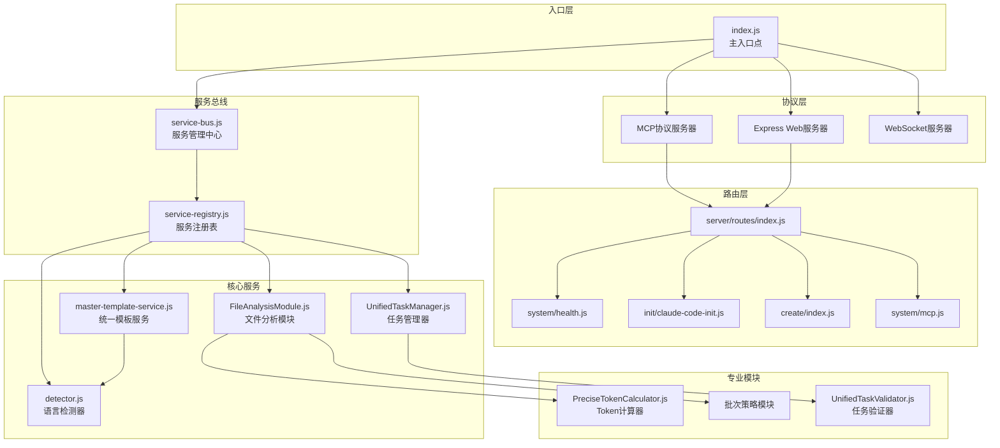

## 🔄 主要调用流程

### 1. 服务启动流程

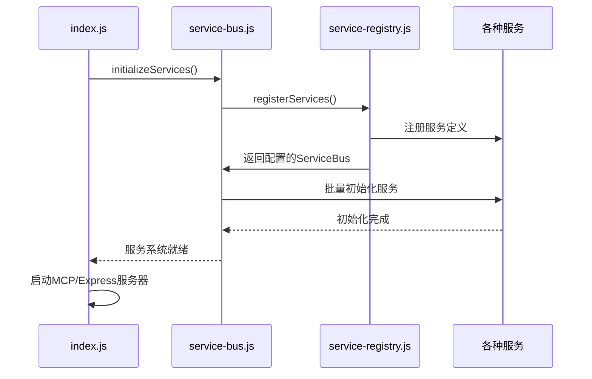

### 2. MCP工具调用流程

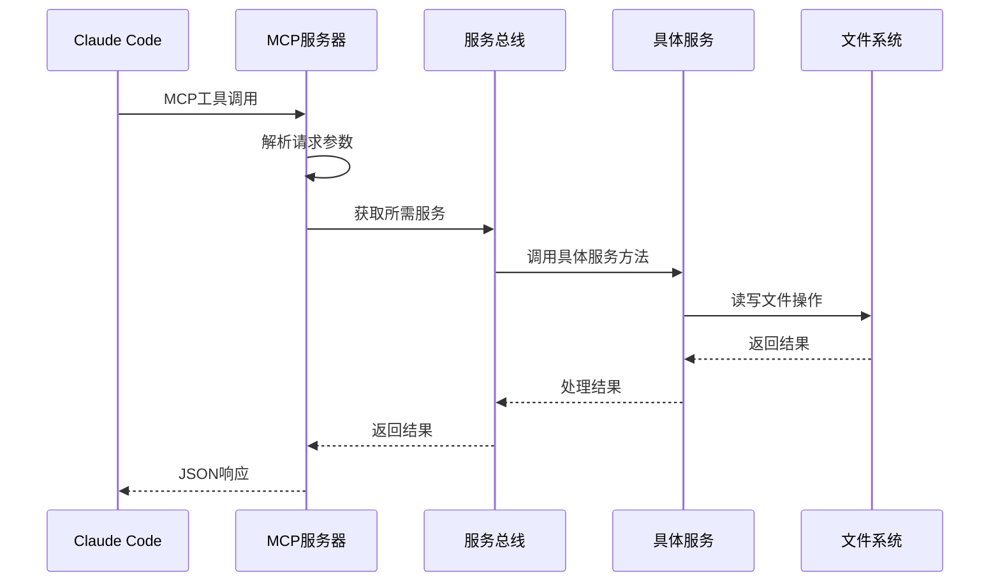

### 3. Init工作流程序

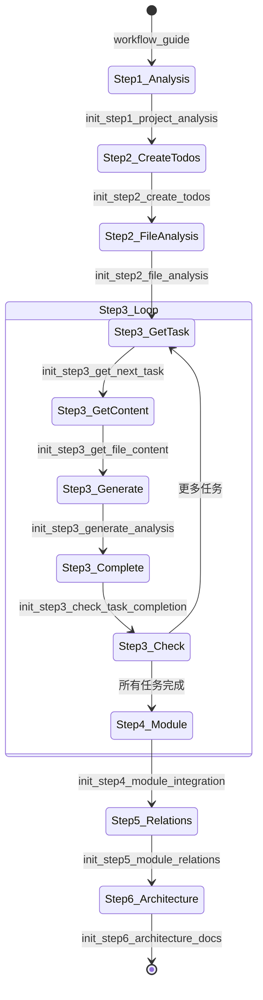

## 📁 文件层次结构和调用关系

### 🎯 入口文件 (`index.js`)

**核心职责：** 
- 统一入口点管理
- MCP协议服务器初始化
- Express Web服务器启动
- WebSocket服务器配置
- 服务依赖注入和管理

**主要导入：**
```javascript
// MCP SDK
import { Server } from "@modelcontextprotocol/sdk/server/index.js";
import { StdioServerTransport } from "@modelcontextprotocol/sdk/server/stdio.js";

// Express 相关
import express from 'express';
import { WebSocketServer } from 'ws';
import cors from 'cors';

// 项目核心模块
import { createAppRoutes } from './server/routes/index.js';
import { initializeServices } from './server/services/service-registry.js';
```

**调用关系：**
- `initializeServices()` → 初始化完整的服务系统
- `createAppRoutes()` → 生成Express路由
- `getServiceContainer()` → 创建服务容器包装器

**MCP工具定义：** 13个核心工具，包括完整的6步Init工作流

### 🗂️ 路由系统 (`server/routes/`)

#### 主路由 (`server/routes/index.js`)

**核心职责：**
- 统一路由入口管理
- 服务依赖注入到路由
- 全局错误处理
- 404处理

**路由结构：**
```javascript
// 系统路由
router.use('/', healthRouter);           // 健康检查
router.use('/mcp', mcpRouter);          // MCP协议端点
router.use('/prompt', promptsRouter);    // 提示词管理

// 业务路由
router.use('/init', claudeCodeInitRouter);    // Claude Code Init
router.use('/turbo', turboInitRouter);        // Turbo Init
router.use('/ai-batch', aiBatchInitRouter);   // AI Batch Init
router.use('/mode/create', createModeRouter); // Create模式
```

**主要导入：**
```javascript
// 系统路由
import { createHealthRoutes } from './system/health.js';
import { createMCPRoutes } from './system/mcp.js';
import { createPromptsRoutes } from './system/prompts.js';

// 业务路由
import { createClaudeCodeInitRoutes } from './init/claude-code-init.js';
import { createTurboInitRoutes } from './init/turbo-init.js';
import { createAIBatchInitRoutes } from './init/ai-batch-init.js';
import { createCreateModeRoutes } from './create/index.js';
```

#### Init路由系统

**路由层次：**
- `init/claude-code-init.js` - Claude Code专用Init路由
- `init/turbo-init.js` - 高性能Turbo Init路由  
- `init/ai-batch-init.js` - AI批处理Init路由

#### Create模式路由

**路由层次：**
- `create/index.js` - Create模式主路由
- `create/existing-project-workflow.js` - 现有项目工作流
- `create/new-project-workflow.js` - 新项目工作流

#### 系统路由

**路由层次：**
- `system/health.js` - 健康检查路由
- `system/mcp.js` - MCP协议管理路由
- `system/prompts.js` - 提示词管理路由

### ⚙️ 服务管理系统

#### 服务总线 (`server/services/service-bus.js`)

**核心职责：**
- 统一服务管理中心
- 依赖注入容器
- 服务生命周期管理
- 循环依赖解决

**类结构：**
```javascript
class ServiceBus {
    constructor()           // 初始化服务注册表
    register()             // 注册服务定义
    get()                  // 获取服务实例（懒加载）
    _initializeService()   // 初始化服务（私有方法）
    _checkCircularDependency() // 循环依赖检查
    initializeAll()        // 批量初始化所有服务
    getServiceStatus()     // 获取服务状态
    validateDependencies() // 验证依赖关系
    shutdown()            // 优雅关闭
}
```

**主要方法调用流程：**
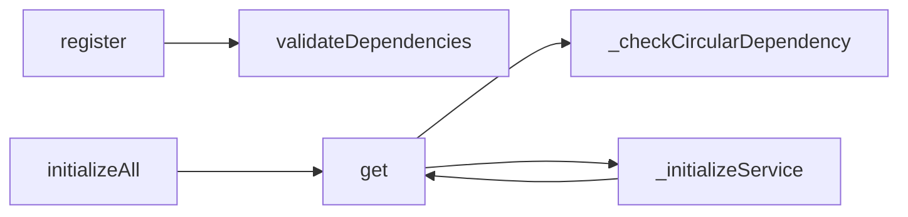

#### 服务注册表 (`server/services/service-registry.js`)

**核心职责：**
- 定义所有服务的注册信息
- 配置服务依赖关系  
- 处理复杂的循环依赖

**服务依赖层次：**

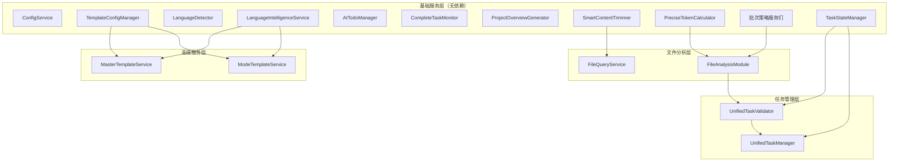

**主要导入和注册：**
```javascript
// 核心服务导入
import ConfigService from './config-service.js';
import AITodoManager from './ai-todo-manager.js';
import CompleteTaskMonitor from './complete-task-monitor.js';
import LanguageDetector from '../language/detector.js';
import LanguageIntelligenceService from './language-intelligence-service.js';

// 统一模板系统
import MasterTemplateService from './unified/master-template-service.js';
import TemplateConfigManager from './unified/template-config-manager.js';
import ModeTemplateService from './unified/mode-template-service.js';

// 文件分析模块
import { FileAnalysisModule } from './file-analysis/FileAnalysisModule.js';
import { PreciseTokenCalculator } from './file-analysis/token-analysis/PreciseTokenCalculator.js';

// 任务管理模块  
import { UnifiedTaskManager } from './task-management/UnifiedTaskManager.js';
import { UnifiedTaskValidator } from './task-management/UnifiedTaskValidator.js';
import { TaskStateManager } from './task-management/TaskStateManager.js';
```

### 🧩 核心服务详解

#### 统一模板服务 (`server/services/unified/master-template-service.js`)

**核心职责：**
- 统一模板管理和加载
- 智能模板选择策略  
- 变量处理和缓存管理
- 多文档结构支持

**主要方法：**
```javascript
class MasterTemplateService {
    async getTemplate(request)              // 🎯 核心API：统一模板获取
    async _handleDirectTemplate(request)    // 直接模板处理
    async _handleIntelligentTemplate(request) // 智能模板处理  
    async _handleLanguageSpecificTemplate(request) // 语言特定模板
    async _handleFallbackTemplate(request)  // 回退模板处理
    
    async getInitStepTemplates(step, variables) // 获取Init流程多文档模板
    async getInitWorkflowTemplates(variables)   // 获取完整Init工作流模板
    async listTemplates(category)              // 列出模板
}
```

**模板处理策略：**
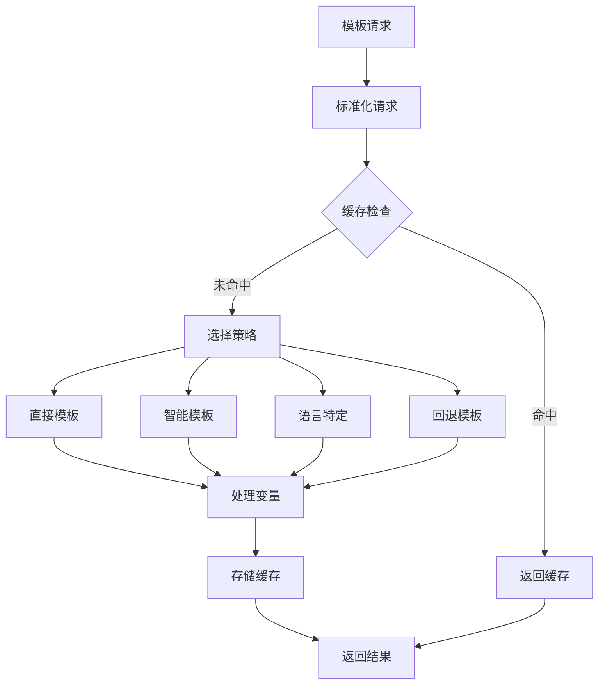

**依赖关系：**
- `LanguageIntelligenceService` - 语言智能处理
- `TemplateConfigManager` - 模板配置管理

#### 文件分析模块 (`server/services/file-analysis/FileAnalysisModule.js`)

**核心职责：**
- 精确Token分析和批次规划
- 协调三种批次策略
- 生成标准化任务定义
- 文件分类和处理策略

**主要方法：**
```javascript  
class FileAnalysisModule {
    async analyzeProject(projectPath, fileList, projectMetadata, options)
    async _analyzeFileTokens(projectPath, fileList, projectMetadata)
    _categorizeFiles(fileAnalyses)                    // 文件分类
    async _generateBatchPlans(fileCategories, projectPath)  // 生成批次计划
    async _createTaskDefinitions(batchPlans, projectMetadata) // 创建任务定义
    
    // 任务管理相关
    async getTaskDefinition(taskId)                   // 获取任务定义
    getProjectTaskIds(projectPath)                    // 获取项目任务ID列表
    clearProjectTasks(projectPath)                    // 清理项目任务
}
```

**文件分析流程：**
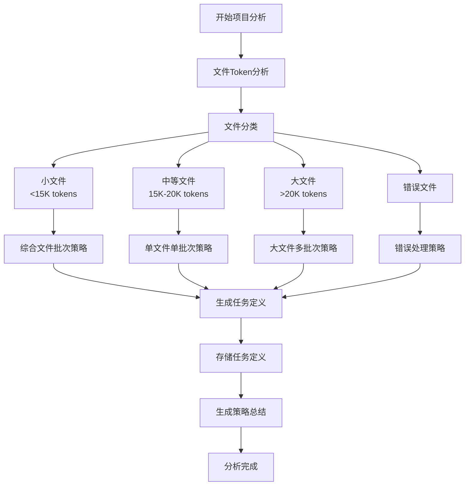

**依赖关系：**
- `PreciseTokenCalculator` - 精确Token计算
- `CombinedFileBatchStrategy` - 综合文件批次策略
- `SingleFileBatchStrategy` - 单文件批次策略  
- `LargeFileMultiBatchStrategy` - 大文件多批次策略

#### 任务管理器 (`server/services/task-management/UnifiedTaskManager.js`)

**核心职责：**
- 统一任务生命周期管理
- 多步骤任务编排  
- 任务状态追踪
- 验证和完成检查

**主要组件关系：**
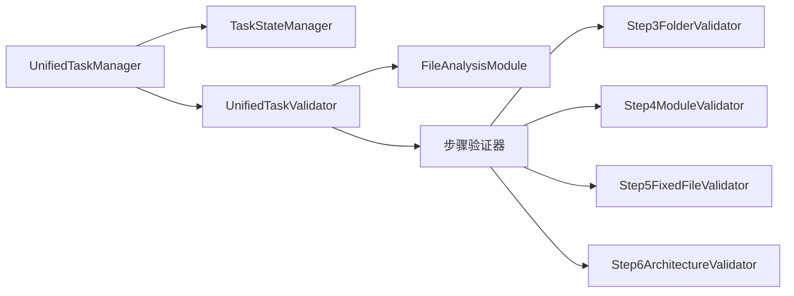

### 🔧 工具和辅助模块

#### 语言检测器 (`server/language/detector.js`)

**核心职责：**
- 智能语言检测
- 项目类型识别
- 框架特征检测

**检测策略：**
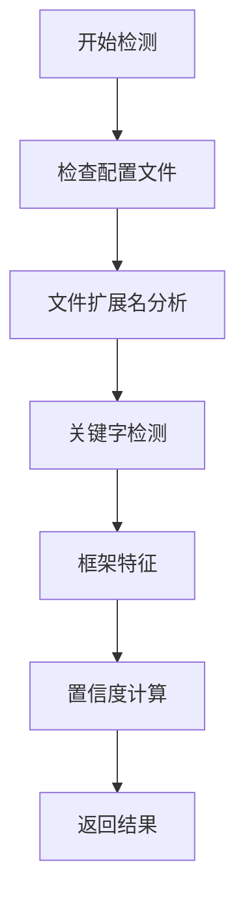

#### Token计算器 (`server/services/file-analysis/token-analysis/PreciseTokenCalculator.js`)

**核心职责：**
- 精确Token数量计算
- 语言特定Token估算
- 批次大小优化

#### 批次策略组件

**三种策略：**
1. **CombinedFileBatchStrategy** - 综合文件批次策略
   - 处理小文件（<15K tokens）
   - 多文件组合优化

2. **SingleFileBatchStrategy** - 单文件单批次策略  
   - 处理中等文件（15K-20K tokens）
   - 单独处理保证质量

3. **LargeFileMultiBatchStrategy** - 大文件多批次策略
   - 处理大文件（>20K tokens）  
   - 智能分割和边界检测

### 📝 配置管理系统

#### 配置文件结构
```
config/
├── mcp.config.json           # MCP服务器配置
├── modes.config.json         # 工作模式配置  
├── template-system.config.json # 模板系统配置
├── templates.config.json      # 模板映射配置
└── workflows.config.json      # 工作流配置
```

#### 配置服务 (`server/services/config-service.js`)
**核心职责：**
- 统一配置管理
- 配置热更新
- 环境变量处理

## 🌊 数据流向分析

### Init工作流数据流

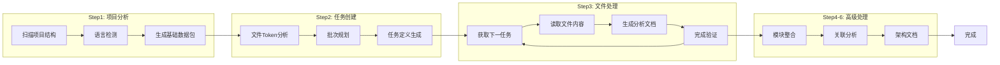

### 服务间数据传递

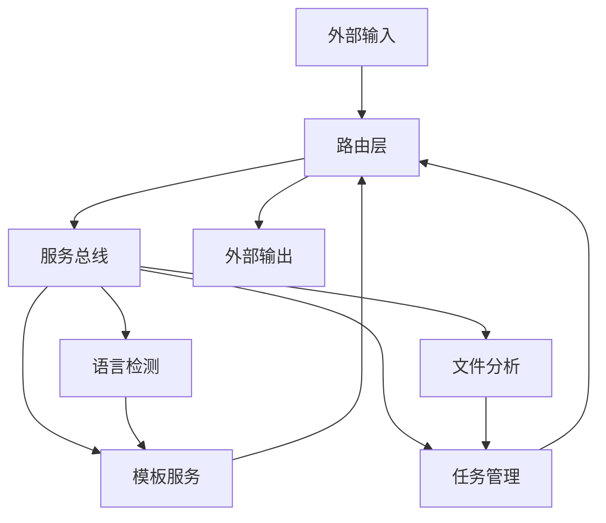

## 🔍 关键调用路径分析

### 1. MCP工具调用路径

**workflow_guide:**
```
index.js:437 → CallToolRequestSchema处理器
→ 解析参数 → 返回工作流指引JSON
```

**init_step1_project_analysis:**
```  
index.js:437 → CallToolRequestSchema处理器
→ serviceBus.get('projectOverviewGenerator')
→ ProjectOverviewGenerator.generateOverview()
→ 文件扫描 + 语言检测 + 数据包生成
→ 保存到 mg_kiro/step1-result.json
```

**init_step2_file_analysis:**
```
index.js:437 → CallToolRequestSchema处理器  
→ serviceBus.get('fileAnalysisModule')
→ FileAnalysisModule.analyzeProject()
→ Token分析 + 批次规划 + 任务生成
→ 保存到 mg_kiro/step2-result.json
```

**init_step3_get_next_task:**
```
index.js:437 → CallToolRequestSchema处理器
→ serviceBus.get('unifiedTaskManager') 
→ UnifiedTaskManager.getNextTask()
→ 从任务队列获取下一个待处理任务
→ 设置当前任务上下文
```

### 2. Express路由调用路径

**健康检查:**
```
GET /health → routes/index.js:createAppRoutes()
→ system/health.js:createHealthRoutes()
→ 服务状态检查 → JSON响应
```

**Init服务:**
```
POST /init/* → routes/index.js:createAppRoutes()
→ init/claude-code-init.js:createClaudeCodeInitRoutes() 
→ 相应的service调用 → JSON响应
```

### 3. 服务初始化调用路径

```
index.js:startServer()
→ initializeServices(CONFIG_DIR)
→ service-registry.js:registerServices()
→ 注册所有服务定义到ServiceBus
→ serviceBus.initializeAll()
→ 按依赖顺序初始化所有服务
→ 设置循环依赖关系
→ 返回initialized ServiceBus
```

## 📊 性能和优化点

### 缓存策略
- **MasterTemplateService**: MD5缓存键，TTL过期机制
- **FileAnalysisModule**: 任务定义内存存储
- **ServiceBus**: 服务实例懒加载

### 内存管理  
- **LRU缓存**: 模板缓存限制最大条目数
- **临时文件清理**: 定期清理.tmp目录
- **服务单例**: ServiceBus单例模式减少内存占用

### 批处理优化
- **Token阈值**: 智能文件分类减少处理开销
- **批次策略**: 三种策略优化不同大小文件处理
- **并行处理**: 支持并发任务处理

## 🚨 错误处理和容错

### 错误传播路径
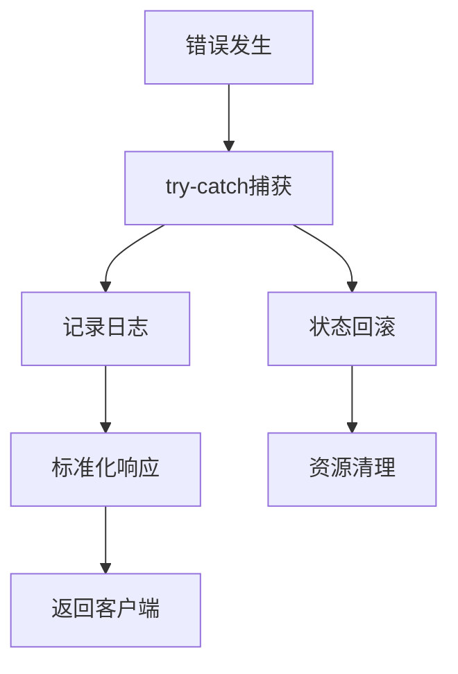

### 容错机制
- **服务降级**: 智能模板处理失败时回退到基础模板
- **任务重试**: 文件处理失败时的重试机制  
- **状态恢复**: 从文件系统恢复任务上下文
- **循环依赖检测**: ServiceBus的依赖关系验证

## 📋 总结

mg_kiro MCP服务器采用了**服务总线 + 依赖注入**的现代架构模式，具有以下特点：

### 🏆 架构优势
1. **模块化设计**: 清晰的层次结构，职责分离
2. **依赖注入**: ServiceBus统一管理，易于测试和维护
3. **智能处理**: 多种策略自动选择，优化性能
4. **可扩展性**: 插件式服务注册，易于扩展新功能
5. **容错性**: 完善的错误处理和状态恢复机制

### 🔧 技术特色
- **MCP协议支持**: 与Claude Code无缝集成
- **6步Init工作流**: 完整的项目分析和文档生成流程
- **智能批次处理**: Token级别的精确分析和优化
- **多模板引擎**: 支持智能选择和语言特定模板
- **实时状态管理**: 完整的任务生命周期跟踪

### 📈 关键指标
- **总文件数**: 35+ JavaScript文件
- **服务数量**: 20+ 注册服务  
- **MCP工具**: 13个核心工具
- **路由端点**: 15+ REST API端点
- **支持语言**: 6+ 主流编程语言

该架构为复杂的AI辅助开发工作流提供了坚实的技术基础，具备良好的可维护性和扩展性。

---

## 🔬 超详细总体架构（精确到文件级别）

> **📌 深度分析**: 基于完整的import/export关系分析，精确到每个文件的调用关系网络

参见独立文档：[超详细总体架构-文件级别.md](./超详细总体架构-文件级别.md)

### 🎯 超级架构要点总结

#### **📊 精确统计数据**
- **JavaScript文件总数**: 44个
- **总代码行数**: 约12,000行
- **服务注册数**: 20+个
- **循环依赖对**: 2个主要循环依赖
- **Token处理能力**: 专业级（支持6种编程语言）

#### **🔄 关键调用链路**
```
🎯 MCP工具调用: Client → index.js → ServiceBus → 具体服务 → 业务逻辑
🌐 Express路由: Request → routes/index.js → 子路由 → 服务调用 → Response  
⚙️ 服务初始化: startServer() → service-registry → ServiceBus → 依赖注入
🧠 文件分析: FileAnalysisModule → Token计算 → 批次策略 → 任务生成
```

#### **🏗️ 文件依赖层次**
1. **入口层** (1个): index.js 统一入口
2. **路由层** (10个): 请求分发和处理 
3. **服务管理** (4个): ServiceBus依赖注入系统
4. **核心服务** (6个): 业务逻辑处理
5. **模板系统** (3个): 统一模板管理
6. **语言处理** (2个): 智能语言检测
7. **文件分析** (5个): Token计算和批次处理
8. **任务管理** (7个): 工作流引擎
9. **配置管理** (5个): 系统配置
10. **工具脚本** (1个): 测试和工具

#### **🧩 循环依赖解决**
- **LanguageIntelligenceService ↔ MasterTemplateService**: ServiceBus延迟注入
- **UnifiedTaskValidator ↔ UnifiedTaskManager**: injectDependencies()方法

#### **💡 架构亮点**
- **三合一服务器**: MCP + Express + WebSocket统一入口
- **智能批次处理**: 基于Token数量的三种策略(<15K/15K-20K/>20K)
- **企业级Token处理**: 支持大型项目的精确分析
- **完善的错误恢复**: 状态持久化 + 任务上下文恢复
- **模块化设计**: 44个文件职责清晰分离

这个超详细分析提供了每个文件的精确职责、依赖关系和调用路径，为项目的深度理解、维护和扩展提供了完整的技术蓝图。

---

*文档生成时间: 2024年度*  
*分析工具: Claude Code + mg_kiro MCP Server*  
*分析深度: 文件级别精确分析*