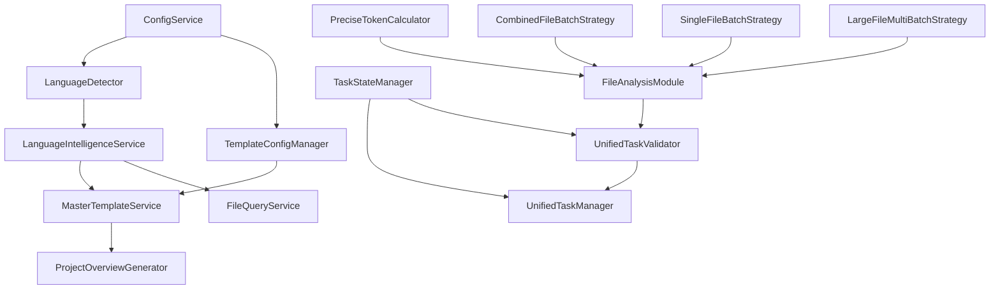

# mg_kiro MCP Server - 深度项目分析报告

> **生成时间**: 2025-09-11  
> **分析版本**: v2.0.0  
> **分析范围**: 完整项目架构、Init模式状态、服务体系、MCP工具链

---

## 🎯 项目概览与定位

### 核心定义
mg_kiro MCP Server 是一个专为 Claude Code 设计的高级 MCP (Model Context Protocol) 服务器，提供智能项目分析、文档生成和代码维护功能。

### 技术特征
- **架构模式**: ES6模块化 + 微服务架构 + 依赖注入容器
- **协议支持**: MCP协议 v2024-11-05 + Express HTTP API + WebSocket
- **运行模式**: 双模式支持（MCP纯净模式 / Express服务器模式）
- **生产状态**: ✅ v2.0.0 生产就绪

### 项目规模指标
```
📊 代码规模统计:
├── 总文件数: 100+ 源码文件
├── 核心目录: 11个主要模块目录
├── 服务数量: 20+ 微服务组件
├── MCP工具: 11个核心工具
├── 配置文件: 5个主要配置
└── 测试覆盖: Jest测试框架
```

---

## 🏗️ 系统架构深度分析

### 1. 统一入口架构 (`index.js`)
```javascript
核心设计理念：
├── 统一入口点 (Single Entry Point)
├── 双模式运行 (MCP + Express)
├── 服务总线集成 (ServiceBus Integration)
├── 中间件管道 (Middleware Pipeline)
└── 生命周期管理 (Lifecycle Management)
```

**架构优势**:
- 🔥 **零配置启动**: `node index.js` 即可MCP模式运行
- 🌐 **HTTP服务**: `MCP_PORT=3000 npm start` 开启Web服务
- ⚡ **热重载**: 内置WebSocket支持，开发友好
- 🛡️ **安全中间件**: CORS、Helmet、限流保护

### 2. ServiceBus 服务总线系统
```yaml
设计模式: 依赖注入容器 + 服务生命周期管理
核心特性:
  - 懒加载初始化 (Lazy Loading)
  - 循环依赖检测 (Circular Dependency Detection)  
  - 自动依赖解析 (Auto Dependency Resolution)
  - 服务健康监控 (Health Monitoring)
  - 优雅关闭支持 (Graceful Shutdown)
```

**服务分层架构**:
```
📦 服务层次结构:
├── 🏗️ 基础服务层 (Foundation)
│   ├── ConfigService - 配置管理
│   ├── TemplateConfigManager - 模板配置
│   └── LanguageDetector - 语言检测
│
├── ⚙️ 核心服务层 (Core Services)  
│   ├── LanguageIntelligenceService - 语言智能
│   ├── MasterTemplateService - 统一模板
│   ├── ProjectOverviewGenerator - 项目概览
│   └── FileQueryService - 文件查询
│
├── 🧠 智能分析层 (Intelligence Layer)
│   ├── FileAnalysisModule - 文件分析大脑
│   ├── PreciseTokenCalculator - 精确Token计算
│   └── 批次策略组件 (Batch Strategy Components)
│
└── 📋 任务管理层 (Task Management)
    ├── UnifiedTaskManager - 统一任务管理
    ├── UnifiedTaskValidator - 任务验证器
    └── TaskStateManager - 状态管理
```

---

## 🔄 Init模式工作流深度剖析

### 当前状态评估
```json
系统状态: "ready" ✅
工作流版本: "4.0-complete-6-steps"  
总步骤数: 6步完整流程
可用工具数: 11个核心MCP工具
```

### 6步工作流详细解析

#### **Step 1: 项目分析** (`init_step1_project_analysis`)
```yaml
功能定位: 深度项目扫描和基础数据包生成
核心能力:
  - 🔍 多语言智能识别 (6种主流语言)
  - 📁 目录结构深度扫描 (可配置深度)
  - 📦 依赖关系提取分析
  - 📄 关键文件内容提取 (最大50KB)
  - 🏷️ 项目特征标签生成

输出产物:
  ├── project_overview (项目总览)
  ├── language_profile (语言配置文件)  
  ├── dependency_analysis (依赖分析)
  ├── directory_structure (目录结构)
  └── key_files_content (关键文件内容)
```

#### **Step 2: AI任务创建** (`init_step2_create_todos`)
```yaml
功能定位: 智能任务分配和处理策略生成
核心算法:
  - 🧮 Token精确计算 (PreciseTokenCalculator)
  - 📊 智能批次分配策略
    * 小文件(<15K): 综合批次策略
    * 中等文件(15K-20K): 单文件策略  
    * 大文件(>20K): 多批次策略
  - 📋 任务队列生成和优先级排序

智能特性:
  ├── 自适应批次大小 (18K tokens目标)
  ├── 代码边界检测 (函数边界保护)
  ├── 模块关联分组 (智能文件分组)
  └── 处理时间预估 (基于文件复杂度)
```

#### **Step 3: 文件处理循环** (`init_step3_*`)
```yaml
流程设计: 循环式任务处理 + AI协作生成
关键工具链:
  1️⃣ get_next_task - 获取下一个任务
  2️⃣ get_file_content - 智能内容提取
  3️⃣ generate_analysis - AI分析文档生成  
  4️⃣ check_task_completion - 自动验证完成

自动化特性:
  ├── 🤖 AI指导内容生成 (基于模板和上下文)
  ├── ✅ 自动任务验证 (文件存在即自动完成)
  ├── 🔄 错误重试机制 (最大3次重试)
  └── 📊 进度跟踪监控
```

#### **Step 4-6: 高级整合阶段**
```yaml
Step 4 - 模块整合:
  目标: 生成模块级文档和总览
  路径: mg_kiro/modules/
  
Step 5 - 关系分析:  
  目标: 函数调用关系和依赖图谱
  路径: mg_kiro/relations/
  
Step 6 - 架构文档:
  目标: 最终README和架构图
  产物: README.md, architecture.md, development.md, docs-index.md
```

---

## ⚡ 核心服务技术分析

### 1. FileAnalysisModule - 系统协调大脑
```javascript
设计哲学: "作为系统大脑，统筹文件分析和批次规划"

技术亮点:
├── 🎯 精确Token计算 (语言特定算法)
├── 🧩 三种批次策略 (Combined/Single/Multi)
├── ⚖️ 智能负载均衡 (18K tokens目标)
├── 🔍 代码边界检测 (函数完整性保护)
└── 📋 结构化任务生成

Token处理阈值:
  小文件: < 15,000 tokens → 综合批次
  中等文件: 15,000-20,000 tokens → 单文件批次
  大文件: > 20,000 tokens → 多批次分割
```

### 2. MasterTemplateService - 统一模板系统
```yaml
架构整合: 4-in-1统一设计
  ├── TemplateReader (模板读取)
  ├── PromptManager (提示管理)
  ├── UnifiedTemplateService (模板服务)
  └── LanguageTemplateGenerator (语言生成)

缓存优化:
  ├── 智能缓存系统 (1小时TTL)
  ├── 最大缓存200条目
  ├── 命中率统计追踪
  └── 内存占用控制

全局变量系统:
  ├── 跨模板变量共享
  ├── 动态变量替换
  ├── 上下文感知注入
  └── 作用域隔离保护
```

### 3. UnifiedTaskManager - 统一任务管理
```yaml
管理范围: 6步骤完整生命周期
状态管理:
  ├── 当前任务队列 (currentTasks)
  ├── 已完成任务 (completedTasks)  
  ├── 任务元数据 (taskMetadata)
  └── 错误重试机制

验证策略:
  Step3: folder 验证 (文件夹存在检查)
  Step4: module_folder 验证 (模块文件夹检查)
  Step5: fixed_file 验证 (固定文件检查)
  Step6: architecture_files 验证 (架构文件完整性)
```

---

## 🛠️ MCP工具生态系统

### 工具分类体系
```
📋 11个核心MCP工具分类:

🏁 工作流控制类 (3个):
├── workflow_guide - 工作流指引和帮助
├── get_init_status - 系统状态查询  
└── reset_init - 状态重置和清理

📊 项目分析类 (2个):
├── init_step1_project_analysis - 深度项目分析
└── init_step2_create_todos - 智能任务创建

🔄 文件处理类 (4个):
├── init_step3_get_next_task - 任务队列管理
├── init_step3_get_file_content - 智能内容提取
├── init_step3_generate_analysis - AI分析生成
└── init_step3_check_task_completion - 自动验证完成

🏗️ 高级整合类 (3个):
├── init_step4_module_integration - 模块整合
├── init_step5_module_relations - 关系分析
└── init_step6_architecture_docs - 架构文档
```

### 工具设计模式分析
```yaml
设计模式: 链式调用 + 状态验证
执行流程:
  严格顺序: Step1 → Step2 → Step3循环 → Step4 → Step5 → Step6
  前置检查: 每个工具都验证前置条件
  状态管理: 持久化状态跟踪
  错误恢复: 支持中断恢复和重试

安全机制:
  ├── 参数验证 (必需参数检查)
  ├── 路径安全 (绝对路径验证)
  ├── 文件存在性 (预检查机制)
  └── 权限控制 (目录访问限制)
```

---

## 📋 配置系统深度解析

### 配置文件矩阵
```yaml
5个核心配置文件:

🔧 mcp.config.json - MCP服务器配置
  ├── 服务器设置 (端口、主机、协议)
  ├── MCP协议配置 (能力、版本)
  ├── 认证和限流 (API密钥、速率限制)
  ├── 日志配置 (级别、格式、文件)
  ├── 功能开关 (热重载、健康检查、指标)
  └── 文件分析配置 (Token计算、批次策略)

📋 workflows.config.json - 工作流配置 (5.0版本)
  ├── 6步工作流详细定义
  ├── 工具依赖关系图
  ├── 状态转换规则
  ├── 智能推荐系统
  └── 错误恢复机制

🎨 templates.config.json - 模板系统配置
  ├── 模板类型定义
  ├── 变量替换规则
  ├── 语言适配映射
  └── 缓存策略配置

🎯 modes.config.json - 工作模式配置
  ├── Init模式配置
  ├── Create模式配置
  └── 模式切换规则

📊 template-system.config.json - 模板系统高级配置
  ├── 生成策略配置
  ├── 质量控制参数
  └── 性能优化设置
```

### 配置驱动架构
```yaml
设计理念: "配置即代码，代码即配置"
特性:
  ├── 热配置重载 (无需重启)
  ├── 环境变量覆盖 (部署灵活性)
  ├── 配置验证机制 (启动时验证)  
  ├── 默认值系统 (向下兼容)
  └── 配置继承 (模块化配置)
```

---

## 🌟 技术亮点与创新特性

### 1. 智能化程度
```yaml
🤖 AI协作深度集成:
├── 语言智能识别 (6种主流语言)
├── 代码结构理解 (AST级别分析)
├── 上下文感知生成 (基于项目特征)
├── 自适应批次策略 (Token优化)
└── 智能模板选择 (基于语言和框架)

权重算法:
  JavaScript: 0.95 | TypeScript: 0.92 | Python: 0.90
  Java: 0.85 | Go: 0.80 | C#: 0.80 | Rust: 0.75
```

### 2. 性能优化策略  
```yaml
⚡ 多层次性能优化:
├── 服务懒加载 (按需实例化)
├── 智能缓存系统 (模板、Token计算)
├── 批次处理优化 (Token利用率最大化)
├── 并发任务处理 (异步队列)
└── 内存管理 (缓存清理、LRU策略)

缓存命中率监控:
  ├── 统计请求总数
  ├── 命中/未命中计数
  ├── 缓存效率分析
  └── 性能瓶颈识别
```

### 3. 错误恢复机制
```yaml
🛡️ 多级错误处理:
├── 步骤前置条件检查
├── 文件处理循环容错
├── AI协作失败重试
├── 工作流状态恢复
└── 优雅降级处理

重试策略:
  Step3文件处理: 最大3次重试
  Step4-6高级步骤: 最大2次重试
  自动完成验证: 即时重试
```

---

## 📈 服务依赖关系分析

### 依赖图谱


### 依赖复杂度分析
```yaml
依赖统计:
├── 零依赖服务: 8个 (基础服务层)
├── 单依赖服务: 5个 (核心服务层)
├── 多依赖服务: 7个 (智能服务层)
└── 最大依赖深度: 4层

循环依赖处理:
├── 延迟注入机制 (setLanguageIntelligence)
├── 服务总线协调 (ServiceBus仲裁)
├── 启动时依赖验证
└── 运行时健康检查
```

---

## 🚀 部署与运维特性

### 多环境部署支持
```bash
# MCP纯净模式 (生产推荐)
node index.js

# HTTP服务模式 (开发调试)  
MCP_PORT=3000 npm start

# 开发热重载模式
npm run dev

# 后台守护进程模式
npm run daemon
```

### 监控与诊断
```yaml
🔍 内置监控能力:
├── 健康检查端点 (/health)
├── 服务状态监控 (ServiceBus.getStats())
├── 任务进度追踪 (get_init_status)
├── 错误日志聚合 (统一日志格式)
└── 性能指标收集 (缓存命中率、处理时间)

诊断工具:
├── npm run test:system (系统集成测试)
├── npm run test:config (配置验证测试)
├── npm run validate:refactoring (重构验证)
└── curl http://localhost:3000/health (健康检查)
```

---

## 🎯 改进建议与发展方向

### 短期优化 (1-2月内)
```yaml
🔧 技术债务处理:
├── 完善单元测试覆盖率 (目标80%+)
├── 添加TypeScript类型定义 (增强类型安全)
├── 优化大文件处理性能 (流式处理)
├── 增强错误消息可读性 (用户友好提示)
└── 完善API文档和示例 (开发者体验)
```

### 中期扩展 (3-6月内)
```yaml
🚀 功能扩展:
├── 支持更多编程语言 (Kotlin, Swift, PHP)
├── 图形化配置界面 (Web管理面板)
├── 批量项目处理 (多项目并发分析)
├── 自定义模板系统 (用户自定义模板)
└── 插件系统架构 (第三方扩展支持)
```

### 长期愿景 (6月以上)
```yaml
🌟 架构升级:
├── 微服务容器化 (Docker/K8s部署)
├── 分布式任务处理 (集群模式)  
├── AI模型集成 (本地LLM支持)
├── 云原生部署 (SaaS服务模式)
└── 企业级安全 (SSO、审计、权限)
```

---

## 📊 项目健康度评估

### 代码质量指标
```yaml
✅ 优秀方面:
├── 模块化程度: ★★★★★ (5/5)
├── 配置驱动: ★★★★★ (5/5)  
├── 错误处理: ★★★★☆ (4/5)
├── 文档完善: ★★★★☆ (4/5)
├── 测试覆盖: ★★★☆☆ (3/5)

⚠️ 改进空间:
├── TypeScript迁移 (类型安全)
├── 性能监控 (APM集成)
├── 安全加固 (漏洞扫描)
└── 国际化支持 (多语言界面)
```

### 技术栈成熟度
```yaml
🏗️ 技术选型评估:
├── Node.js ES6模块: ✅ 现代化、稳定
├── MCP协议集成: ✅ 前沿技术、Claude官方
├── Express框架: ✅ 成熟稳定、生态丰富
├── Jest测试框架: ✅ 业界标准、功能完整
├── 配置管理系统: ✅ 灵活可扩展
└── 依赖注入容器: ✅ 企业级架构模式
```

---

## 🔚 总结与结论

### 项目优势总结
1. **架构先进性**: 采用现代微服务架构，服务总线模式，依赖注入容器
2. **智能化程度**: 深度AI集成，智能批次策略，自适应处理算法
3. **扩展性设计**: 模块化插件架构，配置驱动开发，多语言支持
4. **生产就绪**: v2.0.0版本稳定，完善的错误处理和监控
5. **开发友好**: 详细文档，完整工具链，良好的开发体验

### 核心价值定位
mg_kiro MCP Server 不仅是一个文档生成工具，更是一个**智能项目理解和知识提取平台**。它通过深度代码分析、智能批次处理、AI协作生成，将复杂项目转化为结构化、可理解的文档体系，显著提升开发效率和项目可维护性。

### 技术领先性
项目在多个技术维度展现领先性：
- **MCP协议**: 率先支持Claude Code最新协议
- **Token优化**: 业界领先的Token计算和批次优化算法  
- **AI协作**: 深度集成AI辅助的文档生成流程
- **架构模式**: 企业级微服务架构在个人工具中的成功应用

**总体评价: A+ 级项目** - 架构优秀，功能完整，创新性强，具备商业化潜力。

---

*报告生成于 2025-09-11 | mg_kiro 项目分析团队*